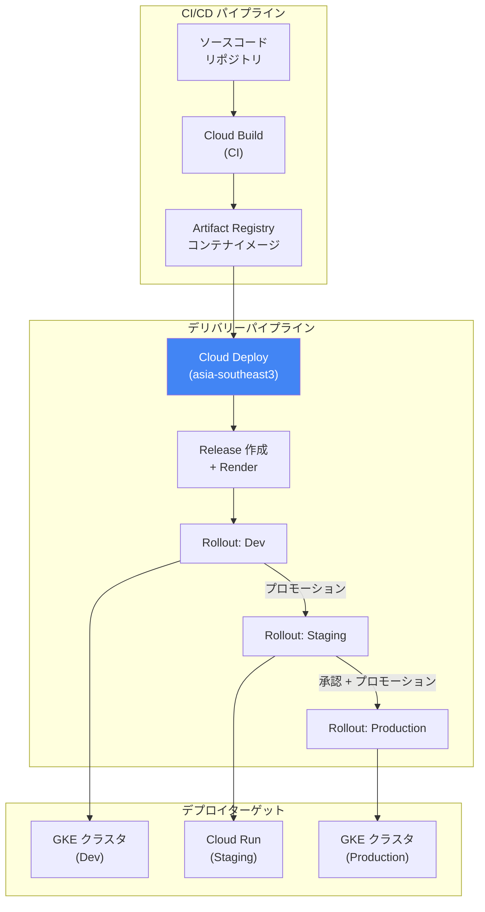

# Cloud Deploy: asia-southeast3 (Bangkok) リージョンのサポート開始

**リリース日**: 2026-03-02

**サービス**: Cloud Deploy

**機能**: 新リージョン asia-southeast3 (Bangkok) の追加

**ステータス**: Feature

[このアップデートのインフォグラフィックを見る](https://takech9203.github.io/google-cloud-news-summary/20260302-cloud-deploy-asia-southeast3.html)

## 概要

Google Cloud Deploy が新たに asia-southeast3 (Bangkok) リージョンで利用可能になった。Cloud Deploy は、GKE (Google Kubernetes Engine)、Cloud Run、および GKE 接続クラスタへのアプリケーションデリバリーを自動化するマネージドサービスであり、デリバリーパイプラインを通じてターゲット環境へのプロモーションシーケンスを定義・管理できる。

今回のリージョン拡張により、タイおよび東南アジア地域のユーザーは、より低レイテンシでデリバリーパイプラインを運用できるようになる。Cloud Deploy のリージョン選択は、パイプラインのリクエスト処理やリソース保存の場所を決定するため、デプロイ対象のクラスタやサービスに近いリージョンを選択することで、パフォーマンスの最適化とコスト効率の向上が期待できる。

このアップデートは、タイを拠点とする企業や東南アジア市場をターゲットとするグローバル企業の DevOps チーム、SRE チームにとって重要な意味を持つ。データレジデンシー要件への対応やデプロイパイプラインの地理的分散が容易になる。

**アップデート前の課題**

- 東南アジア地域で Cloud Deploy を利用する場合、asia-southeast1 (Singapore) または asia-southeast2 (Jakarta) のいずれかを選択する必要があった
- タイ国内のデータレジデンシー要件がある場合、Cloud Deploy のリソース (デリバリーパイプライン、ターゲット、リリース、ロールアウト) をタイ国内に保存することができなかった
- Bangkok に近いリージョンが存在しなかったため、タイのユーザーにとってはパイプライン管理操作のレイテンシが相対的に高かった

**アップデート後の改善**

- asia-southeast3 (Bangkok) リージョンで Cloud Deploy のデリバリーパイプラインを作成・管理できるようになった
- タイ国内でのデータレジデンシー要件に対応可能になった
- Bangkok リージョンから東南アジア各地の GKE クラスタや Cloud Run サービスへのデプロイが可能になり、地理的に最適化されたデプロイパイプラインを構築できるようになった

## アーキテクチャ図



Cloud Deploy はデリバリーパイプラインを通じて、CI で生成されたコンテナイメージを dev、staging、production の各ターゲットに順序通りプロモーションしながらデプロイする。asia-southeast3 リージョンでパイプラインを作成すると、そのリージョンでリクエストが処理・保存される。

## サービスアップデートの詳細

### 主要機能

1. **asia-southeast3 (Bangkok) リージョンでのパイプライン管理**
   - デリバリーパイプライン、ターゲット、リリース、ロールアウト、ジョブランの全リソースを Bangkok リージョンで作成・管理可能
   - パイプラインを作成したリージョンと同じリージョンでターゲット、リリース、ロールアウトを作成する必要がある

2. **クロスリージョンデプロイのサポート**
   - Cloud Deploy インスタンスは、パイプラインが存在するリージョン以外のロケーションにもアプリケーションをデプロイ可能
   - Bangkok リージョンのパイプラインから、任意のリージョンの GKE クラスタや Cloud Run サービスへデプロイできる

3. **リージョン独立性による高可用性**
   - Cloud Deploy インスタンスはリージョンごとに独立して動作
   - あるリージョンで障害が発生しても、他のリージョンのインスタンスには影響しない

## 技術仕様

### Cloud Deploy リソースタイプ

| リソース | 説明 |
|---------|------|
| Delivery Pipeline | デプロイのプロモーションシーケンスを定義 |
| Target | デプロイ先の GKE クラスタまたは Cloud Run サービス |
| Release | デプロイする変更 (コード、設定) を表すリソース |
| Rollout | リリースをターゲットに関連付けるリソース |
| Job Run | ジョブの実行インスタンス |

### リージョン制約

| 項目 | 詳細 |
|------|------|
| リソースの作成場所 | パイプラインと同じリージョン内に作成が必要 |
| デプロイ先の制約 | GKE クラスタ・Cloud Run サービスは任意のリージョンに配置可能 |
| Cloud Storage バケット | 可能な限りパイプラインと同じリージョンに自動作成 |
| API リクエスト制限 | 18,000 リクエスト/分/リージョン (システム制限) |

### パイプライン設定例

```yaml
apiVersion: deploy.cloud.google.com/v1
kind: DeliveryPipeline
metadata:
  name: my-app-pipeline
description: Bangkok リージョンのデリバリーパイプライン
serialPipeline:
  stages:
  - targetId: dev
    profiles:
    - dev
  - targetId: staging
    profiles:
    - staging
  - targetId: prod
    profiles:
    - prod
    strategy:
      canary:
        canaryDeployment:
          percentages: [25, 50, 75]
---
apiVersion: deploy.cloud.google.com/v1
kind: Target
metadata:
  name: dev
description: Development 環境
gke:
  cluster: projects/my-project/locations/asia-southeast3/clusters/dev-cluster
```

## 設定方法

### 前提条件

1. Google Cloud プロジェクトで Cloud Deploy API が有効化されていること
2. 適切な IAM ロール (`roles/clouddeploy.admin` または `roles/clouddeploy.developer`) が付与されていること
3. デプロイ先の GKE クラスタまたは Cloud Run サービスが設定済みであること

### 手順

#### ステップ 1: Cloud Deploy API の有効化

```bash
gcloud services enable clouddeploy.googleapis.com --project=PROJECT_ID
```

Cloud Deploy API をプロジェクトで有効化する。

#### ステップ 2: デリバリーパイプラインの作成 (Bangkok リージョン)

```bash
gcloud deploy apply \
  --file=clouddeploy.yaml \
  --region=asia-southeast3 \
  --project=PROJECT_ID
```

`--region=asia-southeast3` を指定することで、Bangkok リージョンにデリバリーパイプラインが作成される。

#### ステップ 3: リリースの作成

```bash
gcloud deploy releases create release-001 \
  --delivery-pipeline=my-app-pipeline \
  --region=asia-southeast3 \
  --build-artifacts=artifacts.json \
  --source=./config/
```

リリースを作成すると、最初のターゲットへのロールアウトが自動的に開始される。

#### ステップ 4: プロモーション

```bash
gcloud deploy releases promote \
  --release=release-001 \
  --delivery-pipeline=my-app-pipeline \
  --region=asia-southeast3
```

次のターゲットへリリースをプロモーションする。

## メリット

### ビジネス面

- **データレジデンシー対応**: タイ国内のデータ主権・レジデンシー要件を満たすデプロイパイプラインの構築が可能になる。組織ポリシーでリソースの作成場所を asia-southeast3 に制限することもできる
- **東南アジア市場への対応強化**: タイおよび周辺地域の顧客向けアプリケーションのデプロイパイプラインをローカルに管理でき、地理的な近さによるビジネスの俊敏性向上が期待できる

### 技術面

- **レイテンシの改善**: Bangkok リージョンにパイプラインを配置することで、タイからのパイプライン管理操作 (リリース作成、プロモーション、承認など) のレイテンシが改善される
- **耐障害性の向上**: 複数リージョンにパイプラインを分散配置することで、リージョン障害に対する耐性が向上する。Cloud Deploy インスタンスはリージョンごとに独立して動作するため、障害の影響範囲が限定される

## デメリット・制約事項

### 制限事項

- パイプラインを作成したリージョンと同じリージョンでターゲット、リリース、ロールアウトを作成する必要がある (クロスリージョンのリソース作成は不可)
- リージョン選択がパフォーマンスと課金に影響する。Google Cloud のロケーション間のデータ転送のコストとレイテンシが発生する可能性がある
- システム制限として 18,000 API リクエスト/分/リージョンの上限がある

### 考慮すべき点

- デプロイ先のクラスタが asia-southeast3 以外にある場合、パイプラインとターゲットクラスタ間のデータ転送コストを考慮する必要がある
- 単一リージョンへのデプロイの場合は、パイプラインをターゲットクラスタと同じリージョンに作成することが推奨される (必須ではない)
- 既存のパイプラインを別のリージョンに移行する場合は、新しいリージョンでパイプラインを再作成し、新しいリリースを作成する必要がある

## ユースケース

### ユースケース 1: タイ国内のデータレジデンシー要件への対応

**シナリオ**: タイの金融機関が、規制要件によりデプロイパイプラインのメタデータをタイ国内に保持する必要がある。アプリケーションは Bangkok リージョンの GKE クラスタで実行される。

**実装例**:
```yaml
apiVersion: deploy.cloud.google.com/v1
kind: DeliveryPipeline
metadata:
  name: banking-app-pipeline
description: タイ国内金融アプリケーション用パイプライン
serialPipeline:
  stages:
  - targetId: uat
    profiles:
    - uat
  - targetId: production
    profiles:
    - production
    strategy:
      canary:
        canaryDeployment:
          percentages: [10, 25, 50]
          verify: true
---
apiVersion: deploy.cloud.google.com/v1
kind: Target
metadata:
  name: production
description: 本番環境 (Bangkok)
gke:
  cluster: projects/finance-prod/locations/asia-southeast3/clusters/prod-cluster
requireApproval: true
```

**効果**: デリバリーパイプラインのすべてのリソース (パイプライン定義、リリース、ロールアウト履歴) がタイ国内に保存され、データレジデンシー要件を満たしつつ、カナリアデプロイと承認フローによる安全なデリバリーが実現できる。

### ユースケース 2: 東南アジアマルチリージョンデプロイ

**シナリオ**: E コマース企業が東南アジア全域にアプリケーションをデプロイしており、Bangkok をハブとして Singapore、Jakarta の各リージョンにもデプロイする必要がある。

**実装例**:
```yaml
apiVersion: deploy.cloud.google.com/v1
kind: DeliveryPipeline
metadata:
  name: ecommerce-sea-pipeline
description: 東南アジアマルチリージョンデプロイ
serialPipeline:
  stages:
  - targetId: staging-bangkok
  - targetId: prod-bangkok
  - targetId: prod-singapore
  - targetId: prod-jakarta
---
apiVersion: deploy.cloud.google.com/v1
kind: Target
metadata:
  name: prod-bangkok
gke:
  cluster: projects/ecom/locations/asia-southeast3/clusters/prod
---
apiVersion: deploy.cloud.google.com/v1
kind: Target
metadata:
  name: prod-singapore
gke:
  cluster: projects/ecom/locations/asia-southeast1/clusters/prod
---
apiVersion: deploy.cloud.google.com/v1
kind: Target
metadata:
  name: prod-jakarta
gke:
  cluster: projects/ecom/locations/asia-southeast2/clusters/prod
```

**効果**: Bangkok リージョンのパイプラインから東南アジア全域の GKE クラスタへの段階的デプロイが可能になり、リリース管理の一元化と地理的分散デプロイを両立できる。

## 料金

Cloud Deploy の料金は、デリバリーパイプラインのアクティブなデプロイメント分数に基づいて課金される。リージョンの追加による料金体系の変更はないが、リージョン間のデータ転送コストが発生する場合がある。

詳細な料金情報は [Cloud Deploy 料金ページ](https://cloud.google.com/deploy/pricing) を参照。

## 利用可能リージョン

今回の asia-southeast3 (Bangkok) の追加により、Cloud Deploy は東南アジアで以下の 3 リージョンが利用可能になった。

| リージョン | ロケーション | 備考 |
|-----------|-------------|------|
| asia-southeast1 | Singapore | 既存 |
| asia-southeast2 | Jakarta | 既存 |
| asia-southeast3 | Bangkok | **今回追加** |

Cloud Deploy が利用可能な全リージョンの一覧は [Cloud Deploy リージョンのドキュメント](https://cloud.google.com/deploy/docs/regions) を参照。

## 関連サービス・機能

- **Google Kubernetes Engine (GKE)**: Cloud Deploy のデプロイターゲットとして使用。GKE クラスタは任意のリージョンに配置可能
- **Cloud Run**: Cloud Deploy のデプロイターゲットとして使用。サービスおよびジョブのデプロイに対応。最近 Cloud Run Worker Pools へのデプロイも GA になった
- **Cloud Build**: Cloud Deploy がリリースのレンダリング時に内部的に使用。CI パイプラインからリリース作成を呼び出すことも可能。Cloud Build も 2026-02-12 に asia-southeast3 のサポートを開始している
- **Artifact Registry**: コンテナイメージの保存先として使用。Cloud Deploy がデプロイ時にイメージを取得する
- **Skaffold**: Cloud Deploy がマニフェストのレンダリングとデプロイに使用するツール
- **Cloud Monitoring / Cloud Logging**: Cloud Deploy のパイプライン実行中のメトリクスとログを監視

## 参考リンク

- [インフォグラフィック](https://takech9203.github.io/google-cloud-news-summary/20260302-cloud-deploy-asia-southeast3.html)
- [公式リリースノート](https://docs.cloud.google.com/release-notes#March_02_2026)
- [Cloud Deploy 概要ドキュメント](https://cloud.google.com/deploy/docs/overview)
- [Cloud Deploy リージョン](https://cloud.google.com/deploy/docs/regions)
- [Cloud Deploy アーキテクチャ](https://cloud.google.com/deploy/docs/architecture)
- [料金ページ](https://cloud.google.com/deploy/pricing)
- [クォータと制限](https://cloud.google.com/deploy/quotas)

## まとめ

Cloud Deploy の asia-southeast3 (Bangkok) リージョンサポートにより、タイおよび東南アジア地域のユーザーは、データレジデンシー要件への準拠やデプロイパイプラインのレイテンシ改善が可能になった。特に Cloud Build の Bangkok リージョン対応 (2026-02-12) と合わせて、タイ国内で完結する CI/CD パイプラインの構築が現実的になった点は注目に値する。東南アジア地域でアプリケーションを運用しているチームは、パイプラインの配置リージョンを見直し、asia-southeast3 の活用を検討することを推奨する。

---

**タグ**: #CloudDeploy #asia-southeast3 #Bangkok #NewRegion #CI/CD #DevOps #GKE #CloudRun #東南アジア
