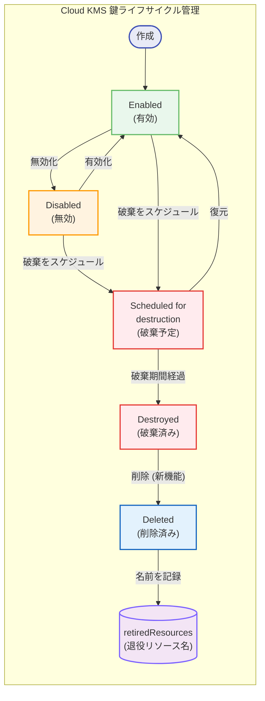

# Cloud Key Management Service: 鍵および鍵バージョンの削除機能が GA

**リリース日**: 2026-03-02

**サービス**: Cloud Key Management Service

**機能**: 鍵および鍵バージョンの削除 (Deletion of keys and key versions)

**ステータス**: GA (一般提供)

[このアップデートのインフォグラフィックを見る](https://takech9203.github.io/google-cloud-news-summary/20260302-cloud-kms-key-deletion-ga.html)

## 概要

Cloud KMS における鍵および鍵バージョンの削除機能が一般提供 (GA) となった。これまで Cloud KMS では、鍵リング、鍵、鍵バージョンはリソース名の衝突を防ぐために削除できない仕様であり、鍵バージョンの鍵マテリアルを破棄 (destroy) することでのみ無効化が可能だった。今回のアップデートにより、削除条件を満たした鍵および鍵バージョンをリソースリストから完全に削除できるようになった。

この機能は、Cloud KMS における「破棄 (destruction)」と「削除 (deletion)」を明確に区別する。破棄は鍵バージョンを恒久的に無効化し、鍵マテリアルを不可逆的に消去する操作である。一方、削除は Google Cloud コンソール、gcloud CLI、Cloud KMS API、クライアントライブラリのリソースリストから鍵または鍵バージョンを除去する操作である。削除により、多数の鍵や鍵バージョンを持つプロジェクトでの検索・一覧操作が効率化される。

この機能は、長期間運用してきたプロジェクトで不要な鍵リソースが蓄積し、リソース管理が煩雑になっているセキュリティチームやインフラ管理者を主な対象としている。

**アップデート前の課題**

Cloud KMS のリソース管理において、以下の課題が存在していた。

- 鍵リング、鍵、鍵バージョンはリソース名の衝突防止のために削除できず、プロジェクト内に不要なリソースが蓄積し続けていた
- 鍵バージョンの鍵マテリアルを破棄しても、リソース自体はリストに残り続けるため、検索・一覧操作のノイズが増加していた
- 大量の鍵を持つプロジェクトでは、アクティブな鍵と破棄済みの鍵を効率的に区別することが困難だった

**アップデート後の改善**

今回のアップデートにより、以下の改善が実現した。

- 削除条件を満たした鍵バージョン (DESTROYED、IMPORT_FAILED、GENERATION_FAILED 状態) をリソースリストから完全に削除できるようになった
- すべての鍵バージョンが削除済みで、自動ローテーションが設定されておらず、Autokey で作成されていない鍵を削除できるようになった
- 削除済みリソースの名前は `retiredResources` として管理され、再利用できない名前を確認できるようになった

## アーキテクチャ図



この図は Cloud KMS 鍵バージョンの完全なライフサイクルを示している。従来は Destroyed 状態が終端だったが、今回のアップデートにより Destroyed 状態から Deleted 状態への遷移が可能になり、リソースリストからの完全な削除が実現した。削除されたリソースの名前は retiredResources に記録され、再利用が防止される。

## サービスアップデートの詳細

### 主要機能

1. **鍵バージョンの削除**
   - DESTROYED、IMPORT_FAILED、GENERATION_FAILED のいずれかの状態にある鍵バージョンを削除できる
   - インポートされた鍵バージョンは、インポートが失敗した場合にのみ削除可能
   - 削除は非同期のロングランニングオペレーションとして実行され、`operations.get` メソッドでステータスを確認できる

2. **鍵の削除**
   - 以下の条件をすべて満たす鍵を削除できる:
     - 鍵に含まれるすべての鍵バージョンが削除済みであること
     - 自動鍵ローテーションがスケジュールされていないこと
     - Cloud KMS Autokey で作成された鍵ではないこと
   - 鍵の削除も非同期のロングランニングオペレーションとして実行される

3. **退役リソース名の管理 (retiredResources)**
   - 削除された鍵の名前は同一プロジェクト内で再利用できない
   - `retiredResources.list` メソッドで再利用できない名前の一覧を取得できる
   - `retiredResources.get` メソッドで個別のリソースのメタデータ (リソースタイプ、削除日時、完全なリソース識別子) を確認できる

## 技術仕様

### 破棄と削除の違い

| 項目 | 破棄 (Destruction) | 削除 (Deletion) |
|------|-------------------|----------------|
| 対象 | 鍵バージョン | 鍵バージョン、鍵 |
| 操作内容 | 鍵マテリアルを恒久的に破壊 | リソースをリストから除去 |
| 前提条件 | 有効または無効状態の鍵バージョン | 破棄済み・インポート失敗・生成失敗の鍵バージョン |
| 猶予期間 | デフォルト 30 日 (変更可能) | なし (即座に実行) |
| 復元可否 | 猶予期間内は復元可能 | 不可逆 |
| 課金への影響 | 破棄済み鍵バージョンは課金対象外 | 削除済みリソースは課金対象外 |
| リストへの表示 | 破棄済みとして表示される | リストから除去される |
| リソース名の再利用 | 不可 | 不可 (retiredResources に記録) |

### 必要な IAM 権限

| 権限 | 説明 |
|------|------|
| `cloudkms.cryptoKeyVersions.delete` | 鍵バージョンの削除に必要 |
| `cloudkms.cryptoKeys.delete` | 鍵の削除に必要 |
| `cloudkms.retiredResources.get` | 退役リソースの個別確認に必要 |
| `cloudkms.retiredResources.list` | 退役リソースの一覧取得に必要 |
| `roles/cloudkms.admin` | 上記すべての権限を含む事前定義ロール |

### 鍵バージョンの削除条件

```json
{
  "deletable_key_version_states": [
    "DESTROYED",
    "IMPORT_FAILED",
    "GENERATION_FAILED"
  ],
  "note": "インポートされた鍵バージョンは IMPORT_FAILED の場合のみ削除可能"
}
```

## 設定方法

### 前提条件

1. Cloud KMS 管理者 (`roles/cloudkms.admin`) IAM ロールが付与されていること
2. 削除対象の鍵バージョンが DESTROYED、IMPORT_FAILED、または GENERATION_FAILED 状態であること
3. 鍵を削除する場合は、すべての鍵バージョンが事前に削除されていること

### 手順

#### ステップ 1: 鍵バージョンの削除

```bash
# gcloud CLI で鍵バージョンを削除
gcloud kms keys versions delete KEY_VERSION \
    --location=LOCATION \
    --keyring=KEY_RING \
    --key=KEY_NAME
```

REST API を使用する場合:

```bash
# REST API で鍵バージョンを削除
curl "https://cloudkms.googleapis.com/v1/projects/PROJECT_ID/locations/LOCATION/keyRings/KEY_RING/cryptoKeys/KEY_NAME/cryptoKeyVersions/KEY_VERSION" \
    --request "DELETE" \
    --header "authorization: Bearer TOKEN"
```

削除はロングランニングオペレーションとして実行される。完了を確認するには `operations.get` メソッドを呼び出す。

#### ステップ 2: 鍵の削除

すべての鍵バージョンが削除済みであることを確認した後、鍵を削除する。

```bash
# gcloud CLI で鍵を削除
gcloud kms keys delete KEY_NAME \
    --location=LOCATION \
    --keyring=KEY_RING
```

REST API を使用する場合:

```bash
# REST API で鍵を削除
curl "https://cloudkms.googleapis.com/v1/projects/PROJECT_ID/locations/LOCATION/keyRings/KEY_RING/cryptoKeys/KEY_NAME" \
    --request "DELETE" \
    --header "authorization: Bearer TOKEN"
```

#### ステップ 3: 退役リソースの確認

```bash
# 退役リソースの一覧を取得
gcloud kms retired-resources list \
    --location=LOCATION

# 個別の退役リソースの詳細を確認
gcloud kms retired-resources describe RETIRED_RESOURCE \
    --location=LOCATION
```

## メリット

### ビジネス面

- **リソース管理の効率化**: 長期間運用してきたプロジェクトで蓄積した不要な鍵リソースをクリーンアップでき、管理対象の見通しが改善される
- **運用負荷の軽減**: 検索・一覧操作のノイズが減少し、管理者がアクティブな鍵に集中できるようになる
- **コンプライアンス対応の強化**: 不要な暗号鍵リソースを確実に除去でき、暗号鍵のライフサイクル管理に関する監査要件への対応が容易になる

### 技術面

- **API レスポンスの改善**: リソースリストから不要なエントリが除去されることで、API の一覧取得操作のレスポンスが効率化される
- **リソース名の一意性保証**: retiredResources メカニズムにより、削除されたリソースの名前が再利用されることを防ぎ、リソース識別子の一意性が保証される
- **gcloud CLI と REST API の両方に対応**: gcloud CLI と REST API の双方で削除操作が可能であり、既存のワークフローに容易に統合できる

## デメリット・制約事項

### 制限事項

- 削除されたリソース名 (CryptoKey 名) は再利用できない。同じ名前で新しい鍵を作成することはできず、retiredResources として記録される
- 鍵リング (KeyRing) は引き続き削除できない
- Autokey で作成された鍵は削除できない
- 鍵の削除には、すべての鍵バージョンが事前に削除されている必要がある (段階的な削除が必要)
- インポートされた鍵バージョンは、IMPORT_FAILED 状態の場合のみ削除可能であり、正常にインポートされた鍵バージョンは通常の破棄 → 削除フローに従う

### 考慮すべき点

- 削除は不可逆操作であり、削除した鍵バージョンを復元することはできない。破棄 (destruction) の段階では猶予期間内の復元が可能だが、削除 (deletion) には猶予期間がない
- 鍵の削除前に、その鍵で暗号化されたデータがすべて復号済みまたは不要であることを十分に確認する必要がある
- 大量の鍵を一括削除する場合は、API のクォータ制限に注意が必要

## ユースケース

### ユースケース 1: レガシープロジェクトの鍵クリーンアップ

**シナリオ**: 数年間運用してきたプロジェクトで、鍵のローテーションにより数千の破棄済み鍵バージョンが蓄積しており、Google Cloud コンソールでの鍵管理画面の操作性が低下している。

**実装例**:

```bash
# 破棄済みの鍵バージョンを確認
gcloud kms keys versions list \
    --location=us-central1 \
    --keyring=my-key-ring \
    --key=my-key \
    --filter="state=DESTROYED"

# 破棄済みの鍵バージョンを削除
gcloud kms keys versions delete 1 \
    --location=us-central1 \
    --keyring=my-key-ring \
    --key=my-key
```

**効果**: 破棄済みの鍵バージョンをリソースリストから除去し、管理画面の見通しを改善できる。アクティブな鍵バージョンのみが表示されるようになり、運用効率が向上する。

### ユースケース 2: プロジェクト再編成時の鍵整理

**シナリオ**: 組織再編に伴いプロジェクトを統合する際、旧プロジェクトの不要な暗号鍵を整理したい。すべてのデータは既に新しい鍵で再暗号化済みである。

**効果**: 旧鍵のバージョンを順次破棄・削除し、最終的に鍵自体を削除することで、不要なリソースを完全にクリーンアップできる。retiredResources で削除済み名前を追跡でき、監査証跡としても活用可能。

## 料金

Cloud KMS の鍵削除操作自体に追加料金は発生しない。削除済みの鍵バージョンは課金対象外である (破棄済みの鍵バージョンも同様に課金対象外)。

### 料金例

| 鍵タイプ | 月額料金 (アクティブ鍵バージョンあたり) |
|----------|----------------------------------------|
| ソフトウェア鍵 (Cloud KMS) | $0.06 |
| ハードウェア鍵 (Cloud HSM) | $1.00 - $2.50 |
| 外部鍵 (Cloud EKM) | $3.00 |

破棄済みまたは削除済みの鍵バージョンは課金対象外。暗号化操作には別途料金が発生する。詳細は [Cloud KMS の料金ページ](https://cloud.google.com/kms/pricing) を参照。

## 利用可能リージョン

Cloud KMS が利用可能なすべての Google Cloud ロケーションで鍵の削除機能を使用できる。詳細は [Cloud KMS ロケーション](https://cloud.google.com/kms/docs/locations) を参照。

## 関連サービス・機能

- **Cloud KMS 鍵バージョンの破棄・復元**: 鍵マテリアルを破棄するための既存機能。削除の前提条件として鍵バージョンが破棄済みである必要がある
- **Cloud KMS Autokey**: 暗号鍵の自動プロビジョニング機能。Autokey で作成された鍵は削除できない制約がある
- **Cloud Audit Logs**: 鍵の削除操作は監査ログに記録され、セキュリティ監査やコンプライアンス対応に活用できる
- **組織ポリシー**: `Minimum destroy scheduled duration per key` や `Restrict key destruction to disabled keys` などの制約と組み合わせて、鍵の破棄・削除のガバナンスを強化できる
- **IAM**: 鍵の削除権限 (`cloudkms.cryptoKeys.delete`, `cloudkms.cryptoKeyVersions.delete`) を細かく制御でき、職務分離を実現できる

## 参考リンク

- [このアップデートのインフォグラフィック](https://takech9203.github.io/google-cloud-news-summary/20260302-cloud-kms-key-deletion-ga.html)
- [公式リリースノート](https://docs.cloud.google.com/release-notes#March_02_2026)
- [Delete Cloud KMS resources (公式ドキュメント)](https://docs.cloud.google.com/kms/docs/delete-kms-resources)
- [Cloud KMS 鍵バージョンの破棄・復元](https://cloud.google.com/kms/docs/destroy-restore)
- [Cloud KMS リソース階層](https://cloud.google.com/kms/docs/resource-hierarchy)
- [Cloud KMS 鍵の状態](https://cloud.google.com/kms/docs/key-states)
- [Cloud KMS 料金ページ](https://cloud.google.com/kms/pricing)

## まとめ

Cloud KMS の鍵および鍵バージョンの削除機能が GA となったことは、長年の Cloud KMS の制約を解消する重要なアップデートである。従来は破棄済みの鍵バージョンやすべてのバージョンが破棄された鍵がリソースリストに残り続けていたが、今後は削除条件を満たしたリソースをクリーンアップできるようになる。長期間運用しているプロジェクトや大量の鍵を管理しているチームは、この機能を活用してリソース管理を効率化することを推奨する。ただし、削除は不可逆操作であるため、対象リソースが確実に不要であることを事前に確認することが重要である。

---

**タグ**: Cloud KMS, 鍵管理, 鍵削除, 鍵バージョン削除, セキュリティ, 暗号化, GA, retiredResources, ライフサイクル管理
