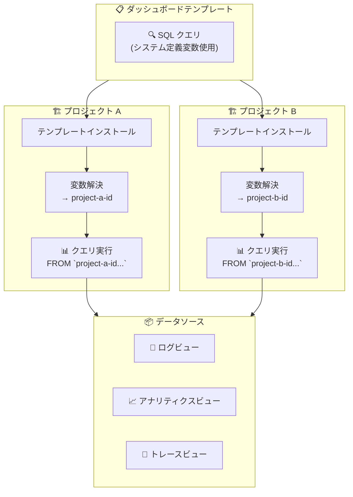

# Cloud Monitoring: Observability Analytics の SQL クエリでプロジェクト ID に解決されるシステム定義変数が利用可能に

**リリース日**: 2026-03-02

**サービス**: Cloud Monitoring

**機能**: Observability Analytics SQL queries can now use a system-defined variable which resolves to the project ID

**ステータス**: Feature

📊 [このアップデートのインフォグラフィックを見る](https://takech9203.github.io/google-cloud-news-summary/20260302-cloud-monitoring-observability-analytics-sql-variable.html)

## 概要

Cloud Monitoring の Observability Analytics で発行される SQL クエリにおいて、プロジェクト ID に自動的に解決されるシステム定義変数が利用可能になりました。これにより、ダッシュボードテンプレートの SQL クエリ内でプロジェクト ID をハードコードする必要がなくなり、テンプレートのインストール後にクエリを手動で編集する手間が解消されます。

この機能は、Cloud Monitoring のダッシュボードテンプレートを複数のプロジェクトにデプロイする運用チームや、Log Analytics・Observability Analytics を活用してログやトレースデータを分析するエンジニアにとって、特に有用な改善です。ダッシュボードテンプレートのポータビリティが向上し、マルチプロジェクト環境での運用効率が大幅に改善されます。

**アップデート前の課題**

- ダッシュボードテンプレートの SQL クエリ内で `PROJECT_ID` を手動で実際のプロジェクト ID に置き換える必要があった
- テンプレートを別のプロジェクトにインストールするたびに、SQL クエリの FROM 句（例: `` `PROJECT_ID.LOCATION.BUCKET_ID.LOG_VIEW_ID` ``）を手動で編集する必要があった
- テンプレートの共有・再利用時にプロジェクト固有の値が残っていると、クエリエラーが発生するリスクがあった

**アップデート後の改善**

- システム定義変数を使用することで、SQL クエリが自動的に実行中のプロジェクト ID に解決されるようになった
- ダッシュボードテンプレートのインストール後に SQL クエリを手動で更新する必要がなくなった
- テンプレートの共有・再利用がプロジェクトをまたいでシームレスに行えるようになった

## アーキテクチャ図



システム定義変数により、同一のダッシュボードテンプレートが複数プロジェクトにそのままインストールでき、SQL クエリが自動的に適切なプロジェクト ID に解決されるフローを示しています。

## サービスアップデートの詳細

### 主要機能

1. **プロジェクト ID のシステム定義変数**
   - Observability Analytics の SQL クエリ内で使用できる、プロジェクト ID に自動解決される変数
   - クエリ実行時に、現在のプロジェクトの ID に動的に置換される

2. **ダッシュボードテンプレートとの統合**
   - テンプレート内の SQL クエリでプロジェクト ID 変数を使用可能
   - テンプレートインストール後の手動編集が不要
   - Google Cloud コンソールおよび API の両方で利用可能

3. **SQL クエリでの変数サポート**
   - Observability Analytics の SQL クエリ（`opsAnalyticsQuery`）で変数が利用可能
   - FROM 句でログビュー、アナリティクスビュー、トレースビューのパスにプロジェクト ID を動的に指定可能

## 技術仕様

### SQL クエリでの変数の使用

Observability Analytics の SQL クエリでは、FROM 句でデータソースを指定する際にプロジェクト ID が必要です。

| データソース | FROM 句のフォーマット |
|------|------|
| ログビュー | `` `PROJECT_ID.LOCATION.BUCKET_ID.LOG_VIEW_ID` `` |
| アナリティクスビュー | `` `analytics_view.PROJECT_ID.LOCATION.ANALYTICS_VIEW_ID` `` |
| トレースビュー | `` `PROJECT_ID.LOCATION._Trace.Spans._AllSpans` `` |

### ダッシュボード変数との関係

Cloud Monitoring のダッシュボードでは、以下の種類の変数がサポートされています。

| 変数の種類 | 用途 | SQL での参照構文 |
|------|------|------|
| ラベルベース変数 | リソースラベルによるフィルタリング | `@variable_name.value` |
| 値のみの変数（Custom） | 定義済みリストからの選択 | `@variable_name` |
| 値のみの変数（SQL Query） | SQL クエリ結果からの選択 | `@variable_name` |
| 値のみの変数（Text Input） | 自由入力 | `@variable_name` |
| システム定義変数（今回追加） | プロジェクト ID の自動解決 | ドキュメント参照 |

### SQL クエリでの変数使用例

SQL クエリ内で変数を使用する場合、`WHERE` 句での参照には `@` プレフィックスを使用し、BigQuery のパラメータ化クエリとして安全に実行されます。

```sql
SELECT
  timestamp, severity, resource.type, log_name
FROM
  `PROJECT_ID.global._Default._Default`
WHERE
  IF(@LogName = "*", TRUE, log_name = @LogName)
LIMIT 10000
```

## メリット

### ビジネス面

- **運用コストの削減**: テンプレートのインストール後に手動でクエリを編集する時間とエラーリスクを削減
- **標準化の促進**: 組織全体で統一されたダッシュボードテンプレートを、プロジェクトごとのカスタマイズなしに展開可能

### 技術面

- **テンプレートのポータビリティ向上**: 同一テンプレートを複数プロジェクトにそのまま適用可能
- **エラーの防止**: プロジェクト ID のハードコードや手動置換に伴う設定ミスを防止
- **SQL インジェクション安全**: 変数の置換は BigQuery のパラメータ化クエリを使用しており、SQL インジェクションに対して安全

## ユースケース

### ユースケース 1: マルチプロジェクト環境でのダッシュボード展開

**シナリオ**: 本番・ステージング・開発の各プロジェクトに同一の監視ダッシュボードを展開する必要がある。

**効果**: プロジェクト ID 変数を使用したテンプレートを作成することで、各環境への展開時にクエリの手動編集が不要になり、展開の自動化が容易になる。

### ユースケース 2: チーム間でのダッシュボードテンプレート共有

**シナリオ**: SRE チームが作成した Log Analytics ダッシュボードテンプレートを、異なるプロジェクトを管理する複数のアプリケーションチームに配布する。

**効果**: テンプレートの受け手は、インストールするだけでプロジェクト固有のデータが自動的に表示され、SQL クエリの理解や編集スキルが不要になる。

### ユースケース 3: GitHub リポジトリでのテンプレート管理

**シナリオ**: [monitoring-dashboard-samples リポジトリ](https://github.com/GoogleCloudPlatform/monitoring-dashboard-samples)のようなテンプレートリポジトリで、SQL クエリを含むダッシュボードテンプレートを管理・配布する。

**効果**: テンプレート内のプロジェクト ID がシステム定義変数で記述されているため、利用者はダウンロード後にそのままインストールでき、プロジェクト固有の値を編集する手順が不要になる。

## 料金

Observability Analytics の SQL クエリにおけるシステム定義変数の使用自体に追加料金は発生しません。ただし、SQL クエリの実行に伴う以下の既存の料金体系が適用されます。

詳細な料金情報は [Google Cloud Observability 料金ページ](https://cloud.google.com/products/observability/pricing) を参照してください。

## 関連サービス・機能

- **Cloud Logging (Log Analytics)**: Observability Analytics の基盤となるログ分析エンジン。SQL クエリでログビューやアナリティクスビューを照会可能
- **Cloud Monitoring ダッシュボード**: SQL クエリの結果をチャートとして表示するカスタムダッシュボード機能
- **ダッシュボードテンプレート**: GitHub リポジトリで提供される事前構成済みダッシュボード定義。今回の変数サポートにより利便性が向上
- **Cloud Trace**: Observability Analytics で SQL クエリによりトレースデータ（`_AllSpans` ビュー）を分析可能
- **BigQuery**: Log Analytics の SQL クエリエンジンとして BigQuery が使用される。リンクされたデータセットを介したクエリも可能

## 参考リンク

- 📊 [インフォグラフィック](https://takech9203.github.io/google-cloud-news-summary/20260302-cloud-monitoring-observability-analytics-sql-variable.html)
- [公式リリースノート](https://docs.google.com/release-notes#March_02_2026)
- [ドキュメント: Charts with SQL queries (Google Cloud コンソール)](https://cloud.google.com/monitoring/charts/view-logs)
- [ドキュメント: Charts with SQL queries (API)](https://cloud.google.com/monitoring/dashboards/api-examples)
- [ダッシュボードの変数とフィルター](https://cloud.google.com/monitoring/dashboards/filter-permanent)
- [SQL クエリのサンプル](https://cloud.google.com/stackdriver/docs/observability/analytics-samples)
- [ダッシュボードテンプレート](https://cloud.google.com/monitoring/dashboards/dashboard-templates)
- [料金ページ](https://cloud.google.com/products/observability/pricing)

## まとめ

今回のアップデートにより、Cloud Monitoring の Observability Analytics で SQL クエリにプロジェクト ID のシステム定義変数が使用可能になりました。これはダッシュボードテンプレートのポータビリティを大幅に向上させる改善であり、特にマルチプロジェクト環境や組織横断でのダッシュボード標準化を推進するチームにとって有益です。既にダッシュボードテンプレートを使用している場合は、SQL クエリ内のハードコードされたプロジェクト ID をシステム定義変数に置き換えることを推奨します。

---

**タグ**: #CloudMonitoring #ObservabilityAnalytics #LogAnalytics #SQL #ダッシュボード #テンプレート #変数 #GoogleCloudObservability
