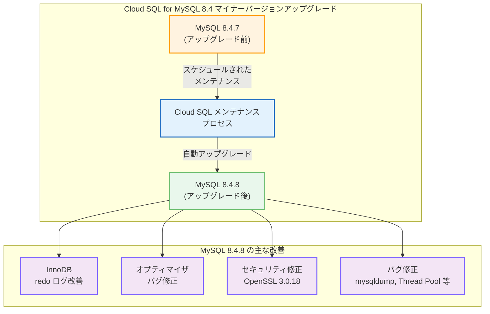

# Cloud SQL for MySQL: MySQL 8.4.7 から 8.4.8 へのマイナーバージョンアップグレード

**リリース日**: 2026-03-02

**サービス**: Cloud SQL for MySQL

**機能**: MySQL 8.4.8 マイナーバージョンアップグレード

**ステータス**: GA (一般提供)

[このアップデートのインフォグラフィックを見る](https://takech9203.github.io/google-cloud-news-summary/20260302-cloud-sql-mysql-8-4-8.html)

## 概要

Cloud SQL for MySQL 8.4 のマイナーバージョンが 8.4.7 から 8.4.8 にアップグレードされた。MySQL 8.4.8 は 2026 年 1 月 20 日にリリースされた LTS (Long-Term Support) リリースであり、InnoDB のエラーログ改善、オプティマイザのバグ修正、セキュリティ修正、OpenSSL ライブラリの更新など、多岐にわたる改善が含まれている。Cloud SQL ではこのバージョンが 2026 年 3 月 2 日より利用可能となった。

MySQL 8.4 は 2024 年 10 月に Cloud SQL で一般提供が開始された LTS シリーズであり、デフォルトでは Cloud SQL Enterprise Plus エディションとして提供される。マイナーバージョンのアップグレードは、Cloud SQL のマネージドサービスとしてのメンテナンスプロセスの一環であり、セキュリティパッチ、バグ修正、パフォーマンス改善を継続的に受け取ることができる。

このアップデートは、Cloud SQL for MySQL 8.4 を使用しているすべてのユーザーに影響があり、特にデータベースの安定性、セキュリティ、パフォーマンスを重視する本番環境のワークロードにとって重要である。

**アップデート前の課題**

MySQL 8.4.7 において以下の課題が存在していた。

- InnoDB の redo ログエラーメッセージに LSN やログ容量情報が含まれておらず、トラブルシューティング時に詳細情報の取得が困難だった
- Common Table Expressions (CTE) に関連するオプティマイザのバグが存在していた
- `REGEXP` を使用するクエリがプリペアドステートメントとして実行する場合、直接クエリよりも実行時間が長くなるパフォーマンス問題があった
- OpenSSL ライブラリが古いバージョンのままであり、最新のセキュリティパッチが適用されていなかった
- `mysqldump` の `--order-by-primary` オプションがプライマリキーだけでなくすべてのインデックスでソートしてしまうバグが存在していた

**アップデート後の改善**

MySQL 8.4.8 へのアップグレードにより、以下の改善が実現した。

- InnoDB redo ログのエラーメッセージに現在の LSN とログ容量情報が含まれるようになり、トラブルシューティングが効率化された
- CTE 関連のオプティマイザバグが修正され、クエリの信頼性が向上した
- `REGEXP` を使用するプリペアドステートメントのパフォーマンスが改善された
- OpenSSL ライブラリが 3.0.18 に更新され、最新のセキュリティ修正が適用された
- 認証に関するセキュリティ問題が修正され、存在しないユーザーでの接続時のエラーメッセージが一貫したものになった

## アーキテクチャ図



この図は Cloud SQL for MySQL 8.4.7 から 8.4.8 へのアップグレードプロセスと、アップグレードに含まれる主な改善カテゴリを示している。Cloud SQL のメンテナンスプロセスを通じて自動的にアップグレードが実施される。

## サービスアップデートの詳細

### 主要機能

1. **InnoDB redo ログの改善**
   - redo ログのエラーメッセージに現在の LSN (Log Sequence Number) と redo ログ容量情報が含まれるようになった
   - 新しい警告コード `ER_IB_WRN_REDO_DISABLED_INFO` が追加され、現在の LSN を含む情報が出力される
   - 新しいエラーコード `ER_IB_MSG_LOG_WRITER_WAIT_ON_NEW_LOG_FILE_INFO` が追加され、現在のログ容量と使用量が出力される
   - InnoDB MONITOR の出力が強化され、redo ログ容量の詳細が含まれるようになった

2. **オプティマイザのバグ修正**
   - Common Table Expressions (CTE) に関連するバグが修正された (Bug #38573285)
   - 特定の SQL クエリ実行に関するバグが修正された (Bug #38448700)
   - `SHOW CREATE TABLE` に関連するバグが修正された (Bug #38298692)
   - `REGEXP` を使用するプリペアドステートメントのパフォーマンスが改善された (Bug #114056, Bug #36326728)

3. **セキュリティ修正**
   - OpenSSL ライブラリが 3.0.18 に更新された
   - 認証に関するセキュリティ問題が修正された (Bug #118447, Bug #38077617)
   - 存在しないユーザーでの接続時のエラーメッセージが一貫したものに修正された (Bug #36527984)

4. **バグ修正**
   - `que_eval_sql` インターフェース使用時のレースコンディションが修正された (Bug #118705, Bug #38310595)
   - `SET PERSIST` 実行後の `mysqld-auto.cnf` での変数重複エントリ問題が修正された (Bug #38680162)
   - バイナリログのパージタイミングに関する問題が修正された (Bug #38554467)
   - 地理的に分散した InnoDB Cluster での接続喪失時のプライマリ応答停止問題が修正された (Bug #38380392)
   - `mysqldump` の `--order-by-primary` オプションがプライマリキーのみでソートするように修正された (Bug #38284832)
   - Thread Pool のブロック接続クローズに関する問題が修正された (Bug #38170188, Bug #36782728, Bug #38549372)
   - `replica-skip-errors` オプションによる GTID ギャップ生成問題が修正された (Bug #28590993)

## 技術仕様

### バージョン情報

| 項目 | 詳細 |
|------|------|
| アップグレード前バージョン | MySQL 8.4.7 (2025-10-21 リリース) |
| アップグレード後バージョン | MySQL 8.4.8 (2026-01-20 リリース) |
| リリースタイプ | LTS (Long-Term Support) |
| Cloud SQL での提供開始日 | 2026-03-02 |
| 同梱 OpenSSL バージョン | 3.0.18 |

### MySQL 8.4 の Cloud SQL における特性

| 項目 | 詳細 |
|------|------|
| デフォルトエディション | Cloud SQL Enterprise Plus |
| 認証プラグインデフォルト | `caching_sha2_password` |
| メンテナンスによる自動アップグレード | 対応 |
| メジャーバージョンアップグレード元 | MySQL 8.0 の任意のマイナーバージョン |

## 設定方法

### 前提条件

1. Cloud SQL for MySQL 8.4 インスタンスが既に作成されていること
2. Cloud SQL 編集者 (`roles/cloudsql.editor`) 以上の IAM ロールが付与されていること

### 手順

#### 方法 1: スケジュールされたメンテナンスによる自動アップグレード

Cloud SQL のメンテナンスプロセスにより、次回のメンテナンスウィンドウで自動的にアップグレードが実施される。メンテナンスウィンドウを設定していない場合は、Cloud SQL が適切なタイミングでアップグレードを実行する。

```bash
# メンテナンスウィンドウの設定
gcloud sql instances patch INSTANCE_NAME \
    --maintenance-window-day=SUN \
    --maintenance-window-hour=2
```

メンテナンスウィンドウを設定することで、ダウンタイムが発生するタイミングを制御できる。

#### 方法 2: セルフサービスメンテナンスによる手動アップグレード

次回のスケジュールされたメンテナンスを待たずにアップグレードしたい場合は、セルフサービスメンテナンスを使用する。

```bash
# 利用可能なメンテナンスバージョンの確認
gcloud sql instances describe INSTANCE_NAME \
    --format="value(availableMaintenanceVersions)"

# セルフサービスメンテナンスの実行
gcloud sql instances patch INSTANCE_NAME \
    --maintenance-version=MAINTENANCE_VERSION
```

リードレプリカがある場合は、プライマリインスタンスを指定してすべてのレプリカを一括更新できる。

#### 方法 3: 現在のバージョンの確認

```bash
# インスタンスの現在のデータベースバージョンを確認
gcloud sql instances describe INSTANCE_NAME \
    --format="value(databaseInstalledVersion)"
```

## メリット

### ビジネス面

- **セキュリティリスクの低減**: OpenSSL 3.0.18 への更新と認証関連のセキュリティ修正により、データベースのセキュリティが強化される
- **システムの安定性向上**: InnoDB Cluster の接続喪失時の問題や Thread Pool のバグが修正され、本番環境の可用性が向上する
- **運用効率の改善**: InnoDB redo ログの診断情報が充実し、障害発生時のトラブルシューティングが効率化される

### 技術面

- **クエリパフォーマンスの改善**: `REGEXP` プリペアドステートメントのパフォーマンス問題が解消され、正規表現を多用するアプリケーションの応答性が向上する
- **レプリケーションの信頼性向上**: `replica-skip-errors` オプションによる GTID ギャップ生成問題が修正され、レプリケーション環境の一貫性が向上する
- **バックアップ操作の改善**: `mysqldump` の `--order-by-primary` オプションの修正により、バックアップの一貫性とパフォーマンスが改善される

## デメリット・制約事項

### 制限事項

- マイナーバージョンのアップグレードにはインスタンスの再起動が必要であり、短時間のダウンタイムが発生する
- Cloud SQL Enterprise Plus エディションの場合はほぼゼロダウンタイムで完了するが、Enterprise エディションでは数分のダウンタイムが見込まれる
- アップグレード後に前のマイナーバージョンにロールバックすることはできない

### 考慮すべき点

- アップグレード前にアプリケーションの互換性テストを実施することを推奨する。ドライランとしてインスタンスのクローンを作成してテストできる
- レプリカを含む構成の場合、レプリカも併せてアップグレードする必要がある
- MySQL 8.4.8 の変更点により、アプリケーションの動作に影響が出ないか、特に `REGEXP` やCTE を使用するクエリについて確認することを推奨する

## ユースケース

### ユースケース 1: InnoDB Cluster を使用した高可用性環境

**シナリオ**: 地理的に分散した InnoDB Cluster を使用しており、一部のインスタンスが接続を喪失した際にプライマリサーバーが応答しなくなる問題が発生していた。

**効果**: MySQL 8.4.8 の Bug #38380392 の修正により、InnoDB Cluster の接続喪失時のプライマリ応答停止問題が解消され、高可用性環境の信頼性が向上する。

### ユースケース 2: 正規表現を多用する検索アプリケーション

**シナリオ**: ユーザー入力をもとに `REGEXP` を使用したプリペアドステートメントでデータ検索を行うアプリケーションで、パフォーマンスの低下が観測されていた。

**効果**: MySQL 8.4.8 での `REGEXP` プリペアドステートメントのパフォーマンス改善により、直接クエリと同等のパフォーマンスが期待でき、アプリケーションの応答性が向上する。

### ユースケース 3: データベースのセキュリティ強化

**シナリオ**: 金融系や医療系のコンプライアンス要件により、データベースの暗号化ライブラリを常に最新のセキュリティパッチが適用された状態に保つ必要がある。

**効果**: OpenSSL 3.0.18 への更新と認証関連のセキュリティ修正により、コンプライアンス要件を満たすとともに、データベース接続のセキュリティが強化される。

## 料金

MySQL 8.4.8 へのマイナーバージョンアップグレード自体に追加料金は発生しない。Cloud SQL の料金は引き続きインスタンスの構成 (vCPU、メモリ、ストレージ、ネットワーク) に基づいて課金される。

### 料金例

| 構成 | 月額料金 (概算、us-central1) |
|------|-------------------------------|
| db-f1-micro (共有 vCPU, 0.6 GB メモリ) | 約 $7.67 |
| db-custom-2-7680 (2 vCPU, 7.5 GB メモリ) | 約 $97.09 |
| db-custom-4-15360 (4 vCPU, 15 GB メモリ) | 約 $194.18 |

上記はインスタンス料金のみの概算。ストレージ (SSD: $0.17/GB/月)、ネットワーク、バックアップに別途料金が発生する。Enterprise Plus エディションの場合は異なる料金体系が適用される。CUD (Committed Use Discounts) により 1 年契約で 25%、3 年契約で 52% の割引が利用可能。詳細は [Cloud SQL 料金ページ](https://cloud.google.com/sql/pricing) を参照。

## 利用可能リージョン

Cloud SQL for MySQL 8.4.8 は、Cloud SQL が利用可能なすべての Google Cloud リージョンで利用できる。主なリージョンは以下の通り。

- **アジア太平洋**: asia-east1 (台湾)、asia-east2 (香港)、asia-northeast1 (東京)、asia-northeast2 (大阪)、asia-northeast3 (ソウル)、asia-south1 (ムンバイ)、asia-south2 (デリー)、asia-southeast1 (シンガポール)、asia-southeast2 (ジャカルタ)、australia-southeast1 (シドニー)、australia-southeast2 (メルボルン)
- **ヨーロッパ**: europe-central2 (ワルシャワ)、europe-north1 (フィンランド)、europe-west1 (ベルギー)、europe-west2 (ロンドン)、europe-west3 (フランクフルト)、europe-west4 (オランダ)、europe-west6 (チューリッヒ)、europe-west8 (ミラノ)、europe-west9 (パリ) 他
- **北米**: us-central1 (アイオワ)、us-east1 (サウスカロライナ)、us-east4 (北バージニア)、us-west1 (オレゴン)、us-west2 (ロサンゼルス)、northamerica-northeast1 (モントリオール) 他
- **南米**: southamerica-east1 (サンパウロ)、southamerica-west1 (サンティアゴ)
- **中東**: me-central1 (ドーハ)、me-central2 (ダンマーム)、me-west1 (テルアビブ)
- **アフリカ**: africa-south1 (ヨハネスブルグ)

## 関連サービス・機能

- **Cloud SQL Enterprise Plus エディション**: MySQL 8.4 インスタンスのデフォルトエディション。ほぼゼロダウンタイムでのマイナーバージョンアップグレードをサポートする
- **Cloud SQL メンテナンスウィンドウ**: メンテナンスによるダウンタイムのタイミングを制御でき、業務時間外にアップグレードをスケジュールできる
- **Cloud SQL セルフサービスメンテナンス**: スケジュールされたメンテナンスを待たずに、任意のタイミングでアップグレードを実行できる
- **Cloud SQL Auth Proxy**: MySQL 8.4 のデフォルト認証プラグイン `caching_sha2_password` と連携して安全なデータベース接続を提供する
- **Cloud SQL クロスリージョンレプリカ**: レプリカを含む構成では、プライマリとレプリカの両方がアップグレードされる
- **Cloud SQL 高度なディザスタリカバリ**: Enterprise Plus エディションの Private Service Connect 対応インスタンスで利用可能

## 参考リンク

- [このアップデートのインフォグラフィック](https://takech9203.github.io/google-cloud-news-summary/20260302-cloud-sql-mysql-8-4-8.html)
- [公式リリースノート](https://docs.cloud.google.com/release-notes#March_02_2026)
- [MySQL 8.4.8 Release Notes](https://dev.mysql.com/doc/relnotes/mysql/8.4/en/news-8-4-8.html)
- [Cloud SQL for MySQL マイナーバージョンアップグレード](https://cloud.google.com/sql/docs/mysql/upgrade-minor-db-version)
- [Cloud SQL メンテナンス](https://cloud.google.com/sql/docs/mysql/maintenance)
- [Cloud SQL セルフサービスメンテナンス](https://cloud.google.com/sql/docs/mysql/self-service-maintenance)
- [Cloud SQL データベースバージョンとバージョンポリシー](https://cloud.google.com/sql/docs/mysql/db-versions)
- [Cloud SQL 料金ページ](https://cloud.google.com/sql/pricing)

## まとめ

Cloud SQL for MySQL 8.4.7 から 8.4.8 へのマイナーバージョンアップグレードは、InnoDB の診断機能強化、オプティマイザのバグ修正、OpenSSL 3.0.18 への更新、InnoDB Cluster の安定性改善など、セキュリティと信頼性の両面で重要な改善を含んでいる。特に InnoDB Cluster の接続喪失時の問題修正や `REGEXP` プリペアドステートメントのパフォーマンス改善は、本番環境で MySQL 8.4 を運用しているユーザーにとって有益である。メンテナンスウィンドウを適切に設定した上で、早期のアップグレードを推奨する。

---

**タグ**: Cloud SQL, MySQL, MySQL 8.4.8, マイナーバージョンアップグレード, LTS, InnoDB, OpenSSL, セキュリティ修正, バグ修正, メンテナンス
