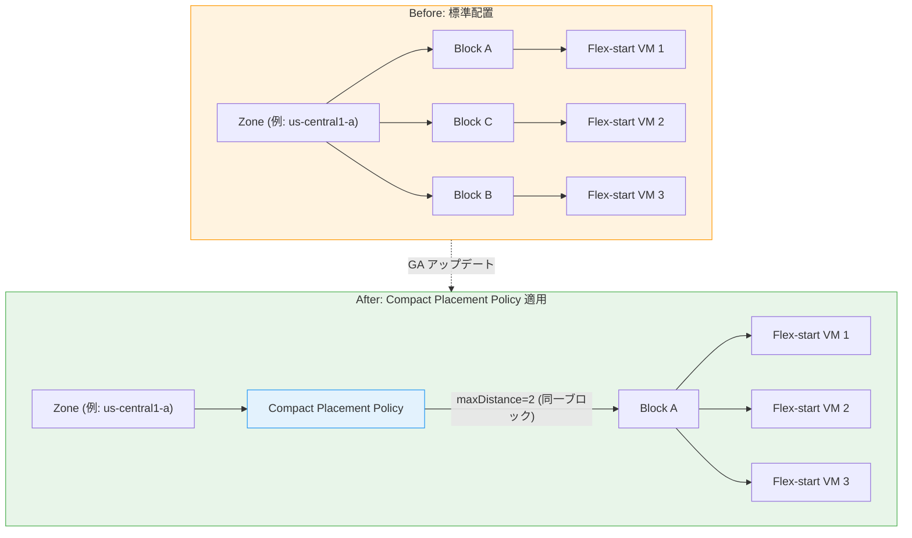

# AI Hypercomputer / Compute Engine: Flex-start VM Compact Placement Policies GA

**リリース日**: 2026-03-02
**サービス**: AI Hypercomputer, Compute Engine
**機能**: Flex-start VM Compact Placement Policies
**ステータス**: GA (一般提供)

[このアップデートのインフォグラフィックを見る](https://takech9203.github.io/google-cloud-news-summary/20260302-compute-engine-flex-start-compact-placement.html)

## 概要

Google Cloud は、スタンドアロン Flex-start VM に対するコンパクト配置ポリシーの適用を一般提供 (GA) として発表した。これにより、Flex-start VM を隣接ブロックまたは同一ブロック内に集約配置し、VM 間のネットワークレイテンシを最小化できるようになる。

Flex-start VM は Dynamic Workload Scheduler (DWS) を活用して最大 7 日間の短期 GPU リソースを割引価格 (最大 53% オフ) で提供するプロビジョニングモデルである。これまでスタンドアロン Flex-start VM は標準配置のみが使用され、同一ゾーン内で VM が離れた場所に配置される可能性があった。今回のアップデートにより、AI/ML ワークロードにおける VM 間通信の低レイテンシ化が実現し、分散学習やバッチ推論のパフォーマンスが向上する。

対象ユーザーは、GPU を活用した AI/ML ワークロード (モデルファインチューニング、小規模事前学習、バッチ推論、HPC シミュレーション) を Flex-start VM で実行するエンジニアやアーキテクトである。

**アップデート前の課題**

- スタンドアロン Flex-start VM には配置ポリシーを適用できず、VM が同一ゾーン内で離れた場所に配置される可能性があった
- スタンドアロン Flex-start VM は「標準配置」のみで、密集配置 (Dense allocation) は MIG リサイズリクエスト経由でのみ利用可能だった
- AI/ML ワークロードで VM 間の低レイテンシ通信が必要な場合、スタンドアロン Flex-start VM ではなく MIG リサイズリクエストや予約ベースの方法を選択する必要があった

**アップデート後の改善**

- スタンドアロン Flex-start VM にコンパクト配置ポリシーを適用し、VM を隣接ブロック (maxDistance=3) または同一ブロック (maxDistance=2) に配置できるようになった
- 個別の Flex-start VM でも密集配置が可能になり、MIG を使わずとも低レイテンシな VM 間通信を実現できるようになった
- Flex-start VM の柔軟性 (任意のタイミングで起動、最大 7 日間、53% 割引) とコンパクト配置による高性能通信を組み合わせた運用が可能になった

## アーキテクチャ図



コンパクト配置ポリシーの適用前は VM がゾーン内の異なるブロックに分散配置されていたが、適用後は同一ブロックまたは隣接ブロックに集約され、ネットワークホップが最小化される。

## サービスアップデートの詳細

### 主要機能

1. **コンパクト配置ポリシーの Flex-start VM への適用**
   - スタンドアロン Flex-start VM に対してコンパクト配置ポリシーを作成・適用可能になった
   - `collocation=COLLOCATED` を指定してポリシーを作成し、Flex-start VM に適用する
   - VM 作成時または既存 VM への追加適用の両方に対応

2. **maxDistance による配置距離の制御**
   - `maxDistance=3`: VM を隣接ブロック (adjacent blocks) に配置。最大 1,500 VM まで対応 (A4 の場合)
   - `maxDistance=2`: VM を同一ブロック (same block) に配置。A4 は最大 150 VM、A3 Ultra/A3 Mega/A3 High は最大 256 VM まで対応
   - 値を指定しない場合はベストエフォートで可能な限り近くに配置 (最大 1,500 VM)

3. **AI/ML ワークロード向けネットワーク最適化**
   - ネットワークホップの削減により VM 間通信レイテンシが低減
   - 分散学習における All-Reduce 通信や勾配同期のパフォーマンス向上
   - MPI ライブラリを使用する HPC タスクの最適化

## 技術仕様

### コンパクト配置ポリシーの maxDistance 設定

| maxDistance | 配置レベル | 対応マシンシリーズ | 最大 VM 数 | ホストメンテナンスポリシー |
|------------|-----------|-------------------|-----------|------------------------|
| 未指定 | ベストエフォート | A4, A3 Ultra, A3 Mega, A3 High, A3 Edge, A2, G2, H4D, H3, C2D, C2, C4D, C4, C3D, C3, N2D, N2, M4, M3, M2, M1, Z3-metal | 1,500 | Migrate または Terminate |
| 3 | 隣接ブロック | A4, A3 Mega, A3 High, A3 Edge, A2, G2, H4D, H3, C2D, C2, C4D, C4, C3D, C3, M4, Z3-metal | 1,500 | Migrate または Terminate |
| 2 | 同一ブロック | A4, A3 Ultra, A3 Mega, A3 High, A3 Edge, A2, G2, H4D, H3, C2D, C2, C4D, C4, C3D, C3, M4, Z3-metal | 150-256 | Terminate |
| 1 | 同一ラック | A3 Edge, A2, G2, H4D, H3, C2D, C2, C4D, C4, C3D, C3, M4, Z3-metal | 22 | Terminate |

### Flex-start VM の主要パラメータ

| 項目 | 詳細 |
|------|------|
| 最大実行時間 | 7 日間 (168 時間) |
| 最小実行時間 | 10 分 |
| 待機時間 (スタンドアロン) | 0 秒、または 90 秒 - 7,200 秒 (2 時間) |
| 対応マシンタイプ | アクセラレータ最適化 (A4X Max, A4X を除く)、H4D |
| プロビジョニングモデル | flex-start |
| クォータ | プリエンプティブルクォータを使用 |

## 設定方法

### 前提条件

1. 対象のマシンタイプに対するプリエンプティブルクォータが十分に確保されていること
2. コンパクト配置ポリシーと VM を同一リージョンに作成すること
3. Compute Engine API が有効化されていること

### 手順

#### ステップ 1: コンパクト配置ポリシーの作成

```bash
gcloud compute resource-policies create group-placement POLICY_NAME \
    --collocation=collocated \
    --max-distance=MAX_DISTANCE \
    --region=REGION
```

- `POLICY_NAME`: ポリシー名
- `MAX_DISTANCE`: 3 (隣接ブロック) または 2 (同一ブロック)
- `REGION`: ポリシーを作成するリージョン

#### ステップ 2: Flex-start VM の作成時にポリシーを適用

```bash
gcloud compute instances create VM_NAME \
    --machine-type=MACHINE_TYPE \
    --zone=ZONE \
    --provisioning-model=FLEX_START \
    --max-run-duration=MAX_RUN_DURATION \
    --instance-termination-action=TERMINATION_ACTION \
    --resource-policies=POLICY_NAME
```

- `MACHINE_TYPE`: 使用するマシンタイプ (例: a3-highgpu-8g)
- `MAX_RUN_DURATION`: VM の最大実行時間 (例: 86400s = 24 時間)
- `TERMINATION_ACTION`: 終了時のアクション (STOP または DELETE)

#### ステップ 3: 既存の Flex-start VM にポリシーを適用

```bash
# VM を停止
gcloud compute instances stop VM_NAME --zone=ZONE

# ポリシーを適用
gcloud compute instances add-resource-policies VM_NAME \
    --resource-policies=POLICY_NAME \
    --zone=ZONE

# VM を再起動
gcloud compute instances start VM_NAME --zone=ZONE
```

REST API を使用する場合は以下の形式でリクエストする。

```json
POST https://compute.googleapis.com/compute/v1/projects/PROJECT_ID/regions/REGION/resourcePolicies
{
  "name": "POLICY_NAME",
  "groupPlacementPolicy": {
    "collocation": "COLLOCATED",
    "maxDistance": MAX_DISTANCE
  }
}
```

## メリット

### ビジネス面

- **コスト効率の高い高性能 AI/ML 環境**: Flex-start VM の最大 53% 割引とコンパクト配置による低レイテンシを組み合わせ、予約なしで高性能な分散学習環境をコスト効率よく構築できる
- **運用の柔軟性向上**: MIG リサイズリクエストを使わずとも、スタンドアロン VM で密集配置が可能になり、小規模から中規模の AI/ML ワークロードを柔軟に管理できる

### 技術面

- **ネットワークレイテンシの最小化**: VM 間のネットワークホップが削減され、分散学習の All-Reduce 通信や勾配同期のパフォーマンスが向上する
- **配置の精密制御**: maxDistance パラメータにより、ワークロードの要件に応じて隣接ブロック (低レイテンシ) と同一ブロック (最低レイテンシ) を選択できる
- **スケーラビリティ**: maxDistance 未指定で最大 1,500 VM、maxDistance=3 で 1,500 VM をサポートし、大規模分散学習にも対応する

## デメリット・制約事項

### 制限事項

- Flex-start VM の最大実行時間は 7 日間に制限されている
- A4X Max および A4X マシンタイプは Flex-start VM では使用できない
- maxDistance の値が小さいほど VM の配置制約が厳しくなり、リソース確保が困難になる可能性がある
- 1 つの Compute Engine リソースに適用できる配置ポリシーは 1 つのみ
- 配置ポリシーはリージョナルリソースであり、同一リージョン内のリソースにのみ適用可能

### 考慮すべき点

- maxDistance=2 (同一ブロック) を指定した場合、最大 VM 数が 150-256 に制限されるため、大規模ワークロードでは maxDistance=3 またはベストエフォートを検討すべき
- Flex-start VM はベストエフォートでのリソース割り当てであり、コンパクト配置ポリシーを組み合わせるとリソース確保がさらに難しくなる可能性がある
- maxDistance=2 の場合、ホストメンテナンスポリシーは Terminate のみ対応となり、ライブマイグレーションは利用できない

## ユースケース

### ユースケース 1: 分散モデルファインチューニング

**シナリオ**: 複数の GPU VM を使用して大規模言語モデルのファインチューニングを 3 日間実行する。VM 間の勾配同期には低レイテンシ通信が必要。

**実装例**:
```bash
# コンパクト配置ポリシーを作成 (同一ブロック配置)
gcloud compute resource-policies create group-placement fine-tune-policy \
    --collocation=collocated \
    --max-distance=2 \
    --region=us-central1

# Flex-start VM を作成 (A3 High, 8 GPU)
for i in $(seq 1 4); do
  gcloud compute instances create fine-tune-vm-$i \
      --machine-type=a3-highgpu-8g \
      --zone=us-central1-a \
      --provisioning-model=FLEX_START \
      --max-run-duration=259200s \
      --instance-termination-action=DELETE \
      --resource-policies=fine-tune-policy
done
```

**効果**: 4 台の GPU VM が同一ブロック内に配置され、VM 間の通信レイテンシが最小化される。Flex-start の割引価格 (最大 53% オフ) で 3 日間のファインチューニングを効率的に実行できる。

### ユースケース 2: HPC シミュレーションのバースト実行

**シナリオ**: 大規模な科学計算シミュレーションを短期間 (24-48 時間) で実行する。MPI 通信のパフォーマンスが結果精度に影響する。

**実装例**:
```bash
# コンパクト配置ポリシーを作成 (隣接ブロック配置)
gcloud compute resource-policies create group-placement hpc-sim-policy \
    --collocation=collocated \
    --max-distance=3 \
    --region=us-east4

# Flex-start VM を作成
gcloud compute instances create hpc-sim-vm-1 \
    --machine-type=h3-standard-88 \
    --zone=us-east4-a \
    --provisioning-model=FLEX_START \
    --max-run-duration=172800s \
    --instance-termination-action=STOP \
    --resource-policies=hpc-sim-policy
```

**効果**: MPI 通信に最適化された低レイテンシ環境で、予約なしに HPC シミュレーションを実行できる。Flex-start の割引により計算コストを削減しながら高性能を維持できる。

## 料金

コンパクト配置ポリシーの作成・削除・適用に追加料金は発生しない。料金は Flex-start VM のコンピューティングリソース (vCPU、メモリ、GPU) に対して課金される。

Flex-start VM は Dynamic Workload Scheduler (DWS) の料金体系に基づき、対象マシンタイプで最大 53% の割引が適用される。従量課金 (PAYG) モデルで、VM が実行中の期間のみ課金される。

### 料金例

| マシンタイプ | 料金体系 | 割引率 |
|------------|---------|--------|
| A4 (GPU) | DWS Pricing | 最大 53% |
| A3 Ultra / A3 Mega / A3 High (GPU) | DWS Pricing | 最大 53% |
| A2 / G4 (GPU) | DWS Pricing | 最大 53% |
| H4D | DWS Pricing | 最大 53% |

詳細は [Dynamic Workload Scheduler 料金ページ](https://cloud.google.com/products/dws/pricing) を参照。

## 利用可能リージョン

コンパクト配置ポリシーはリージョナルリソースとして作成される。利用可能なリージョンはマシンタイプにより異なる。GPU マシンタイプの利用可能リージョン・ゾーンについては [GPU のリージョンとゾーン](https://cloud.google.com/compute/docs/gpus/gpu-regions-zones) を参照。

## 関連サービス・機能

- **[Dynamic Workload Scheduler (DWS)](https://cloud.google.com/products/dws/pricing)**: Flex-start VM の基盤となるスケジューリングエンジン。割引価格でのリソース提供を実現する
- **[AI Hypercomputer](https://cloud.google.com/ai-hypercomputer)**: GPU/TPU を活用した AI/ML ワークロード向けの統合コンピューティングプラットフォーム。Flex-start は AI Hypercomputer の消費オプションの 1 つ
- **[Workload Policy (MIG 向け)](https://cloud.google.com/ai-hypercomputer/docs/placement-policy-and-workload-policy)**: MIG に対する配置制御。MIG リサイズリクエストで Flex-start VM を使用する場合はワークロードポリシーを利用する
- **[Cloud Batch](https://cloud.google.com/batch/docs/create-run-job-placement-policy)**: バッチジョブの VM にコンパクト配置ポリシーを自動適用する機能を提供
- **[GKE (Google Kubernetes Engine)](https://cloud.google.com/kubernetes-engine/docs/concepts/dws)**: GKE クラスタで Flex-start VM を利用し、Custom Compute Classes と組み合わせて GPU 取得戦略を最適化可能

## 参考リンク

- [インフォグラフィック](https://takech9203.github.io/google-cloud-news-summary/20260302-compute-engine-flex-start-compact-placement.html)
- [公式リリースノート](https://cloud.google.com/release-notes#March_02_2026)
- [Flex-start VM 概要 (Compute Engine)](https://cloud.google.com/compute/docs/instances/about-flex-start-vms)
- [配置ポリシー概要](https://cloud.google.com/compute/docs/instances/placement-policies-overview)
- [コンパクト配置ポリシーの使用方法](https://cloud.google.com/compute/docs/instances/use-compact-placement-policies)
- [AI Hypercomputer: 配置ポリシーとワークロードポリシー](https://cloud.google.com/ai-hypercomputer/docs/placement-policy-and-workload-policy)
- [AI Hypercomputer: 消費モデル](https://cloud.google.com/ai-hypercomputer/docs/consumption-models)
- [Dynamic Workload Scheduler 料金](https://cloud.google.com/products/dws/pricing)

## まとめ

今回の GA リリースにより、スタンドアロン Flex-start VM にコンパクト配置ポリシーを適用できるようになり、予約なし・最大 53% 割引の Flex-start VM でも VM 間の低レイテンシ通信が実現可能になった。これは、分散学習やバッチ推論などの AI/ML ワークロードを短期間かつ低コストで実行したいユーザーにとって大きな改善である。次のアクションとして、既存の Flex-start VM ワークロードでコンパクト配置ポリシーの導入を検討し、ネットワークレイテンシの影響が大きいワークロードから優先的に適用することを推奨する。

---

**タグ**: #AI-Hypercomputer #ComputeEngine #FlexStart #CompactPlacementPolicy #GPU #AIML #DynamicWorkloadScheduler #GA
