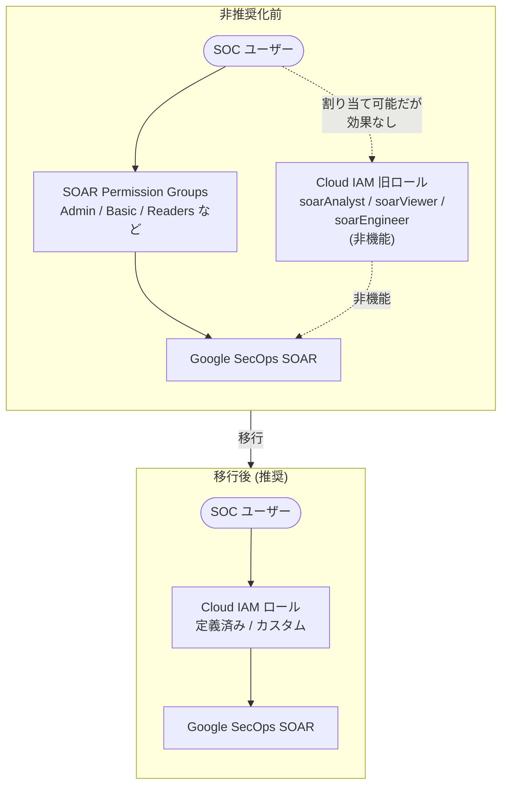

# Google SecOps: SOAR ロール (Cloud IAM) の非推奨化

**リリース日**: 2026-03-02
**サービス**: Google SecOps
**機能**: SOAR ロールの Cloud IAM における非推奨化
**ステータス**: Deprecated

[このアップデートのインフォグラフィックを見る](https://takech9203.github.io/google-cloud-news-summary/20260302-google-secops-soar-roles-deprecated.html)

## 概要

Google SecOps (旧 Chronicle) において、Cloud IAM に存在していた 3 つの SOAR 関連ロール -- `chronicle.soarAnalyst`、`chronicle.soarViewer`、`chronicle.soarEngineer` -- が非推奨 (Deprecated) となり、6 か月後に完全に削除されることが発表された。

これらのロールは Cloud IAM 上でアクセス可能であり、歴史的にユーザーに割り当てることができたが、実際には機能しない (non-operational) ロールであった。SOAR のアクセス制御は従来から Permission Groups によって管理されており、SOAR Migration to Google Cloud の一環として Permission Groups が Cloud IAM に移行されたため、これらの旧ロールは不要となった。

対象ユーザーは、Google SecOps (SOAR) を利用する全てのセキュリティチーム、SOC アナリスト、SOAR エンジニア、および IAM 管理者である。特に、これらの非推奨ロールを既にユーザーに割り当てている組織は、6 か月の猶予期間内に移行を完了する必要がある。

**アップデート前の課題**

SOAR のアクセス制御は、SOAR 独自の Permission Groups で管理されており、Cloud IAM とは別系統で運用されていた。

- Cloud IAM 上に `chronicle.soarAnalyst`、`chronicle.soarViewer`、`chronicle.soarEngineer` というロールが存在していたが、これらは実際のアクセス制御に影響しない非機能 (non-operational) ロールであった
- SOAR のアクセス制御は SOAR Settings 内の Permission Groups (Admin、Basic、Readers、View Only、Collaborators、Managed、Managed-Plus) で管理されていたため、Cloud IAM のロールと二重管理の状態が生じていた
- ユーザーが Cloud IAM でこれらの非機能ロールを割り当てても、実際の SOAR 機能へのアクセスには影響しないため、混乱の原因となっていた

**アップデート後の改善**

SOAR Migration to Google Cloud の完了に伴い、アクセス制御が Cloud IAM に統合された。

- 非機能だった旧 SOAR ロールが非推奨化され、6 か月後に削除されることでロールの整理が進む
- Permission Groups のセルフサービス移行により、既存のアクセス制御を Cloud IAM のカスタムロールとして再現可能になった
- Cloud IAM の定義済み Google SecOps ロール (`chronicle.admin`、`chronicle.editor`、`chronicle.viewer`、`chronicle.limitedViewer`、`chronicle.soarAdmin`) や特定パーミッションを持つカスタムロールによる一元管理が可能になった

## アーキテクチャ図



左側の「非推奨化前」は SOAR Permission Groups と非機能な Cloud IAM ロールが混在していた状態を示す。右側の「移行後」は Cloud IAM ロールに一元化された推奨構成を示す。

## サービスアップデートの詳細

### 主要機能

1. **非推奨ロールの削除スケジュール**
   - `chronicle.soarAnalyst`、`chronicle.soarViewer`、`chronicle.soarEngineer` の 3 ロールが非推奨化
   - 6 か月の猶予期間が設定されており、完全削除は 2026 年 9 月頃を予定
   - これらのロールは元々非機能であったため、機能への即座の影響はない

2. **移行オプション 1: Permission Groups のセルフサービス移行**
   - Google Cloud コンソールの SOAR IAM Migration タブからワンクリックで移行スクリプトを実行
   - 既存の Permission Groups を読み取り、対応する Cloud IAM カスタムロールを自動生成
   - Cloud Identity ユーザーまたは IdP グループに自動でロールバインディングを設定
   - Terraform を使用した移行もサポート

3. **移行オプション 2: 定義済み Google SecOps ロール**
   - `roles/chronicle.admin` -- Chronicle API Admin: Google SecOps の全アクセス権
   - `roles/chronicle.editor` -- Chronicle API Editor: リソースの変更権限
   - `roles/chronicle.viewer` -- Chronicle API Viewer: 読み取り専用アクセス
   - `roles/chronicle.limitedViewer` -- Chronicle API Limited Viewer: 検出ルールとレトロハントを除く読み取り専用
   - `roles/chronicle.soarAdmin` -- Chronicle SOAR Admin: SOAR 設定と管理の完全アクセス

4. **移行オプション 3: 特定パーミッションを持つカスタムロール**
   - `chronicle.` プレフィックスのきめ細かいパーミッションを使用してカスタムロールを作成
   - パーミッション形式: `chronicle.<機能名>.<アクション>` (例: `chronicle.cases.get`、`chronicle.dashboards.edit`)
   - 組織のセキュリティポリシーに合わせた最小権限の原則を実装可能

## 技術仕様

### 非推奨ロールと移行先の対応

| 非推奨ロール | 説明 | 推奨移行先 |
|------|------|------|
| `chronicle.soarAnalyst` | SOAR アナリスト (非機能) | `roles/chronicle.editor` またはカスタムロール |
| `chronicle.soarViewer` | SOAR ビューアー (非機能) | `roles/chronicle.viewer` または `roles/chronicle.limitedViewer` |
| `chronicle.soarEngineer` | SOAR エンジニア (非機能) | `roles/chronicle.admin` またはカスタムロール |

### 定義済み IAM SOAR ロール (移行後)

| ロール | ロール ID | 説明 |
|------|------|------|
| Chronicle API Admin | `roles/chronicle.admin` | Google SecOps アプリケーションと API サービスへの完全アクセス |
| Chronicle API Editor | `roles/chronicle.editor` | Google SecOps リソースの変更アクセス |
| Chronicle API Viewer | `roles/chronicle.viewer` | Google SecOps リソースの読み取り専用アクセス |
| Chronicle API Limited Viewer | `roles/chronicle.limitedViewer` | 検出ルール・レトロハントを除く読み取り専用 |
| Chronicle SOAR Admin | `roles/chronicle.soarAdmin` | SOAR 設定・管理への完全管理アクセス |
| Chronicle SOAR Threat Manager | `roles/chronicle.soarThreatManager` | SOAR 脅威管理アクセス |
| Chronicle SOAR Vulnerability Manager | `roles/chronicle.soarVulnerabilityManager` | SOAR 脆弱性管理アクセス |

### Permission Groups 移行スクリプトの出力例 (gcloud)

```bash
# カスタムロールの作成例
gcloud iam roles create SOAR_Custom_managedUser_google.com \
  --project="YOUR_PROJECT_ID" \
  --title="SOAR Custom managedUser Role" \
  --description="SOAR Custom role generated for IDP Mapping Group ManagedUser" \
  --stage=GA \
  --permissions=chronicle.cases.get

# ロールバインディングの設定例
gcloud projects add-iam-policy-binding YOUR_PROJECT_ID \
  --member="user:alice@example.com" \
  --role="projects/YOUR_PROJECT_ID/roles/SOAR_Custom_managedUser_google.com"
```

### Terraform での移行例

```hcl
# カスタムロールの作成
resource "google_project_iam_custom_role" "soar_custom_managed_user" {
  role_id     = "SOAR_Custom_managedUser_google_com"
  title       = "SOAR Custom managedUser Role"
  project     = "YOUR_PROJECT_ID"
  stage       = "GA"
  permissions = [
    "chronicle.cases.get"
  ]
}

# ロールバインディングの設定
resource "google_project_iam_member" "soar_user_binding" {
  project = "YOUR_PROJECT_ID"
  role    = "projects/YOUR_PROJECT_ID/roles/SOAR_Custom_managedUser_google_com"
  member  = "user:alice@example.com"
}
```

## 設定方法

### 前提条件

1. SOAR Migration to Google Cloud の Stage 1 が完了していること
2. 以下の IAM ロールを持つ管理者アカウント:
   - Chronicle API Admin (`roles/chronicle.admin`)
   - Chronicle Service Admin (`roles/chroniclesm.admin`)
   - Chronicle SOAR Admin (`roles/chronicle.soarAdmin`)
3. IdP グループマッピング (Workforce Identity Federation 利用時) または Email グループマッピング (Cloud Identity 利用時) が設定済みであること

### 手順

#### ステップ 1: Permission Groups の移行 (Google Cloud CLI)

```bash
# 1. Google Cloud コンソールで Google SecOps 管理設定に移動
# 2. SOAR IAM Migration タブをクリック
# 3. Migrate role bindings セクションのコマンドをコピー
# 4. Cloud Shell を起動してコマンドを貼り付け・実行
# 5. 完了後、コンソールに戻り "Enable IAM" をクリック
```

Google Cloud コンソールの SOAR IAM Migration タブから移行スクリプトをコピーし、Cloud Shell で実行する。スクリプトは既存の Permission Groups を読み取り、対応する IAM カスタムロールとバインディングを自動生成する。

#### ステップ 2: 移行結果の確認

```bash
# プロジェクトの IAM ポリシーを確認
gcloud projects get-iam-policy YOUR_PROJECT_ID \
  --format="table(bindings.role, bindings.members)"

# カスタムロールの一覧を確認
gcloud iam roles list --project=YOUR_PROJECT_ID \
  --filter="name:SOAR_Custom"
```

移行後、IAM ポリシーとカスタムロールが正しく作成されていることを確認する。

## メリット

### ビジネス面

- **アクセス管理の一元化**: SOAR 独自の Permission Groups と Cloud IAM の二重管理が解消され、管理コストが削減される
- **コンプライアンスの強化**: Cloud IAM のポリシー管理、監査ログ、組織ポリシーとの統合により、コンプライアンス要件への対応が容易になる

### 技術面

- **最小権限の原則の実装**: Cloud IAM のきめ細かいパーミッション (`chronicle.*`) を使用してカスタムロールを作成でき、最小権限の原則を実装可能
- **自動化とインフラ as Code**: Terraform や gcloud CLI を使用したロール管理の自動化が可能になり、Infrastructure as Code のワークフローに統合できる
- **Cloud Audit Logs との統合**: IAM に移行後、SOAR の操作ログが Cloud Audit Logs に出力されるようになり、セキュリティ監視が強化される

## デメリット・制約事項

### 制限事項

- 非推奨ロールが完全に削除されるまでの猶予期間は 6 か月 (2026 年 9 月頃)
- Stage 1 の移行が完了していない場合、Stage 2 (Permission Groups の IAM 移行) を開始できない
- SOAR Settings > Organization > Permissions ページは 2026 年 6 月 30 日まで後方互換性のために利用可能だが、変更は行わないこと

### 考慮すべき点

- 複数の IdP を使用している MSSP 顧客は、各プロバイダに対して個別の Workforce Pool を設定する必要がある
- レガシー SOAR API と API キーは 2026 年 6 月 30 日以降に機能停止するため、Chronicle API への移行も並行して進める必要がある
- Remote Agent を使用している場合、サービスアカウントへの移行とメジャーバージョンアップグレードが必要

## ユースケース

### ユースケース 1: SOC チームのロールベースアクセス制御の移行

**シナリオ**: SOC チームが SOAR Permission Groups (Admin、Basic、Readers) を使用してアナリストのアクセスを管理している。SOAR Migration to Google Cloud の完了後、これらを Cloud IAM に移行する。

**実装例**:
```bash
# 移行スクリプトにより自動生成されるコマンドの例

# T1 アナリスト向けカスタムロール
gcloud iam roles create SOAR_Custom_T1Analyst \
  --project="my-secops-project" \
  --title="SOAR T1 Analyst Role" \
  --description="T1 Analyst role migrated from Permission Groups" \
  --stage=GA \
  --permissions=chronicle.cases.get,chronicle.cases.update,chronicle.alerts.get

# T1 アナリストグループへのバインディング
gcloud projects add-iam-policy-binding my-secops-project \
  --member="group:t1-analysts@example.com" \
  --role="projects/my-secops-project/roles/SOAR_Custom_T1Analyst"
```

**効果**: Permission Groups から Cloud IAM への移行により、Google Cloud 全体のアクセスポリシーとの統合管理が実現し、監査証跡の一元化が可能になる。

### ユースケース 2: Terraform による SOAR ロール管理の自動化

**シナリオ**: Infrastructure as Code を採用している組織が、SOAR のアクセス制御も Terraform で管理したい。

**効果**: Terraform を使用したロール定義・バインディングにより、GitOps ワークフローでの変更管理、レビュー、自動デプロイが可能になる。

## 料金

Google SecOps の料金は公開されておらず、Google SecOps Sales への問い合わせが必要となる。IAM のロール管理自体には追加料金は発生しない。

詳細: [Google SecOps Sales に問い合わせ](https://chronicle.security/contact)

## 関連サービス・機能

- **Cloud IAM**: SOAR Permission Groups の移行先。ロール・パーミッション管理の基盤サービス
- **Cloud Audit Logs**: IAM 移行後、SOAR 操作のログが Cloud Audit Logs に出力される
- **Workforce Identity Federation**: 外部 IdP (Azure AD、Okta、Ping Identity など) を使用した認証連携
- **Cloud Identity**: Google マネージドアカウントによるユーザー管理
- **Chronicle API**: SOAR API の移行先。SOAR エンドポイント v1 beta が Chronicle API で利用可能
- **Security Command Center Enterprise**: Google SecOps SOAR と統合されたセキュリティ管理プラットフォーム

## 参考リンク

- [インフォグラフィック](https://takech9203.github.io/google-cloud-news-summary/20260302-google-secops-soar-roles-deprecated.html)
- [公式リリースノート](https://cloud.google.com/release-notes#March_02_2026)
- [Google Security Operations の権限とロール](https://docs.cloud.google.com/iam/docs/roles-permissions/chronicle#google-security-operations-permissions)
- [SOAR Permission の IAM 移行手順](https://docs.cloud.google.com/chronicle/docs/soar/admin-tasks/advanced/migrate-soar-permissions-iam)
- [Google Security Operations のロール](https://docs.cloud.google.com/iam/docs/roles-permissions/chronicle#google-security-operations-roles)
- [SOAR Migration to Google Cloud 概要](https://docs.cloud.google.com/chronicle/docs/soar/admin-tasks/advanced/migrate-to-gcp)
- [SOAR Migration FAQ](https://docs.cloud.google.com/chronicle/docs/soar/admin-tasks/advanced/migrate-soar-faq)
- [アクセス制御の設定](https://docs.cloud.google.com/chronicle/docs/onboard/configure-feature-access)

## まとめ

今回のアップデートは、Cloud IAM 上に存在していた非機能の SOAR ロール (`chronicle.soarAnalyst`、`chronicle.soarViewer`、`chronicle.soarEngineer`) を非推奨化し、6 か月後に完全削除するものである。これらのロールは元々アクセス制御に影響しないため機能面での即座の影響はないが、SOAR Migration to Google Cloud の一環として Cloud IAM への移行を完了していない組織は、定義済みロール、カスタムロール、または Permission Groups のセルフサービス移行を利用して、2026 年 6 月 30 日の最終期限までに移行を完了することが推奨される。

---

**タグ**: Google SecOps, Chronicle, SOAR, Cloud IAM, Deprecated, Permission Groups, ロール移行, セキュリティオペレーション, アクセス制御
