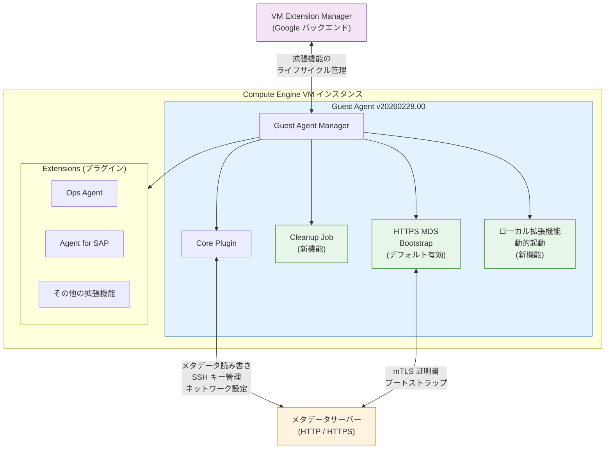

# Guest Environment (Compute Engine): Guest Agent v20260228.00

**リリース日**: 2026-03-02
**サービス**: Compute Engine (Guest Environment)
**機能**: Guest Agent v20260228.00 - 新機能追加とバグ修正
**ステータス**: GA (一般提供)

[このアップデートのインフォグラフィックを見る](https://takech9203.github.io/google-cloud-news-summary/20260302-guest-environment-agent-20260228.html)

## 概要

Google Cloud は、Compute Engine のゲストエージェント バージョン 20260228.00 をリリースした。このアップデートでは、HTTPS メタデータサーバーエンドポイントのブートストラップ認証情報のデフォルトサポート、プラグインファイルおよびステートのクリーンアップジョブの追加、ローカルインストール済み拡張機能の動的起動サポートという 3 つの新機能が追加された。加えて、Windows のロケール問題やネットワーク設定に関する複数の重要なバグが修正されている。

対応 OS として Debian 13、AlmaLinux 10、CentOS Stream 10、Oracle Linux 10、Red Hat Enterprise Linux 10、Rocky Linux 10 が新たに追加された。ゲストエージェントは Compute Engine インスタンスのゲスト環境の中核コンポーネントであり、アカウント管理、OS Login 統合、ネットワークインターフェース管理、メタデータサーバーとの通信など、インスタンスの基本的な動作を担っている。

対象ユーザーは、Compute Engine 上で Linux または Windows VM を運用するすべてのインフラエンジニア、SRE、クラウドアーキテクトである。特に、複数のロケールの Windows 環境を運用しているチームや、NetworkManager を使用したネットワーク構成を行っているチームにとって重要なアップデートとなる。

**アップデート前の課題**

- HTTPS メタデータサーバーエンドポイントの認証情報セットアップを手動で有効化する必要があった
- プラグインファイルやステートが蓄積し、ディスク容量を消費する可能性があった
- ローカルにインストールされた拡張機能を動的に起動する仕組みがなかった
- Windows の英語以外のロケール (日本語、ドイツ語など) で、ゲストエージェントがユーザーを Administrator グループに追加できなかった
- ネットワークセットアップが完了する前にゲストエージェントが準備完了シグナルを送信し、起動スクリプトが失敗する可能性があった
- フォーマットが不正な SSH キーに対してメタデータ SSH キーエラーが大量出力されていた
- NetworkManager での構成ロールバック後にプライマリ NIC の再接続が正しく行われなかった
- `Daemons.network_daemon` および `NetworkInterfaces.vlan_setup_enabled` フラグが正しく適用されなかった

**アップデート後の改善**

- HTTPS メタデータサーバーエンドポイントの認証情報がデフォルトでブートストラップされるようになり、Shielded VM でのセキュアなメタデータ通信が即座に利用可能になった
- プラグインファイルとステートのクリーンアップジョブにより、不要なファイルが自動的に削除されるようになった
- ローカルにインストールされた拡張機能を動的に起動できるようになり、拡張機能の管理が柔軟になった
- すべての Windows ロケールで Administrator グループへのユーザー追加が正しく動作するようになった
- ネットワークセットアップ完了後にのみ準備完了シグナルが送信されるようになり、起動時の競合状態が解消された
- 不正なフォーマットの SSH キーに対するエラースパムが抑制された
- NetworkManager での構成ロールバック後のプライマリ NIC 再接続が正しく動作するようになった
- `Daemons.network_daemon` および `NetworkInterfaces.vlan_setup_enabled` フラグが正しく適用されるようになった

## アーキテクチャ図



ゲストエージェント v20260228.00 のプラグインベースアーキテクチャを示す。Guest Agent Manager が Core Plugin、新機能のクリーンアップジョブ、HTTPS MDS ブートストラップ、ローカル拡張機能の動的起動を統括し、メタデータサーバーおよび VM Extension Manager と連携する。

## サービスアップデートの詳細

### 主要機能

1. **HTTPS メタデータサーバーエンドポイントのブートストラップ認証情報のデフォルトサポート**
   - Shielded VM において、HTTPS メタデータサーバーエンドポイントに必要な mTLS 証明書 (ルート証明書、クライアント ID 証明書) がデフォルトでセットアップされるようになった
   - これまでは `disable-https-mds-setup` メタデータキーを `FALSE` に設定する必要があったが、今後はデフォルトで有効になる
   - HTTPS エンドポイント (`https://metadata.google.internal/computeMetadata/v1`) を使用することで、メタデータサーバーのなりすましや中間者攻撃を防止できる

2. **プラグインファイルおよびステートのクリーンアップジョブ**
   - プラグインベースアーキテクチャで生成されるプラグインファイルやステート情報を定期的にクリーンアップするジョブが追加された
   - 不要になったプラグインの残留ファイルを自動削除し、ディスク使用量の増加を防止する
   - クリーンアップは自動的に実行され、手動での介入は不要

3. **ローカルインストール済み拡張機能の動的起動サポート**
   - VM 上にローカルにインストールされた拡張機能を、ゲストエージェントが動的に検出・起動できるようになった
   - VM Extension Manager を経由せずにローカルで管理される拡張機能にも対応
   - 拡張機能の追加・更新時にゲストエージェントの再起動が不要

### バグ修正

1. **Windows ロケール対応の修正**
   - 英語以外の Windows ロケール (日本語、ドイツ語、フランス語など) で、ゲストエージェントが Administrator グループ名を正しく解決できない問題を修正
   - Windows SID ベースのグループ解決に切り替えることで、ローカライズされたグループ名 (例: 「管理者」、「Administratoren」) に対応

2. **ネットワーク準備完了シグナルの修正**
   - ゲストエージェントがネットワークセットアップの完了を待たずに準備完了シグナルを送信していた問題を修正
   - ネットワーク構成が完了してからシグナルを送信するようになり、起動スクリプトがネットワーク接続を前提とする処理を安全に実行できるようになった

3. **SSH キーエラースパムの抑制**
   - フォーマットが不正な SSH キーに対してメタデータ SSH キーエラーが繰り返しログ出力されていた問題を修正
   - 不正なキーは初回のみ警告を出力し、以降は重複ログを抑制する

4. **NetworkManager 構成ロールバック時のプライマリ NIC 再接続の修正**
   - NetworkManager を使用する環境で構成ロールバックが発生した際、プライマリ NIC が正しく再接続されない問題を修正
   - ロールバック後にプライマリ NIC の接続状態を検証し、必要に応じて再接続を行う

5. **設定フラグの適用修正**
   - `Daemons.network_daemon` フラグ (ネットワークデーモンの選択) と `NetworkInterfaces.vlan_setup_enabled` フラグ (VLAN セットアップの有効化) が正しく適用されなかった問題を修正
   - インスタンスメタデータで指定されたフラグ値が確実に反映されるようになった

## 技術仕様

### 対応 OS

| OS | バージョン | パッケージ名 |
|------|------|------|
| Debian | 13 (Trixie) | `google-guest-agent` |
| AlmaLinux | 10 | `google-guest-agent` |
| CentOS Stream | 10 | `google-guest-agent` |
| Oracle Linux | 10 | `google-guest-agent` |
| Red Hat Enterprise Linux | 10 | `google-guest-agent` |
| Rocky Linux | 10 | `google-guest-agent` |
| Windows | 各バージョン | `google-compute-engine-windows` |

### HTTPS メタデータサーバー証明書の保存場所

| OS | ルート証明書パス | クライアント証明書パス |
|------|------|------|
| CentOS / RHEL / Rocky / AlmaLinux / Oracle Linux | `/run/google-mds-mtls/root.crt` | `/run/google-mds-mtls/client.key` |
| Debian | `/run/google-mds-mtls/root.crt` | `/run/google-mds-mtls/client.key` |
| Windows | `C:\ProgramData\Google\ComputeEngine\mds-mtls-root.crt` | `C:\ProgramData\Google\ComputeEngine\mds-mtls-client.key` |

### ゲストエージェントのバイナリパス

| コンポーネント | Linux パス | Windows パス |
|------|------|------|
| Guest Agent Manager | `/usr/bin/google_guest_agent_manager` | `C:\ProgramData\Google\Compute Engine\agent\GCEWindowsAgentManager.exe` |
| Core Plugin | `/usr/lib/google/guest_agent/core_plugin` | `C:\Program Files\Google\Compute Engine\agent\CorePlugin.exe` |

## 設定方法

### 前提条件

1. Compute Engine インスタンスが稼働していること
2. 対象 OS がサポートリストに含まれていること
3. インターネットまたは `packages.cloud.google.com` へのアクセスが可能であること

### 手順

#### ステップ 1: ゲストエージェントの更新 (Linux - Debian 13)

```bash
sudo apt update
sudo apt install -y google-guest-agent
```

#### ステップ 2: ゲストエージェントの更新 (Linux - RHEL/CentOS/AlmaLinux/Rocky/Oracle Linux 10)

```bash
sudo yum makecache
sudo yum install -y google-guest-agent
```

#### ステップ 3: ゲストエージェントの更新 (Windows)

```powershell
googet update google-compute-engine-windows
```

#### ステップ 4: バージョンの確認

```bash
# Linux: シリアルコンソールログまたはサービスステータスで確認
sudo systemctl status google-guest-agent-manager.service

# エージェントバージョンの確認 (ブートログ)
# 期待される出力: google_guest_agent: GCE Agent Started (version 20260228.00)
```

#### ステップ 5: HTTPS メタデータサーバーエンドポイントの利用確認

```bash
# 証明書が配置されていることを確認 (Shielded VM)
ls -la /run/google-mds-mtls/

# HTTPS エンドポイントでメタデータを取得
curl --cacert /run/google-mds-mtls/root.crt \
     --cert /run/google-mds-mtls/client.key \
     -H "Metadata-Flavor: Google" \
     https://metadata.google.internal/computeMetadata/v1/instance/hostname
```

## メリット

### ビジネス面

- **セキュリティの自動強化**: HTTPS メタデータサーバーエンドポイントがデフォルトで有効になることで、Shielded VM のセキュリティがユーザーの追加設定なしに向上する
- **運用負荷の軽減**: クリーンアップジョブの自動実行とネットワーク準備完了シグナルの改善により、手動でのトラブルシューティングや設定調整が削減される

### 技術面

- **多言語 Windows 環境の安定性**: SID ベースのグループ解決により、すべての Windows ロケールでユーザー管理が正しく動作し、国際的な組織での VM 管理が安定する
- **起動シーケンスの信頼性向上**: ネットワーク完了後にのみ準備完了シグナルが送信されるため、起動スクリプトの失敗が大幅に減少する
- **ログの品質改善**: SSH キーエラーのスパム抑制により、重要なログメッセージの視認性が向上し、問題の診断が容易になる
- **ネットワーク構成の堅牢性**: NetworkManager でのロールバック処理と設定フラグの適用が改善され、ネットワーク構成変更時の安定性が向上する

## デメリット・制約事項

### 制限事項

- 新しい OS サポート (Debian 13、AlmaLinux 10、CentOS Stream 10、Oracle Linux 10、RHEL 10、Rocky Linux 10) に限定される。旧バージョンの OS では個別にバックポートが必要な場合がある
- HTTPS メタデータサーバーエンドポイントは Shielded VM でのみ利用可能であり、非 Shielded VM では引き続き HTTP エンドポイントのみが使用される
- ローカル拡張機能の動的起動は、プラグインベースアーキテクチャ (v20250901.00 以降) でのみサポートされる

### 考慮すべき点

- ゲストエージェントの更新にはパッケージリポジトリへのアクセスが必要であり、閉域ネットワーク環境では Private Google Access や Cloud NAT の設定が前提となる
- HTTPS メタデータサーバーのデフォルト有効化に伴い、証明書のローテーション (インスタンスの停止・起動時に発生) の挙動を理解しておく必要がある
- 自動更新パッケージ (`google-compute-engine-auto-updater`) がインストールされていない場合、手動で更新を行う必要がある

## ユースケース

### ユースケース 1: 多言語 Windows 環境での VM 管理

**シナリオ**: グローバル企業で日本語、ドイツ語、英語の各ロケールの Windows VM を運用しており、ゲストエージェントによるユーザーの Administrator グループ追加が一部のロケールで失敗していた。

**効果**: v20260228.00 への更新により、すべてのロケールで Administrator グループへのユーザー追加が正しく動作するようになる。ローカライズされたグループ名 (「管理者」「Administratoren」など) に依存せず、Windows SID を使用したグループ解決が行われる。

### ユースケース 2: セキュアなメタデータアクセスの強化

**シナリオ**: Shielded VM を使用してセキュリティ要件の高いワークロードを実行しており、メタデータサーバーへのアクセスを HTTPS に統一したい。

**実装例**:
```bash
# Shielded VM を作成 (HTTPS MDS がデフォルトで有効)
gcloud compute instances create secure-vm \
    --machine-type=e2-medium \
    --zone=asia-northeast1-a \
    --shielded-secure-boot \
    --shielded-vtpm \
    --shielded-integrity-monitoring \
    --image-family=debian-13 \
    --image-project=debian-cloud

# HTTPS エンドポイントでメタデータを安全に取得
curl --cacert /run/google-mds-mtls/root.crt \
     --cert /run/google-mds-mtls/client.key \
     -H "Metadata-Flavor: Google" \
     https://metadata.google.internal/computeMetadata/v1/instance/service-accounts/default/token
```

**効果**: v20260228.00 では HTTPS MDS の証明書セットアップがデフォルトで有効になるため、追加のメタデータ設定なしに HTTPS エンドポイントを即座に利用できる。メタデータサーバーのなりすましや通信の傍受を防止し、トークンなどの機密メタデータを安全に取得できる。

### ユースケース 3: NetworkManager 環境でのネットワーク信頼性向上

**シナリオ**: RHEL 10 や AlmaLinux 10 など NetworkManager をデフォルトで使用する OS で VM を運用しており、ネットワーク構成変更時のロールバックでプライマリ NIC が切断される問題に遭遇していた。

**効果**: v20260228.00 では NetworkManager でのロールバック後にプライマリ NIC が自動的に再接続されるため、ネットワーク構成変更に伴う接続断が解消される。また、`Daemons.network_daemon` フラグにより NetworkManager と従来のネットワーク管理を切り替える際の設定が正しく反映されるようになる。

## 料金

ゲストエージェントは Compute Engine サービスの一部として無料で提供される。ゲストエージェントの更新やインストールに追加料金は発生しない。料金は Compute Engine インスタンスのコンピューティングリソース (vCPU、メモリ、ディスク) に対して標準の Compute Engine 料金が適用される。

## 利用可能リージョン

ゲストエージェント v20260228.00 は、Compute Engine が利用可能なすべてのリージョンおよびゾーンで利用可能である。対応 OS イメージが提供されているリージョンであれば制限なく利用できる。

## 関連サービス・機能

- **[Compute Engine](https://cloud.google.com/compute)**: ゲストエージェントが動作する基盤サービス。VM インスタンスの作成・管理を行う
- **[メタデータサーバー](https://cloud.google.com/compute/docs/metadata/overview)**: ゲストエージェントが通信する VM ごとの HTTP/HTTPS サーバー。インスタンスの構成データや認証情報を提供する
- **[VM Extension Manager](https://cloud.google.com/compute/docs/vm-extensions/about-vm-extension-manager)**: プラグインベースアーキテクチャにおいて、拡張機能のライフサイクルを管理する Google Cloud バックエンドサービス
- **[OS Login](https://cloud.google.com/compute/docs/oslogin)**: ゲストエージェントの Core Plugin が統合する IAM ベースの SSH アクセス管理機能
- **[Cloud Logging](https://cloud.google.com/logging)**: ゲストエージェントのログ出力先。SSH キーエラーのスパム抑制により、ログの品質が向上する

## 参考リンク

- [インフォグラフィック](https://takech9203.github.io/google-cloud-news-summary/20260302-guest-environment-agent-20260228.html)
- [公式リリースノート](https://docs.cloud.google.com/release-notes#March_02_2026)
- [Guest Environment 概要](https://cloud.google.com/compute/docs/images/guest-environment)
- [Guest Agent アーキテクチャ](https://cloud.google.com/compute/docs/images/guest-agent)
- [Guest Agent の機能](https://cloud.google.com/compute/docs/images/guest-agent-functions)
- [Guest Environment のインストール・更新](https://cloud.google.com/compute/docs/images/install-guest-environment)
- [VM メタデータの概要 (HTTPS MDS)](https://cloud.google.com/compute/docs/metadata/overview)
- [GitHub: guest-agent](https://github.com/GoogleCloudPlatform/guest-agent)

## まとめ

ゲストエージェント v20260228.00 は、HTTPS メタデータサーバーのデフォルト有効化によるセキュリティ強化、プラグインクリーンアップの自動化、ローカル拡張機能の動的起動という 3 つの新機能に加え、Windows ロケール対応やネットワーク安定性に関する 5 つの重要なバグ修正を含む包括的なアップデートである。特に、多言語 Windows 環境を運用するチームや NetworkManager ベースの Linux 環境を使用するチームにとって、安定性が大幅に向上する。推奨アクションとして、対象 OS を使用しているすべての Compute Engine インスタンスでゲストエージェントを v20260228.00 に更新し、Shielded VM を利用している場合は HTTPS メタデータサーバーエンドポイントへの移行を検討することを推奨する。

---

**タグ**: #ComputeEngine #GuestEnvironment #GuestAgent #MetadataServer #HTTPS #Security #NetworkManager #Windows #Debian13 #RHEL10 #BugFix
