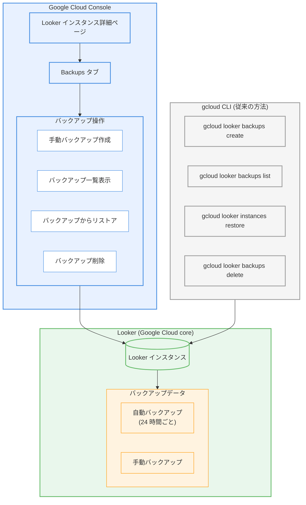

# Looker (Google Cloud core): Google Cloud コンソールでのバックアップ管理が可能に

**リリース日**: 2026-03-02

**サービス**: Looker (Google Cloud core)

**機能**: Google Cloud コンソールでのバックアップ管理

**ステータス**: Feature (一般提供)

[このアップデートのインフォグラフィックを見る](https://takech9203.github.io/google-cloud-news-summary/20260302-looker-core-backup-management-console.html)

## 概要

Looker (Google Cloud core) インスタンスのバックアップ管理が、Google Cloud コンソールから直接実行できるようになりました。インスタンス詳細ページに新たに追加された **Backups** タブから、手動バックアップの作成、自動バックアップおよび手動バックアップの一覧表示、リストア、削除の操作が GUI ベースで行えます。

Looker (Google Cloud core) は Google Cloud 上でホストされるフルマネージドの BI プラットフォームであり、データの探索、可視化、共有を通じてビジネスインサイトの獲得を支援します。バックアップ機能はインスタンスの内部データベースとファイルサーバーのポイントインタイムスナップショットを提供し、障害時のデータ復旧やインスタンス構成の巻き戻しに活用できます。

今回のアップデートにより、これまで gcloud CLI でのみ実行可能であったバックアップ管理操作がコンソール上で完結するようになり、CLI 操作に不慣れな管理者でもバックアップ運用を直感的に行えるようになりました。

**アップデート前の課題**

今回のアップデート以前は、以下の制限がありました。

- バックアップの作成・一覧表示・リストア・削除の操作は gcloud CLI (`gcloud looker backups` コマンド群) でのみ実行可能であり、GUI からの操作手段が提供されていなかった
- CLI 操作に精通していない BI 管理者やビジネスユーザーがバックアップ運用を行うには学習コストが高く、運用が特定のエンジニアに属人化する傾向があった
- バックアップの状態 (ACTIVE / FAILED) や保持期限の確認にもコマンドの実行が必要であり、視覚的な管理ができなかった

**アップデート後の改善**

今回のアップデートにより、以下の改善が実現しました。

- Google Cloud コンソールのインスタンス詳細ページに **Backups** タブが追加され、バックアップのライフサイクル管理が GUI から一元的に実行可能になった
- 手動バックアップの作成、自動・手動バックアップの一覧確認、リストア、削除のすべての操作がコンソールから実行可能になった
- CLI に不慣れな管理者でも直感的にバックアップ運用を行えるようになり、運用の属人化が解消された

## アーキテクチャ図



Google Cloud コンソールの新しい Backups タブと従来の gcloud CLI の両方から Looker (Google Cloud core) インスタンスのバックアップ管理が可能であることを示しています。今回のアップデートにより、コンソール経由の操作パスが新たに追加されました。

## サービスアップデートの詳細

### 主要機能

1. **Backups タブの追加**
   - Looker (Google Cloud core) インスタンスの詳細ページに新しい **Backups** タブが追加された
   - このタブから自動バックアップと手動バックアップの両方を一元管理可能
   - バックアップの ID、ステータス (ACTIVE / FAILED)、作成日時、有効期限を視覚的に確認可能

2. **手動バックアップの作成 (コンソール)**
   - Backups タブから手動バックアップをオンデマンドで作成可能
   - バックアップの作成中もインスタンスのパフォーマンスに影響はなし
   - 作成完了後、ステータスが ACTIVE または FAILED として表示される

3. **バックアップの一覧表示 (コンソール)**
   - 過去 30 日間の自動バックアップと手動バックアップの一覧をコンソールから確認可能
   - 各バックアップの ID、ステータス、作成日時、有効期限を表形式で表示

4. **バックアップからのリストア (コンソール)**
   - コンソールからバックアップを選択してインスタンスのリストアを実行可能
   - リストア前にバックアップを取得することが推奨されている
   - リストア中はインスタンスのステータスが Updating に変わり、完了後に Active に戻る
   - リストア中はユーザーがインスタンスにログインできないため注意が必要

5. **バックアップの削除 (コンソール)**
   - 自動バックアップ・手動バックアップの両方をコンソールから削除可能
   - 不要なバックアップの整理を GUI から直感的に実行可能

## 技術仕様

### バックアップの仕様

| 項目 | 詳細 |
|------|------|
| 自動バックアップ頻度 | 24 時間ごと |
| 手動バックアップ | 任意のタイミングで作成可能 |
| バックアップ保持期間 | 30 日間 (自動・手動とも) |
| バックアップ対象 | インスタンスの内部データベースおよびファイルサーバーのデータ |
| バックアップ対象外 | Elite System Activity のデータ |
| リストア先 | バックアップを取得した同一インスタンスのみ |
| パフォーマンスへの影響 | バックアップ作成中のインスタンスへの影響なし |
| リストア所要時間 | インスタンスサイズに依存 (数分から数時間) |
| バックアップのキャンセル | バックアップ・リストア操作は開始後のキャンセル不可 |

### 必要な IAM ロール

| 操作 | 必要なロール |
|------|-------------|
| バックアップの作成・リストア・削除 | Looker Admin (`roles/looker.admin`) |
| バックアップの表示 | Looker Admin (`roles/looker.admin`) または Looker Viewer (`roles/looker.viewer`) |

### 前提条件

```bash
# Looker API が有効であること (無効の場合、バックアップ機能は利用不可)
gcloud services enable looker.googleapis.com --project=PROJECT_ID
```

## 設定方法

### 前提条件

1. Looker (Google Cloud core) インスタンスが作成済みであること
2. Looker Admin (`roles/looker.admin`) IAM ロールが付与されていること
3. Looker API が有効化されていること

### 手順

#### ステップ 1: 手動バックアップの作成 (Google Cloud コンソール)

1. Google Cloud コンソールで **Looker** のページに移動
2. バックアップを取得するインスタンスの名前をクリック
3. インスタンス詳細ページの **Backups** タブをクリック
4. バックアップの作成操作を実行

gcloud CLI を使用する場合は以下のコマンドを実行します。

```bash
gcloud looker backups create \
  --instance=INSTANCE_NAME \
  --region=REGION
```

#### ステップ 2: バックアップの一覧確認 (Google Cloud コンソール)

1. Google Cloud コンソールでインスタンス詳細ページに移動
2. **Backups** タブをクリック
3. 自動バックアップと手動バックアップの一覧が表示される

gcloud CLI を使用する場合は以下のコマンドを実行します。

```bash
gcloud looker backups list \
  --instance=INSTANCE_NAME \
  --region=REGION
```

出力には以下の情報が含まれます。

- `NAME`: バックアップの英数字 ID
- `STATUS`: ACTIVE または FAILED
- `CREATE TIME`: バックアップ作成日時
- `EXPIRE TIME`: バックアップの有効期限

#### ステップ 3: バックアップからのリストア

リストア前に現在の状態のバックアップを取得することを推奨します。

1. Google Cloud コンソールで **Backups** タブからリストアしたいバックアップを選択
2. リストア操作を実行
3. インスタンスのステータスが Updating から Active に変わるまで待機

gcloud CLI を使用する場合は以下のコマンドを実行します。

```bash
gcloud looker instances restore INSTANCE_NAME \
  --backup=BACKUP_ID \
  --region=REGION \
  --async
```

`--async` フラグは必須です。リストアの進行状況はコンソールのインスタンス詳細ページのステータスで確認できます。

#### ステップ 4: バックアップの削除

1. Google Cloud コンソールで **Backups** タブから削除したいバックアップを選択
2. 削除操作を実行

gcloud CLI を使用する場合は以下のコマンドを実行します。

```bash
gcloud looker backups delete BACKUP_ID \
  --instance=INSTANCE_NAME \
  --region=REGION
```

## メリット

### ビジネス面

- **運用の民主化**: CLI に精通していない BI 管理者やアナリストでも、Google Cloud コンソールの GUI から直感的にバックアップ運用を実行でき、運用の属人化を解消できる
- **運用効率の向上**: コマンドの記憶やドキュメント参照が不要になり、バックアップの作成・確認・リストア・削除の操作を迅速に実行可能
- **ガバナンスの強化**: バックアップの状態を視覚的に一覧確認できるため、バックアップポリシーの遵守状況を容易に把握できる

### 技術面

- **コンソールと CLI の両方をサポート**: 既存の gcloud CLI ワークフローに影響を与えず、コンソールという新たな操作手段が追加された
- **バックアップ状態の視覚的確認**: ステータス、作成日時、有効期限を一覧画面で即座に把握可能
- **リストア進行状況のモニタリング**: コンソールのインスタンスステータスでリストアの進行状況をリアルタイムに確認可能

## デメリット・制約事項

### 制限事項

- バックアップは取得元のインスタンスにのみリストア可能であり、異なるインスタンスへのリストアはサポートされていない (インスタンス間のデータ移動には [インポート/エクスポート機能](https://docs.cloud.google.com/looker/docs/looker-core-import-export) を使用)
- Elite System Activity のデータはバックアップに含まれない
- リストア操作中はインスタンスにログインできず、ユーザーはサービスを利用できない
- バックアップおよびリストア操作は開始後にキャンセルできない
- バックアップの保持期間は 30 日間であり、変更はできない

### 考慮すべき点

- リストアを行うと既存のデータベースおよびファイルサーバーのデータがバックアップ作成時点のデータで上書きされるため、バックアップ作成後に追加されたデータは失われる
- CMEK (顧客管理暗号鍵) を使用している場合、バックアップ作成時の鍵バージョンがリストア時にも有効である必要がある。鍵のローテーション後は前の鍵バージョンを 45 日間有効に保つことが推奨される
- Looker reports 機能を有効にしている場合、削除されたレポートはバックアップからリストアしても復元されない

## ユースケース

### ユースケース 1: 障害発生時のデータ復旧

**シナリオ**: Looker (Google Cloud core) インスタンスで誤った設定変更やデータ破損が発生し、インスタンスを以前の状態に戻す必要がある。

**実装例**:

```bash
# 1. 現在の状態をバックアップ (リストア前の安全策)
gcloud looker backups create \
  --instance=my-looker-instance \
  --region=asia-northeast1

# 2. 過去のバックアップ一覧を確認
gcloud looker backups list \
  --instance=my-looker-instance \
  --region=asia-northeast1

# 3. 適切なバックアップを選択してリストア
gcloud looker instances restore my-looker-instance \
  --backup=BACKUP_ID \
  --region=asia-northeast1 \
  --async
```

または、Google Cloud コンソールで Backups タブから対象のバックアップを選択してリストアを実行する。

**効果**: 障害発生前の状態にインスタンスを復元し、ビジネスへの影響を最小限に抑えることができる。コンソールからの操作により、CLI に不慣れな管理者でも迅速に復旧対応が可能。

### ユースケース 2: メンテナンス前の安全バックアップ

**シナリオ**: Looker の LookML プロジェクトの大規模な変更やダッシュボードの再構成を行う前に、変更前の状態を確実に保存する。

**実装例**:

Google Cloud コンソールからの操作手順:
1. Looker インスタンスの詳細ページに移動
2. Backups タブをクリック
3. 手動バックアップを作成
4. ステータスが ACTIVE であることを確認
5. メンテナンス作業を実施
6. 問題が発生した場合は、Backups タブから作成したバックアップを選択してリストア

**効果**: 大規模な変更作業前に確実なロールバックポイントを確保でき、安全にメンテナンスを実施できる。コンソールの視覚的なインターフェースにより、バックアップの作成からリストアまでの一連の操作を迷わず実行可能。

## 料金

Looker (Google Cloud core) のバックアップ機能自体には追加料金は発生しません。ただし、Looker (Google Cloud core) インスタンスの利用にはエディションに応じた料金が適用されます。

Looker (Google Cloud core) は以下の 3 つのエディションで提供されています。

| エディション | 対象 | 主な特徴 |
|-------------|------|---------|
| Standard | 小規模チーム (最大 50 ユーザー) | Google Cloud IAM、BigQuery 接続 |
| Enterprise | 大規模組織 (無制限ユーザー) | VPC-SC、Private Service Connect、CMEK 対応 |
| Embed | 組み込み BI | 署名付き埋め込み、カスタムテーマ |

詳細な料金については [Looker (Google Cloud core) 料金ページ](https://cloud.google.com/looker/pricing) を参照してください。

## 利用可能リージョン

Looker (Google Cloud core) は複数のリージョンで利用可能です。バックアップはインスタンスが作成されたリージョンに保存されます。

主要なリージョンは以下の通りです。

| リージョン | 説明 |
|-----------|------|
| asia-northeast1 | 東京 |
| asia-northeast2 | 大阪 |
| asia-southeast1 | シンガポール |
| us-central1 | アイオワ |
| us-east1 | サウスカロライナ |
| europe-west1 | ベルギー |
| europe-west3 | フランクフルト |

全リージョンの一覧は [Looker (Google Cloud core) のドキュメント](https://docs.cloud.google.com/looker/docs/looker-core-view-console#the_instances_page) を参照してください。

## 関連サービス・機能

- **Looker (Google Cloud core) インポート/エクスポート**: バックアップとは異なり、インスタンス間のデータ移動に使用。バックアップが同一インスタンスへの復元に限定されるのに対し、インポート/エクスポートは異なるインスタンス間でのデータ移行を可能にする
- **Cloud KMS (CMEK)**: Looker (Google Cloud core) インスタンスで顧客管理暗号鍵を使用している場合、バックアップにも CMEK 鍵バージョンが適用される。リストア時に鍵バージョンの整合性が必要
- **IAM**: Looker Admin ロール (`roles/looker.admin`) によるバックアップ操作のアクセス制御。最小権限の原則に基づいた運用が可能
- **Looker (Google Cloud core) メンテナンスポリシー**: メンテナンスウィンドウの設定によりバックアップ操作のタイミングを管理。メンテナンスとバックアップが同時発生する場合のスケジュール調整が重要
- **VPC Service Controls**: Enterprise エディション以上でサポートされるセキュリティ機能。バックアップデータのアクセス制御をさらに強化

## 参考リンク

- [インフォグラフィック](https://takech9203.github.io/google-cloud-news-summary/20260302-looker-core-backup-management-console.html)
- [公式リリースノート](https://docs.cloud.google.com/release-notes#March_02_2026)
- [Looker (Google Cloud core) バックアップとリストア - ドキュメント](https://docs.cloud.google.com/looker/docs/looker-core-backup-restore)
- [Looker (Google Cloud core) 管理コンソール](https://docs.cloud.google.com/looker/docs/looker-core-admin-console)
- [Looker (Google Cloud core) インスタンス詳細の表示](https://docs.cloud.google.com/looker/docs/looker-core-view-console)
- [Looker (Google Cloud core) 概要](https://docs.cloud.google.com/looker/docs/looker-core-overview)
- [料金ページ](https://cloud.google.com/looker/pricing)

## まとめ

Looker (Google Cloud core) のバックアップ管理が Google Cloud コンソールから実行可能になり、手動バックアップの作成、自動・手動バックアップの一覧確認、リストア、削除の操作が GUI で完結するようになりました。これまで gcloud CLI でのみ可能であったこれらの操作がコンソールに統合されたことで、CLI に精通していない BI 管理者でも安全かつ直感的にバックアップ運用を実施できます。Looker (Google Cloud core) を運用しているチームは、新しい Backups タブを確認し、定期的なバックアップ状態の確認をコンソールベースの運用フローに組み込むことを推奨します。

---

**タグ**: #Looker #GoogleCloudCore #Backup #Restore #GoogleCloudConsole #BI #DataProtection #DisasterRecovery
