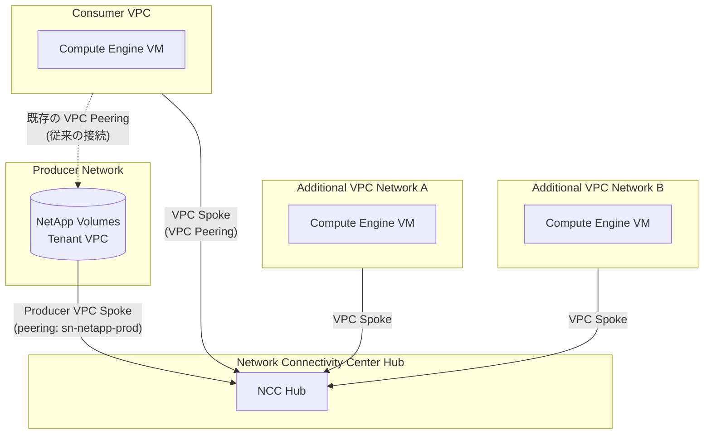

# NetApp Volumes: Network Connectivity Center Producer VPC Spokes (GA)

**リリース日**: 2026-03-02
**サービス**: Google Cloud NetApp Volumes, Network Connectivity Center
**機能**: Producer VPC Spokes による追加ネットワーク接続
**ステータス**: GA (一般提供開始)

[このアップデートのインフォグラフィックを見る](https://takech9203.github.io/google-cloud-news-summary/20260302-netapp-volumes-ncc-producer-vpc.html)

## 概要

Google Cloud NetApp Volumes が Network Connectivity Center (NCC) の Producer VPC Spokes に対応し、一般提供 (GA) となった。これにより、NetApp Volumes のストレージリソースに対して、VPC ピアリングの推移的ルーティングの制約を超えて、複数の VPC ネットワークからアクセスできるようになる。

NetApp Volumes はプライベートサービスアクセス (Private Services Access) を利用してテナント VPC 上にボリュームをプロビジョニングし、ユーザーのプロジェクト VPC と VPC ピアリングで接続する仕組みである。従来は、ピアリング先の VPC に直接接続されたクライアントのみがボリュームにアクセス可能だった。今回の GA により、NCC の Hub-and-Spoke アーキテクチャを通じて、追加の VPC ネットワークからも NetApp Volumes のサービスに到達できるようになった。

この機能は、マルチ VPC 環境やハイブリッドクラウド構成で NetApp Volumes を活用するエンタープライズユーザーにとって特に有用である。なお、Producer VPC Spokes は 2024 年 10 月にパブリックプレビューとして提供開始されており、今回 GA に昇格した。

**アップデート前の課題**

- VPC ピアリングは推移的ルーティングをサポートしないため、NetApp Volumes のテナント VPC にピアリングされた VPC 以外のネットワークからボリュームにアクセスできなかった
- 追加の VPC から NetApp Volumes にアクセスするには、テナント VPC への手動ピアリングを Google Cloud Customer Care に依頼する必要があった
- VPN やインターコネクトを使う回避策は構成が複雑で、運用コストが高かった

**アップデート後の改善**

- NCC の Producer VPC Spoke として NetApp Volumes のプロデューサーネットワークをハブに追加することで、ハブに接続された全ての VPC Spoke からボリュームにアクセス可能になった
- セルフサービスで追加ネットワーク接続を構成できるようになり、Google Cloud Customer Care への依頼が不要になった
- Export Filter によるルート広告の制御が可能になり、きめ細かいネットワークアクセス制御を実現できるようになった

## アーキテクチャ図



NCC Hub を中心に、NetApp Volumes のプロデューサーネットワークが Producer VPC Spoke として接続される。Consumer VPC は従来の VPC ピアリング経由でもアクセスを維持しつつ、Additional VPC Network A / B は NCC 経由でサブネットルートの交換によりボリュームにアクセスする。

## サービスアップデートの詳細

### 主要機能

1. **Producer VPC Spoke としての NetApp Volumes 統合**
   - NetApp Volumes のテナント VPC ネットワークを NCC Hub に Producer VPC Spoke として追加可能
   - ピアリング名には `sn-netapp-prod` を指定する
   - 既存の Consumer VPC Spoke (ピアリング済みの VPC) が前提条件として必要

2. **サブネットルートの自動交換**
   - Producer VPC Spoke がハブに追加されると、そのサブネットルートが自動的にエクスポートされる
   - ハブに接続された他の VPC Spoke にルートが広告され、NetApp Volumes のサービスに到達可能になる
   - 新規にプロビジョニングされたサブネットも自動的にエクスポート対象となる

3. **Export Filter によるルート制御**
   - Include Export Ranges / Exclude Export Ranges でエクスポートするサブネット IP 範囲を制御可能
   - `ALL_PRIVATE_IPV4_RANGES`、`ALL_IPV4_RANGES`、`ALL_IPV6_RANGES` などのキーワード指定が可能
   - 最大 16 個の重複しない CIDR を指定可能

## 技術仕様

### Producer VPC Spoke の要件と制約

| 項目 | 詳細 |
|------|------|
| 前提条件 | Consumer VPC がハブ上の VPC Spoke として登録済みであること |
| ピアリング名 (NetApp Volumes) | `sn-netapp-prod` |
| ピアリング名 (Private Services Access) | `servicenetworking-googleapis-com` |
| トポロジ | Mesh / Star の両方をサポート (Star の場合、同じグループに配置が必要) |
| Export Filter | Include / Exclude の両方をサポート (最大 16 CIDR) |
| クォータ | ハブあたりの VPC Spoke 数、ハブルートテーブルあたりのサブネットルート数の上限に準拠 |

### 接続性の例外事項

| 制約 | 説明 |
|------|------|
| Producer VPC Spoke 間の接続 | Producer VPC Spoke 同士の直接接続は確立されない |
| Peered Consumer VPC との接続 | 既存の VPC ピアリング接続が維持される (NCC 経由の新規接続は作成されない) |
| Private Service Connect | Producer VPC Spoke では PSC 接続伝搬はサポートされない |
| Internal LB 制限 | プロデューサー VPC の静的ルートは NCC ピアの内部パススルー NLB に解決されない |

### IAM 権限

```json
{
  "required_permissions": [
    "networkconnectivity.spokes.use",
    "networkconnectivity.groups.use",
    "networkconnectivity.spokes.create",
    "compute.networks.use"
  ],
  "recommended_roles": [
    "roles/compute.networkAdmin",
    "roles/networkconnectivity.spokeAdmin",
    "roles/networkconnectivity.groupUser"
  ]
}
```

## 設定方法

### 前提条件

1. Network Connectivity API が有効化されていること
2. NetApp Volumes のストレージプールとボリュームが作成済みであること
3. Consumer VPC が NetApp Volumes テナント VPC と VPC ピアリングで接続済みであること
4. Consumer VPC が NCC Hub に VPC Spoke として登録済みであること

### 手順

#### ステップ 1: NCC Hub の作成 (未作成の場合)

```bash
gcloud network-connectivity hubs create HUB_NAME \
    --description="Hub for NetApp Volumes connectivity"
```

Consumer VPC を VPC Spoke としてハブに登録していない場合は、先に登録する。

#### ステップ 2: Producer VPC Spoke の作成

```bash
gcloud network-connectivity spokes linked-producer-vpc-network create SPOKE_NAME \
    --hub=HUB_NAME \
    --description="NetApp Volumes producer VPC spoke" \
    --network=projects/PROJECT_ID/global/networks/CONSUMER_VPC_NAME \
    --peering=sn-netapp-prod \
    --global
```

`CONSUMER_VPC_NAME` は NetApp Volumes テナント VPC とピアリングしている VPC ネットワーク名を指定する。

#### ステップ 3: Export Filter の設定 (任意)

```bash
gcloud network-connectivity spokes linked-producer-vpc-network create SPOKE_NAME \
    --hub=HUB_NAME \
    --network=projects/PROJECT_ID/global/networks/CONSUMER_VPC_NAME \
    --peering=sn-netapp-prod \
    --include-export-ranges=ALL_PRIVATE_IPV4_RANGES \
    --exclude-export-ranges=10.200.0.0/16 \
    --global
```

Export Filter を使用して、ハブにエクスポートするサブネットルートを制限できる。

#### ステップ 4: 追加 VPC ネットワークの VPC Spoke 登録

```bash
gcloud network-connectivity spokes linked-vpc-network create ADDITIONAL_SPOKE_NAME \
    --hub=HUB_NAME \
    --vpc-network=projects/PROJECT_ID/global/networks/ADDITIONAL_VPC_NAME \
    --global
```

NetApp Volumes にアクセスさせたい追加の VPC ネットワークを VPC Spoke としてハブに登録する。

## メリット

### ビジネス面

- **マルチテナント環境の統合**: 複数のプロジェクトや部門が個別の VPC を持ちながら、共通の NetApp Volumes ストレージを共有できるため、ストレージコストの最適化が可能
- **運用負荷の軽減**: Google Cloud Customer Care への手動ピアリング依頼が不要になり、セルフサービスでネットワーク構成を管理できる
- **GA による本番利用の保証**: SLA に基づく本番環境での利用が正式にサポートされ、エンタープライズワークロードへの適用が可能になった

### 技術面

- **推移的ルーティングの実現**: VPC ピアリングの制約を NCC の Hub-and-Spoke モデルで解消し、複数ネットワーク間の接続を確立できる
- **きめ細かいルート制御**: Export Filter により、セキュリティ要件に応じたサブネットルートの公開範囲を制御可能
- **ハイブリッド接続との統合**: NCC ハブを通じて、VPN や Cloud Interconnect で接続されたオンプレミスネットワークからも NetApp Volumes にアクセス可能

## デメリット・制約事項

### 制限事項

- Producer VPC Spoke 同士の直接通信は NCC 経由で確立されない
- Producer VPC Spoke 上の Private Service Connect 接続伝搬はサポートされない
- 内部パススルー Network Load Balancer において、プロデューサー VPC の静的ルートが NCC ピアの LB に解決されない制約がある
- `PER_SESSION` コネクション トラッキング モードは Producer VPC Spoke ではサポートされない

### 考慮すべき点

- NCC は割り当て済み IP 範囲との重複チェックを行わないため、VPC Spoke の IP 範囲がプライベートサービスアクセスの割り当て範囲と重複しないよう手動で確認が必要
- Star トポロジ使用時は、Producer VPC Spoke を Consumer VPC Spoke と同じグループに配置する必要がある
- ハブあたりの VPC Spoke 数やサブネットルート数のクォータ上限に注意が必要

## ユースケース

### ユースケース 1: マルチ VPC 環境での共有ファイルストレージ

**シナリオ**: 大企業で部門ごとに異なる VPC を運用しており、共通の NetApp Volumes ファイルストレージ (NFS/SMB) を全部門から利用したい。

**実装例**:
```bash
# 各部門の VPC を NCC Hub に VPC Spoke として登録
gcloud network-connectivity spokes linked-vpc-network create dept-a-spoke \
    --hub=corp-hub --vpc-network=projects/dept-a/global/networks/vpc-dept-a --global

gcloud network-connectivity spokes linked-vpc-network create dept-b-spoke \
    --hub=corp-hub --vpc-network=projects/dept-b/global/networks/vpc-dept-b --global

# NetApp Volumes Producer VPC Spoke を登録
gcloud network-connectivity spokes linked-producer-vpc-network create netapp-spoke \
    --hub=corp-hub \
    --network=projects/shared-services/global/networks/vpc-shared \
    --peering=sn-netapp-prod --global
```

**効果**: 各部門の VPC から NCC 経由で NetApp Volumes に直接アクセスでき、手動ピアリング設定や VPN 構成の複雑さを排除できる。

### ユースケース 2: VMware Engine 環境からの NetApp Volumes アクセス

**シナリオ**: Google Cloud VMware Engine で SAP HANA ワークロードを実行しており、NetApp Volumes をデータストアとして利用したいが、VMware Engine の VPC と NetApp Volumes の VPC が異なる。

**効果**: NCC の Producer VPC Spoke により、VMware Engine の VPC ネットワークから NetApp Volumes のストレージにアクセスでき、コスト効率の高いデータストア拡張を実現できる。

## 料金

NetApp Volumes と Network Connectivity Center はそれぞれ独立した料金体系を持つ。

### NetApp Volumes の料金

NetApp Volumes はサービスレベル (Flex / Standard / Premium / Extreme) とリージョンに基づく料金体系である。コミットメント利用割引 (CUD) も利用可能で、1 年契約で 15%、3 年契約で 20% の割引が適用される。CUD の最低コミットメント額は 1 時間あたり $11.38 (年間約 $100,000) である。

詳細な料金は [NetApp Volumes 料金ページ](https://cloud.google.com/netapp/volumes/pricing) を参照。

### Network Connectivity Center の料金

NCC の料金は接続タイプとデータ転送量に基づく。VPC Spoke 間のデータ転送には Advanced Data Networking (ADN) の料金が適用される場合がある。

詳細な料金は [NCC 料金ページ](https://cloud.google.com/network-connectivity/pricing#ncc-pricing) を参照。

## 利用可能リージョン

NetApp Volumes は 40 以上のリージョンで利用可能である (サービスレベルにより異なる)。Standard サービスレベルは最も広いリージョンカバレッジを提供しており、米国、欧州、アジア太平洋、中東、南米、アフリカの主要リージョンで利用できる。

Network Connectivity Center はグローバルリソースであり、すべての Google Cloud リージョンで利用可能。Producer VPC Spoke もグローバルリソースとして作成される。

詳細なリージョン情報は [NetApp Volumes のサービスレベルとリージョン](https://cloud.google.com/netapp/volumes/docs/discover/service-levels#supported_regions) を参照。

## 関連サービス・機能

- **VPC Network Peering**: NetApp Volumes の基本的な接続基盤。プライベートサービスアクセスを通じてテナント VPC とユーザー VPC をピアリングする
- **Network Connectivity Center (VPC Spokes)**: 複数の VPC ネットワークをハブを通じて接続する NCC のコア機能。Producer VPC Spoke はこの上に構築される
- **Private Services Access**: NetApp Volumes がテナント VPC をホストするために使用するフレームワーク
- **Cloud VPN / Cloud Interconnect**: NCC ハブとの統合により、オンプレミスネットワークから NetApp Volumes への接続経路を提供する
- **Shared VPC**: NetApp Volumes の別の接続方法。同一の Shared VPC 上に配置することで、異なるサービスプロジェクトからのアクセスを実現する

## 参考リンク

- [インフォグラフィック](https://takech9203.github.io/google-cloud-news-summary/20260302-netapp-volumes-ncc-producer-vpc.html)
- [公式リリースノート](https://cloud.google.com/release-notes#March_02_2026)
- [NetApp Volumes: 追加ネットワーク接続](https://cloud.google.com/netapp/volumes/docs/get-started/quickstarts/connect-additional-networks)
- [Producer VPC Spokes 概要](https://cloud.google.com/network-connectivity/docs/network-connectivity-center/concepts/producer-vpc-spokes-overview)
- [Producer VPC Spoke の作成](https://cloud.google.com/network-connectivity/docs/network-connectivity-center/how-to/create-producer-vpc-spoke)
- [Network Connectivity Center 概要](https://cloud.google.com/network-connectivity/docs/network-connectivity-center/concepts/overview)
- [NetApp Volumes 料金](https://cloud.google.com/netapp/volumes/pricing)
- [NCC 料金](https://cloud.google.com/network-connectivity/pricing#ncc-pricing)

## まとめ

NetApp Volumes の Producer VPC Spokes が GA となったことで、エンタープライズ環境で一般的なマルチ VPC 構成において、NetApp Volumes のファイルストレージサービスへのアクセスが大幅に容易になった。VPC ピアリングの推移的ルーティング制約を NCC の Hub-and-Spoke モデルで解消し、セルフサービスで構成可能な点が大きな利点である。マルチ VPC 環境で NetApp Volumes を利用中、または検討中のユーザーは、NCC の Producer VPC Spoke を活用したネットワーク構成への移行を推奨する。

---

**タグ**: #NetAppVolumes #NetworkConnectivityCenter #VPC #ネットワーキング #GA #ProducerVPCSpoke #PrivateServicesAccess #ハイブリッドクラウド #ストレージ
