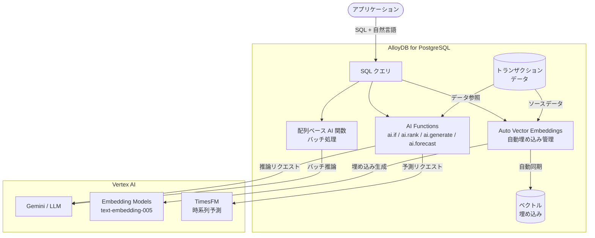

# AlloyDB for PostgreSQL: AI 機能群の一般提供 (GA)

**リリース日**: 2026-03-03

**サービス**: AlloyDB for PostgreSQL

**機能**: Auto Vector Embeddings、AI Functions、配列ベース AI 関数の GA 昇格

**ステータス**: GA (一般提供)

📊 [このアップデートのインフォグラフィックを見る](https://takech9203.github.io/google-cloud-news-summary/20260303-alloydb-ai-features-ga.html)

## 概要

AlloyDB for PostgreSQL の AI 機能群が一般提供 (GA) となった。今回 GA となったのは、Auto Vector Embeddings (自動ベクトル埋め込み)、AI Functions (ai.if、ai.rank、ai.generate、ai.forecast)、および配列ベース AI 関数の 3 つの主要機能である。これらの機能により、SQL ワークフロー内で直接 LLM やベクトル検索を活用できるようになり、データベースとAI/ML の統合がさらに強化された。

AlloyDB AI は、Gemini をはじめとする LLM をデータベースに直接統合し、セマンティック検索、自然言語フィルタリング、テキスト生成、時系列予測などの高度な AI 操作を SQL クエリ内で実行可能にするスイートである。今回の GA により、これらの機能がプロダクション環境でのフルサポートを受けられるようになり、エンタープライズレベルのAI アプリケーション構築が本格化する。

対象ユーザーは、AlloyDB を使用してセマンティック検索、RAG (Retrieval Augmented Generation)、AI を活用したデータ分析、時系列予測などを構築するデータエンジニア、アプリケーション開発者、データサイエンティストである。

**アップデート前の課題**

- ベクトル埋め込みの生成と管理を手動で行う必要があり、カスタムスクリプトや手動による再インデックスが必要だった
- AI モデルの推論をデータベース外部で実行する必要があり、データの移動によるレイテンシとアーキテクチャの複雑化が発生していた
- 大規模データセットに対する AI 操作では、行ごとの逐次処理が必要で効率が悪かった
- セマンティック検索やランキングを SQL ワークフローに直接組み込むことができず、アプリケーション層での追加実装が必要だった
- これらの機能は Preview ステータスであり、本番環境での使用にはリスクがあった

**アップデート後の改善**

- Auto Vector Embeddings がトランザクションデータと自動同期され、手動管理が不要になった。incremental refresh (manual モード) と bulk モードにより、従来の行ごとの処理と比較して最大 100 倍高速なテーブルリフレッシュが可能
- ai.if、ai.rank、ai.generate、ai.forecast の各 AI 関数を SQL 内で直接使用でき、LLM の「世界知識」をデータベースデータと組み合わせた高度なクエリが可能になった
- 配列ベース AI 関数により、大規模 AI 操作のバッチ処理が可能になり、スケーラビリティが大幅に改善された
- GA ステータスにより、Google Cloud の正式サポートと SLA が適用され、プロダクション環境での利用が推奨されるようになった

## アーキテクチャ図



AlloyDB AI の全体アーキテクチャ。アプリケーションから発行された SQL クエリが AlloyDB 内の AI Functions や Auto Vector Embeddings を経由し、Vertex AI 上の Gemini や Embedding モデルと連携して AI 機能を実現する。

## サービスアップデートの詳細

### 主要機能

1. **Auto Vector Embeddings (自動ベクトル埋め込み)**
   - テーブルカラム全体のベクトル埋め込みを自動的に生成・管理するスケーラブルなソリューション
   - トランザクションデータとの自動同期により、AI アプリケーションが常に最新の埋め込みで動作
   - `manual` モードでの incremental refresh により、新規または更新された行のみに対して埋め込みを生成
   - `bulk` モードにより、従来の行ごとの処理と比較して最大 100 倍高速なテーブルリフレッシュとマイグレーションが可能
   - Google 提供モデル (Vertex AI text-embedding-005 など) およびカスタムモデルに対応
   - `ai.initialize_embeddings()` 関数による一括初期化、`ai.drop_embedding_config()` によるクリーンアップに対応

2. **AI Functions (AI 関数)**
   - **ai.if**: 自然言語で記述された条件に基づくフィルタリング。ブーリアン値を返し、SQL の WHERE 句やJOIN 条件で使用可能
   - **ai.rank**: セマンティックランキング。Vertex AI のランキングモデルと連携し、検索結果の関連性を向上
   - **ai.generate**: テキスト生成。Gemini などの LLM を使用して、データの要約、変換、生成をSQL 内で実行
   - **ai.forecast**: 時系列予測。TimesFM などの予測モデルを使用して、データベース内で直接時系列予測を実行。ソーステーブルまたはクエリからデータを入力し、将来の時間ステップを予測
   - Gemini、OpenAI、Anthropic など複数のモデルプロバイダーに対応

3. **配列ベース AI 関数**
   - SQL クエリ内で自然言語プロンプトのバッチ処理を実行
   - 配列入力・配列出力により、複数行を単一の関数呼び出しで処理
   - 小~中規模データセットに最適で、セットベースの操作に高スループットを提供
   - スカラー関数 (1:1 処理)、配列ベース関数 (バッチ処理)、カーソル関数 (大規模データ処理) の 3 カテゴリから用途に応じて選択可能

## 技術仕様

### AI 関数カテゴリ

| カテゴリ | 説明 | 推奨ユースケース |
|---------|------|-----------------|
| スカラー | 単一入力から単一出力を返す基本処理 | 50 件未満のスカラー関数呼び出しで十分なクエリ |
| 配列ベース | 行の配列を単一の関数呼び出しで処理 | メモリに収まる小~中規模データセットのバッチ処理 |
| カーソル | カーソル入力からカーソル出力を返す | 10,000 行以上の大規模データ処理 |

### AI 関数シグネチャ

| 関数 | シグネチャ | 戻り値 |
|------|-----------|--------|
| `ai.if` | `ai.if(prompt TEXT, model_id VARCHAR DEFAULT NULL)` | `bool` |
| `ai.rank` | セマンティックランキング用 | スコア値 |
| `ai.generate` | テキスト生成用 | 生成テキスト |
| `ai.forecast` | `ai.forecast(model_id, source_table/source_query, data_col, timestamp_col, horizon, conf_level)` | 予測結果セット |

### ai.forecast パラメータ

| パラメータ | 説明 |
|-----------|------|
| `model_id` | 予測に使用する登録済みモデルの一意識別子 |
| `source_table` / `source_query` | 時系列データのソース (テーブル名またはクエリ) |
| `data_col` | 予測対象の数値データカラム名 |
| `timestamp_col` | 時間ポイントを含むカラム名 |
| `horizon` | 予測する将来の時間ステップ数 (1~128) |
| `conf_level` | 信頼区間レベル (0~1)。0.80 = 80% の確率で実際の値が予測区間内に収まる |

### 必要な拡張機能

```sql
-- google_ml_integration 拡張機能のバージョン確認 (1.4.5 以上が必要)
SELECT extversion FROM pg_extension WHERE extname = 'google_ml_integration';

-- ベクトル埋め込み用カラムの追加
ALTER TABLE user_reviews
ADD COLUMN IF NOT EXISTS content_embeddings vector(768) DEFAULT NULL;
```

## 設定方法

### 前提条件

1. AlloyDB for PostgreSQL クラスタが作成済みであること
2. Vertex AI API が有効化されていること
3. AlloyDB サービスアカウントに Vertex AI User ロール (`roles/aiplatform.user`) が付与されていること
4. `google_ml_integration` 拡張機能 バージョン 1.4.5 以上がインストール済みであること

### 手順

#### ステップ 1: Auto Vector Embeddings の設定

```sql
-- 埋め込み用カラムの作成
ALTER TABLE my_table
ADD COLUMN IF NOT EXISTS content_embeddings vector(768) DEFAULT NULL;

-- テーブルの埋め込みを初期化 (ブロッキング呼び出し)
SELECT ai.initialize_embeddings('my_table');
```

初期化が完了すると、テーブル内の既存データに対してベクトル埋め込みが生成される。transient なエラー (モデルクォータエラーなど) は自動的にリカバリが試みられる。

#### ステップ 2: AI Functions の使用

```sql
-- ai.if: セマンティックフィルタリングの例
SELECT r.name, r.location_city
FROM restaurant_reviews r
WHERE ai.if(
  r.location_city || ' has a population of more than 100,000
  AND the following is a positive review; Review: ' || r.review
)
GROUP BY r.name, r.location_city
HAVING COUNT(*) > 500;

-- ai.generate: テキスト生成の例
SELECT ai.generate('Summarize the following review: ' || review_text)
FROM product_reviews;

-- ai.forecast: 時系列予測の例
SELECT * FROM ai.forecast(
  model_id => 'timesfm_v2',
  source_table => 'time_series_data',
  data_col => 'data_points',
  timestamp_col => 'timestamp',
  horizon => 7,
  conf_level => 0.80
);
```

#### ステップ 3: 配列ベース AI 関数の活用

```sql
-- 配列ベース AI 関数によるバッチ処理
-- 複数行を一度に処理することでスループットを向上
SELECT *
FROM ai.if_array(
  ARRAY(SELECT review_text FROM product_reviews LIMIT 100),
  'Is this a positive review?'
);
```

## メリット

### ビジネス面

- **開発効率の向上**: SQL 内で直接 AI 機能を利用できるため、外部 AI パイプラインの構築が不要になり、アプリケーション開発のタイムトゥマーケットが短縮される
- **運用コストの削減**: Auto Vector Embeddings の自動管理により、手動での埋め込み更新やカスタムスクリプトのメンテナンスが不要になる
- **本番環境での信頼性**: GA ステータスにより、Google Cloud の SLA とフルサポートが適用され、エンタープライズ環境での採用リスクが低減される

### 技術面

- **パフォーマンスの向上**: bulk モードによる最大 100 倍高速なテーブルリフレッシュ、配列ベース関数によるバッチ処理でスループットが大幅に改善
- **アーキテクチャの簡素化**: データベースと AI/ML の統合により、データ移動に伴うレイテンシが削減され、リアルタイム AI 推論が可能になる
- **マルチモデル対応**: Gemini、OpenAI、Anthropic、Hugging Face など複数のモデルプロバイダーをサポートし、ユースケースに応じた最適なモデル選択が可能
- **PostgreSQL 互換性**: 標準 pgvector 拡張との完全互換性を維持しつつ、AlloyDB 独自の ScaNN アルゴリズムによる高効率ベクトル検索を提供

## デメリット・制約事項

### 制限事項

- Auto Vector Embeddings は通常の永続 PostgreSQL テーブルのみでサポートされ、パーティションテーブル、一時テーブル、unlogged テーブルには非対応
- ai.forecast の horizon パラメータは 1~128 の範囲に制限される
- AI 関数の使用にはモデルトークン使用量に基づく追加料金が発生する
- `ai.initialize_embeddings()` が失敗した場合、再実行前に `ai.drop_embedding_config()` でクリーンアップが必要

### 考慮すべき点

- AI 関数の実行はリモートモデル呼び出しを伴うため、ネットワークレイテンシとモデルのレスポンス時間がクエリ性能に影響する
- 配列ベース関数はメモリに収まるデータセットが対象であり、大規模データには カーソル関数の使用を検討すべき
- AlloyDB インスタンスと Vertex AI モデルエンドポイントが異なるプロジェクトにある場合、追加の IAM 設定が必要

## ユースケース

### ユースケース 1: E コマースのセマンティック商品検索と RAG

**シナリオ**: 大規模 E コマースサイトで、商品レビューや説明文に対してセマンティック検索を実装し、ユーザーの自然言語クエリに最も関連性の高い商品を返す。

**実装例**:
```sql
-- Auto Vector Embeddings でレビューの埋め込みを自動管理
SELECT ai.initialize_embeddings('product_reviews');

-- ai.rank でセマンティックランキング
SELECT p.name, p.description, p.price
FROM products p
JOIN product_reviews r ON p.id = r.product_id
WHERE ai.if('This review mentions high quality and durability: ' || r.review_text)
ORDER BY ai.rank('Best products for outdoor activities', p.description)
LIMIT 10;
```

**効果**: 手動でのベクトル埋め込み管理が不要になり、常に最新のレビューデータに基づくセマンティック検索が可能。bulk モードにより新商品のカタログ追加時も高速に埋め込みを生成できる。

### ユースケース 2: 需要予測と在庫最適化

**シナリオ**: 小売業の販売データに基づき、将来の需要を予測して在庫管理を最適化する。

**実装例**:
```sql
-- TimesFM モデルを使用した需要予測
SELECT * FROM ai.forecast(
  model_id => 'timesfm_v2',
  source_query => '(SELECT sale_date, daily_sales
                    FROM sales_data
                    WHERE product_id = 12345
                    ORDER BY sale_date) AS ts',
  data_col => 'daily_sales',
  timestamp_col => 'sale_date',
  horizon => 30,
  conf_level => 0.90
);
```

**効果**: データベース内で直接時系列予測を実行できるため、外部の ML パイプラインを構築する必要がなく、在庫計画の意思決定を迅速化できる。

## 料金

AlloyDB for PostgreSQL は従量課金制の料金モデルを採用しており、料金はインスタンスリソース (vCPU 数とメモリ量)、ストレージ使用量、ネットワーク Egress の 3 要素で構成される。AI 関数の使用には、モデルトークン使用量に基づく追加の処理料金が発生する。

詳細な料金情報については、以下の公式料金ページを参照のこと。

- [AlloyDB for PostgreSQL 料金ページ](https://cloud.google.com/alloydb/pricing)

### 料金最適化のヒント

| 方法 | 説明 |
|------|------|
| Basic インスタンス | HA が不要な場合、Basic インスタンスで コスト削減が可能 |
| 確約利用割引 (CUD) | vCPU とメモリ使用量に対する 1 年または 3 年の確約利用割引が利用可能 |
| バッチ処理の活用 | 配列ベース AI 関数やbulk モードを使用して API 呼び出し回数を最適化 |

## 利用可能リージョン

AlloyDB for PostgreSQL は世界中の 40 以上のリージョンで利用可能。主要なリージョンは以下の通り。

| 地域 | リージョン例 |
|------|-------------|
| アメリカ | us-central1 (Iowa)、us-east1 (South Carolina)、us-west1 (Oregon) など 14 リージョン |
| ヨーロッパ | europe-west1 (Belgium)、europe-west3 (Frankfurt)、europe-north1 (Finland) など 13 リージョン |
| アジア | asia-northeast1 (Tokyo)、asia-northeast2 (Osaka)、asia-southeast1 (Singapore) など 10 リージョン |
| オーストラリア | australia-southeast1 (Sydney)、australia-southeast2 (Melbourne) |
| 中東 | me-central1 (Doha)、me-central2 (Dammam)、me-west1 (Tel Aviv) |

全リージョンの一覧は [AlloyDB Locations](https://cloud.google.com/alloydb/docs/locations) を参照。

## 関連サービス・機能

- **Vertex AI**: AI 関数のバックエンドとなる ML モデル (Gemini、text-embedding-005、TimesFM など) を提供。Model Garden からモデルを選択して AlloyDB と連携
- **Vertex AI Model Garden**: TimesFM などの時系列予測モデルや、テキスト埋め込みモデルのデプロイ先
- **pgvector / alloydb_scann**: AlloyDB のベクトル検索拡張機能。ScaNN アルゴリズムによる高効率な近似最近傍検索を提供
- **AlloyDB AI Natural Language**: 自然言語で SQL クエリを生成する機能 (Preview)。AI 関数と組み合わせてデータアクセスをさらに民主化
- **GenAI Toolbox for Databases**: AlloyDB と Google の GenAI Toolbox を統合するためのツール

## 参考リンク

- 📊 [インフォグラフィック](https://takech9203.github.io/google-cloud-news-summary/20260303-alloydb-ai-features-ga.html)
- [公式リリースノート](https://docs.cloud.google.com/release-notes#March_03_2026)
- [AlloyDB AI 概要ドキュメント](https://cloud.google.com/alloydb/docs/ai)
- [Auto Vector Embeddings ドキュメント](https://docs.cloud.google.com/alloydb/docs/ai/generate-manage-auto-embeddings-for-tables)
- [AI Functions ドキュメント](https://docs.cloud.google.com/alloydb/docs/ai/ai-query-engine-landing)
- [AI 関数を使用したインテリジェント SQL クエリ](https://docs.cloud.google.com/alloydb/docs/ai/evaluate-semantic-queries-ai-operators)
- [時系列予測 (ai.forecast)](https://docs.cloud.google.com/alloydb/docs/ai/perform-time-series-forecasting)
- [料金ページ](https://cloud.google.com/alloydb/pricing)
- [AlloyDB Locations](https://cloud.google.com/alloydb/docs/locations)

## まとめ

AlloyDB for PostgreSQL の AI 機能群 (Auto Vector Embeddings、AI Functions、配列ベース AI 関数) が GA となったことで、SQL ワークフロー内で LLM を活用したセマンティック検索、フィルタリング、テキスト生成、時系列予測がプロダクション対応となった。これらの機能は、データベースと AI の統合を大幅に簡素化し、外部パイプラインの構築を不要にすることで、AI アプリケーション開発の効率を劇的に向上させる。AlloyDB を使用している組織は、まず Auto Vector Embeddings による既存データの自動埋め込み管理を有効化し、次に ai.if や ai.generate などの AI 関数を既存の SQL ワークフローに組み込むことで、迅速に AI 機能を活用開始することを推奨する。

---

**タグ**: #AlloyDB #PostgreSQL #AI #VectorEmbeddings #SemanticSearch #RAG #Gemini #VertexAI #MachineLearning #GA #TimeSeriesForecasting #LLM #Database
