# Cloud Build: 認可の脆弱性 CVE-2026-3136 の修正

**リリース日**: 2026-03-03

**サービス**: Cloud Build

**機能**: 認可 (Authorization) 脆弱性の修正

**ステータス**: 修正済み (Fixed)

[このアップデートのインフォグラフィックを見る](https://takech9203.github.io/google-cloud-news-summary/20260303-cloud-build-cve-2026-3136.html)

## 概要

Google Cloud は、Cloud Build に存在していた認可 (Authorization) の脆弱性 [CVE-2026-3136](https://cve.mitre.org/cgi-bin/cvename.cgi?name=CVE-2026-3136) を修正したことを発表した。この脆弱性はサーバーサイドで修正が適用されており、Cloud Build を利用するすべてのプロジェクトに対して自動的に適用されている。

Cloud Build は Google Cloud のフルマネージド CI/CD プラットフォームであり、ソースコードのビルド、テスト、デプロイを自動化するサービスである。ビルドプロセスではサービスアカウントを使用してリソースにアクセスするため、認可の仕組みはセキュリティの根幹を担っている。今回の CVE-2026-3136 は認可に関する脆弱性であり、適切な権限チェックが行われないケースが存在していたことが報告された。

対象ユーザーは Cloud Build を利用しているすべてのプロジェクト管理者、DevOps エンジニア、およびプラットフォームエンジニアである。修正はサーバーサイドで適用済みであるが、セキュリティのベストプラクティスとして IAM 権限の見直しを推奨する。

**アップデート前の課題**

- Cloud Build の認可メカニズムに脆弱性 (CVE-2026-3136) が存在していた
- 認可チェックの不備により、意図しないリソースアクセスが発生する可能性があった
- Cloud Build のデフォルトサービスアカウントが過剰な権限を持つ構成では、脆弱性の影響がより大きくなるリスクがあった

**アップデート後の改善**

- CVE-2026-3136 が修正され、Cloud Build の認可メカニズムが強化された
- 認可チェックが適切に行われるようになり、意図しないリソースアクセスのリスクが解消された
- 修正はサーバーサイドで自動的に適用されたため、ユーザー側での追加対応は不要

## アーキテクチャ図

```mermaid
flowchart TD
    subgraph Before["修正前: CVE-2026-3136"]
        User1["ユーザー / サービスアカウント"]
        API1["Cloud Build API"]
        AuthCheck1["認可チェック\n(不完全)"]
        Resources1["Cloud Build リソース\n(ビルド / トリガー / リポジトリ)"]
        Bypass["認可バイパス\nの可能性"]

        User1 -->|"リクエスト"| API1
        API1 -->|"権限検証"| AuthCheck1
        AuthCheck1 -.->|"不完全な検証"| Bypass
        Bypass -.->|"意図しないアクセス"| Resources1
    end

    subgraph After["修正後: パッチ適用済み"]
        User2["ユーザー / サービスアカウント"]
        API2["Cloud Build API"]
        AuthCheck2["認可チェック\n(強化済み)"]
        IAM2["IAM 権限検証"]
        Resources2["Cloud Build リソース\n(ビルド / トリガー / リポジトリ)"]

        User2 -->|"リクエスト"| API2
        API2 -->|"権限検証"| AuthCheck2
        AuthCheck2 -->|"IAM ポリシー照合"| IAM2
        IAM2 -->|"認可済みアクセスのみ"| Resources2
    end

    style Bypass fill:#ff6b6b,color:#fff
    style AuthCheck1 fill:#ff9f43,color:#fff
    style AuthCheck2 fill:#2ed573,color:#fff
    style IAM2 fill:#1e90ff,color:#fff
```



修正前は認可チェックの不備により意図しないリソースアクセスが発生する可能性があったが、修正後は IAM ポリシーとの適切な照合が行われ、認可済みのアクセスのみが許可される。

## サービスアップデートの詳細

### 主要機能

1. **認可メカニズムの修正**
   - CVE-2026-3136 として報告された認可の脆弱性が修正された
   - Cloud Build API への認可チェックが強化され、不適切なリソースアクセスが防止される
   - 修正はサーバーサイドで適用されたため、ユーザー側でのアクションは不要

2. **サービスアカウント権限の適切な検証**
   - ビルド実行時のサービスアカウント認可が正しく行われるようになった
   - デフォルトサービスアカウントおよびユーザー指定サービスアカウントの両方に対して修正が適用
   - 最小権限の原則 (Principle of Least Privilege) に基づく権限管理がより確実に機能する

3. **セキュリティ態勢の強化**
   - Cloud Build の共有責任モデルにおいて、Google Cloud 側の責任範囲であるサービスコントロールプレーンのセキュリティが強化された
   - 過去のセキュリティ修正 (GCP-2023-013 など) と同様に、最小権限の原則に基づくアクセス制御が継続的に改善されている

## 技術仕様

### 脆弱性の概要

| 項目 | 詳細 |
|------|------|
| CVE ID | [CVE-2026-3136](https://cve.mitre.org/cgi-bin/cvename.cgi?name=CVE-2026-3136) |
| 脆弱性の種類 | Authorization (認可) |
| 影響を受けるサービス | Cloud Build |
| 修正方法 | サーバーサイドパッチ (自動適用) |
| ユーザーアクション | 不要 (追加のセキュリティ強化を推奨) |

### Cloud Build のセキュリティ関連 IAM ロール

| ロール | 説明 |
|------|------|
| `roles/cloudbuild.builds.editor` | ビルドの作成・キャンセル |
| `roles/cloudbuild.builds.viewer` | ビルドの閲覧のみ |
| `roles/cloudbuild.workerPoolOwner` | ワーカープールの管理 |
| `roles/iam.serviceAccountUser` | サービスアカウントの使用 |

### 推奨されるサービスアカウント構成

```json
{
  "serviceAccount": "projects/PROJECT_ID/serviceAccounts/custom-build-sa@PROJECT_ID.iam.gserviceaccount.com",
  "options": {
    "requestedVerifyOption": "VERIFIED",
    "logging": "GCS_ONLY"
  }
}
```

## 設定方法

### 前提条件

1. Cloud Build API が有効化されていること
2. IAM 権限の管理権限を持つアカウントでアクセスしていること

### 手順

#### ステップ 1: 現在のサービスアカウント構成の確認

```bash
# プロジェクトのCloud Build サービスアカウントを確認
gcloud projects get-iam-policy PROJECT_ID \
  --flatten="bindings[].members" \
  --filter="bindings.members:cloudbuild" \
  --format="table(bindings.role, bindings.members)"
```

デフォルトサービスアカウントではなく、ユーザー指定のサービスアカウントを使用しているか確認する。

#### ステップ 2: ユーザー指定サービスアカウントの作成と設定

```bash
# 専用のサービスアカウントを作成
gcloud iam service-accounts create cloud-build-custom-sa \
  --display-name="Cloud Build Custom Service Account" \
  --project=PROJECT_ID

# 必要最小限のロールを付与
gcloud projects add-iam-policy-binding PROJECT_ID \
  --member="serviceAccount:cloud-build-custom-sa@PROJECT_ID.iam.gserviceaccount.com" \
  --role="roles/cloudbuild.builds.builder"

# ログ書き込み権限を付与
gcloud projects add-iam-policy-binding PROJECT_ID \
  --member="serviceAccount:cloud-build-custom-sa@PROJECT_ID.iam.gserviceaccount.com" \
  --role="roles/logging.logWriter"
```

ユーザー指定のサービスアカウントを使用することで、最小権限の原則に基づいたビルド実行が可能になる。

#### ステップ 3: Cloud Build トリガーでのサービスアカウント指定

```bash
# 既存のトリガーのサービスアカウントを更新
gcloud builds triggers update TRIGGER_NAME \
  --service-account="projects/PROJECT_ID/serviceAccounts/cloud-build-custom-sa@PROJECT_ID.iam.gserviceaccount.com" \
  --region=REGION
```

トリガーごとに専用のサービスアカウントを指定することで、ビルドの権限スコープを最小限に抑えることができる。

#### ステップ 4: セキュリティ監査ログの確認

```bash
# Cloud Build の監査ログを確認
gcloud logging read 'resource.type="build" AND protoPayload.methodName="google.devtools.cloudbuild.v1.CloudBuild.CreateBuild"' \
  --project=PROJECT_ID \
  --limit=10 \
  --format="table(timestamp, protoPayload.authenticationInfo.principalEmail, protoPayload.methodName)"
```

監査ログを定期的に確認し、不審なビルド実行がないか監視する。

## メリット

### ビジネス面

- **セキュリティリスクの低減**: 認可の脆弱性が修正されたことで、意図しないリソースアクセスのリスクが排除された
- **コンプライアンスの維持**: CVE への対応が自動的に行われることで、セキュリティコンプライアンス要件を継続的に満たすことができる
- **ダウンタイムなし**: サーバーサイドでの修正のため、サービスの中断なく脆弱性が解消された

### 技術面

- **自動適用**: ユーザー側でのパッチ適用作業が不要であり、運用コストが発生しない
- **認可チェックの強化**: IAM ポリシーとの整合性が向上し、権限管理がより堅牢になった
- **共有責任モデルの充実**: Google Cloud 側のインフラストラクチャセキュリティ責任が確実に果たされている

## デメリット・制約事項

### 制限事項

- CVE-2026-3136 の詳細な技術情報 (攻撃ベクトル、CVSS スコアなど) は本記事執筆時点では公開されていない
- サーバーサイド修正のため、ユーザーが修正の適用状況を直接確認する手段は限られる

### 考慮すべき点

- 今回の修正はサーバーサイドで自動適用されるが、Cloud Build のセキュリティを最大限に確保するためには、ユーザー側でも IAM 権限の見直しを行うことが推奨される
- デフォルトサービスアカウントを使用している場合は、ユーザー指定のサービスアカウントへの移行を検討すべきである
- Cloud Build のセキュリティブレティンを定期的に確認し、新たな脆弱性情報をモニタリングすることが重要である

## ユースケース

### ユースケース 1: 既存 CI/CD パイプラインのセキュリティ強化

**シナリオ**: Cloud Build でコンテナイメージのビルドとデプロイを自動化している組織が、今回の CVE 修正を契機にセキュリティ態勢を見直す場合。

**実装例**:
```yaml
# cloudbuild.yaml - セキュリティ強化された構成例
steps:
  - name: 'gcr.io/cloud-builders/docker'
    args: ['build', '-t', 'REGION-docker.pkg.dev/PROJECT_ID/REPO/IMAGE:$COMMIT_SHA', '.']
  - name: 'gcr.io/cloud-builders/docker'
    args: ['push', 'REGION-docker.pkg.dev/PROJECT_ID/REPO/IMAGE:$COMMIT_SHA']
options:
  logging: CLOUD_LOGGING_ONLY
  requestedVerifyOption: VERIFIED
serviceAccount: 'projects/PROJECT_ID/serviceAccounts/build-sa@PROJECT_ID.iam.gserviceaccount.com'
```

**効果**: ユーザー指定のサービスアカウントと最小限の権限設定により、認可の脆弱性が悪用された場合でも影響範囲を限定できる。

### ユースケース 2: セキュリティ監査対応

**シナリオ**: セキュリティ監査で CVE 対応状況を報告する必要がある場合。

**効果**: Cloud Build のセキュリティブレティンと監査ログを証跡として提出することで、Google Cloud 側での自動修正と組織側での追加セキュリティ対策の両方を証明できる。

## 料金

今回のセキュリティ修正に伴う追加料金は発生しない。Cloud Build の通常の料金体系が適用される。

| プラン | 内容 | 料金 |
|--------|------|------|
| 無料枠 | 120 ビルド分/日 (デフォルトマシンタイプ) | 無料 |
| デフォルトマシンタイプ | e2-medium (2 vCPU, 8 GB メモリ) | $0.003/ビルド分 |
| 高性能マシンタイプ | e2-highcpu-8 (8 vCPU, 8 GB メモリ) | $0.016/ビルド分 |
| 高性能マシンタイプ | e2-highcpu-32 (32 vCPU, 32 GB メモリ) | $0.064/ビルド分 |

詳細は [Cloud Build 料金ページ](https://cloud.google.com/build/pricing) を参照。

## 利用可能リージョン

Cloud Build は全リージョンで利用可能であり、今回のセキュリティ修正もすべてのリージョンに適用されている。グローバル (non-regional) およびリージョナルビルドの両方で修正が有効である。

## 関連サービス・機能

- **[Cloud Build セキュリティブレティン](https://cloud.google.com/build/docs/security-bulletins)**: Cloud Build に関連するセキュリティ情報が公開されるページ。RSS フィードで購読可能
- **[IAM (Identity and Access Management)](https://cloud.google.com/iam)**: Cloud Build のアクセス制御を管理するサービス。サービスアカウントの権限設定に使用
- **[Cloud Audit Logs](https://cloud.google.com/logging/docs/audit)**: Cloud Build の操作ログを記録し、セキュリティ監査に活用
- **[Binary Authorization](https://cloud.google.com/binary-authorization)**: ビルドされたコンテナイメージのデプロイポリシーを制御し、サプライチェーンセキュリティを強化
- **[Artifact Registry](https://cloud.google.com/artifact-registry)**: ビルド成果物の保存先。脆弱性スキャン機能と連携可能
- **[Software Supply Chain Security](https://cloud.google.com/software-supply-chain-security)**: SLSA レベルのビルド来歴情報の生成やデプロイポリシーの適用を含む、総合的なソフトウェアサプライチェーンセキュリティ機能

## 参考リンク

- [インフォグラフィック](https://takech9203.github.io/google-cloud-news-summary/20260303-cloud-build-cve-2026-3136.html)
- [公式リリースノート](https://docs.cloud.google.com/release-notes#March_03_2026)
- [Cloud Build セキュリティブレティン](https://cloud.google.com/build/docs/security-bulletins)
- [Cloud Build ドキュメント](https://cloud.google.com/build/docs)
- [Cloud Build の共有責任モデル](https://cloud.google.com/build/docs/shared-responsibility)
- [Cloud Build サービスアカウントの構成](https://cloud.google.com/build/docs/securing-builds/configure-user-specified-service-accounts)
- [Cloud Build IAM ロールと権限](https://cloud.google.com/build/docs/iam-roles-permissions)
- [Cloud Build 料金ページ](https://cloud.google.com/build/pricing)

## まとめ

Cloud Build の認可脆弱性 CVE-2026-3136 はサーバーサイドで修正済みであり、ユーザー側での追加対応は不要である。ただし、この機会にデフォルトサービスアカウントからユーザー指定サービスアカウントへの移行、IAM 権限の最小権限化、および Cloud Audit Logs の有効化といったセキュリティ強化策を実施することを強く推奨する。Cloud Build のセキュリティブレティンを RSS フィードで購読し、今後の脆弱性情報を継続的にモニタリングすることも重要である。

---

**タグ**: #CloudBuild #Security #CVE #Authorization #IAM #CI/CD #脆弱性修正 #GoogleCloud
