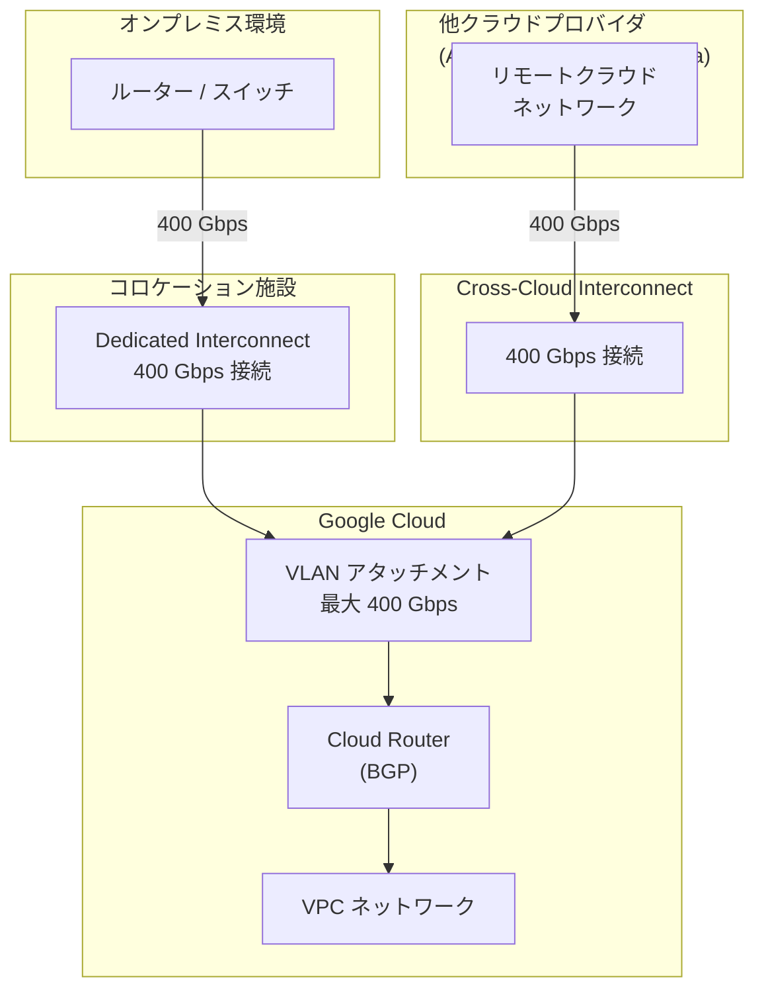

# Cloud Interconnect: 400 Gbps 接続サポート GA

**リリース日**: 2026-03-03

**サービス**: Cloud Interconnect

**機能**: 400 Gbps 接続 / VLAN アタッチメント

**ステータス**: GA (一般提供)

📊 [このアップデートのインフォグラフィックを見る](https://takech9203.github.io/google-cloud-news-summary/20260303-cloud-interconnect-400gbps-ga.html)

## 概要

Google Cloud は、Cloud Interconnect において 400 Gbps 接続のサポートを一般提供 (GA) として発表した。この機能強化は Dedicated Interconnect と Cross-Cloud Interconnect の両方に適用され、単一接続あたりの最大帯域幅が従来の 200 Gbps (2 x 100 Gbps) から 400 Gbps へと大幅に拡大された。

同時に、VLAN アタッチメントの最大容量も 400 Gbps に引き上げられ、Dedicated Interconnect および Cross-Cloud Interconnect で利用可能になった。これにより、単一の VLAN アタッチメントで 400 Gbps の帯域幅をフルに活用でき、大規模なデータ転送や高帯域幅を必要とするワークロードへの対応が飛躍的に向上する。

このアップデートは、AI/ML のトレーニングデータ転送、大規模なデータ分析基盤、マルチクラウド環境での高速データ連携など、ネットワーク帯域幅がボトルネックとなりやすいエンタープライズワークロードを運用する組織にとって特に重要である。

**アップデート前の課題**

- Dedicated Interconnect の最大接続容量は 2 x 100 Gbps (200 Gbps) に制限されていた
- VLAN アタッチメントの最大容量は 100 Gbps までであり、それ以上の帯域幅が必要な場合は複数の接続を束ねる必要があった
- 大規模データ転送やリアルタイム処理を行う場合、帯域幅の上限が性能のボトルネックとなる可能性があった
- マルチクラウド環境 (Cross-Cloud Interconnect) での高帯域幅接続にも同様の制約が存在していた

**アップデート後の改善**

- 単一の Dedicated Interconnect 接続で最大 400 Gbps の帯域幅を確保可能になった
- Cross-Cloud Interconnect でも 400 Gbps 接続がサポートされ、マルチクラウド間の高速データ転送が実現された
- VLAN アタッチメントの最大容量が 400 Gbps に拡大され、単一アタッチメントで接続帯域幅をフル活用できるようになった
- 従来より少ない接続数で同等以上の帯域幅を確保でき、構成の簡素化とコスト最適化が期待できる

## アーキテクチャ図



Dedicated Interconnect はオンプレミス環境と Google Cloud を直接接続し、Cross-Cloud Interconnect は他のクラウドプロバイダと Google Cloud を接続する。今回のアップデートにより、両方の接続タイプで 400 Gbps の帯域幅がサポートされた。

## サービスアップデートの詳細

### 主要機能

1. **400 Gbps Dedicated Interconnect 接続**
   - 単一の Dedicated Interconnect 接続で 400 Gbps の帯域幅を提供
   - 従来の最大 200 Gbps (2 x 100 Gbps) から 2 倍の帯域幅向上
   - コロケーション施設でのオンプレミスネットワークと Google ネットワーク間の直接物理接続

2. **400 Gbps Cross-Cloud Interconnect 接続**
   - Google Cloud と他のクラウドサービスプロバイダ (AWS、Azure、OCI、Alibaba Cloud) 間で 400 Gbps の帯域幅を提供
   - マルチクラウドアーキテクチャにおける高帯域幅データ転送を実現
   - Google がマネージドで提供する物理接続のため、自社でルーティング機器を管理する必要がない

3. **400 Gbps VLAN アタッチメント**
   - 単一の VLAN アタッチメントで最大 400 Gbps の帯域幅を設定可能
   - Dedicated Interconnect と Cross-Cloud Interconnect の両方で利用可能
   - 接続の帯域幅をフルに活用するために、従来必要だった複数 VLAN アタッチメントの構成が不要になるケースが増加

## 技術仕様

### 接続容量の比較

| 項目 | アップデート前 | アップデート後 |
|------|---------------|---------------|
| Dedicated Interconnect 最大接続容量 | 200 Gbps (2 x 100 Gbps) | 400 Gbps |
| Cross-Cloud Interconnect 最大接続容量 | 100 Gbps (単一リンク) | 400 Gbps |
| VLAN アタッチメント最大容量 (Dedicated) | 100 Gbps | 400 Gbps |
| VLAN アタッチメント最大容量 (Cross-Cloud) | 100 Gbps | 400 Gbps |
| 回線タイプ | 10 Gbps / 100 Gbps | 10 Gbps / 100 Gbps / 400 Gbps |

### 接続要件

| 項目 | 詳細 |
|------|------|
| 対象サービス | Dedicated Interconnect、Cross-Cloud Interconnect |
| ステータス | GA (一般提供) |
| プロトコル | BGP-4 (Cloud Router 経由) |
| VLAN サポート | 802.1Q VLAN |
| LACP | 必須 (単一回線でも必要) |
| 暗号化 | MACsec for Cloud Interconnect、HA VPN over Cloud Interconnect |
| SLA | 最大 99.99% (冗長構成時) |

## 設定方法

### 前提条件

1. Google Cloud プロジェクトで Network Connectivity API が有効化されていること
2. 400 Gbps 接続に対応したコロケーション施設でネットワーク機器が設置されていること (Dedicated Interconnect の場合)
3. 400 Gbps 対応の光トランシーバおよびルーティング機器を所有していること
4. Cloud Router が設定済みであること

### 手順

#### ステップ 1: Dedicated Interconnect 接続の発注

```bash
# Dedicated Interconnect 接続の作成 (400 Gbps)
gcloud compute interconnects create my-interconnect-400g \
    --interconnect-type=DEDICATED \
    --link-type=LINK_TYPE_ETHERNET_400G_LR4 \
    --requested-link-count=1 \
    --location=COLOCATION_FACILITY \
    --admin-enabled
```

Google がリソースを割り当て、LOA-CFA (Letter of Authorization and Connecting Facility Assignment) を送付する。ベンダーに LOA-CFA を提出して物理接続をプロビジョニングする。

#### ステップ 2: VLAN アタッチメントの作成

```bash
# 400 Gbps VLAN アタッチメントの作成
gcloud compute interconnects attachments dedicated create my-attachment-400g \
    --region=REGION \
    --router=my-cloud-router \
    --interconnect=my-interconnect-400g \
    --bandwidth=400G
```

VLAN アタッチメントを Cloud Router に関連付け、BGP セッションを構成する。

## メリット

### ビジネス面

- **大規模データ転送の高速化**: AI/ML モデルのトレーニングデータ、大規模分析データセットの転送時間を大幅に短縮できる
- **マルチクラウド戦略の強化**: Cross-Cloud Interconnect での 400 Gbps サポートにより、クラウド間のデータ連携がより実用的になる
- **構成の簡素化**: 従来複数の接続で実現していた帯域幅を、より少ない接続数で達成でき、運用管理コストを削減できる

### 技術面

- **帯域幅の大幅向上**: 単一接続で 400 Gbps を実現し、ネットワークのボトルネックを解消
- **VLAN アタッチメントの統合**: 単一アタッチメントで 400 Gbps を利用でき、構成がシンプルになる
- **低レイテンシの維持**: パブリックインターネットを経由しない専用接続のため、一貫した低レイテンシを実現
- **SLA の維持**: 冗長構成で 99.99% の可用性 SLA を引き続きサポート

## デメリット・制約事項

### 制限事項

- 400 Gbps 接続は Dedicated Interconnect と Cross-Cloud Interconnect のみが対象。Partner Interconnect は対象外
- 400 Gbps 接続に対応したコロケーション施設が必要であり、すべてのロケーションで利用可能とは限らない
- 400 Gbps 対応の光トランシーバおよびネットワーク機器の調達が必要

### 考慮すべき点

- 400 Gbps 接続を活用するには、オンプレミス側のネットワーク機器も同等の帯域幅をサポートしている必要がある
- 冗長構成 (99.99% SLA) を実現するには、複数のメトロエリアにまたがる接続が必要であり、400 Gbps 接続の場合はコストが増大する可能性がある
- Cross-Cloud Interconnect の場合、接続先のクラウドプロバイダ側でも 400 Gbps に対応している必要がある

## ユースケース

### ユースケース 1: AI/ML トレーニングデータの高速転送

**シナリオ**: 大規模な AI モデルのトレーニングにおいて、オンプレミスのデータレイクから Google Cloud の Vertex AI 環境にペタバイト規模のデータセットを転送する必要がある場合。

**効果**: 400 Gbps の帯域幅により、従来の 200 Gbps 接続と比較してデータ転送時間を最大 50% 短縮できる。例えば、100 TB のデータセットの転送が約 33 分で完了する (理論値)。

### ユースケース 2: マルチクラウドリアルタイムデータ連携

**シナリオ**: AWS 上のアプリケーションと Google Cloud 上の BigQuery 間でリアルタイムのデータストリーミングを行い、クラウド横断の分析パイプラインを構築する場合。

**効果**: Cross-Cloud Interconnect の 400 Gbps 接続により、大量のストリーミングデータを低レイテンシで転送でき、リアルタイム分析の精度とスピードが向上する。

### ユースケース 3: ディザスタリカバリ環境の高速レプリケーション

**シナリオ**: オンプレミスのプライマリデータセンターから Google Cloud のディザスタリカバリ環境へ、大量のデータベースレプリケーションを行う場合。

**効果**: 400 Gbps の帯域幅により、RPO (目標復旧時点) を短縮し、より鮮度の高いバックアップを維持できる。

## 料金

400 Gbps 接続の料金体系は公式料金ページで確認が必要である。従来の Dedicated Interconnect では、ポートごとの月額料金と VLAN アタッチメントごとの料金が課金されていた。Cloud Interconnect 経由のエグレストラフィックはインターネット経由より低い料金が適用される。

Dedicated Interconnect と Cross-Cloud Interconnect の両方で、固定ポート料金 (Fixed Port Pricing) オプションも利用可能であり、アウトバウンドデータ転送の月額料金を固定化できる。

詳細な料金については公式料金ページを参照されたい。

- [Cloud Interconnect 料金](https://cloud.google.com/network-connectivity/docs/interconnect/pricing)

## 関連サービス・機能

- **[VPC (Virtual Private Cloud)](https://cloud.google.com/vpc/docs/overview)**: Cloud Interconnect は VPC ネットワークと外部ネットワークを接続するための基盤サービス。VLAN アタッチメントは Cloud Router を介して特定の VPC ネットワークに紐付けられる
- **[Cloud Router](https://cloud.google.com/network-connectivity/docs/router/concepts/overview)**: BGP を使用した動的ルーティングを提供し、Cloud Interconnect の VLAN アタッチメントとオンプレミス/リモートクラウドのルーター間でルート交換を行う
- **[Network Connectivity Center](https://cloud.google.com/network-connectivity/docs/network-connectivity-center/concepts/overview)**: Cross-Cloud Interconnect と組み合わせて、Google ネットワークを WAN として活用するサイト間データ転送が可能
- **[HA VPN over Cloud Interconnect](https://cloud.google.com/network-connectivity/docs/interconnect/concepts/ha-vpn-interconnect)**: Cloud Interconnect トラフィックの IPsec 暗号化が必要な場合に使用
- **[MACsec for Cloud Interconnect](https://cloud.google.com/network-connectivity/docs/interconnect/concepts/macsec-overview)**: Cloud Interconnect 接続のレイヤー 2 暗号化を提供

## 参考リンク

- 📊 [インフォグラフィック](https://takech9203.github.io/google-cloud-news-summary/20260303-cloud-interconnect-400gbps-ga.html)
- [公式リリースノート](https://docs.cloud.google.com/release-notes#March_03_2026)
- [Cloud Interconnect 概要](https://cloud.google.com/network-connectivity/docs/interconnect/concepts/overview)
- [Dedicated Interconnect 概要](https://cloud.google.com/network-connectivity/docs/interconnect/concepts/dedicated-overview)
- [Cross-Cloud Interconnect 概要](https://cloud.google.com/network-connectivity/docs/interconnect/concepts/cci-overview)
- [Cloud Interconnect 料金](https://cloud.google.com/network-connectivity/docs/interconnect/pricing)
- [Cloud Interconnect FAQ](https://cloud.google.com/network-connectivity/docs/interconnect/support/faq)

## まとめ

Cloud Interconnect の 400 Gbps 接続サポートの GA は、Google Cloud のネットワーキング能力における重要なマイルストーンである。Dedicated Interconnect と Cross-Cloud Interconnect の両方で帯域幅が従来の最大 200 Gbps から 400 Gbps に倍増し、VLAN アタッチメントも 400 Gbps に対応したことで、大規模データ転送やマルチクラウド連携のボトルネックが大幅に解消される。AI/ML ワークロード、リアルタイムデータ分析、ディザスタリカバリなど、高帯域幅を必要とするユースケースを持つ組織は、この新しい接続オプションの導入を検討することを推奨する。

---

**タグ**: #CloudInterconnect #DedicatedInterconnect #CrossCloudInterconnect #400Gbps #VLAN #ネットワーキング #GA #マルチクラウド #ハイブリッドクラウド
