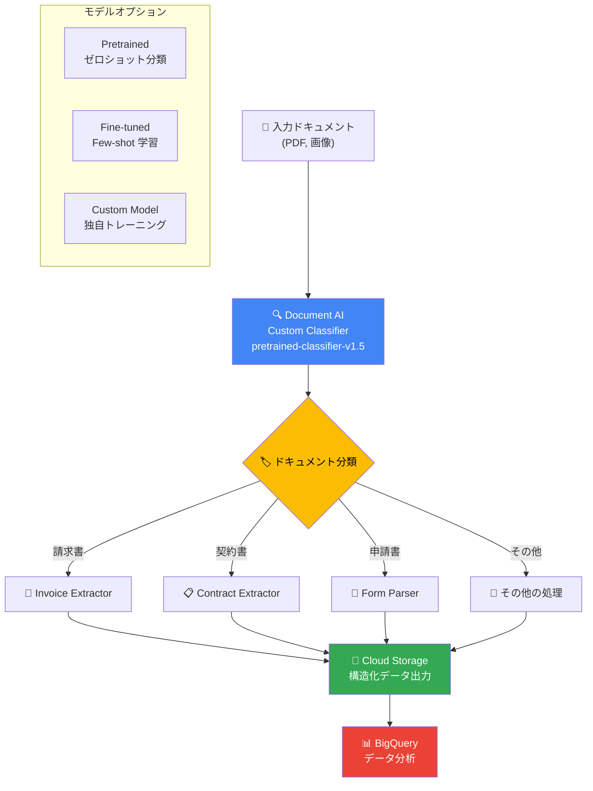

# Document AI: カスタム分類モデル GA

**リリース日**: 2026-03-03

**サービス**: Document AI

**機能**: カスタム分類モデル pretrained-classifier-v1.5

**ステータス**: GA (一般提供)

📊 [このアップデートのインフォグラフィックを見る](https://takech9203.github.io/google-cloud-news-summary/20260303-document-ai-custom-classifier-ga.html)

## 概要

Google Cloud Document AI のカスタム分類モデル `pretrained-classifier-v1.5-2025-08-05` が一般提供 (GA) として利用可能になりました。このモデルは Gemini 2.5 Flash LLM をベースとした生成 AI 搭載の分類プロセッサであり、ドキュメントの種類をユーザー定義のクラスセットから自動的に分類する機能を提供します。

本モデルは 2025 年 8 月にリリースされ、2025 年 9 月に Preview として公開された後、Release Candidate を経て GA に昇格しました。GA への昇格により、本番環境でのワークロードに対する SLA が保証され、エンタープライズレベルでの安定運用が可能になります。高精度な即時分類、Few-shot 学習による精度向上、ラベリング時の説明文による文脈付与、ファインチューニングによる更なる精度向上、自動ラベリング機能など、豊富な機能を備えています。

このアップデートは、ドキュメント処理パイプラインにおいて大量の文書を自動分類する必要があるエンタープライズユーザーや、請求書・契約書・申請書などの多様なドキュメントタイプを扱う組織にとって大きな価値があります。

**アップデート前の課題**

- カスタム分類モデル `pretrained-classifier-v1.5-2025-08-05` は Release Candidate (Preview) の段階であり、本番環境での利用には SLA が保証されていなかった
- 旧モデル `pretrained-foundation-model-v1.4-2025-05-16` は Gemini 2.0 Flash ベースであり、2026 年 3 月 31 日にアクセス不可となる予定があった
- 従来のカスタム分類器は古典的な機械学習ベースであり、ゼロショット分類やラベルの説明文を活用した高精度な分類ができなかった

**アップデート後の改善**

- `pretrained-classifier-v1.5-2025-08-05` が GA となり、SLA に基づいた本番環境での安定運用が可能になった
- Gemini 2.5 Flash LLM をベースとした最新の生成 AI モデルにより、ドキュメント分類の精度が向上
- 旧モデル (`v1.4`) の廃止予定 (2026-03-31) に先立ち、より高性能な GA モデルへの移行パスが明確になった

## アーキテクチャ図



Document AI カスタム分類器は、入力ドキュメントを自動的にユーザー定義のクラスに分類し、分類結果に基づいて適切な抽出プロセッサにルーティングする文書処理パイプラインの中核を担います。Pretrained (ゼロショット)、Fine-tuned、Custom Model の 3 つのアプローチから最適な方法を選択できます。

## サービスアップデートの詳細

### 主要機能

1. **ゼロショット (Pretrained) 分類**
   - ユーザーが定義したクラスラベルを指定するだけで、トレーニングデータなしに即座にドキュメントを分類可能
   - Gemini 2.5 Flash LLM による高精度な文書理解に基づく分類

2. **Few-shot 学習によるファインチューニング**
   - 少量のラベル付きデータ (ラベルごとに推奨 10 件) でファインチューニングが可能
   - 生成 AI モデルのファインチューニングにより、従来のカスタムモデルと同じデータセットでもより高精度な結果を実現

3. **自動ラベリング (Auto-labeling)**
   - デプロイ済みのプロセッサバージョンを使用して、新しくインポートしたドキュメントに自動的にラベルを付与
   - ラベリング工数を大幅に削減し、反復的なデータ準備プロセスを効率化

4. **ラベル説明文による精度向上**
   - スキーマ定義時にラベルの説明 (プロンプト) を記述することで、モデルが文書クラスをより正確に理解
   - 類似した名前のラベルを区別する際に特に有効

5. **信頼度スコア (Confidence Scores)**
   - 分類結果に対する信頼度スコアを提供 (Preview)
   - ファインチューニング済みモデルとの組み合わせで最高のパフォーマンスを発揮

## 技術仕様

### モデルバージョン比較

| 項目 | pretrained-classifier-v1.5-2025-08-05 | pretrained-foundation-model-v1.4-2025-05-16 |
|------|---------------------------------------|----------------------------------------------|
| ベース LLM | Gemini 2.5 Flash | Gemini 2.0 Flash |
| リリースチャネル | GA | Release Candidate |
| ML 処理リージョン | US, EU | US, EU |
| ファインチューニング | US, EU (Preview) | US, EU (Preview) |
| 高度な OCR 機能 | 対応 | 対応 |
| リリース日 | 2025-08-05 | 2025-05-16 |
| 廃止予定 | なし | 2026-03-31 にアクセス不可 |

### クォータと制限

| 項目 | 値 |
|------|-----|
| 最大ページ数 (オンライン/同期リクエスト) | 15 ページ |
| 最大ページ数 (バッチ/非同期リクエスト) | 200 ページ |
| 最大ページ数 (イメージレスモード、オンライン) | 30 ページ |
| Provisioned tier (ページ/分) | 120 |
| Best effort tier (ページ/分) | 120 |
| 最大画像解像度 | 40 メガピクセル |
| オンライン処理の最大ファイルサイズ | 40 MB |
| バッチ処理の最大ファイルサイズ | 1 GB |

### 必要な IAM ロール

```
roles/documentai.admin    # Document AI Administrator
roles/storage.admin        # Storage Admin (トレーニングデータアクセス用)
```

## 設定方法

### 前提条件

1. Google Cloud プロジェクトで Document AI API が有効化されていること
2. `roles/documentai.admin` および `roles/storage.admin` の IAM ロールが付与されていること
3. トレーニングデータ用の Cloud Storage バケットが準備されていること (ファインチューニングを行う場合)

### 手順

#### ステップ 1: プロセッサの作成

Google Cloud コンソールで Document AI Workbench にアクセスし、カスタム分類プロセッサを作成します。

```bash
# gcloud CLI を使用したプロセッサの作成
gcloud document-ai processors create \
  --display-name="my-custom-classifier" \
  --type="CUSTOM_CLASSIFICATION_PROCESSOR" \
  --location="us"
```

#### ステップ 2: スキーマの定義とラベリング

分類対象のドキュメントクラス (ラベル) を定義し、トレーニングデータにラベルを付与します。ゼロショット分類の場合は、ラベル名と説明文を定義するだけで利用可能です。

#### ステップ 3: モデルバージョンの指定と処理リクエスト

```bash
# オンライン処理リクエストの例
curl -X POST \
  -H "Authorization: Bearer $(gcloud auth print-access-token)" \
  -H "Content-Type: application/json" \
  -d '{
    "rawDocument": {
      "mimeType": "application/pdf",
      "content": "<BASE64_ENCODED_CONTENT>"
    }
  }' \
  "https://us-documentai.googleapis.com/v1/projects/PROJECT_ID/locations/us/processors/PROCESSOR_ID/processorVersions/pretrained-classifier-v1.5-2025-08-05:process"
```

## メリット

### ビジネス面

- **本番環境での信頼性**: GA により SLA が保証され、ミッションクリティカルなワークロードでの利用が可能
- **ラベリング工数の削減**: 自動ラベリング機能と Few-shot 学習により、トレーニングデータの準備にかかる時間とコストを大幅に削減
- **迅速な導入**: ゼロショット分類により、トレーニングデータなしで即座に文書分類を開始可能

### 技術面

- **最新の LLM 基盤**: Gemini 2.5 Flash ベースにより、従来の Gemini 2.0 Flash ベースのモデルよりも高精度な文書理解を実現
- **柔軟なデプロイオプション**: Pretrained、Fine-tuned、Custom Model の 3 段階で精度と導入速度のバランスを調整可能
- **高度な OCR 機能**: 内蔵の OCR 機能により、別途 OCR プロセッサを用意することなくテキスト認識が可能

## デメリット・制約事項

### 制限事項

- 信頼度スコアは現時点で Preview であり、GA ではない
- ファインチューニングは US および EU リージョンでのみ利用可能 (Preview)
- 対応言語は現時点で英語のみ
- オンライン処理の最大ページ数は 15 ページ (イメージレスモードで 30 ページ)

### 考慮すべき点

- 旧モデル `pretrained-foundation-model-v1.4-2025-05-16` は 2026 年 3 月 31 日にアクセス不可となるため、使用中のユーザーは早急に v1.5 への移行を計画する必要がある
- ファインチューニングを行う場合、ラベルごとに最低 1 件、推奨 10 件のトレーニングデータが必要
- トレーニングには数時間かかる場合がある

## ユースケース

### ユースケース 1: 大量ドキュメントの自動仕分け

**シナリオ**: 保険会社が受領する申請書、証明書、請求書などの多様なドキュメントを自動的に種類ごとに仕分け、適切な処理パイプラインにルーティングする。

**実装例**:
```python
from google.cloud import documentai_v1 as documentai

client = documentai.DocumentProcessorServiceClient()

# カスタム分類器でドキュメントを分類
name = f"projects/{project_id}/locations/us/processors/{processor_id}/processorVersions/pretrained-classifier-v1.5-2025-08-05"

with open("document.pdf", "rb") as f:
    content = f.read()

request = documentai.ProcessRequest(
    name=name,
    raw_document=documentai.RawDocument(
        content=content,
        mime_type="application/pdf"
    )
)

result = client.process_document(request=request)

# 分類結果に基づいてルーティング
for entity in result.document.entities:
    print(f"分類: {entity.type_}, 信頼度: {entity.confidence}")
```

**効果**: 手動仕分け作業の 90% 以上を自動化し、処理時間を大幅に短縮

### ユースケース 2: 法務部門の契約書管理

**シナリオ**: 法務部門が受け取る様々な種類の契約書 (NDA、サービス契約、ライセンス契約など) を自動分類し、種類ごとに適切なレビューワークフローに振り分ける。

**効果**: 契約書の初期分類プロセスを自動化し、法務チームが高付加価値なレビュー業務に集中できる環境を構築

## 料金

Document AI の料金は、デプロイしたプロセッサ数と処理したページ数に基づいて課金されます。トレーニングおよびアップトレーニングは無料です。

詳細な料金については、[Document AI 料金ページ](https://cloud.google.com/document-ai/pricing) を参照してください。

## 利用可能リージョン

カスタム分類プロセッサは以下のリージョンで利用可能です。

| リージョン | ロケーション |
|-----------|-------------|
| us | 米国 (マルチリージョン) |
| eu | 欧州連合 (マルチリージョン) |
| asia-south1 | ムンバイ |
| asia-southeast1 | シンガポール |
| australia-southeast1 | シドニー |
| europe-west2 | ロンドン |
| europe-west3 | フランクフルト |
| northamerica-northeast1 | モントリオール |

## 関連サービス・機能

- **Cloud Storage**: トレーニングデータやドキュメントの保存先として使用。CMEK (顧客管理暗号鍵) にも対応
- **BigQuery**: `ML.PROCESS_DOCUMENT` 関数を通じて BigQuery から直接 Document AI プロセッサを呼び出し、大規模なドキュメント分析が可能
- **Vertex AI**: Gemini 2.5 Flash LLM がカスタム分類モデルの基盤技術として使用されている
- **Document AI Custom Extractor**: 分類後のドキュメントからエンティティを抽出するプロセッサ。分類器と組み合わせた処理パイプラインの構築が一般的
- **Document AI Custom Splitter**: 複数ドキュメントが結合されたファイルを分割・分類するプロセッサ

## 参考リンク

- 📊 [インフォグラフィック](https://takech9203.github.io/google-cloud-news-summary/20260303-document-ai-custom-classifier-ga.html)
- [公式リリースノート](https://docs.cloud.google.com/release-notes#March_03_2026)
- [カスタム分類器ドキュメント](https://cloud.google.com/document-ai/docs/custom-classifier)
- [プロセッサ一覧](https://cloud.google.com/document-ai/docs/processors-list)
- [クォータと制限](https://cloud.google.com/document-ai/quotas)
- [利用可能リージョン](https://cloud.google.com/document-ai/docs/regions)
- [料金ページ](https://cloud.google.com/document-ai/pricing)
- [処理リクエストの送信方法](https://cloud.google.com/document-ai/docs/send-request)

## まとめ

Document AI カスタム分類モデル `pretrained-classifier-v1.5-2025-08-05` の GA 昇格は、Gemini 2.5 Flash LLM を基盤とした高精度なドキュメント分類を本番環境で安定的に利用できるようになった重要なアップデートです。旧モデル `v1.4` が 2026 年 3 月 31 日に廃止予定であるため、現在 Preview や Release Candidate のモデルを使用しているユーザーは、早急に GA 版の `v1.5` への移行を計画することを推奨します。ゼロショット分類から段階的にファインチューニングへと精度を高められるアプローチにより、ドキュメント処理パイプラインの迅速な立ち上げと継続的な改善が可能です。

---

**タグ**: Document AI, カスタム分類, Gemini 2.5 Flash, GA, 生成AI, ドキュメント処理, OCR, 機械学習
