# Google Distributed Cloud for Bare Metal: v1.33.500-gke.63 リリース

**リリース日**: 2026-03-03

**サービス**: Google Distributed Cloud (software only) for bare metal

**機能**: v1.33.500-gke.63 リリース / bmctl ログストリーミング修正

**ステータス**: Announcement

📊 [このアップデートのインフォグラフィックを見る](https://takech9203.github.io/google-cloud-news-summary/20260303-gdc-bare-metal-1-33-500.html)

## 概要

Google Distributed Cloud (software only) for bare metal の新パッチバージョン 1.33.500-gke.63 がリリースされた。このリリースでは、bmctl コマンドラインツールにおけるログストリーミングの不具合が修正されている。

バージョン 1.33.0 以降で発生していた bmctl のログストリーミング問題は、Kubernetes クライアントライブラリのアップグレードに起因するものであった。ライブラリのアップグレードにより、Pod のログストリーミング API に context パラメータが必須となったが、bmctl は 10 秒のタイムアウトを持つ context を渡していたため、ログの取得が途中で打ち切られ、空または不完全なログがローカルワークスペースに出力されていた。本リリースではこの問題が修正されている。

本アップデートは、Google Distributed Cloud をオンプレミス環境やエッジで運用するインフラストラクチャ管理者およびプラットフォームエンジニアに特に関連する。クラスターの作成、アップグレード、トラブルシューティング時に bmctl を使用するすべてのユーザーが対象となる。

**アップデート前の課題**

- bmctl のオペレーション (クラスター作成、アップグレードなど) において、Pod からローカルワークスペースへのログストリーミングが失敗し、空または不完全なログが出力されていた
- Kubernetes クライアントライブラリのアップグレードにより、context パラメータが必須となったが、bmctl は 10 秒のタイムアウトを持つ context を渡していたため、長時間実行されるオペレーションのログが途中で切断されていた
- トラブルシューティング時に必要なログが取得できず、問題の原因特定が困難であった
- ワークアラウンドとして `kubectl logs` を直接使用する必要があった

**アップデート後の改善**

- bmctl のログストリーミングが正常に動作するようになり、完全なログがローカルワークスペースに出力されるようになった
- クラスターの作成やアップグレード時のオペレーションログが正しく記録されるため、問題発生時のトラブルシューティングが容易になった
- `kubectl logs` による手動のワークアラウンドが不要になった

## アーキテクチャ図

```mermaid
flowchart TD
    subgraph Before["修正前 (v1.33.0 - v1.33.400)"]
        B1["🖥️ bmctl オペレーション<br/>(クラスター作成/アップグレード)"]
        B2["📦 Pod ログストリーミング API"]
        B3["⏱️ context (10秒タイムアウト)"]
        B4["❌ 空/不完全なログ"]
        B1 -->|"ログ取得リクエスト"| B2
        B2 -->|"context 必須"| B3
        B3 -->|"タイムアウト超過"| B4
    end

    subgraph After["修正後 (v1.33.500+)"]
        A1["🖥️ bmctl オペレーション<br/>(クラスター作成/アップグレード)"]
        A2["📦 Pod ログストリーミング API"]
        A3["⏱️ 適切な context"]
        A4["✅ 完全なログ出力"]
        A1 -->|"ログ取得リクエスト"| A2
        A2 -->|"context 必須"| A3
        A3 -->|"正常完了"| A4
    end
```



bmctl のログストリーミングにおける context パラメータの修正前後の動作を示す。修正前は 10 秒のタイムアウトによりログが途中で切断されていたが、修正後は適切な context が使用されることで完全なログが取得可能になった。

## サービスアップデートの詳細

### 主要機能

1. **bmctl ログストリーミングの修正**
   - バージョン 1.33.0 以降で発生していた Pod ログストリーミングの不具合を修正
   - Kubernetes クライアントライブラリのアップグレードで導入された必須の context パラメータに正しく対応
   - bmctl が渡していた 10 秒タイムアウトの context が、ログストリーミングの早期終了を引き起こしていた問題を解消
   - 修正はバージョン 1.33.500+、1.34.100+、1.35.0+ に含まれる

2. **v1.33.500-gke.63 パッチリリース**
   - Google Distributed Cloud (software only) for bare metal の最新パッチバージョン
   - ダウンロードして利用可能
   - リリース後、GKE On-Prem API クライアント (Google Cloud コンソール、gcloud CLI、Terraform) でのインストールやアップグレードが利用可能になるまで約 7 ~ 14 日かかる

## 技術仕様

### バージョン情報

| 項目 | 詳細 |
|------|------|
| パッチバージョン | 1.33.500-gke.63 |
| 対象マイナーバージョン | 1.33 |
| 前回パッチ | 1.33.400-gke.113 (2026-02-04) |
| ログ修正対象バージョン | 1.33.0 以降 (1.33.500 で修正) |
| 他の修正済みバージョン | 1.34.100+, 1.35.0+ |

### 影響を受けるバージョンと修正状況

| マイナーバージョン | 影響を受けるバージョン | 修正バージョン |
|-------------------|----------------------|--------------|
| 1.33 | 1.33.0 - 1.33.400 | 1.33.500+ |
| 1.34 | 1.34.0 | 1.34.100+ |
| 1.35 | - | 1.35.0+ (初回リリースで対応) |

### ワークアラウンド (修正前バージョンを使用する場合)

修正バージョンにアップグレードできない場合は、`kubectl logs` を直接使用してログを取得する。

```bash
# Pod のログを直接取得する
kubectl logs <pod-name> -n <namespace> --kubeconfig <kubeconfig-path>

# ログをフォローする場合
kubectl logs -f <pod-name> -n <namespace> --kubeconfig <kubeconfig-path>
```

## 設定方法

### 前提条件

1. Google Cloud アカウントで認証済みであること
2. bmctl をダウンロードするための Linux 管理ワークステーションがあること
3. 既存の Google Distributed Cloud for bare metal クラスターがバージョン 1.33.x であること

### 手順

#### ステップ 1: 新しい bmctl のダウンロード

```bash
# Google Cloud にログイン
gcloud auth login

# bmctl 1.33.500-gke.63 をダウンロード
gcloud storage cp gs://anthos-baremetal-release/bmctl/1.33.500-gke.63/linux-amd64/bmctl .
chmod +x ./bmctl
```

#### ステップ 2: bmctl バイナリの検証

```bash
# 公開鍵をファイルに書き出し
cat << EOF > public.key
-----BEGIN PUBLIC KEY-----
MFkwEwYHKoZIzj0CAQYIKoZIzj0DAQcDQgAEWZrGCUaJJr1H8a36sG4UUoXvlXvZ
wQfk16sxprI2gOJ2vFFggdq3ixF2h4qNBt0kI7ciDhgpwS8t+/960IsIgw==
-----END PUBLIC KEY-----
EOF

# デジタル署名ファイルをダウンロード
gcloud storage cp gs://anthos-baremetal-release/bmctl/1.33.500-gke.63/linux-amd64/bmctl.1.sig .

# 署名を検証
openssl dgst -verify public.key -signature ./bmctl.1.sig ./bmctl
# 期待される出力: Verified OK
```

#### ステップ 3: クラスターのアップグレード

```bash
# クラスター設定ファイルの anthosBareMetalVersion を 1.33.500-gke.63 に更新後
bmctl upgrade cluster --cluster <CLUSTER_NAME> \
  --kubeconfig <ADMIN_KUBECONFIG_PATH>
```

## メリット

### ビジネス面

- **運用効率の向上**: bmctl のログストリーミングが正常に動作することで、クラスターオペレーション時のトラブルシューティング時間が短縮される
- **サポートコストの削減**: 完全なログが取得可能になることで、問題の原因特定が容易になり、サポートチケットの解決時間が改善される

### 技術面

- **デバッグ体験の改善**: bmctl オペレーション (クラスター作成、アップグレード、診断) のログが完全に取得でき、問題の根本原因を迅速に特定できる
- **ワークアラウンド不要**: `kubectl logs` を手動で実行する必要がなくなり、標準的なワークフローで完結する
- **継続的なセキュリティとバグ修正**: 最新パッチバージョンにアップグレードすることで、既知の問題や脆弱性に対する修正が適用される

## デメリット・制約事項

### 制限事項

- リリース後、GKE On-Prem API クライアント (Google Cloud コンソール、gcloud CLI、Terraform) でのインストール/アップグレードが利用可能になるまで約 7 ~ 14 日かかる
- サードパーティのストレージベンダーを使用している場合、ストレージベンダーが本リリースの認定を通過していることを確認する必要がある

### 考慮すべき点

- アップグレード前にリリースノートを確認し、既知の問題がないか確認することを推奨
- admin クラスターを先にアップグレードしてから、関連する user クラスターをアップグレードする必要がある
- アップグレードには最大 30 分程度かかる場合がある

## ユースケース

### ユースケース 1: クラスター作成時のログ確認

**シナリオ**: インフラストラクチャ管理者が新しい Google Distributed Cloud クラスターをベアメタルサーバー上に構築する際、bmctl の create コマンドを実行する。修正前のバージョンでは、作成プロセス中のログが途中で切断され、エラーが発生した場合に原因特定が困難であった。

**効果**: v1.33.500 にアップグレードすることで、クラスター作成プロセスの全ログがローカルワークスペースに正しく出力され、問題発生時の迅速なトラブルシューティングが可能になる。

### ユースケース 2: クラスターアップグレードのモニタリング

**シナリオ**: プラットフォームエンジニアが本番環境のクラスターを新しいバージョンにアップグレードする際、bmctl upgrade コマンドのログをモニタリングしてアップグレードの進行状況を確認する。

**効果**: 完全なログストリーミングにより、アップグレードの各ステップの状態をリアルタイムで確認でき、問題が発生した場合も中断箇所を正確に特定できる。

## 関連サービス・機能

- **Google Kubernetes Engine (GKE)**: Google Distributed Cloud は GKE をベースとしており、GKE の Kubernetes パッケージをオンプレミス環境向けに拡張したものである
- **bmctl**: Google Distributed Cloud のコマンドラインツールで、クラスターの作成、管理、アップグレードを簡素化する
- **Cloud Monitoring / Cloud Logging**: Google Distributed Cloud クラスターのモニタリングとロギングを提供し、Connect Agent を通じてクラスターとワークロードを管理する
- **GKE On-Prem API**: Google Cloud コンソール、gcloud CLI、Terraform からクラスターのインストールやアップグレードを管理するための API

## 参考リンク

- 📊 [インフォグラフィック](https://takech9203.github.io/google-cloud-news-summary/20260303-gdc-bare-metal-1-33-500.html)
- [公式リリースノート](https://docs.cloud.google.com/release-notes#March_03_2026)
- [Google Distributed Cloud for bare metal リリースノート](https://cloud.google.com/kubernetes-engine/distributed-cloud/bare-metal/docs/release-notes)
- [バージョン履歴](https://cloud.google.com/kubernetes-engine/distributed-cloud/bare-metal/docs/version-history)
- [クラスターのアップグレード](https://cloud.google.com/kubernetes-engine/distributed-cloud/bare-metal/docs/how-to/upgrade)
- [bmctl ダウンロード](https://cloud.google.com/kubernetes-engine/distributed-cloud/bare-metal/docs/downloads)
- [既知の問題](https://cloud.google.com/kubernetes-engine/distributed-cloud/bare-metal/docs/troubleshooting/known-issues)
- [bmctl リファレンス](https://cloud.google.com/kubernetes-engine/distributed-cloud/bare-metal/docs/reference/bmctl)

## まとめ

Google Distributed Cloud for bare metal v1.33.500-gke.63 は、bmctl のログストリーミングに関する重要なバグ修正を含むパッチリリースである。バージョン 1.33.0 以降で発生していた Pod ログの取得不具合が解消されたため、該当バージョンを使用しているユーザーは早期のアップグレードを推奨する。修正バージョンへのアップグレードが困難な場合は、ワークアラウンドとして `kubectl logs` を直接使用することで対処可能である。

---

**タグ**: #GoogleDistributedCloud #GDC #BareMetal #bmctl #Kubernetes #GKE #OnPremise #PatchRelease #BugFix #LogStreaming
