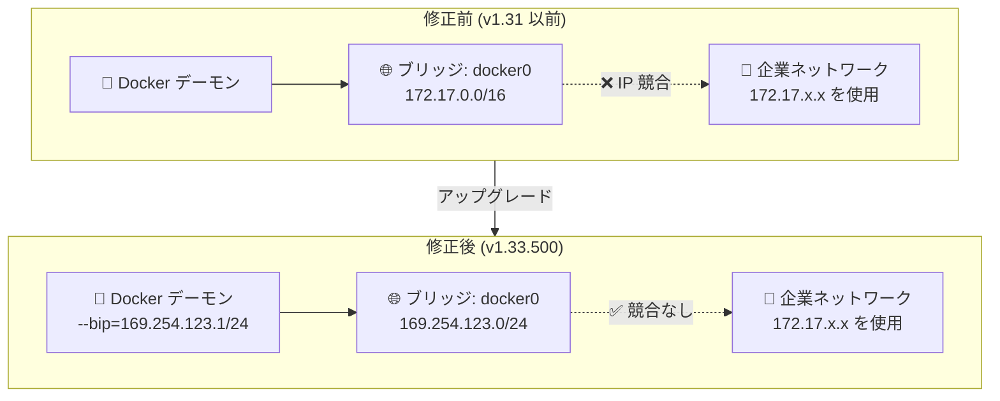

# Google Distributed Cloud for VMware: v1.33.500-gke.63 リリース

**リリース日**: 2026-03-03

**サービス**: Google Distributed Cloud (software only) for VMware

**機能**: v1.33.500-gke.63 リリース / Docker ブリッジ IP 修正

**ステータス**: Announcement

📊 [このアップデートのインフォグラフィックを見る](https://takech9203.github.io/google-cloud-news-summary/20260303-gdc-vmware-1-33-500.html)

## 概要

Google Distributed Cloud (software only) for VMware v1.33.500-gke.63 がダウンロード可能になった。本バージョンは Kubernetes v1.33.5-gke.2200 をベースとしており、オンプレミス VMware vSphere 環境で動作する GKE クラスタの最新パッチリリースである。リリース後、GKE On-Prem API クライアント (Google Cloud コンソール、gcloud CLI、Terraform) での利用が可能になるまで約 7〜14 日を要する。

同日のリリースノートには、V2 (Advanced Clusters) のバージョン 1.31 以前で発生していた Docker デフォルトブリッジ IP レンジの問題に対する修正も含まれている。Docker がデフォルトで使用する 172.17.0.0/16 の IP レンジが顧客のネットワークと重複する可能性があったが、Docker デフォルトブリッジ IP を 169.254.123.1/24 に明示的に設定することで解決された。

本アップデートは、Google Distributed Cloud を VMware 環境で運用するインフラ管理者、クラスタ管理者、および Kubernetes ワークロードを展開するプラットフォームエンジニアを主な対象としている。

**アップデート前の課題**

- V2 (Advanced Clusters) のバージョン 1.31 以前では、Docker がデフォルトで 172.17.0.0/16 の IP レンジをブリッジネットワークに使用していた
- この広い /16 のレンジが企業内ネットワークで使用されている IP アドレスと重複し、IP アドレスの競合が発生する可能性があった
- 過去のバージョン (1.28.0〜1.28.500、1.29.0) では COS OS イメージのリグレッションにより、Docker サービスが再起動されず、カスタマイズされた Docker 設定が反映されない問題も報告されていた
- 以前の回避策 (`sudo systemctl restart docker`) は VM 再作成のたびに再適用が必要で、永続的な解決策ではなかった

**アップデート後の改善**

- Docker デフォルトブリッジ IP が 169.254.123.1/24 に明示的に設定され、172.17.0.0/16 との競合が解消された
- 169.254.0.0/16 はリンクローカルアドレスであるため、企業ネットワークとの IP 競合リスクが極めて低い
- 手動での Docker サービス再起動などの回避策が不要になった
- Kubernetes v1.33.5-gke.2200 ベースにより、最新のセキュリティパッチとバグ修正が適用された

## アーキテクチャ図



Docker ブリッジ IP の修正前後を比較した図。修正前はデフォルトの 172.17.0.0/16 が企業ネットワークと競合する可能性があったが、修正後はリンクローカルアドレス (169.254.123.0/24) を使用することで競合リスクを排除している。

## サービスアップデートの詳細

### 主要機能

1. **v1.33.500-gke.63 パッチリリース**
   - Kubernetes v1.33.5-gke.2200 をベースとした最新パッチ
   - セキュリティ脆弱性の修正を含む
   - リリース後、GKE On-Prem API クライアントでの利用開始まで約 7〜14 日

2. **Docker デフォルトブリッジ IP の修正 (V2 / Advanced Clusters)**
   - 対象: V2 (Advanced Clusters) のバージョン 1.31 以前
   - 修正内容: Docker のデフォルトブリッジ IP を `--bip=169.254.123.1/24` に明示的に設定
   - 効果: 172.17.0.0/16 レンジとの IP アドレス競合を解消

3. **Advanced Clusters への自動変換 (v1.33 系の特徴)**
   - バージョン 1.32 から 1.33 へのアップグレード時、クラスタは自動的に Advanced Clusters に変換される
   - cert-manager が Advanced Clusters に自動インストールされる (v1.33 はバンドル版 cert-manager 1.18)
   - 非 Advanced クラスタのアップグレードには gkectl コマンドラインツールが必要

## 技術仕様

### バージョン情報

| 項目 | 詳細 |
|------|------|
| Google Distributed Cloud バージョン | 1.33.500-gke.63 |
| Kubernetes バージョン | v1.33.5-gke.2200 |
| GKE On-Prem API 利用可能時期 | リリース後 7〜14 日 |
| Advanced Clusters cert-manager | v1.18 (バンドル版) |

### Docker ブリッジ IP 修正の詳細

| 項目 | 修正前 | 修正後 |
|------|--------|--------|
| Docker ブリッジ IP | 172.17.0.0/16 (デフォルト) | 169.254.123.1/24 (明示設定) |
| サブネットサイズ | /16 (65,536 アドレス) | /24 (256 アドレス) |
| アドレスレンジ種別 | プライベートアドレス | リンクローカルアドレス |
| 企業ネットワーク競合リスク | 高い | 極めて低い |
| 影響バージョン | V2 (Advanced Clusters) 1.31 以前 | 解決済み |

### Docker 設定パラメータ

```json
{
  "bip": "169.254.123.1/24"
}
```

Docker デーモンの起動パラメータとして `--bip=169.254.123.1/24` が設定される。この設定により、`docker0` ブリッジインターフェースに割り当てられる IP アドレスがリンクローカル範囲に固定される。

## 設定方法

### 前提条件

1. サードパーティストレージベンダーを使用している場合、[GDC Ready ストレージパートナー](https://cloud.google.com/kubernetes-engine/enterprise/docs/resources/partner-storage)ドキュメントで互換性を確認
2. アップグレード前にアドミンクラスタおよびユーザークラスタのバックアップを作成
3. 非 Advanced クラスタから v1.33 へのアップグレードには gkectl ツールが必要 (GKE On-Prem API クライアントは非対応)

### 手順

#### ステップ 1: バイナリのダウンロード

公式ダウンロードページから v1.33.500-gke.63 のバイナリを取得する。

```bash
# ダウンロードページから最新バイナリを取得
# https://cloud.google.com/kubernetes-engine/distributed-cloud/vmware/docs/downloads
```

#### ステップ 2: gkectl によるアップグレード

```bash
# アドミンクラスタのアップグレード
gkectl upgrade admin \
  --config ADMIN_CLUSTER_CONFIG_FILE \
  --kubeconfig ADMIN_CLUSTER_KUBECONFIG

# ユーザークラスタのアップグレード
gkectl upgrade cluster \
  --config USER_CLUSTER_CONFIG_FILE \
  --kubeconfig ADMIN_CLUSTER_KUBECONFIG
```

#### ステップ 3: gcloud CLI によるアップグレード (GKE On-Prem API 経由)

```bash
# 利用可能なバージョンの確認
gcloud container vmware clusters query-version-config \
  --cluster=USER_CLUSTER_NAME \
  --project=PROJECT_ID \
  --location=REGION

# ユーザークラスタのアップグレード
gcloud container vmware clusters upgrade USER_CLUSTER_NAME \
  --project=PROJECT_ID \
  --location=REGION \
  --version=1.33.500-gke.63
```

GKE On-Prem API 経由のアップグレードは、リリース後 7〜14 日経過してから利用可能になる点に注意。

#### ステップ 4: Docker ブリッジ IP の確認

アップグレード後、Docker ブリッジ IP が正しく設定されていることを確認する。

```bash
# Docker ブリッジ IP の確認
ip a | grep docker0
# 期待される出力: 169.254.123.1/24
```

## メリット

### ビジネス面

- **ネットワーク安定性の向上**: Docker ブリッジ IP 競合による予期しないネットワーク障害のリスクが排除され、オンプレミス環境でのワークロードの安定稼働が確保される
- **運用コストの削減**: 手動での Docker サービス再起動や VM 再作成時の回避策適用が不要になり、運用チームの負担が軽減される

### 技術面

- **Kubernetes 最新パッチの適用**: v1.33.5-gke.2200 ベースにより、最新のセキュリティ修正とバグフィックスが反映される
- **リンクローカルアドレスの活用**: 169.254.0.0/16 のリンクローカルレンジは通常のネットワーキングでは使用されないため、どのような企業ネットワーク構成でも競合しない設計となっている
- **Advanced Clusters の成熟**: v1.33 系列は Advanced Clusters が GA となっており、自動ノードリサイズ、VM-Host アフィニティグループ、vsphere-metrics-exporter などの高度な機能が利用可能

## デメリット・制約事項

### 制限事項

- GKE On-Prem API クライアント (Google Cloud コンソール、gcloud CLI、Terraform) でのバージョン利用開始まで、リリース後 7〜14 日の遅延がある
- 非 Advanced クラスタから v1.33 へのアップグレードは gkectl コマンドラインツールのみで対応 (GKE On-Prem API クライアントは非サポート)
- v1.32 から v1.33 へのアップグレード時、コントロールプレーンとすべてのノードプールを同時にアップグレードする必要がある (バージョンスキューは許可されない)

### 考慮すべき点

- Advanced Clusters へのアップグレード時、既存の cert-manager が自動的に上書きされるため、カスタム設定がある場合は事前に確認が必要
- サードパーティストレージベンダーとの互換性を事前に GDC Ready ストレージパートナードキュメントで確認する必要がある
- Docker ブリッジ IP の修正は V2 (Advanced Clusters) のバージョン 1.31 以前が対象であり、既に 1.32 以降を使用している環境では影響がない可能性がある

## ユースケース

### ユースケース 1: 172.17.0.0/16 レンジを使用する企業ネットワーク環境

**シナリオ**: 企業の内部ネットワークが 172.17.0.0/16 の IP レンジを使用しており、Google Distributed Cloud のクラスタノード上で Docker ブリッジとの IP 競合が発生している環境。

**効果**: v1.33.500-gke.63 へのアップグレードにより、Docker ブリッジ IP が自動的に 169.254.123.1/24 に設定され、ネットワーク競合が根本的に解消される。手動での回避策の適用や VM 再作成時の再設定が不要になる。

### ユースケース 2: Advanced Clusters への移行と最新 Kubernetes の活用

**シナリオ**: v1.32 の非 Advanced クラスタを運用しており、最新の Kubernetes 機能と Advanced Clusters の高度な運用機能 (自動ノードリサイズ、VM-Host アフィニティなど) を活用したい環境。

**効果**: v1.33 へのアップグレードにより自動的に Advanced Clusters に変換され、最新の Kubernetes v1.33.5 の機能と、Google Distributed Cloud 固有の高度な運用機能を利用できるようになる。

## 関連サービス・機能

- **Google Kubernetes Engine (GKE)**: Google Distributed Cloud は GKE をベースとしたオンプレミス向け Kubernetes ソリューションであり、GKE と同じ管理機能・API を使用する
- **GKE On-Prem API**: Google Cloud コンソール、gcloud CLI、Terraform を通じたクラスタライフサイクル管理を提供。リリース後 7〜14 日で新バージョンが利用可能になる
- **VMware vSphere**: Google Distributed Cloud (software only) for VMware が動作するハイパーバイザー環境。vSphere Container Storage Plug-in との連携でストレージを管理
- **Fleet Management**: 複数の GKE クラスタ (クラウド、オンプレミス、マルチクラウド) を一元管理するためのフリート管理機能
- **Cloud Monitoring / Cloud Logging**: クラスタのメトリクスとログの収集・分析基盤。vsphere-metrics-exporter により vSphere 環境の可視性も向上

## 参考リンク

- 📊 [インフォグラフィック](https://takech9203.github.io/google-cloud-news-summary/20260303-gdc-vmware-1-33-500.html)
- [公式リリースノート](https://docs.cloud.google.com/release-notes#March_03_2026)
- [Google Distributed Cloud for VMware リリースノート](https://cloud.google.com/kubernetes-engine/distributed-cloud/vmware/docs/release-notes)
- [ダウンロードページ](https://cloud.google.com/kubernetes-engine/distributed-cloud/vmware/docs/downloads)
- [アップグレード手順](https://cloud.google.com/kubernetes-engine/distributed-cloud/vmware/docs/how-to/upgrading)
- [Advanced Clusters 概要](https://cloud.google.com/kubernetes-engine/distributed-cloud/vmware/docs/concepts/advanced-clusters)
- [既知の問題 - Docker ブリッジ IP](https://cloud.google.com/kubernetes-engine/distributed-cloud/vmware/docs/troubleshooting/known-issues)
- [GDC Ready ストレージパートナー](https://cloud.google.com/kubernetes-engine/enterprise/docs/resources/partner-storage)

## まとめ

Google Distributed Cloud for VMware v1.33.500-gke.63 は、Kubernetes v1.33.5-gke.2200 をベースとしたセキュリティパッチリリースであり、V2 (Advanced Clusters) における Docker ブリッジ IP の競合問題の修正が特に重要である。172.17.0.0/16 から 169.254.123.1/24 への変更により、企業ネットワークとの IP 競合リスクが根本的に解消されるため、該当バージョンを使用している環境では早期のアップグレードを推奨する。

---

**タグ**: Google Distributed Cloud, VMware, GKE On-Prem, Kubernetes, Docker, ネットワーク, Advanced Clusters, パッチリリース, IP アドレス競合
