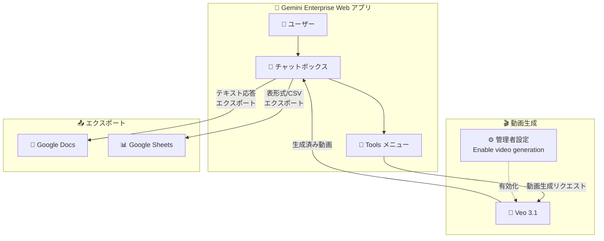

# Gemini Enterprise: Veo 3.1 動画生成 / Docs・Sheets エクスポート

**リリース日**: 2026-03-03

**サービス**: Gemini Enterprise

**機能**: Veo 3.1 動画生成、Google Docs/Sheets エクスポート

**ステータス**: Feature

📊 [このアップデートのインフォグラフィックを見る](https://takech9203.github.io/google-cloud-news-summary/20260303-gemini-enterprise-veo-3-1-export.html)

## 概要

Gemini Enterprise Web アプリに 2 つの重要なアップデートが導入された。1 つ目は、動画生成モデルが Veo 3.0 から **Veo 3.1** にアップグレードされたことである。Veo 3.1 は Google DeepMind の最新動画生成モデルであり、高忠実度の 8 秒間の動画を 720p、1080p、4K 解像度で生成でき、ネイティブ音声生成にも対応している。管理者が「Enable video generation」設定を有効にすることで、ユーザーは Web アプリ内で直接この機能を利用できる。

2 つ目は、アシスタントの応答を **Google Docs** および **Google Sheets** にエクスポートできる新機能である。チャットの応答内容を Google Docs にエクスポートでき、表形式データや CSV データは Google Sheets にエクスポートできる。これにより、Gemini Enterprise で生成したコンテンツを Google Workspace のエコシステム内でシームレスに活用・共有・編集できるようになった。

これらの機能は、Gemini Enterprise の全エディション (Business、Standard、Plus、Frontline) のユーザーを対象としている。

**アップデート前の課題**

- 動画生成には Veo 3.0 が使用されており、4K 解像度やポートレートモード、動画拡張機能には対応していなかった
- アシスタントの応答を外部アプリケーションで活用するには、テキストを手動でコピー&ペーストする必要があった
- 表形式データの分析結果を Google Sheets で編集・共有するには、CSV としてダウンロードし手動でインポートする必要があった

**アップデート後の改善**

- Veo 3.1 により、4K 解像度、ポートレート (9:16) / ランドスケープ (16:9) の選択、動画拡張、フレーム指定生成、画像ベースのディレクション機能が利用可能になった
- チャット応答をワンクリックで Google Docs にエクスポートし、即座に編集・共有が可能になった
- 表形式データ・CSV データを Google Sheets に直接エクスポートし、スプレッドシート上でさらなる分析や加工が可能になった

## アーキテクチャ図

Gemini Enterprise Web アプリにおけるユーザーワークフローを示す。動画生成は管理者が有効化した上で Veo 3.1 を通じて処理され、チャット応答はコンテンツの種類に応じて Google Docs または Google Sheets にエクスポートされる。

## サービスアップデートの詳細

### 主要機能

1. **Veo 3.1 動画生成**
   - Veo 3.0 から Veo 3.1 への自動置換により、動画生成の品質と機能が大幅に向上
   - 720p、1080p、4K (Veo 3.1 Preview のみ) の解像度に対応
   - ネイティブ音声付き動画の生成が可能
   - ポートレートモード (9:16) とランドスケープモード (16:9) の選択に対応
   - 生成済み動画の拡張機能 (最大 7 秒ずつ、最大 20 回まで延長可能で最大約 148 秒の動画を生成)
   - フレーム指定生成 (最初と最後のフレームを指定して動画生成)
   - 画像ベースのディレクション (最大 3 枚の参照画像でコンテンツをガイド)

2. **Google Docs エクスポート**
   - アシスタントのチャット応答を Google Docs ドキュメントとしてエクスポート
   - エクスポートされたドキュメントは Google Workspace 内で共有・共同編集が可能
   - レポート作成やドキュメント整理のワークフローを効率化

3. **Google Sheets エクスポート**
   - 表形式データや CSV データを Google Sheets にエクスポート
   - スプレッドシート上でのデータ分析、ピボットテーブル作成、グラフ化が可能
   - データ分析結果をチームで共有・活用する際の利便性が向上

## 技術仕様

### Veo 3.1 モデル仕様

| 項目 | 詳細 |
|------|------|
| モデルコード | `veo-3.1-generate-preview` / `veo-3.1-fast-generate-preview` |
| 入力 | テキスト、画像 |
| 出力 | 音声付き動画 |
| テキスト入力上限 | 1,024 トークン |
| 出力動画数 | 1 |
| 解像度 | 720p、1080p、4K |
| アスペクト比 | 16:9 (ランドスケープ)、9:16 (ポートレート) |
| 動画長さ | 最大 8 秒 (拡張により最大約 148 秒) |

### Veo 3.0 から Veo 3.1 への変更点

| 項目 | Veo 3.0 | Veo 3.1 |
|------|---------|---------|
| 4K 解像度 | 非対応 | 対応 |
| ポートレートモード | 非対応 | 対応 (9:16) |
| 動画拡張 | 非対応 | 対応 (最大 20 回) |
| フレーム指定生成 | 非対応 | 対応 |
| 画像ベースディレクション | 非対応 | 対応 (最大 3 枚) |

### 管理者設定

管理者は Google Cloud コンソールの Configurations > Feature Management タブで、以下の設定を管理する。

| 設定項目 | 説明 |
|----------|------|
| Enable video generation | 有効にすると、Web アプリでの動画生成が利用可能になる |
| Enable image generation | 有効にすると、Web アプリでの画像生成が利用可能になる |

## 設定方法

### 前提条件

1. Gemini Enterprise のサブスクリプションとライセンスが有効であること
2. 管理者が Discovery Engine Admin ロールを持っていること
3. ユーザーが Discovery Engine User ロールを持っていること

### 手順

#### ステップ 1: 動画生成の有効化 (管理者)

1. Google Cloud コンソールで Gemini Enterprise ページを開く
2. **Configurations** をクリック
3. **Feature Management** タブを選択
4. **Enable video generation** トグルを有効にする

#### ステップ 2: 動画生成の使用 (ユーザー)

1. Gemini Enterprise Web アプリのチャットボックスで **Tools** をクリック
2. **Generate a video** を選択
3. 生成したい動画の説明をテキストで入力
4. プロンプトを送信して動画生成を待つ

#### ステップ 3: 応答のエクスポート (ユーザー)

1. アシスタントのチャット応答を確認
2. テキスト応答の場合: Google Docs へのエクスポートオプションを選択
3. 表形式/CSV データの場合: Google Sheets へのエクスポートオプションを選択

## メリット

### ビジネス面

- **コンテンツ制作の効率化**: Veo 3.1 の高品質動画生成により、マーケティング資料やプレゼンテーション用の動画を社内で迅速に作成可能
- **ワークフローの統合**: Gemini Enterprise の分析結果を Google Workspace に直接エクスポートすることで、チーム間のコラボレーションが促進される
- **データ活用の加速**: 表形式データを Google Sheets にエクスポートすることで、追加のデータ分析やダッシュボード作成に即座に活用可能

### 技術面

- **モデルの進化**: Veo 3.1 は 4K 対応、音声ネイティブ生成、動画拡張などの先進的な機能を提供し、エンタープライズレベルの動画生成要件に対応
- **Google Workspace 連携**: エクスポート機能により、AI 生成コンテンツと既存の Google Workspace ツール群とのシームレスな統合が実現

## デメリット・制約事項

### 制限事項

- 動画生成の利用には管理者による「Enable video generation」設定の有効化が必要
- Veo 3.1 の動画拡張は Veo で生成された動画のみが対象 (外部動画の拡張は不可)
- 生成された動画のストレージは 2 日間 (拡張のために参照されるとタイマーがリセットされる)
- Gemini Enterprise Frontline エディションでは、Made by Google エージェント (Deep Research 等) が利用できない場合がある

### 考慮すべき点

- Veo 3.0 から Veo 3.1 への移行は自動で行われるため、既存のプロンプトの出力結果が変わる可能性がある
- 動画生成は現時点では Global リージョンおよび US リージョンで利用可能 (リージョン制限あり)
- エクスポート先の Google Docs / Google Sheets には、対応する Google Workspace アカウントが必要

## ユースケース

### ユースケース 1: マーケティングチームの動画コンテンツ制作

**シナリオ**: マーケティング担当者が新製品のプロモーション用ショート動画を迅速に作成したい。

**実装例**:
1. Gemini Enterprise の Tools メニューから「Generate a video」を選択
2. 「新製品のモダンなデザインを紹介する 8 秒のプロモーション映像。明るい照明、クリーンな背景。」とプロンプトを入力
3. 生成された動画を確認し、必要に応じてフォローアッププロンプトで調整
4. Library から動画をダウンロード

**効果**: 外部の動画制作ツールを使用せず、社内で迅速にプロモーション素材のプロトタイプを作成できる

### ユースケース 2: データ分析結果のチーム共有

**シナリオ**: データアナリストが Gemini Enterprise で分析した売上データをチームメンバーと共有し、共同で追加分析を行いたい。

**実装例**:
1. Gemini Enterprise にデータファイルをアップロードし、「四半期ごとの売上推移を表にまとめて」と指示
2. アシスタントが生成した表形式データを Google Sheets にエクスポート
3. Google Sheets 上でピボットテーブルやグラフを追加
4. チームメンバーと共有して共同編集

**効果**: AI 分析結果をスプレッドシートに直接取り込むことで、手動コピーの手間を省き、データの正確性を維持しながらチーム間でのコラボレーションが可能になる

## 料金

Gemini Enterprise は、エディション (Business、Standard、Plus、Frontline) ごとにサブスクリプション・ライセンスベースの料金体系となっている。動画生成およびエクスポート機能は全エディションで利用可能な機能であり、追加の個別課金は発生しない (サブスクリプション料金に含まれる)。

詳細な料金については以下を参照:
- [Gemini Enterprise エディション比較](https://cloud.google.com/gemini/enterprise/docs/editions)
- [Gemini Enterprise ライセンス](https://cloud.google.com/gemini/enterprise/docs/licenses)

## 関連サービス・機能

- **Veo (Vertex AI)**: Gemini Enterprise の動画生成基盤となる Google DeepMind の動画生成モデル。Vertex AI 経由の API アクセスも可能
- **Google Workspace (Google Docs / Google Sheets)**: エクスポート先のプロダクティビティツール群。共同編集、共有、バージョン管理が可能
- **Gemini Enterprise 画像生成**: Nano Banana (Gemini 2.5 Flash Image) / Nano Banana Pro (Gemini 3 Pro Image) による画像生成機能。動画生成と組み合わせたメディアコンテンツ制作に活用可能
- **NotebookLM Enterprise**: Gemini Enterprise 内で利用可能なノートブックツール。Google Docs や Google Sheets のソースを追加して分析に活用できる
- **Deep Research**: Gemini Enterprise の Made by Google エージェント。深い調査が必要な場合にエクスポート機能と組み合わせて活用可能

## 参考リンク

- 📊 [インフォグラフィック](https://takech9203.github.io/google-cloud-news-summary/20260303-gemini-enterprise-veo-3-1-export.html)
- [公式リリースノート](https://docs.cloud.google.com/release-notes#March_03_2026)
- [Gemini Enterprise リリースノート](https://docs.cloud.google.com/gemini/enterprise/docs/release-notes)
- [アシスタントのツールと分析](https://cloud.google.com/gemini/enterprise/docs/assistant-analyze)
- [Web アプリ機能管理](https://cloud.google.com/gemini/enterprise/docs/manage-web-app-features)
- [Veo 3.1 ドキュメント (Gemini API)](https://ai.google.dev/gemini-api/docs/video)
- [Veo 3.1 モデル情報](https://ai.google.dev/gemini-api/docs/models/veo-3.1-generate-preview)
- [Gemini Enterprise エディション比較](https://cloud.google.com/gemini/enterprise/docs/editions)
- [Gemini Enterprise ライセンス管理](https://cloud.google.com/gemini/enterprise/docs/licenses)

## まとめ

今回のアップデートにより、Gemini Enterprise は動画生成能力とワークフロー統合の両面で大きく強化された。Veo 3.1 への移行は 4K 解像度対応、ポートレートモード、動画拡張など多くの新機能をもたらし、エンタープライズにおけるクリエイティブコンテンツ制作の幅を広げる。また、Google Docs / Google Sheets へのエクスポート機能は、AI アシスタントの出力を Google Workspace のエコシステムにシームレスに統合し、チームコラボレーションを促進する。管理者は Feature Management の設定を確認し、動画生成が有効であることを確認した上で、ユーザーへの周知を行うことを推奨する。

---

**タグ**: #GeminiEnterprise #Veo3.1 #動画生成 #GoogleDocs #GoogleSheets #エクスポート #GoogleWorkspace #AI #エンタープライズ
