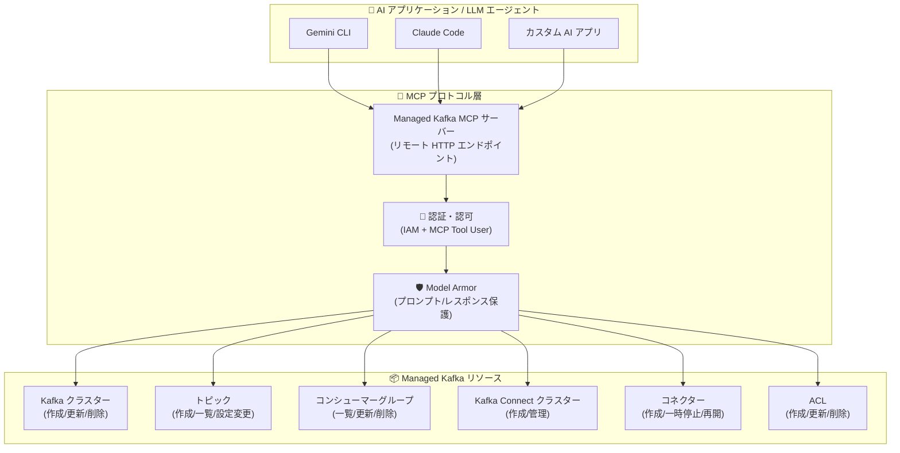

# Google Cloud Managed Service for Apache Kafka: リモート MCP サーバー

**リリース日**: 2026-03-03

**サービス**: Google Cloud Managed Service for Apache Kafka

**機能**: リモート MCP サーバー (LLM エージェント連携)

**ステータス**: Preview

📊 [このアップデートのインフォグラフィックを見る](https://takech9203.github.io/google-cloud-news-summary/20260303-managed-kafka-mcp-server-preview.html)

## 概要

Google Cloud Managed Service for Apache Kafka にリモート MCP (Model Context Protocol) サーバーが Preview として追加された。この機能により、LLM エージェントが MCP プロトコルを通じて Kafka クラスターおよび Kafka Connect クラスターの作成・管理を行えるようになる。管理対象には、トピック、コンシューマーグループ、コネクター、ACL などの関連リソースも含まれる。

MCP は Anthropic が開発したオープンソースプロトコルであり、LLM や AI アプリケーションが外部データソースやサービスに接続する方法を標準化する。Google Cloud のリモート MCP サーバーは Google のインフラストラクチャ上で動作し、HTTP エンドポイントを通じて AI アプリケーションと通信する。これにより、Gemini CLI、Gemini Code Assist のエージェントモード、Claude Code などの AI アプリケーションから、自然言語を使って Kafka インフラストラクチャを直接管理できるようになる。

この機能は、Kafka の運用を担当するプラットフォームエンジニア、DevOps エンジニア、データエンジニアに特に有用である。AI エージェントを活用することで、複雑な CLI コマンドや API 呼び出しを覚える必要なく、対話的に Kafka リソースを管理できる。

**アップデート前の課題**

- Kafka クラスターやリソースの管理には、Google Cloud Console、gcloud CLI、REST/gRPC API、Terraform、またはクライアントライブラリを使用する必要があった
- 各管理操作に対応するコマンドや API エンドポイントを把握しておく必要があり、学習コストが高かった
- 複数のリソース (クラスター、トピック、コネクター、ACL) を横断的に管理する場合、それぞれ異なるコマンドやワークフローを使い分ける必要があった
- AI エージェントから Kafka インフラストラクチャを直接操作する標準的な方法が存在しなかった

**アップデート後の改善**

- LLM エージェントが MCP プロトコルを通じて、Kafka クラスターの作成・更新・削除を自然言語で実行可能になった
- トピック、コンシューマーグループ、コネクター、ACL などの関連リソースも MCP 経由で統合的に管理可能になった
- Gemini CLI、Claude Code などの AI アシスタントから直接 Kafka インフラストラクチャを操作できるようになった
- IAM による細粒度の認可ポリシーと Model Armor によるセキュリティ保護が適用され、安全な AI エージェント連携が実現された

## アーキテクチャ図



LLM エージェントが MCP プロトコルを通じて Managed Kafka のリモート MCP サーバーに接続し、認証・認可を経て Kafka リソースを操作するアーキテクチャを示す。Model Armor による保護がプロンプトとレスポンスの両方に適用される。

## サービスアップデートの詳細

### 主要機能

1. **Kafka クラスター管理**
   - LLM エージェントから Kafka クラスターの作成、構成変更、スケーリング、削除が可能
   - クラスターの vCPU 数、RAM サイズ、ネットワーク構成などの設定を自然言語で指示できる
   - クラスターの状態確認やリスト表示にも対応

2. **Kafka Connect クラスター管理**
   - Connect クラスターの作成・更新・削除が MCP 経由で可能
   - コネクターのライフサイクル管理 (作成、一時停止、再開、再起動、停止) に対応
   - BigQuery Sink、Cloud Storage Sink、Pub/Sub Source/Sink、MirrorMaker 2.0 などのビルトインコネクタープラグインの設定をサポート

3. **トピック・コンシューマーグループ管理**
   - トピックの作成、設定変更 (パーティション数、レプリケーションファクターなど)、削除
   - コンシューマーグループの一覧表示、設定変更、削除
   - リソースの状態を自然言語で問い合わせ可能

4. **ACL (アクセス制御リスト) 管理**
   - Kafka ACL の作成、更新、削除を MCP ツール経由で実行
   - プリンシパルごとのきめ細かなアクセス制御の設定が可能
   - ACL エントリの追加・削除による増分的なアクセス制御変更に対応

5. **エンタープライズセキュリティ**
   - Google Cloud IAM との統合による認証・認可
   - `roles/mcp.toolUser` ロールによる MCP ツール呼び出し権限の制御
   - Model Armor によるプロンプトインジェクション対策とレスポンスのセキュリティスキャン
   - 組織ポリシーによる MCP 利用の組織レベルでの制御

## 技術仕様

### MCP サーバー構成

| 項目 | 詳細 |
|------|------|
| プロトコル | Model Context Protocol (MCP) |
| サーバータイプ | リモート MCP サーバー (Google インフラストラクチャ上で動作) |
| 通信方式 | HTTP エンドポイント (Streamable HTTP) |
| 認証 | Google Cloud 認証情報 / MCP 認可仕様準拠 |
| ステータス | Preview |
| 対応 AI アプリケーション | Gemini CLI、Gemini Code Assist、Claude Code、カスタムアプリケーション |

### 管理可能なリソース

| リソースタイプ | 操作 |
|---------------|------|
| Kafka クラスター | 作成、取得、一覧、更新、削除 |
| Kafka Connect クラスター | 作成、取得、一覧、更新、削除 |
| トピック | 作成、取得、一覧、更新、削除 |
| コンシューマーグループ | 取得、一覧、更新、削除 |
| コネクター | 作成、取得、一覧、更新、削除、一時停止、再開、再起動、停止 |
| ACL | 作成、取得、一覧、更新、削除、エントリ追加、エントリ削除 |

### 必要な IAM ロール

| ロール | 用途 |
|--------|------|
| `roles/serviceusage.serviceUsageAdmin` | MCP サーバーの有効化 |
| `roles/mcp.toolUser` | MCP ツールの呼び出し |
| `roles/managedkafka.*` | 各 Kafka リソースの操作権限 |

## 設定方法

### 前提条件

1. Google Cloud プロジェクトで Managed Service for Apache Kafka API が有効化されていること
2. MCP サーバーの有効化に必要な `roles/serviceusage.serviceUsageAdmin` ロールが付与されていること
3. MCP ツール呼び出しに必要な `roles/mcp.toolUser` ロールが付与されていること
4. 操作対象の Kafka リソースに対する適切な IAM 権限が付与されていること

### 手順

#### ステップ 1: MCP サーバーの有効化

```bash
# gcloud CLI beta コンポーネントのインストール
gcloud components install beta

# Managed Kafka MCP サーバーの有効化
gcloud beta services enable managedkafka.googleapis.com --project=PROJECT_ID
```

MCP サーバーを有効化することで、AI アプリケーションから MCP エンドポイントへの接続が可能になる。

#### ステップ 2: AI アプリケーションの MCP クライアント設定

```json
{
  "mcpServers": {
    "managed-kafka": {
      "url": "https://managedkafka.googleapis.com/mcp"
    }
  }
}
```

AI アプリケーションの MCP クライアント設定に Managed Kafka MCP サーバーのエンドポイントを追加する。認証には Google Cloud 認証情報が使用される。

#### ステップ 3: MCP ツールの確認

```bash
# MCP サーバーで利用可能なツール一覧を取得
curl --location 'https://managedkafka.googleapis.com/mcp' \
  --header 'content-type: application/json' \
  --header 'accept: application/json, text/event-stream' \
  --data '{
    "method": "tools/list",
    "jsonrpc": "2.0",
    "id": 1
  }'
```

利用可能な MCP ツールの一覧を確認し、AI エージェントから Kafka リソースの操作が可能であることを検証する。

## メリット

### ビジネス面

- **運用効率の向上**: AI エージェントを活用した自然言語での Kafka 管理により、専門的な CLI/API 知識がなくてもインフラ運用が可能になり、チームの生産性が向上する
- **オンボーディングの加速**: 新しいチームメンバーが Kafka の管理コマンドを習得する必要がなくなり、AI アシスタントに自然言語で指示するだけで操作できる
- **運用ミスの削減**: AI エージェントがコマンドを構築するため、パラメータの入力ミスやコマンド構文の誤りによる運用事故のリスクが低減する

### 技術面

- **統合管理インターフェース**: クラスター、トピック、コネクター、ACL など異なるリソースタイプを単一の MCP インターフェースから統合的に管理できる
- **標準プロトコル準拠**: MCP プロトコルに準拠しているため、様々な AI アプリケーションやエージェントフレームワークから利用可能
- **IAM 統合セキュリティ**: Google Cloud IAM と完全に統合され、既存の権限モデルを維持しながら AI エージェント連携を実現

## デメリット・制約事項

### 制限事項

- Preview 段階のため、本番ワークロードでの使用は推奨されない (Pre-GA サービス規約が適用)
- Preview 機能は限定的なサポートで提供され、機能が変更される可能性がある
- MCP サーバーの利用には `mcp.tools.call` 権限が必要であり、組織ポリシーにより制限される場合がある

### 考慮すべき点

- AI エージェントによるリソース操作は IAM で制御されるが、意図しない操作 (クラスター削除など) を防ぐためにロールの最小権限の原則を厳守する必要がある
- Model Armor の設定により、AI エージェントのプロンプトとレスポンスのセキュリティポリシーを適切に構成することを推奨
- 既存の CI/CD パイプラインや Infrastructure as Code (Terraform) との併用時は、MCP 経由の変更とコード管理の整合性に注意が必要

## ユースケース

### ユースケース 1: 対話型 Kafka クラスター構築

**シナリオ**: プラットフォームエンジニアが新しいマイクロサービス向けに Kafka クラスターとトピックを構築する必要がある。Gemini CLI を使い、自然言語で指示する。

**実装例**:
```
# Gemini CLI での対話例
> us-central1 に 6 vCPU、12 GiB RAM の Kafka クラスターを作成して。
  サブネットは default を使って。

> 作成したクラスターに "order-events" トピックを作成して。
  パーティション数は 12、レプリケーションファクターは 3 で。

> BigQuery にデータを流すための Connect クラスターとコネクターも設定して。
```

**効果**: gcloud CLI コマンドの構文を調べる時間が不要になり、クラスター構築の所要時間が大幅に短縮される。

### ユースケース 2: AI エージェントによるトラブルシューティング

**シナリオ**: データエンジニアがコンシューマーグループのラグを調査し、関連リソースの設定を確認・変更する。

**効果**: 複数の管理コマンドを順次実行する代わりに、AI エージェントに状況を説明するだけで、関連リソースの状態確認と設定変更が一連の対話で完了する。

## 料金

MCP サーバー自体の利用料金については、公式ドキュメントで明確に記載されていない。Managed Service for Apache Kafka の基盤となるリソース (Kafka クラスター、Connect クラスター、ストレージ、データ転送) の料金は従来通り適用される。

### Managed Service for Apache Kafka の料金体系

| リソースタイプ | 課金基準 |
|---------------|---------|
| コンピュート (vCPU + RAM) | Data Compute Units (DCU) による時間課金 |
| 永続ストレージ | GB あたりの月額課金 |
| データ転送 | GB あたりの課金 |
| Private Service Connect | エンドポイントごとの課金 |

CUD (確約利用割引) を利用した場合、1 年契約で 20% 割引、3 年契約で 40% 割引が適用される。詳細は [Managed Service for Apache Kafka pricing](https://cloud.google.com/managed-service-for-apache-kafka/pricing) を参照。

## 関連サービス・機能

- **Google Cloud MCP サーバー**: Managed Kafka 以外にも、BigQuery、GKE、Cloud SQL、Spanner、Compute Engine など多数の Google Cloud サービスがリモート MCP サーバーを提供している
- **Model Armor**: MCP ツール呼び出しとレスポンスのセキュリティスキャンにより、プロンプトインジェクションや機密データ漏洩のリスクを軽減する
- **Kafka Connect**: MCP サーバーから管理可能な Connect クラスターにより、BigQuery、Cloud Storage、Pub/Sub などとのデータ統合を実現する
- **Cloud Monitoring / Cloud Logging**: Kafka クラスターのメトリクスとブローカーログの監視・ログ管理に使用。MCP サーバー経由の操作も監査ログに記録される
- **Cloud API Registry**: MCP サーバーとツールの検出・ガバナンスに使用され、組織内で利用可能な MCP サーバーの一元管理が可能

## 参考リンク

- 📊 [インフォグラフィック](https://takech9203.github.io/google-cloud-news-summary/20260303-managed-kafka-mcp-server-preview.html)
- [公式リリースノート](https://docs.cloud.google.com/release-notes#March_03_2026)
- [Managed Service for Apache Kafka 概要](https://docs.cloud.google.com/managed-service-for-apache-kafka/docs/overview)
- [Google Cloud MCP サーバー概要](https://docs.cloud.google.com/mcp/overview)
- [Google Cloud MCP サーバー対応製品](https://docs.cloud.google.com/mcp/supported-products)
- [MCP サーバーの管理](https://docs.cloud.google.com/mcp/manage-mcp-servers)
- [Kafka Connect 概要](https://docs.cloud.google.com/managed-service-for-apache-kafka/docs/kafka-connect-overview)
- [Managed Service for Apache Kafka 料金](https://cloud.google.com/managed-service-for-apache-kafka/pricing)
- [Managed Service for Apache Kafka REST API リファレンス](https://docs.cloud.google.com/managed-service-for-apache-kafka/docs/reference/rest)

## まとめ

Managed Service for Apache Kafka へのリモート MCP サーバーの追加は、AI エージェントによるクラウドインフラストラクチャ管理の新しいパラダイムを Kafka エコシステムに拡張するものである。Preview 段階ではあるが、自然言語による Kafka クラスター、トピック、コネクター、ACL の統合管理が可能になることで、運用の効率化とアクセシビリティの向上が見込まれる。本番利用を検討する場合は GA 昇格を待つことを推奨するが、開発・検証環境での評価を開始し、MCP 経由の運用ワークフローを検討する価値がある。

---

**タグ**: #ManagedKafka #MCP #ModelContextProtocol #LLMエージェント #ApacheKafka #KafkaConnect #Preview #AIインフラ管理 #GoogleCloud
