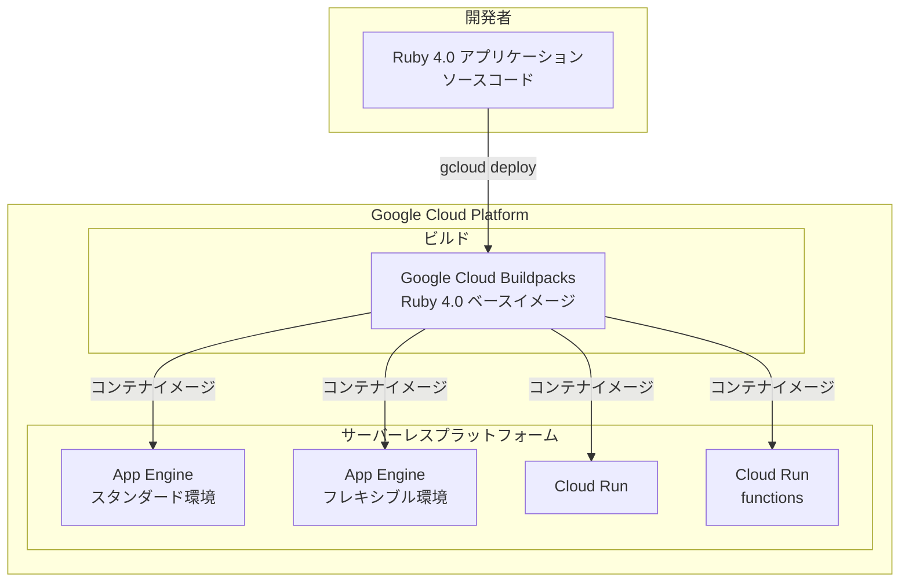

# App Engine / Cloud Run: Ruby 4.0 ランタイムサポート (Preview)

**リリース日**: 2026-03-03

**サービス**: App Engine / Cloud Run

**機能**: Ruby 4.0 ランタイムサポート

**ステータス**: Preview

📊 [このアップデートのインフォグラフィックを見る](https://takech9203.github.io/google-cloud-news-summary/20260303-ruby-4-runtime-preview.html)

## 概要

Google Cloud は、複数のサーバーレスプラットフォームにおいて Ruby 4.0 ランタイムの Preview サポートを開始しました。対象プラットフォームは App Engine フレキシブル環境、App Engine スタンダード環境、Cloud Run、および Cloud Run functions の 4 つです。これにより、Ruby の最新メジャーバージョンを Google Cloud のサーバーレス基盤上で利用できるようになります。

Ruby 4.0 は Ruby 言語のメジャーバージョンアップであり、パフォーマンスの改善、新しい言語機能、およびセキュリティの強化が含まれています。Google Cloud がこのバージョンを Preview として提供することで、開発者は本番環境への移行前に、既存のアプリケーションの互換性を検証し、新機能を評価することが可能になります。

このアップデートは、Ruby を使用して Web アプリケーション、API バックエンド、イベント駆動型関数を構築している開発者および運用チームを主な対象としています。

**アップデート前の課題**

- Google Cloud のサーバーレスプラットフォームで利用できる Ruby の最新バージョンは 3.4 であり、Ruby 4.0 の新機能やパフォーマンス改善を活用できなかった
- Ruby 4.0 を使用するためにはカスタムランタイムを構築する必要があり、Buildpacks によるマネージドなビルド・デプロイの恩恵を受けられなかった
- Ruby 4.0 への移行検証を Google Cloud 環境上で直接行う手段がなかった

**アップデート後の改善**

- App Engine (スタンダード・フレキシブル)、Cloud Run、Cloud Run functions の全サーバーレスプラットフォームで Ruby 4.0 を直接指定してデプロイが可能になった
- Google Cloud の Buildpacks による自動ビルドに Ruby 4.0 が組み込まれ、マネージドなランタイム管理の恩恵を受けられるようになった
- Preview 段階で Ruby 4.0 との互換性テストや移行計画の策定を開始できるようになった

## アーキテクチャ図



Ruby 4.0 アプリケーションのソースコードが Google Cloud Buildpacks を経由して自動的にコンテナ化され、4 つのサーバーレスプラットフォームのいずれにもデプロイ可能であることを示しています。

## サービスアップデートの詳細

### 主要機能

1. **App Engine スタンダード環境での Ruby 4.0 サポート**
   - `app.yaml` でランタイムとして `ruby40` を指定可能
   - 自動スケーリング、基本スケーリング、手動スケーリングのすべてに対応
   - インスタンスクラスに応じた CPU・メモリリソースの割り当て

2. **App Engine フレキシブル環境での Ruby 4.0 サポート**
   - Buildpacks ベースのランタイムとして提供
   - `Gemfile` での Ruby バージョン指定、または `.ruby-version` ファイルによるバージョン管理に対応
   - `app.yaml` で `operating_system` の指定と組み合わせて利用

3. **Cloud Run での Ruby 4.0 サポート**
   - ソースコードからの直接デプロイ (`gcloud run deploy --source .`) に対応
   - カスタム Dockerfile との併用も可能
   - リクエストベースおよびインスタンスベースの課金モデルの両方に対応

4. **Cloud Run functions での Ruby 4.0 サポート**
   - `--base-image ruby40` フラグによるランタイム指定
   - Ruby Functions Framework との統合
   - HTTP 関数および CloudEvent 関数の両方をサポート

## 技術仕様

### ランタイム仕様

| 項目 | 詳細 |
|------|------|
| ランタイム ID | `ruby40` (Preview) |
| Ruby バージョン | 4.0.x |
| ステータス | Preview |
| 対応プラットフォーム | App Engine Standard / Flexible、Cloud Run、Cloud Run functions |
| パッケージマネージャー | Bundler |
| Web フレームワーク | Rails、Sinatra、Rack 互換フレームワーク |
| Functions Framework | functions_framework gem (~> 0.7) |

### 既存の Ruby ランタイムサポート状況 (参考)

| ランタイム | ランタイム ID | スタック | 非推奨予定 |
|-----------|-------------|---------|-----------|
| Ruby 3.4 | ruby34 | google-22 | 2028-03-31 |
| Ruby 3.3 | ruby33 | google-22 | 2027-03-31 |
| Ruby 3.2 | ruby32 | google-22 | 2026-03-31 |

## 設定方法

### 前提条件

1. Google Cloud プロジェクトが作成済みであること
2. gcloud CLI がインストール済みで最新版に更新されていること
3. 対象プロジェクトで課金が有効であること

### 手順

#### ステップ 1: App Engine スタンダード環境の場合

```yaml
# app.yaml
runtime: ruby40
entrypoint: bundle exec rails server -p $PORT
```

```bash
gcloud app deploy
```

`app.yaml` の `runtime` フィールドに `ruby40` を指定してデプロイします。

#### ステップ 2: App Engine フレキシブル環境の場合

```yaml
# app.yaml
runtime: ruby
env: flex
runtime_config:
  operating_system: "ubuntu22"
```

```ruby
# Gemfile
ruby "4.0.x"
```

Gemfile で Ruby のバージョンを指定し、`app.yaml` でフレキシブル環境の設定を行います。

#### ステップ 3: Cloud Run の場合

```bash
# ソースコードからデプロイ
gcloud run deploy my-ruby-app --source .
```

Cloud Run はソースコードから自動的にコンテナイメージをビルドしてデプロイします。

#### ステップ 4: Cloud Run functions の場合

```bash
# 関数をデプロイ
gcloud run deploy my-function \
  --source . \
  --function my_function_entrypoint \
  --base-image ruby40
```

`--base-image` フラグで Ruby 4.0 のベースイメージを指定します。

## メリット

### ビジネス面

- **最新技術への迅速な対応**: Ruby 4.0 の Preview 提供により、GA リリース前から移行準備を開始でき、競合に先んじて新機能を活用した開発が可能
- **統一的なプラットフォーム選択**: 4 つのサーバーレスプラットフォーム全てで同一の Ruby バージョンが利用可能なため、ワークロードの特性に応じたプラットフォーム選択の自由度が向上

### 技術面

- **Ruby 4.0 の新機能活用**: パフォーマンス改善や新しい言語機能をサーバーレス環境で直接利用可能
- **マネージドランタイムの恩恵**: Buildpacks による自動ビルドにより、セキュリティパッチやランタイム更新が自動適用される
- **移行リスクの低減**: Preview 段階で互換性テストを実施し、本番移行前に問題を特定・解決可能

## デメリット・制約事項

### 制限事項

- Preview ステータスのため、本番環境での利用は推奨されない。SLA の適用対象外となる可能性がある
- Ruby 4.0 はメジャーバージョンアップのため、Ruby 3.x との間に後方互換性のない変更が含まれる可能性がある
- Preview 期間中は機能の変更や削除が行われる可能性がある

### 考慮すべき点

- 既存の gem や依存ライブラリが Ruby 4.0 に対応しているか事前に検証が必要
- Ruby 4.0 固有の非推奨警告やエラーが発生する場合、アプリケーションコードの修正が必要になる可能性がある
- Buildpacks のベースイメージが確定するまで、ビルド環境に変更が入る可能性がある

## ユースケース

### ユースケース 1: 既存 Rails アプリケーションの互換性検証

**シナリオ**: Ruby 3.4 で運用中の Rails アプリケーションを Ruby 4.0 へ移行する前に、App Engine スタンダード環境で互換性テストを実施する。

**実装例**:
```yaml
# app.yaml (テスト用サービス)
runtime: ruby40
service: ruby4-test
entrypoint: bundle exec rails server -p $PORT
```

```bash
# テスト用サービスとしてデプロイ
gcloud app deploy --no-promote
```

**効果**: 本番トラフィックに影響を与えることなく、Ruby 4.0 環境でのアプリケーション動作を検証できる。問題が発生した場合は既存の Ruby 3.4 バージョンにトラフィックを維持したまま修正対応が可能。

### ユースケース 2: イベント駆動型マイクロサービスの構築

**シナリオ**: Cloud Run functions を使用して、Pub/Sub メッセージをトリガーとするデータ処理パイプラインを Ruby 4.0 で新規構築する。

**実装例**:
```ruby
# app.rb
require "functions_framework"

FunctionsFramework.cloud_event "process_data" do |event|
  data = event.data
  # Ruby 4.0 の新機能を活用したデータ処理
  puts "Processing event: #{event.id}"
end
```

```bash
gcloud run deploy process-data \
  --source . \
  --function process_data \
  --base-image ruby40 \
  --trigger-topic my-topic
```

**効果**: Ruby 4.0 のパフォーマンス改善を活用し、より効率的なイベント処理が可能。Cloud Run functions のスケーリング機能と組み合わせることで、負荷に応じた自動拡縮が実現できる。

## 料金

Ruby 4.0 ランタイムの利用自体に追加料金は発生しません。料金は各プラットフォームの通常の課金体系に従います。

### App Engine スタンダード環境

| リソース | 無料枠 | 無料枠超過後 |
|---------|--------|------------|
| インスタンス時間 (F1) | 28 時間/日 | 使用量に応じた課金 |

### Cloud Run

| リソース | 無料枠 (月間) | Tier 1 リージョン料金 |
|---------|-------------|-------------------|
| CPU | 最初の 180,000 vCPU 秒 | $0.000024/vCPU 秒 |
| メモリ | 最初の 360,000 GiB 秒 | $0.0000025/GiB 秒 |
| リクエスト | 最初の 200 万リクエスト | $0.40/100 万リクエスト |

詳細な料金情報は [App Engine の料金ページ](https://cloud.google.com/appengine/pricing) および [Cloud Run の料金ページ](https://cloud.google.com/run/pricing) を参照してください。

## 利用可能リージョン

Ruby 4.0 ランタイムは、各プラットフォームがサポートする全リージョンで利用可能です。

- **App Engine**: プロジェクトに設定されたリージョン
- **Cloud Run**: 全ての Cloud Run 対応リージョン (Tier 1 / Tier 2)

Cloud Run の対応リージョンには、asia-northeast1 (東京)、asia-northeast2 (大阪)、us-central1 (アイオワ)、europe-west1 (ベルギー) などが含まれます。

## 関連サービス・機能

- **[Google Cloud Buildpacks](https://cloud.google.com/docs/buildpacks/overview)**: Ruby 4.0 のベースイメージを提供し、ソースコードからコンテナイメージへの自動ビルドを実現
- **[App Engine](https://cloud.google.com/appengine/docs)**: フルマネージドのサーバーレスアプリケーションプラットフォーム。スタンダード・フレキシブル両環境で Ruby 4.0 をサポート
- **[Cloud Run](https://cloud.google.com/run/docs)**: コンテナベースのサーバーレスプラットフォーム。ソースコードデプロイおよびコンテナイメージデプロイに対応
- **[Cloud Run functions](https://cloud.google.com/run/docs/runtimes/ruby)**: イベント駆動型の関数実行環境。Ruby Functions Framework を使用
- **[Artifact Registry](https://cloud.google.com/artifact-registry/docs)**: ランタイムベースイメージおよびビルドされたコンテナイメージの格納先

## 参考リンク

- 📊 [インフォグラフィック](https://takech9203.github.io/google-cloud-news-summary/20260303-ruby-4-runtime-preview.html)
- [公式リリースノート](https://docs.cloud.google.com/release-notes#March_03_2026)
- [App Engine Ruby ランタイム (スタンダード環境)](https://cloud.google.com/appengine/docs/standard/ruby/runtime)
- [App Engine Ruby ランタイム (フレキシブル環境)](https://cloud.google.com/appengine/docs/flexible/ruby/runtime)
- [Cloud Run Ruby ランタイム](https://cloud.google.com/run/docs/runtimes/ruby)
- [Buildpacks ランタイムサポート](https://cloud.google.com/docs/buildpacks/runtime-support)
- [App Engine 料金](https://cloud.google.com/appengine/pricing)
- [Cloud Run 料金](https://cloud.google.com/run/pricing)

## まとめ

Google Cloud の 4 つのサーバーレスプラットフォーム (App Engine Standard / Flexible、Cloud Run、Cloud Run functions) で Ruby 4.0 ランタイムが Preview として利用可能になりました。これにより、Ruby 開発者は最新のメジャーバージョンの言語機能とパフォーマンス改善を Google Cloud のマネージド環境で活用する準備を開始できます。現在は Preview ステータスのため、本番ワークロードではなくテスト・検証用途での利用を推奨します。GA リリースに備えて、既存アプリケーションの互換性検証や依存ライブラリの対応状況確認を早期に開始することをお勧めします。

---

**タグ**: #AppEngine #CloudRun #CloudRunFunctions #Ruby #Ruby4 #ランタイム #サーバーレス #Preview #Buildpacks
