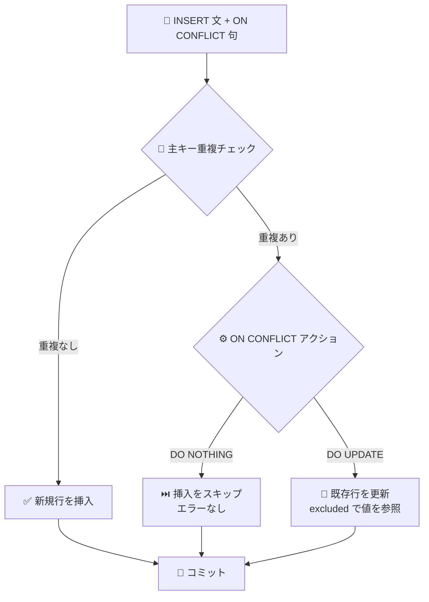

# Cloud Spanner: GoogleSQL INSERT 文における ON CONFLICT 句のサポート

**リリース日**: 2026-03-03

**サービス**: Cloud Spanner

**機能**: ON CONFLICT Clause for GoogleSQL INSERT Statements

**ステータス**: GA

📊 [このアップデートのインフォグラフィックを見る](https://takech9203.github.io/google-cloud-news-summary/20260303-spanner-on-conflict-clause.html)

## 概要

Cloud Spanner の GoogleSQL 方言において、INSERT 文で `ON CONFLICT` 句がサポートされました。これにより、一意制約違反 (主キーの重複) が発生した場合の動作を宣言的に制御できるようになります。`ON CONFLICT DO NOTHING` と `ON CONFLICT DO UPDATE` の 2 つのアクションが利用可能です。

従来、GoogleSQL 方言では `INSERT OR IGNORE` や `INSERT OR UPDATE` という Spanner 独自の構文が提供されていましたが、今回の `ON CONFLICT` 句の追加により、PostgreSQL や他のデータベースで広く使われている標準的な UPSERT パターンが GoogleSQL でも利用できるようになりました。これにより、他のデータベースからの移行やマルチデータベース環境での SQL の共通化が容易になります。

この機能は、データの同期処理、冪等な書き込み操作、バッチデータ投入など、重複レコードの処理が必要なあらゆるユースケースで活用できます。

**アップデート前の課題**

- GoogleSQL 方言で重複キーを処理するには `INSERT OR IGNORE` や `INSERT OR UPDATE` という Spanner 独自の構文を使用する必要があった
- PostgreSQL 方言では `ON CONFLICT` 句が利用できたが、GoogleSQL 方言では利用できなかった
- 他のデータベースから Spanner への移行時に、`ON CONFLICT` を使用した SQL を書き換える必要があった

**アップデート後の改善**

- GoogleSQL 方言でも `ON CONFLICT DO NOTHING` を使用して重複行の挿入を安全にスキップできるようになった
- GoogleSQL 方言でも `ON CONFLICT DO UPDATE` を使用して UPSERT (挿入または更新) 操作が標準的な構文で実行できるようになった
- PostgreSQL や他のデータベースとの SQL 互換性が向上し、移行やマルチデータベース運用が容易になった

## アーキテクチャ図



この図は、ON CONFLICT 句を含む INSERT 文の処理フローを示しています。主キーの重複が検出された場合、指定されたアクション (DO NOTHING または DO UPDATE) に応じて挿入のスキップまたは既存行の更新が行われます。

## サービスアップデートの詳細

### 主要機能

1. **ON CONFLICT DO NOTHING**
   - 挿入しようとする行が既にテーブルに存在する場合、一意制約違反エラーをスローせずに挿入をスキップする
   - バッチ挿入時に一部の行が既に存在していてもステートメント全体が失敗しない
   - 冪等な書き込み操作の実装に最適

2. **ON CONFLICT DO UPDATE**
   - 挿入しようとする行が既にテーブルに存在する場合、一意制約違反エラーをスローせずに既存行を更新する
   - `excluded` エイリアスを使用して、挿入しようとした値を UPDATE の値として参照できる
   - ON UPDATE 式が定義されたカラムは、ステートメントのカラムリストに非キーカラムが含まれている場合、自動的に ON UPDATE 式の値が設定される

3. **conflict_target の指定**
   - 主キーカラムを conflict_target として指定する
   - 複合主キーの場合は、すべての主キーカラムを指定する必要がある

## 技術仕様

### 構文

| 項目 | 詳細 |
|------|------|
| 対象方言 | GoogleSQL |
| サポートされるアクション | `DO NOTHING`, `DO UPDATE SET` |
| conflict_target | 主キーカラムのみ |
| 複合主キー | すべての主キーカラムの指定が必要 |
| excluded エイリアス | `DO UPDATE SET` で挿入値を参照するために使用 |
| WHERE 句 | `ON CONFLICT DO UPDATE` 内の WHERE 句は非サポート |

### 従来構文との比較

| 従来の構文 | ON CONFLICT 構文 | 動作 |
|------------|-----------------|------|
| `INSERT OR IGNORE` | `INSERT ... ON CONFLICT DO NOTHING` | 重複行をスキップ |
| `INSERT OR UPDATE` | `INSERT ... ON CONFLICT DO UPDATE SET ...` | 重複行を更新 (UPSERT) |

### GoogleSQL での使用例

```sql
-- ON CONFLICT DO NOTHING: 重複行をスキップ
INSERT INTO Singers (SingerId, FirstName, LastName)
VALUES (1, 'Marc', 'Richards')
ON CONFLICT (SingerId) DO NOTHING;

-- ON CONFLICT DO UPDATE: 重複行を更新 (UPSERT)
INSERT INTO Singers (SingerId, FirstName, LastName)
VALUES (1, 'Marc', 'Richards')
ON CONFLICT (SingerId)
DO UPDATE SET
  SingerId = excluded.SingerId,
  FirstName = excluded.FirstName,
  LastName = excluded.LastName;
```

### 制約事項

```sql
-- DO UPDATE SET では、INSERT リストに指定したすべてのカラムを
-- SET 句にも記載する必要がある
INSERT INTO Singers (SingerId, FirstName, LastName)
VALUES (1, 'Marc', 'Richards')
ON CONFLICT (SingerId)
DO UPDATE SET
  SingerId = excluded.SingerId,
  FirstName = excluded.FirstName,
  LastName = excluded.LastName;
-- FirstName を省略するとエラーになる
```

## 設定方法

### 前提条件

1. Cloud Spanner インスタンスおよび GoogleSQL 方言のデータベースが作成済みであること
2. テーブルに主キーが定義されていること
3. 適切な IAM 権限 (`spanner.databases.write`) を持つサービスアカウントまたはユーザー

### 手順

#### ステップ 1: DO NOTHING を使用した安全な挿入

```sql
-- 既存データとの重複を無視して挿入
INSERT INTO Singers (SingerId, FirstName, LastName)
VALUES
  (1, 'Marc', 'Richards'),
  (2, 'Catalina', 'Smith'),
  (3, 'Alice', 'Trentor')
ON CONFLICT (SingerId) DO NOTHING;
```

SingerId が既に存在する行は挿入されず、存在しない行のみが挿入されます。エラーは発生しません。

#### ステップ 2: DO UPDATE を使用した UPSERT

```sql
-- 存在すれば更新、存在しなければ挿入
INSERT INTO Singers (SingerId, FirstName, LastName)
VALUES (1, 'Marc', 'NewLastName')
ON CONFLICT (SingerId)
DO UPDATE SET
  SingerId = excluded.SingerId,
  FirstName = excluded.FirstName,
  LastName = excluded.LastName;
```

SingerId = 1 の行が存在する場合は LastName が 'NewLastName' に更新され、存在しない場合は新規挿入されます。

#### ステップ 3: 複合主キーでの使用

```sql
-- 複合主キーの場合、すべての主キーカラムを conflict_target に指定
INSERT INTO AlbumInfo (SingerId, AlbumId, AlbumTitle, MarketingBudget)
VALUES (1, 1, 'Total Junk', 100000)
ON CONFLICT (SingerId, AlbumId)
DO UPDATE SET
  SingerId = excluded.SingerId,
  AlbumId = excluded.AlbumId,
  AlbumTitle = excluded.AlbumTitle,
  MarketingBudget = excluded.MarketingBudget;
```

複合主キー (SingerId, AlbumId) の両方を ON CONFLICT 句に指定する必要があります。

## メリット

### ビジネス面

- **移行コストの削減**: 他のデータベースから Spanner への移行時に、ON CONFLICT を使用した SQL の書き換えが不要になり、移行作業の工数を削減できる
- **開発生産性の向上**: 標準的な SQL パターンが使えるため、開発者の学習コストが低減し、コードの可読性が向上する

### 技術面

- **SQL 互換性の向上**: PostgreSQL などで広く使われている ON CONFLICT 構文が GoogleSQL でも利用可能になり、マルチデータベース環境での SQL の共通化が容易になる
- **冪等な書き込みの実装が容易**: DO NOTHING を使用することで、リトライ処理や重複データの投入時にエラーハンドリングを簡素化できる
- **宣言的な UPSERT**: DO UPDATE SET を使用することで、「存在すれば更新、なければ挿入」というロジックを 1 つの SQL 文で表現できる

## デメリット・制約事項

### 制限事項

- conflict_target には主キーカラムのみ指定可能 (ユニークインデックスは指定不可)
- 複合主キーの場合、すべての主キーカラムを conflict_target に指定する必要がある
- `DO UPDATE SET` 句では、INSERT リストに指定したすべてのカラムを SET 句にも記載する必要がある
- `ON CONFLICT DO UPDATE` 内の WHERE 句はサポートされていない
- `DO UPDATE SET` の更新値は `excluded` エイリアスを使用して挿入値を参照する必要がある

### 考慮すべき点

- 従来の `INSERT OR IGNORE` / `INSERT OR UPDATE` 構文も引き続き利用可能であり、既存のコードを書き換える必要はない
- Partitioned DML では INSERT 自体がサポートされていないため、ON CONFLICT 句も使用できない
- DO UPDATE SET の制約 (全カラム指定必須) は PostgreSQL の ON CONFLICT とは異なるため、PostgreSQL からの移行時に注意が必要

## ユースケース

### ユースケース 1: 冪等なデータ同期

**シナリオ**: 外部システムからのデータを定期的に Spanner に同期する際、既存データとの重複を安全に処理したい。

**実装例**:
```sql
-- 外部システムからのデータを冪等に挿入
-- 既存データは更新、新規データは挿入
INSERT INTO Products (ProductId, Name, Price, LastSyncTime)
VALUES
  (101, 'Widget A', 29.99, CURRENT_TIMESTAMP()),
  (102, 'Widget B', 49.99, CURRENT_TIMESTAMP()),
  (103, 'Widget C', 19.99, CURRENT_TIMESTAMP())
ON CONFLICT (ProductId)
DO UPDATE SET
  ProductId = excluded.ProductId,
  Name = excluded.Name,
  Price = excluded.Price,
  LastSyncTime = excluded.LastSyncTime;
```

**効果**: リトライやスケジュール実行時に重複エラーが発生せず、常に最新データが反映される。

### ユースケース 2: イベントの重複排除

**シナリオ**: メッセージキューから受信したイベントを Spanner に記録する際、At-Least-Once 配信による重複イベントを安全に処理したい。

**実装例**:
```sql
-- イベント ID で重複を排除
INSERT INTO Events (EventId, EventType, Payload, ReceivedAt)
VALUES (@eventId, @eventType, @payload, CURRENT_TIMESTAMP())
ON CONFLICT (EventId) DO NOTHING;
```

**効果**: 重複イベントの受信時にエラーが発生せず、アプリケーション側での重複チェックロジックを簡素化できる。

## 料金

Cloud Spanner の ON CONFLICT 句の利用に追加料金は発生しません。通常の Spanner の料金体系 (コンピュートキャパシティ + ストレージ) が適用されます。

### 料金例

| エディション | ノード単価 (時間あたり) | 1 年 CUD 割引 | 3 年 CUD 割引 |
|-------------|----------------------|--------------|--------------|
| Standard | $0.90 | 20% | 40% |
| Enterprise | リージョンにより異なる | 20% | 40% |
| Enterprise Plus | リージョンにより異なる | 20% | 40% |

詳細は [Spanner 料金ページ](https://cloud.google.com/spanner/pricing) を参照してください。無料トライアルインスタンスも利用可能です。

## 利用可能リージョン

Cloud Spanner が利用可能なすべてのリージョンで ON CONFLICT 句を使用できます。リージョン一覧は [Spanner インスタンス構成](https://cloud.google.com/spanner/docs/instance-configurations) を参照してください。

## 関連サービス・機能

- **Cloud Spanner PostgreSQL 方言**: PostgreSQL 方言では以前から ON CONFLICT 句がサポートされており、今回 GoogleSQL 方言にも同等の機能が追加された
- **INSERT OR IGNORE / INSERT OR UPDATE**: GoogleSQL 方言の従来からの重複処理構文。ON CONFLICT 句と同等の機能を提供する
- **Cloud Spanner Mutation API**: DML とは別のデータ変更手段。`InsertOrUpdate` ミューテーションで同様の UPSERT 操作が可能
- **Partitioned DML**: 大量データの一括変更に使用。ただし INSERT (および ON CONFLICT) はサポートされていない

## 参考リンク

- 📊 [インフォグラフィック](https://takech9203.github.io/google-cloud-news-summary/20260303-spanner-on-conflict-clause.html)
- [公式リリースノート](https://docs.cloud.google.com/release-notes#March_03_2026)
- [GoogleSQL DML 構文リファレンス](https://cloud.google.com/spanner/docs/reference/standard-sql/dml-syntax)
- [PostgreSQL DML 構文リファレンス (ON CONFLICT)](https://cloud.google.com/spanner/docs/reference/postgresql/dml-syntax)
- [DML を使用したデータの挿入・更新・削除](https://cloud.google.com/spanner/docs/dml-tasks)
- [Spanner 料金ページ](https://cloud.google.com/spanner/pricing)

## まとめ

Cloud Spanner の GoogleSQL 方言で ON CONFLICT 句がサポートされたことにより、標準的な SQL パターンを使用した UPSERT 操作や重複排除が可能になりました。他のデータベースからの移行の容易化、冪等な書き込み処理の簡素化、コードの可読性向上に寄与します。既存の `INSERT OR IGNORE` / `INSERT OR UPDATE` 構文も引き続き利用可能なため、既存アプリケーションへの影響はありません。新規開発や移行プロジェクトでは ON CONFLICT 句の採用を検討してください。

---

**タグ**: #CloudSpanner #GoogleSQL #DML #UPSERT #OnConflict #データベース
