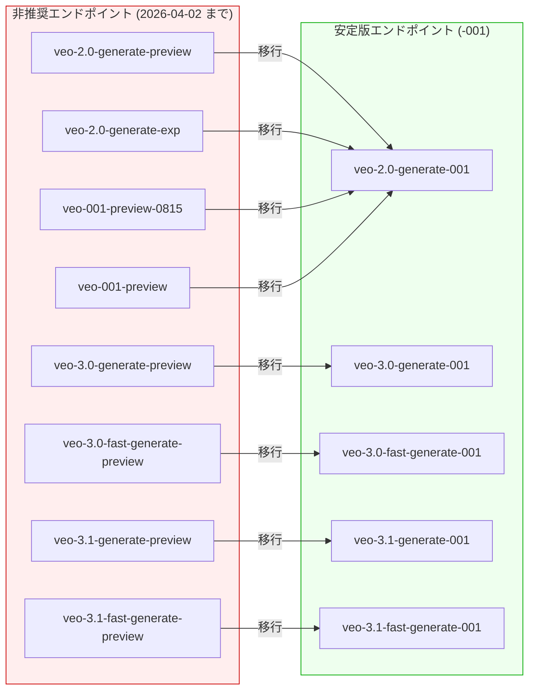

# Generative AI on Vertex AI: Gemini 3.1 Flash-Lite / Veo エンドポイント非推奨化

**リリース日**: 2026-03-03

**サービス**: Generative AI on Vertex AI

**機能**: Gemini 3.1 Flash-Lite Preview、Veo エンドポイント移行

**ステータス**: Preview / Deprecated

📊 [このアップデートのインフォグラフィックを見る](https://takech9203.github.io/google-cloud-news-summary/20260303-vertex-ai-gemini-3-1-flash-lite-veo-deprecation.html)

## 概要

今回のアップデートでは、Generative AI on Vertex AI に関する 2 つの重要な変更が発表された。1 つ目は、Gemini 3.1 Flash-Lite (`gemini-3.1-flash-lite-preview`) がパブリックプレビューとして利用可能になったことである。これは Gemini モデルファミリーの中で最もコスト効率に優れたモデルであり、大量のリクエストを低レイテンシで処理する必要があるコスト重視の LLM ワークロードに最適化されている。

2 つ目は、Veo (動画生成) の複数のプレビューエンドポイントが非推奨となり、安定版の `-001` エンドポイントへの移行が必要になったことである。対象は Veo 2.0、Veo 3.0、Veo 3.1 の各プレビューエンドポイントであり、2026 年 4 月 2 日までにエンドポイントの更新が必要となる。これにより、プレビューから安定版への統合が進み、本番ワークロードでの信頼性が向上する。

**アップデート前の課題**

- Gemini モデルファミリーにおいて、3.1 世代の Flash-Lite モデルが存在せず、最新世代で最もコスト効率の高い選択肢が限られていた
- Veo の動画生成では複数のプレビューエンドポイント (`-preview`、`-exp`、`-preview-0815`) が混在しており、どのエンドポイントを使用すべきか判断が難しかった
- プレビューエンドポイントは SLA の保証がなく、本番環境での運用に不安があった

**アップデート後の改善**

- Gemini 3.1 Flash-Lite により、最新世代で最もコスト効率の高いモデルが利用可能になった
- Veo エンドポイントが安定版 (`-001`) に統合され、利用すべきエンドポイントが明確になった
- 安定版エンドポイントへの移行により、本番環境での信頼性と一貫性が向上する

## アーキテクチャ図



この図は、非推奨となる Veo プレビューエンドポイントから安定版エンドポイントへの移行パスを示している。すべてのプレビューエンドポイントが対応する `-001` サフィックスの安定版エンドポイントに統合される。

## サービスアップデートの詳細

### 主要機能

1. **Gemini 3.1 Flash-Lite (パブリックプレビュー)**
   - モデル ID: `gemini-3.1-flash-lite-preview`
   - Gemini モデルファミリーの中で最もコスト効率に優れたモデル
   - 大量トラフィック・低レイテンシのユースケースに最適化
   - 高頻度・コスト重視の LLM トラフィック処理を想定した設計

2. **Veo エンドポイント非推奨化**
   - Veo 2.0、3.0、3.1 の複数のプレビューエンドポイントが非推奨
   - 安定版の `-001` エンドポイントへの移行を推奨
   - 移行期限: 2026 年 4 月 2 日

3. **安定版エンドポイントへの統合**
   - プレビュー版から安定版への移行により、API の一貫性が向上
   - 本番ワークロードでの信頼性が改善
   - Veo 3.0 では Fast Generate も安定版 (`veo-3.0-fast-generate-001`) を提供

## 技術仕様

### Gemini 3.1 Flash-Lite の位置づけ

Gemini の Flash-Lite シリーズは、Flash モデルよりもさらにコスト効率を重視した軽量モデルである。以前の世代 (2.5 Flash-Lite) と同様の設計思想に基づき、以下の特徴を持つ。

| 項目 | 詳細 |
|------|------|
| モデル ID | `gemini-3.1-flash-lite-preview` |
| ステータス | パブリックプレビュー |
| 最適化対象 | 低レイテンシ、高コスト効率 |
| 想定ワークロード | 大量トラフィック、コスト重視の LLM 処理 |

### Veo エンドポイント移行マッピング

| 非推奨エンドポイント | 移行先エンドポイント |
|------|------|
| `veo-3.0-generate-preview` | `veo-3.0-generate-001` |
| `veo-3.0-fast-generate-preview` | `veo-3.0-fast-generate-001` |
| `veo-2.0-generate-preview` | `veo-2.0-generate-001` |
| `veo-2.0-generate-exp` | `veo-2.0-generate-001` |
| `veo-001-preview-0815` | `veo-2.0-generate-001` |
| `veo-001-preview` | `veo-2.0-generate-001` |
| `veo-3.1-generate-preview` | `veo-3.1-generate-001` |
| `veo-3.1-fast-generate-preview` | `veo-3.1-fast-generate-001` |

### Veo API エンドポイントの使用例

```bash
# 移行前 (非推奨)
curl -X POST \
  -H "Authorization: Bearer $(gcloud auth print-access-token)" \
  -H "Content-Type: application/json" \
  https://us-central1-aiplatform.googleapis.com/v1/projects/PROJECT_ID/locations/us-central1/publishers/google/models/veo-3.0-generate-preview:predictLongRunning

# 移行後 (推奨)
curl -X POST \
  -H "Authorization: Bearer $(gcloud auth print-access-token)" \
  -H "Content-Type: application/json" \
  https://us-central1-aiplatform.googleapis.com/v1/projects/PROJECT_ID/locations/us-central1/publishers/google/models/veo-3.0-generate-001:predictLongRunning
```

## メリット

### ビジネス面

- **コスト最適化**: Gemini 3.1 Flash-Lite により、大量の LLM リクエストを処理するワークロードのコストを大幅に削減可能
- **運用の安定化**: Veo のプレビューエンドポイントから安定版への移行により、本番環境の信頼性が向上
- **エンドポイント管理の簡素化**: 複数のプレビューエンドポイントが安定版に統合され、管理が容易に

### 技術面

- **低レイテンシ**: Flash-Lite モデルは低レイテンシに最適化されており、リアルタイム性が求められるアプリケーションに適している
- **API の一貫性**: `-001` サフィックスの安定版エンドポイントにより、バージョン管理が明確になる
- **段階的な移行**: 2026 年 4 月 2 日までの移行期間が設けられており、計画的に対応可能

## デメリット・制約事項

### 制限事項

- Gemini 3.1 Flash-Lite はパブリックプレビューであり、SLA は適用されない
- Preview ステータスのため、API の仕様が変更される可能性がある

### 考慮すべき点

- Veo プレビューエンドポイントを使用している場合、2026 年 4 月 2 日までに移行を完了する必要がある
- `veo-3.0-fast-generate-preview` の移行先は `veo-3.0-fast-generate-001` であるが (リリースノートに記載の通り)、その他のプレビューエンドポイントは Fast ではない通常の `-001` エンドポイントに移行する点に注意
- 旧い Veo 1.0 系のプレビューエンドポイント (`veo-001-preview-0815`、`veo-001-preview`) は `veo-2.0-generate-001` への移行となり、モデルバージョンが変更される
- 安定版エンドポイントへの移行時に、出力品質やパラメータのデフォルト値が異なる場合があるため、事前にテストを推奨

## ユースケース

### ユースケース 1: 大量テキスト分類パイプライン

**シナリオ**: EC サイトで毎日数百万件のカスタマーレビューをリアルタイムに分類・タグ付けする必要がある場合、Gemini 3.1 Flash-Lite を使用することで、低コストかつ低レイテンシでの処理が可能になる。

**効果**: 従来の Flash モデルと比較してコスト削減が期待でき、高頻度のリクエストに対しても安定したレスポンスタイムを維持できる。

### ユースケース 2: 動画生成アプリケーションの本番移行

**シナリオ**: マーケティングチームが Veo 3.0 のプレビューエンドポイントを使用してプロモーション動画の自動生成を行っている場合、安定版エンドポイントへの移行により本番運用の信頼性が向上する。

**効果**: `-001` 安定版エンドポイントの使用により、SLA に基づいた安定したサービス品質が得られ、プロダクション環境での運用リスクが低減される。

## 料金

Gemini 3.1 Flash-Lite および Veo エンドポイントの料金については、公式の料金ページを参照のこと。過去の Flash-Lite モデル (Gemini 2.5 Flash-Lite) は Gemini ファミリーの中で最も低価格のトークン単価が設定されていた実績がある。

- [Vertex AI Generative AI 料金ページ](https://cloud.google.com/vertex-ai/generative-ai/pricing)

## 利用可能リージョン

Gemini 3.1 Flash-Lite Preview のリージョン情報は公式ドキュメントを参照のこと。過去の Gemini Flash-Lite モデル (2.5) の実績では、Global エンドポイントおよび複数の US・Europe リージョンで利用可能であった。Veo モデルは `us-central1` リージョンで利用可能である。

- [Generative AI on Vertex AI のリージョン情報](https://cloud.google.com/vertex-ai/generative-ai/docs/learn/locations)

## 関連サービス・機能

- **Vertex AI Studio**: Gemini 3.1 Flash-Lite および Veo モデルを GUI で試用・テストできるプラットフォーム
- **Vertex AI Media Studio**: Veo を使用した動画生成をインタラクティブに行えるスタジオ環境
- **Gemini 3.1 Pro**: 同じ 3.1 世代の高性能推論モデル。Flash-Lite は Pro よりもコスト効率を重視
- **Gemini 3 Flash**: 3.0 世代のフロンティア性能モデル。Flash-Lite はさらに軽量化・低コスト化したバリアント
- **Veo 3.1**: 最新の動画生成モデル。4K 解像度のサポートやオーディオ同期生成に対応
- **Provisioned Throughput**: 安定したスループットが必要な場合に利用できる専用キャパシティオプション

## 参考リンク

- 📊 [インフォグラフィック](https://takech9203.github.io/google-cloud-news-summary/20260303-vertex-ai-gemini-3-1-flash-lite-veo-deprecation.html)
- [公式リリースノート](https://docs.cloud.google.com/release-notes#March_03_2026)
- [Gemini モデル一覧 (Vertex AI)](https://cloud.google.com/vertex-ai/generative-ai/docs/models)
- [Veo 動画生成 API リファレンス](https://cloud.google.com/vertex-ai/generative-ai/docs/model-reference/veo-video-generation)
- [Veo 動画生成概要](https://cloud.google.com/vertex-ai/generative-ai/docs/video/overview)
- [Generative AI on Vertex AI のリージョン情報](https://cloud.google.com/vertex-ai/generative-ai/docs/learn/locations)
- [Vertex AI Generative AI 料金ページ](https://cloud.google.com/vertex-ai/generative-ai/pricing)

## まとめ

Gemini 3.1 Flash-Lite の登場により、大量の LLM リクエストを低コスト・低レイテンシで処理する新たな選択肢が提供された。コスト重視のワークロードにおいて評価・検討すべきモデルである。また、Veo プレビューエンドポイントの非推奨化により、2026 年 4 月 2 日までに安定版エンドポイントへの移行が必要となる。Veo を使用している場合は、早急に移行計画を策定し、テストを実施することを推奨する。

---

**タグ**: Vertex AI, Gemini, Flash-Lite, Veo, 動画生成, エンドポイント移行, コスト最適化, Preview, Deprecated
