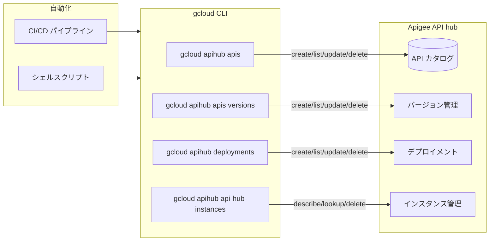

# Apigee API hub: gcloud CLI サポート

**リリース日**: 2026-03-04

**サービス**: Apigee API hub

**機能**: gcloud CLI Support for API hub

**ステータス**: GA

📊 [このアップデートのインフォグラフィックを見る](https://takech9203.github.io/google-cloud-news-summary/20260304-apigee-api-hub-gcloud-cli.html)

## 概要

gcloud CLI が Apigee API hub を正式にサポートし、組織の API カタログ、バージョン、ライフサイクルメタデータをコマンドラインから直接管理できるようになった。これまで Cloud Console の UI や REST API 経由で行っていた API hub の操作を、シェルスクリプトや CI/CD パイプラインに組み込めるようになり、API ガバナンスの自動化が大幅に容易になる。

`gcloud apihub` コマンドグループには、API リソースの CRUD 操作、バージョン管理、デプロイメント管理、API hub インスタンスの管理、API オペレーションの管理など、包括的なサブコマンドが含まれている。API プラットフォームチームやプラットフォームエンジニアにとって、大規模な API ポートフォリオの管理を効率化する重要なアップデートである。

**アップデート前の課題**

- API hub の操作は Cloud Console の UI または REST API (curl) 経由で行う必要があり、自動化には REST API の直接呼び出しが必要だった
- CI/CD パイプラインへの API hub 操作の組み込みには、認証トークンの取得や API エンドポイントの構築など、ボイラープレートコードが多かった
- 複数の API リソースの一括操作やスクリプト化が煩雑で、手動作業が多くなりがちだった

**アップデート後の改善**

- `gcloud apihub` コマンドグループにより、API カタログの管理がコマンドライン一行で完結するようになった
- gcloud の標準的な認証・プロジェクト設定の仕組みをそのまま利用でき、CI/CD パイプラインへの統合が容易になった
- `--format` や `--filter` といった gcloud 標準フラグにより、出力のフィルタリングやフォーマット変換がシンプルになった

## アーキテクチャ図



gcloud CLI から API hub の各リソース (API、バージョン、デプロイメント、インスタンス) を直接操作できるようになり、CI/CD パイプラインやシェルスクリプトからの自動化が可能になった。

## サービスアップデートの詳細

### 主要機能

1. **API リソース管理 (`gcloud apihub apis`)**
   - `create`: 新しい API リソースの作成
   - `list`: API リソースの一覧表示 (`--filter`、`--limit`、`--sort-by` オプション対応)
   - `describe`: 特定の API リソースの詳細表示
   - `update`: 既存 API リソースの更新
   - `delete`: API リソースの削除

2. **バージョン管理 (`gcloud apihub apis versions`)**
   - API の各バージョンの作成・一覧・詳細表示・更新・削除
   - バージョンに API 仕様 (OpenAPI、MCP スキーマなど) を関連付け可能
   - オペレーション管理 (`gcloud apihub apis versions operations`) による API オペレーションの CRUD

3. **デプロイメント管理 (`gcloud apihub deployments`)**
   - API デプロイメントの作成・一覧・詳細表示・更新・削除
   - デプロイメントタイプ、エンドポイント、環境情報の設定
   - SLO やドキュメント URI などのメタデータ管理

4. **インスタンス管理 (`gcloud apihub api-hub-instances`)**
   - `describe`: API hub インスタンスの詳細表示
   - `lookup`: プロジェクト内の API hub インスタンスの検索
   - `delete`: API hub インスタンスの削除 (`--async` オプション対応)

## 技術仕様

### gcloud apihub コマンドグループ一覧

| コマンドグループ | 説明 | 主なサブコマンド |
|---|---|---|
| `gcloud apihub apis` | API リソース管理 | create, list, describe, update, delete |
| `gcloud apihub apis versions` | バージョン管理 | create, list, describe, update, delete |
| `gcloud apihub apis versions operations` | API オペレーション管理 | create, list, describe, update, delete |
| `gcloud apihub deployments` | デプロイメント管理 | create, list, describe, update, delete |
| `gcloud apihub api-hub-instances` | インスタンス管理 | describe, lookup, delete |

### API リファレンス

- すべてのコマンドは `apihub/v1` API を使用
- alpha トラック (`gcloud alpha apihub`) も利用可能

## 設定方法

### 前提条件

1. API hub がプロジェクトにプロビジョニング済みであること
2. 適切な IAM ロール (`roles/apihub.admin` など) が付与されていること
3. gcloud CLI が最新バージョンにアップデートされていること

### 手順

#### ステップ 1: gcloud CLI のアップデート

```bash
# gcloud CLI を最新バージョンにアップデート
gcloud components update
```

#### ステップ 2: API hub の API 一覧を表示

```bash
# プロジェクト内の全 API を一覧表示
gcloud apihub apis list \
  --project=my-project \
  --location=us-central1
```

#### ステップ 3: 新しい API リソースの作成

```bash
# 新しい API リソースを作成
gcloud apihub apis create my-api \
  --display-name="My API" \
  --project=my-project \
  --location=us-central1
```

#### ステップ 4: デプロイメントの作成

```bash
# デプロイメントを作成
gcloud apihub deployments create my-deployment \
  --display-name="My Deployment" \
  --deployment-type=apigee \
  --project=my-project \
  --location=us-central1
```

## メリット

### ビジネス面

- **API ガバナンスの自動化**: CI/CD パイプラインに API hub 操作を組み込むことで、API のライフサイクル管理を自動化し、ガバナンスの一貫性を確保できる
- **運用効率の向上**: 大量の API リソースの一括操作やレポート生成をスクリプト化でき、プラットフォームチームの運用負荷を軽減できる

### 技術面

- **Infrastructure as Code との統合**: gcloud コマンドをシェルスクリプトや自動化ツールに組み込み、API カタログの管理を宣言的に行える
- **標準的な出力フォーマット**: `--format=json` や `--format=yaml` で出力をプログラム的に処理でき、他のツールとの連携が容易になった
- **フィルタリングとソート**: `--filter` と `--sort-by` フラグにより、大規模な API ポートフォリオからの効率的な検索が可能

## デメリット・制約事項

### 制限事項

- API hub インスタンスはプロジェクトごとに 1 つのみ作成可能
- API hub のプロビジョニング解除後、同じプロジェクトでの再プロビジョニングには 7 日間の待機が必要
- Cloud Scheduler が利用できないリージョンでは、フォールバックロケーションが使用される

### 考慮すべき点

- gcloud apihub コマンドは GA トラックと alpha トラックの両方で利用可能だが、alpha トラックには今後変更される可能性のある機能が含まれる
- API hub のプロビジョニング時に Apigee API (`apigee.googleapis.com`) が自動的に有効化される (追加料金なし)

## ユースケース

### ユースケース 1: CI/CD パイプラインでの API カタログ自動更新

**シナリオ**: OpenAPI 仕様ファイルが Git リポジトリにマージされたタイミングで、API hub のカタログを自動的に更新したい。

**実装例**:
```bash
#!/bin/bash
# CI/CD パイプラインでの API カタログ更新スクリプト

API_ID="my-service-api"
VERSION_ID="v2"
PROJECT="my-project"
LOCATION="us-central1"

# API が存在するか確認
if gcloud apihub apis describe ${API_ID} \
  --project=${PROJECT} --location=${LOCATION} 2>/dev/null; then
  echo "API exists, updating..."
  gcloud apihub apis update ${API_ID} \
    --project=${PROJECT} --location=${LOCATION} \
    --display-name="My Service API (Updated)"
else
  echo "Creating new API..."
  gcloud apihub apis create ${API_ID} \
    --project=${PROJECT} --location=${LOCATION} \
    --display-name="My Service API"
fi
```

**効果**: API 仕様の変更がコードリポジトリと API hub の両方に自動的に反映され、カタログの整合性を維持できる。

### ユースケース 2: API ポートフォリオの棚卸しレポート生成

**シナリオ**: 組織内のすべての API とそのデプロイメント状況を定期的にレポートとして出力したい。

**実装例**:
```bash
#!/bin/bash
# API ポートフォリオのレポート生成

echo "=== API Portfolio Report ==="
echo "Date: $(date)"

# 全 API の一覧を JSON で取得
gcloud apihub apis list \
  --project=my-project \
  --location=us-central1 \
  --format="table(name, displayName, createTime)"

# 全デプロイメントの一覧
echo ""
echo "=== Deployments ==="
gcloud apihub deployments list \
  --project=my-project \
  --location=us-central1 \
  --format="table(name, displayName, endpoints)"
```

**効果**: API ガバナンスチームが組織全体の API ポートフォリオを定期的に把握し、未使用 API の特定やコンプライアンスチェックを効率的に行える。

## 料金

Apigee API hub は無料サービスである。API hub のプロビジョニング時に Apigee API が自動的に有効化されるが、追加の料金や課金への影響はない。

なお、Apigee のプロキシ実行やその他のサービスを利用する場合は、別途 Apigee の料金体系 (Pay-as-you-go またはサブスクリプション) が適用される。

- [Apigee 料金ページ](https://cloud.google.com/apigee/pricing)

## 利用可能リージョン

API hub は複数のリージョンで利用可能。サポートされるロケーションの詳細は公式ドキュメントを参照。

- [API hub ロケーション](https://cloud.google.com/apigee/docs/apihub/locations)

## 関連サービス・機能

- **Apigee**: API hub は Apigee のコンポーネントとして提供され、Apigee API プロキシの情報を自動的に取得・連携する
- **API Gateway**: API Gateway と API hub を連携させることで、API Gateway で管理する API のメタデータを API hub に自動的にパブリッシュできる
- **Cloud Console**: gcloud CLI に加えて、引き続き Cloud Console の UI からも API hub を操作可能
- **Vertex AI**: API hub に登録された API から Vertex AI エクステンションを作成し、LLM と連携させることが可能
- **Eventarc**: API hub のイベントに対して Eventarc トリガーを設定し、カスタムワークフローを起動可能

## 参考リンク

- 📊 [インフォグラフィック](https://takech9203.github.io/google-cloud-news-summary/20260304-apigee-api-hub-gcloud-cli.html)
- [公式リリースノート](https://docs.cloud.google.com/release-notes#March_04_2026)
- [Apigee API hub とは](https://cloud.google.com/apigee/docs/apihub/what-is-api-hub)
- [gcloud apihub コマンドリファレンス](https://cloud.google.com/sdk/gcloud/reference/apihub)
- [API hub プロビジョニング (CLI)](https://cloud.google.com/apigee/docs/apihub/provision-cli)
- [API hub リリースノート](https://cloud.google.com/apigee/docs/apihub/release-notes)
- [Apigee 料金ページ](https://cloud.google.com/apigee/pricing)

## まとめ

gcloud CLI による Apigee API hub のサポートは、API プラットフォームチームにとって大きな生産性向上をもたらすアップデートである。CI/CD パイプラインへの統合やスクリプトベースの自動化が容易になり、大規模な API ポートフォリオのガバナンスを効率的に実現できる。既に API hub を利用している組織は、gcloud CLI を最新バージョンにアップデートし、既存の自動化ワークフローへの組み込みを検討することを推奨する。

---

**タグ**: #ApigeeAPIHub #gcloudCLI #API管理 #APIガバナンス #コマンドライン #自動化 #CICD
