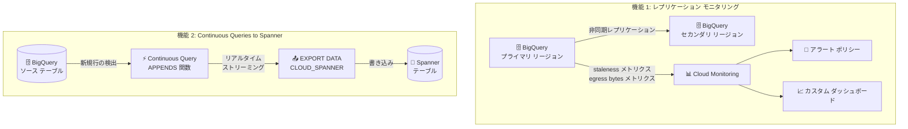

# BigQuery: レプリケーション モニタリングと Spanner への Continuous Queries が GA

**リリース日**: 2026-03-04

**サービス**: BigQuery

**機能**: Replication Monitoring / Continuous Queries to Spanner GA

**ステータス**: GA (一般提供)

📊 [このアップデートのインフォグラフィックを見る](https://takech9203.github.io/google-cloud-news-summary/20260304-bigquery-replication-monitoring-continuous-queries.html)

## 概要

BigQuery の 2 つの機能が GA (一般提供) になった。1 つ目は、BigQuery のクロスリージョン レプリケーション (CRR) およびマネージド ディザスタ リカバリ (MDR) におけるデータセット レプリケーションのレイテンシとネットワーク エグレス バイトを Cloud Monitoring で監視できる機能である。2 つ目は、Continuous Queries を使用して BigQuery のデータを Spanner にリアルタイムでストリーミングできる機能である。

これらの機能により、BigQuery を利用したデータ基盤の可用性監視とリアルタイム データ連携の両面が強化された。レプリケーション モニタリングは DR 戦略の運用品質を向上させ、Continuous Queries to Spanner はリバース ETL パイプラインの構築を大幅に簡素化する。

対象ユーザーは、クロスリージョン レプリケーションを利用しているデータエンジニア、DR 計画を策定するインフラストラクチャ チーム、および BigQuery と Spanner 間のリアルタイム データ同期を必要とするアプリケーション開発者である。

**アップデート前の課題**

- クロスリージョン レプリケーションのレイテンシやエグレス バイトを Cloud Monitoring で直接監視する手段がなく、レプリケーションの健全性を把握しにくかった
- BigQuery から Spanner へのデータ同期はバッチ ジョブによるスケジュール実行が必要で、リアルタイム性に欠けていた
- DR 環境のレプリケーション遅延を検知するためのカスタム監視基盤を別途構築する必要があった

**アップデート後の改善**

- Cloud Monitoring でレプリケーション レイテンシ (`storage/replication/staleness`) とネットワーク エグレス バイト (`storage/replication/network_egress_bytes_count`) を直接監視可能になった
- Continuous Queries により BigQuery のデータを Spanner にリアルタイムでストリーミングでき、バッチ ジョブが不要になった
- Metrics Explorer やカスタム ダッシュボードでレプリケーション状態を可視化し、アラートを設定できるようになった

## アーキテクチャ図



上図は今回 GA となった 2 つの機能を示す。機能 1 はクロスリージョン レプリケーションの監視フローで、レプリケーション メトリクスが Cloud Monitoring に送信されアラートやダッシュボードで可視化される。機能 2 は BigQuery の Continuous Queries による Spanner へのリアルタイム データ ストリーミングのフローである。

## サービスアップデートの詳細

### 主要機能

1. **レプリケーション モニタリング (Cloud Monitoring 連携)**
   - クロスリージョン レプリケーション (CRR) およびマネージド ディザスタ リカバリ (MDR) で有効なデータセットのレプリケーション状態を Cloud Monitoring で監視可能
   - `storage/replication/staleness` メトリクス: セカンダリ リージョンで利用可能なデータの鮮度 (レイテンシ) を測定。60 秒ごとにサンプリングされ、最大 420 秒の遅延で表示
   - `storage/replication/network_egress_bytes_count` メトリクス: レプリケーションによる課金対象のエグレス バイト数を測定。60 秒ごとにサンプリングされ、最大 420 秒の遅延で表示
   - Metrics Explorer でのリアルタイム表示、カスタム ダッシュボードの作成、アラート ポリシーの設定が可能

2. **Continuous Queries to Spanner (リアルタイム リバース ETL)**
   - BigQuery の `EXPORT DATA` ステートメントと `APPENDS` 関数を組み合わせ、BigQuery テーブルに追加された新規行を自動的に検出して Spanner にストリーミング
   - `format = 'CLOUD_SPANNER'` オプションにより Spanner テーブルへの直接エクスポートが可能
   - `change_timestamp_column` オプションでデータの書き込み順序を制御可能
   - ニアリアルタイムのデータ同期を実現し、定期バッチ ジョブが不要に

3. **Continuous Queries の CONTINUOUS ジョブタイプ**
   - Continuous Query パイプラインの実行には `CONTINUOUS` ジョブタイプのスロット予約割り当てが必要
   - BigQuery Studio の UI またはBQ CLI (`--continuous=true`) から実行可能
   - サービス アカウントを使用した長時間実行に対応

## 技術仕様

### レプリケーション モニタリング メトリクス

| メトリクス名 | 型 | 単位 | サンプリング間隔 | 説明 |
|---|---|---|---|---|
| `storage/replication/staleness` | GAUGE, INT64 | ms | 60 秒 | セカンダリ リージョンのデータ鮮度 (レイテンシ) |
| `storage/replication/network_egress_bytes_count` | DELTA, INT64 | By | 60 秒 | レプリケーションによる課金対象エグレス バイト数 |

メトリクスのラベル:
- `location`: レプリケーション先のロケーション
- `replica_id`: レプリカ ID
- `replication_error`: レプリケーション エラー (staleness メトリクスのみ)

### Continuous Queries to Spanner の設定パラメータ

| パラメータ | 説明 |
|---|---|
| `format` | `'CLOUD_SPANNER'` を指定 |
| `uri` | Spanner データベースの URI (`https://spanner.googleapis.com/projects/{PROJECT}/instances/{INSTANCE}/databases/{DB}`) |
| `spanner_options.table` | 書き込み先の Spanner テーブル名 |
| `spanner_options.priority` | リクエスト優先度 (`HIGH`, `MEDIUM`, `LOW`) |
| `spanner_options.change_timestamp_column` | タイムスタンプ列の指定 (書き込み順序の制御) |

### Continuous Query の SQL 例

```sql
EXPORT DATA
OPTIONS (
  uri = 'https://spanner.googleapis.com/projects/PROJECT_ID/instances/INSTANCE_ID/databases/DATABASE_ID',
  format = 'CLOUD_SPANNER',
  spanner_options = '{"table": "my_table", "priority": "HIGH", "change_timestamp_column": "update_time"}'
)
AS
SELECT
  id,
  name,
  value,
  _CHANGE_TIMESTAMP AS update_time
FROM APPENDS(
  TABLE `project.dataset.source_table`,
  CURRENT_TIMESTAMP() - INTERVAL 10 MINUTE
);
```

## 設定方法

### 前提条件

1. BigQuery のクロスリージョン レプリケーションまたはマネージド ディザスタ リカバリが有効なデータセットが存在すること (モニタリング機能)
2. Enterprise エディション以上の予約が作成されていること (Continuous Queries)
3. `CONTINUOUS` ジョブタイプのスロット予約割り当てがプロジェクト、フォルダ、または組織レベルで設定されていること (Continuous Queries)
4. Spanner データベースおよび書き込み先テーブルが作成済みであること (Continuous Queries)

### 手順

#### ステップ 1: レプリケーション モニタリングの設定

```bash
# Cloud Monitoring の Metrics Explorer で確認
# Google Cloud コンソール > Monitoring > Metrics Explorer
# リソースタイプ: BigQuery Dataset
# メトリクス: storage/replication/staleness または storage/replication/network_egress_bytes_count
```

Metrics Explorer で BigQuery Dataset リソースタイプを選択し、レプリケーション関連メトリクスを追加する。アラート ポリシーを作成して、レプリケーション レイテンシが閾値を超えた場合に通知を受け取ることができる。

#### ステップ 2: Continuous Query to Spanner の設定

```bash
# bq CLI を使用した Continuous Query の実行
bq query --continuous=true --use_legacy_sql=false '
EXPORT DATA
OPTIONS (
  uri = "https://spanner.googleapis.com/projects/my-project/instances/my-instance/databases/my-db",
  format = "CLOUD_SPANNER",
  spanner_options = "{\"table\": \"target_table\", \"priority\": \"HIGH\"}"
)
AS
SELECT * FROM APPENDS(
  TABLE `my-project.my_dataset.source_table`,
  CURRENT_TIMESTAMP() - INTERVAL 10 MINUTE
);
'
```

BigQuery Studio の UI から実行する場合は、クエリ エディタで SQL を入力し、「その他」メニューから「クエリモードの選択」で「Continuous query」を選択する。

## メリット

### ビジネス面

- **DR 運用の信頼性向上**: レプリケーション レイテンシの継続的な監視により、RPO (目標復旧時点) の遵守状況をリアルタイムで把握でき、DR 計画の実効性を確保できる
- **リアルタイム アプリケーション サービング**: BigQuery の分析結果を Spanner 経由でアプリケーションに低レイテンシで提供でき、ユーザー体験の向上に直結する
- **運用コストの削減**: バッチ ジョブのスケジューリングと管理が不要になり、データ パイプラインの運用負荷が軽減される

### 技術面

- **統合監視**: Cloud Monitoring の既存のダッシュボードやアラート基盤にレプリケーション メトリクスを統合でき、監視の一元化が実現する
- **イベント駆動アーキテクチャ**: `APPENDS` 関数により新規行の追加をイベントとして捕捉し、即座に Spanner に反映するイベント駆動パイプラインが構築できる
- **SQL ベースのパイプライン定義**: Continuous Queries は標準 SQL で記述できるため、専用の ETL ツールを導入することなくリバース ETL を実現できる

## デメリット・制約事項

### 制限事項

- Continuous Queries to Spanner は Enterprise エディション以上が必要であり、Standard エディションやオンデマンド コンピューティングでは利用不可
- `APPENDS` 関数は INSERT のみを捕捉し、UPDATE や DELETE は検出しない
- Spanner の自動生成主キーを持つテーブルへの Continuous Query によるエクスポートは不可
- PostgreSQL 方言の Spanner データベースへの Continuous Query エクスポートは不可
- ユーザー アカウントのアクセス トークンは TTL が 2 日間のため、長時間実行にはサービス アカウントの使用が必要
- レプリケーション モニタリング メトリクスはサンプリング後最大 420 秒の遅延がある

### 考慮すべき点

- Continuous Query はデータベース エラー (重複主キー、参照整合性違反など) が発生するとパイプラインがキャンセルされるため、エラー ハンドリングの設計が重要
- Spanner テーブルの主キーに単調増加する整数を使用するとパフォーマンスの問題が発生する可能性がある
- レプリケーション モニタリングのメトリクスは CRR/MDR が有効なデータセットでのみ利用可能

## ユースケース

### ユースケース 1: DR レプリケーション SLA 監視

**シナリオ**: 金融サービス企業が BigQuery のマネージド ディザスタ リカバリを利用し、東京 (asia-northeast1) から大阪 (asia-northeast2) へのレプリケーションを監視する。

**実装例**:
```
# Cloud Monitoring アラート ポリシーの設定
# 条件: storage/replication/staleness > 300000 ms (5 分) が 10 分間継続
# 通知チャンネル: PagerDuty, Slack
```

**効果**: レプリケーション レイテンシが閾値を超えた場合に即座にアラートが発報され、RPO 違反を未然に防止できる。

### ユースケース 2: リアルタイム リバース ETL パイプライン

**シナリオ**: EC サイトが BigQuery で集約したユーザー行動分析データを Spanner に同期し、パーソナライゼーション エンジンからリアルタイムに参照する。

**実装例**:
```sql
EXPORT DATA
OPTIONS (
  format = 'CLOUD_SPANNER',
  uri = 'https://spanner.googleapis.com/projects/ecommerce-prod/instances/serving/databases/personalization',
  spanner_options = '{"table": "user_recommendations", "priority": "HIGH", "change_timestamp_column": "updated_at"}'
)
AS
SELECT
  user_id,
  recommendation_scores,
  _CHANGE_TIMESTAMP AS updated_at
FROM APPENDS(
  TABLE `ecommerce-prod.analytics.user_recommendations`,
  CURRENT_TIMESTAMP() - INTERVAL 10 MINUTE
);
```

**効果**: BigQuery での ML 推論結果が数秒以内に Spanner を経由してアプリケーションに反映され、リアルタイムなパーソナライゼーションが可能になる。

## 料金

### レプリケーション モニタリング

Cloud Monitoring のメトリクス利用に関する追加費用は発生しない。ただし、カスタム ダッシュボードやアラートの設定数が Cloud Monitoring の無料枠を超える場合は Cloud Monitoring の料金が適用される。

### クロスリージョン レプリケーション

レプリケートされたデータセットには以下の料金が発生する:
- **ストレージ**: セカンダリ リージョンのストレージ バイトが別途課金
- **データ レプリケーション**: データ レプリケーション料金が別途課金 (スロット リソースは消費しない)

### Continuous Queries

- **スロット予約**: CONTINUOUS ジョブタイプの予約割り当てに基づくスロット消費
- **Enterprise エディション以上**が必須

詳細は [BigQuery 料金ページ](https://cloud.google.com/bigquery/pricing) を参照。

## 利用可能リージョン

### レプリケーション モニタリング

クロスリージョン レプリケーションまたはマネージド ディザスタ リカバリが利用可能なすべてのリージョン ペアで利用可能。主なリージョン ペア:

| リージョン グループ | 利用可能なリージョン ペア例 |
|---|---|
| US | us-central1 / us-east1, US マルチリージョン / us-west1 |
| EU | europe-west3 / europe-west10, EU マルチリージョン / europe-west1 |
| ASIA | asia-east1 / asia-southeast1 |
| AU | australia-southeast1 / australia-southeast2 |

### Continuous Queries

Continuous Queries がサポートされるリージョンは [BigQuery Continuous Query のロケーション](https://cloud.google.com/bigquery/docs/locations#continuous-query-loc) を参照。

## 関連サービス・機能

- **Cloud Monitoring**: レプリケーション メトリクスの収集・可視化・アラート基盤として直接連携
- **Cloud Spanner**: Continuous Queries のエクスポート先として、低レイテンシのアプリケーション サービングを提供
- **BigQuery マネージド ディザスタ リカバリ (MDR)**: Enterprise Plus エディション向けの包括的な DR 機能。ハード フェイルオーバーとソフト フェイルオーバーをサポート
- **BigQuery クロスリージョン レプリケーション (CRR)**: データセットのセカンダリ レプリカを別リージョンに作成し、非同期でレプリケーション
- **Pub/Sub / Bigtable**: Continuous Queries のエクスポート先として Spanner 以外にも対応

## 参考リンク

- 📊 [インフォグラフィック](https://takech9203.github.io/google-cloud-news-summary/20260304-bigquery-replication-monitoring-continuous-queries.html)
- [公式リリースノート](https://docs.cloud.google.com/release-notes#March_04_2026)
- [BigQuery クロスリージョン レプリケーション ドキュメント](https://cloud.google.com/bigquery/docs/data-replication)
- [BigQuery マネージド ディザスタ リカバリ ドキュメント](https://cloud.google.com/bigquery/docs/managed-disaster-recovery)
- [BigQuery Continuous Queries 概要](https://cloud.google.com/bigquery/docs/continuous-queries-introduction)
- [BigQuery から Spanner へのデータ エクスポート (リバース ETL)](https://cloud.google.com/bigquery/docs/export-to-spanner)
- [Cloud Monitoring メトリクス (BigQuery)](https://cloud.google.com/monitoring/api/metrics_gcp#gcp-bigquery)
- [BigQuery 料金](https://cloud.google.com/bigquery/pricing)

## まとめ

今回の GA により、BigQuery のクロスリージョン レプリケーションの運用監視と Spanner へのリアルタイム データ連携の両方が本番環境で安心して利用できるようになった。DR 戦略を運用している組織は、レプリケーション モニタリング メトリクスを活用してアラートとダッシュボードを構築し、RPO の遵守状況を可視化することを推奨する。また、BigQuery と Spanner 間のバッチ ETL パイプラインを運用している場合は、Continuous Queries への移行を検討することで、リアルタイム性の向上と運用負荷の軽減が期待できる。

---

**タグ**: #BigQuery #CloudMonitoring #Spanner #CrossRegionReplication #DisasterRecovery #ContinuousQueries #ReverseETL #GA
