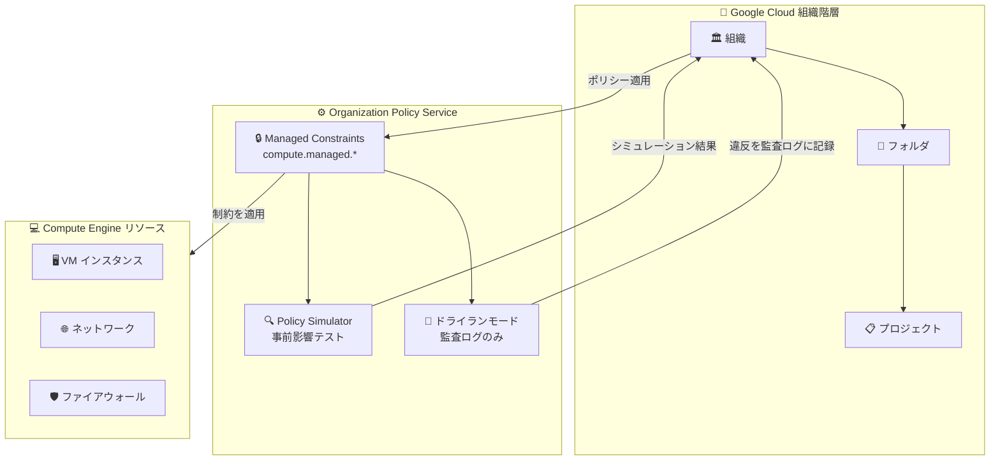

# Compute Engine: Organization Policy の Managed Constraints が GA

**リリース日**: 2026-03-04

**サービス**: Compute Engine

**機能**: Managed Constraints for Organization Policy

**ステータス**: GA (一般提供開始)

📊 [このアップデートのインフォグラフィックを見る](https://takech9203.github.io/google-cloud-news-summary/20260304-compute-engine-managed-constraints-ga.html)

## 概要

Compute Engine リソースに対する Organization Policy Service の Managed Constraints が一般提供 (GA) となった。Managed Constraints は、従来のレガシー制約 (`compute.*` プレフィックス) を置き換える新しい制約体系であり、`compute.managed.*` プレフィックスで識別される。

Managed Constraints を使用することで、組織全体の Compute Engine リソースに対して一元的かつプログラム的なガバナンス制御が可能になる。特に重要なのは、Policy Simulator やドライランモードといった安全なロールアウトツールのビルトインサポートが含まれている点であり、本番環境に適用する前にポリシー変更の影響を事前に検証できる。

対象ユーザーは、組織のセキュリティポリシー管理者、クラウドガバナンス担当者、および大規模な Google Cloud 環境を運用するプラットフォームエンジニアリングチームである。

**アップデート前の課題**

- レガシー制約 (`compute.*`) では Policy Simulator によるポリシー変更の事前テストが利用できなかった
- ドライランモードが使えず、ポリシー適用による影響を本番環境で直接確認するしかなかった
- レガシー制約はリスト型またはブーリアン型の単純なルールに限定されており、パラメータによる柔軟な制御ができなかった
- ポリシー変更のロールアウト時にサービス停止のリスクがあった

**アップデート後の改善**

- `compute.managed.*` プレフィックスの新しい Managed Constraints により、Policy Intelligence ツールとの統合が実現
- Policy Simulator を使ってポリシー変更の影響を事前にシミュレーション可能になった
- ドライランモードにより、ポリシー違反を監査ログに記録しつつ実際のアクションはブロックしない段階的な適用が可能になった
- パラメータ付き制約のサポートにより、より細かい粒度でのリソース制御が可能になった

## アーキテクチャ図



Organization Policy Service の Managed Constraints は組織階層に沿ってポリシーを適用し、Policy Simulator とドライランモードにより安全なロールアウトを実現する。

## サービスアップデートの詳細

### 主要機能

1. **Managed Constraints (`compute.managed.*`)**
   - レガシー制約 (`compute.*`) を置き換える新しい制約体系
   - Google が管理する制約であり、カスタム制約と同様の構造を持つ
   - ブーリアン型とパラメータ付きリスト型の両方をサポート

2. **Policy Simulator 統合**
   - ポリシー変更を本番環境に適用する前に、現在の環境でどのリソースが影響を受けるかをシミュレーション可能
   - 既存リソースの設定をスキャンし、違反が発生する箇所を事前に特定
   - Google Cloud コンソールおよび gcloud CLI から利用可能

3. **ドライランモード**
   - ポリシーを「監視のみ」モードで適用し、違反を監査ログに記録
   - 実際のリソース作成・変更はブロックせず、30 日間の影響を確認可能
   - ドライランで安全性を確認後、本番ポリシーへ昇格可能

4. **GA となった主な Compute Engine Managed Constraints**
   - `compute.managed.requireOsConfig` - VM Manager (OS Config) の有効化を強制
   - `compute.managed.requireOsLogin` - OS Login の有効化を強制
   - `compute.managed.vmExternalIpAccess` - 外部 IP アドレスの使用を制限
   - `compute.managed.vmCanIpForward` - IP フォワーディングの制限
   - `compute.managed.restrictProtocolForwardingCreationForTypes` - プロトコルフォワーディングのタイプ制限

## 技術仕様

### Managed Constraints の構造

| 項目 | 詳細 |
|------|------|
| プレフィックス | `compute.managed.*` |
| 制約タイプ | ブーリアン型、パラメータ付きリスト型 |
| ポリシー継承 | 組織 → フォルダ → プロジェクトの階層で継承 |
| 条件付きルール | タグベースの条件付き適用をサポート |
| Policy Intelligence | Policy Simulator、ドライランモード対応 |
| スコープ | VM インスタンス、プロジェクト、ゾーンレベルのメタデータを評価 |

### 設定例 (gcloud CLI)

```yaml
# Managed Constraint を使用した組織ポリシーの例
name: organizations/1234567890123/policies/compute.managed.requireOsLogin
spec:
  rules:
    - enforce: true
```

## 設定方法

### 前提条件

1. Organization Policy 管理者ロール (`roles/orgpolicy.policyAdmin`) が付与されていること
2. 組織リソースが作成されていること

### 手順

#### ステップ 1: 利用可能な Managed Constraints の確認

```bash
gcloud org-policies list-custom-constraints \
  --organization=ORGANIZATION_ID
```

#### ステップ 2: Policy Simulator で影響をテスト

Google Cloud コンソールの「組織のポリシー」ページから対象の Managed Constraint を選択し、「変更をテスト」をクリックしてシミュレーションを実行する。

#### ステップ 3: ドライランモードで適用

```bash
# ドライランポリシーの設定
gcloud org-policies set-policy POLICY_FILE.yaml \
  --update-mask=spec.dryRunSpec
```

ドライランモードでは違反が監査ログに記録されるが、実際のアクションはブロックされない。

#### ステップ 4: 本番ポリシーとして適用

```bash
# ドライランの結果を確認後、本番ポリシーを設定
gcloud org-policies set-policy POLICY_FILE.yaml
```

## メリット

### ビジネス面

- **ガバナンス強化**: 組織全体のセキュリティポリシーを一元管理でき、コンプライアンス要件への対応が容易になる
- **リスク低減**: Policy Simulator とドライランモードにより、ポリシー変更によるサービス停止リスクを大幅に低減できる

### 技術面

- **段階的ロールアウト**: シミュレーション → ドライラン → 本番適用の段階を踏むことで安全にポリシーを展開可能
- **タグベースの条件制御**: タグを使って特定の VM インスタンスを制約の適用対象外にでき、例外管理が柔軟
- **メタデータレベルの評価**: VM インスタンス、プロジェクト、ゾーンレベルのメタデータを統合的に評価可能

## デメリット・制約事項

### 制限事項

- レガシー制約からの移行が必要であり、既存のポリシー設定の見直しが求められる
- ドライランモードで利用可能な制約は限定されている (すべての制約でドライランが使えるわけではない)
- 組織リソースが必要であり、個人アカウントでは利用できない

### 考慮すべき点

- レガシー制約と Managed Constraints が並行して存在する期間があるため、移行計画を策定する必要がある
- Policy Simulator の結果は現時点のリソース状態に基づくため、将来のリソース変更は反映されない
- 階層的なポリシー継承の仕組みを理解した上で設計する必要がある

## ユースケース

### ユースケース 1: 外部 IP アドレスの段階的な制限

**シナリオ**: 大規模な組織で、VM インスタンスの外部 IP アドレス使用を制限したいが、既存のワークロードへの影響を事前に把握したい。

**実装例**:
```yaml
# 1. まずドライランモードで影響を確認
name: organizations/123456/policies/compute.managed.vmExternalIpAccess
dryRunSpec:
  rules:
    - enforce: true
```

**効果**: ドライランモードで 30 日間の違反状況を監視し、影響を受けるワークロードを特定した上で本番適用に移行できる。

### ユースケース 2: OS Login の組織全体への強制適用

**シナリオ**: セキュリティチームが組織全体で OS Login の有効化を義務付けたいが、一部の開発環境では例外を設けたい。

**効果**: `compute.managed.requireOsLogin` をタグベースの条件付きルールと組み合わせることで、本番環境では強制適用しつつ開発環境には例外を許容する柔軟な運用が可能。

## 料金

Organization Policy Service (Managed Constraints を含む) は無料で提供される。追加の料金は発生しない。

- [Organization Policy 料金情報](https://cloud.google.com/resource-manager/docs/organization-policy/overview#pricing)

## 関連サービス・機能

- **Policy Intelligence**: Policy Simulator を含むツールセットで、ポリシー変更の影響分析を支援
- **Resource Manager**: 組織階層の管理とポリシーの階層的な適用を担う基盤サービス
- **Cloud Audit Logs**: ドライランモードでの違反ログの出力先
- **Security Command Center**: 組織ポリシー違反の検出と可視化に活用可能
- **IAM**: Organization Policy 管理者ロールの付与に使用

## 参考リンク

- 📊 [インフォグラフィック](https://takech9203.github.io/google-cloud-news-summary/20260304-compute-engine-managed-constraints-ga.html)
- [公式リリースノート](https://docs.cloud.google.com/release-notes#March_04_2026)
- [Organization Policy の概要](https://cloud.google.com/resource-manager/docs/organization-policy/overview)
- [Managed Constraints の使用](https://cloud.google.com/resource-manager/docs/organization-policy/using-constraints#managed-constraints)
- [Organization Policy 制約一覧](https://cloud.google.com/resource-manager/docs/organization-policy/org-policy-constraints)
- [ドライランモード](https://cloud.google.com/resource-manager/docs/organization-policy/dry-run-policy)
- [Policy Simulator](https://cloud.google.com/policy-intelligence/docs/test-organization-policies)
- [Compute Engine カスタム制約](https://cloud.google.com/compute/docs/access/custom-constraints)

## まとめ

Compute Engine の Managed Constraints が GA となったことで、組織全体の Compute Engine リソースに対するガバナンスが大幅に強化された。特に Policy Simulator とドライランモードのビルトインサポートにより、ポリシー変更を安全にロールアウトできる点が最大の価値である。レガシー制約 (`compute.*`) を使用している組織は、`compute.managed.*` への移行を計画し、段階的に新しい制約体系への切り替えを進めることを推奨する。

---

**タグ**: #ComputeEngine #OrganizationPolicy #ManagedConstraints #Governance #Security #PolicySimulator #DryRun #GA
