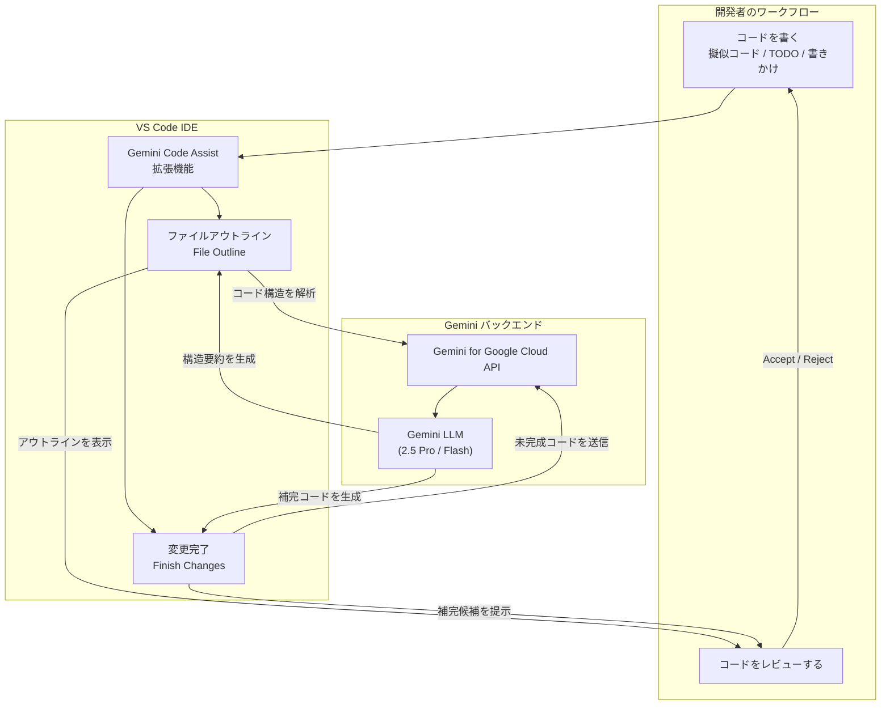

# Gemini Code Assist: ファイルアウトラインと変更完了機能 VS Code GA

**リリース日**: 2026-03-04

**サービス**: Gemini Code Assist

**機能**: ファイルアウトライン / 変更完了 (Finish Changes)

**ステータス**: GA (一般提供)

📊 [このアップデートのインフォグラフィックを見る](https://takech9203.github.io/google-cloud-news-summary/20260304-gemini-code-assist-vs-code-ga.html)

## 概要

Gemini Code Assist の「ファイルアウトライン (File Outline)」と「変更完了 (Finish Changes)」の 2 つの機能が、VS Code で一般提供 (GA) となった。これらの機能は、2025 年 12 月に IntelliJ 向けにプレビューとして初めてリリースされ、2026 年 2 月 24 日に IntelliJ で GA となっていたが、VS Code ではこれまでサポートされていなかった。今回のアップデートにより、VS Code ユーザーもこれらの AI 支援機能を本番環境で利用できるようになる。

ファイルアウトライン機能は、コードファイルの構造的な概要を AI が自動生成し、コードブロックごとの短い要約を提供する。変更完了機能は、AI ペアプログラマーとして作業中のコードを観察し、擬似コード、#TODO コメント、書きかけのコードを検出して自動的に補完する。両機能により、開発者はコードの理解と実装のスピードを大幅に向上させることができる。

これらの機能は Gemini Code Assist Standard および Enterprise エディションの利用者、ならびに Gemini Code Assist for Individuals の利用者が使用可能である。

**アップデート前の課題**

- ファイルアウトラインと変更完了機能は IntelliJ のみで利用可能であり、VS Code ユーザーはこれらの機能を使用できなかった
- VS Code ユーザーはコードファイルの構造把握に手動での確認作業が必要だった
- 擬似コードや TODO コメントからのコード補完には、チャットでの明示的なプロンプト入力が必要だった
- IntelliJ と VS Code の間で Gemini Code Assist の機能パリティに差があった

**アップデート後の改善**

- VS Code でファイルアウトライン機能が利用可能になり、コードの構造を AI が自動的に要約・表示する
- VS Code で変更完了機能が利用可能になり、書きかけのコードや TODO を AI が自動検出して補完する
- IntelliJ と VS Code の両方で同等の AI コーディング支援が提供されるようになった
- GA ステータスにより本番ワークロードでの使用が Google Cloud サービス規約でサポートされる

## アーキテクチャ図

この図は、VS Code 上で開発者がコードを書く際に、ファイルアウトライン機能と変更完了機能がどのように連携し、Gemini バックエンドを通じて AI 支援を提供するかを示している。

## サービスアップデートの詳細

### 主要機能

1. **ファイルアウトライン (File Outline)**
   - IDE でフォーカス中のファイルに対して、AI がコードブロックごとの短い英語の要約を自動生成する
   - Gemini Code Assist チャットペインの「Outline」タブでアウトラインを確認可能
   - アウトラインをコードファイル内にインラインで表示するオプションあり
   - ファイルに変更を加えた場合、自動再生成ではなく手動で「Refresh outline」を実行して更新する
   - 設定から自動アウトライン生成を無効化し、手動生成に切り替えることが可能

2. **変更完了 (Finish Changes)**
   - 作業中のファイル内の擬似コード、#TODO コメント、書きかけのコードを AI が検出し、コード補完候補を生成する
   - 右クリックメニューの「Gemini > Finish changes」またはキーボードショートカットで起動
   - 各コード補完候補に対して個別に「Accept」または「Reject」を選択可能
   - ファイル上部で「Accept all」または「Reject all」による一括操作にも対応
   - 複雑なプロンプトを入力する必要がなく、コーディングのフローを維持できる

3. **VS Code と IntelliJ の機能パリティ達成**
   - 今回の GA により、Gemini Code Assist の主要な AI コーディング支援機能が VS Code と IntelliJ の両方で完全にサポートされる
   - 既に GA となっているエージェントモード、モデル選択、インラインコード補完などと合わせて、包括的な開発体験を提供

## 技術仕様

### 対応環境

| 項目 | 詳細 |
|------|------|
| 対応 IDE | VS Code, IntelliJ (JetBrains IDE) |
| ステータス | GA (一般提供) |
| 対応エディション | Gemini Code Assist Standard, Enterprise, For Individuals |
| 使用モデル | Gemini 2.5 Pro / Gemini 2.5 Flash (GA) |
| API | Gemini for Google Cloud API (cloudaicompanion.googleapis.com) |

### 機能タイムライン

| 日付 | イベント |
|------|---------|
| 2025-12-05 | IntelliJ でファイルアウトラインと変更完了がプレビューリリース |
| 2026-02-24 | IntelliJ でファイルアウトラインと変更完了が GA |
| 2026-03-04 | VS Code でファイルアウトラインと変更完了が GA |

## 設定方法

### 前提条件

1. VS Code がインストールされていること
2. Gemini Code Assist VS Code 拡張機能がインストールされていること
3. Google アカウントでサインインし、Gemini for Google Cloud API が有効化された Google Cloud プロジェクトが選択されていること
4. Gemini Code Assist のライセンス (Standard, Enterprise, または For Individuals) が割り当てられていること

### 手順

#### ステップ 1: Gemini Code Assist 拡張機能の確認

VS Code のアクティビティバーで Gemini Code Assist アイコンをクリックし、サインイン状態とプロジェクト設定を確認する。拡張機能が最新バージョンに更新されていることを確認する。

#### ステップ 2: ファイルアウトラインの利用

1. VS Code でコードファイルを開く
2. Gemini Code Assist チャットペインの「Outline」タブをクリック
3. フォーカス中のファイルのアウトラインが自動生成される
4. 必要に応じて Eye アイコンをクリックしてインライン表示に切り替える

#### ステップ 3: 変更完了の利用

1. コードファイル内に擬似コード、#TODO コメント、または書きかけのコードがあることを確認する
2. ファイルウィンドウ内で右クリックし、「Gemini > Finish changes」を選択 (またはキーボードショートカットを使用)
3. Gemini Code Assist がコード補完候補を生成する
4. 各候補に対して「Accept」または「Reject」を選択する

#### ステップ 4 (任意): 自動アウトライン生成の設定変更

VS Code の設定から Extensions > Gemini Code Assist に移動し、「Enable automatic outline generation」のトグルで自動生成の有効/無効を切り替えることができる。

## メリット

### ビジネス面

- **開発生産性の向上**: ファイルアウトラインにより、既存コードの理解にかかる時間が短縮され、新規メンバーのオンボーディングが加速する
- **コーディング時間の短縮**: 変更完了機能により、定型的なコード実装や TODO の消化が自動化され、開発者はより高レベルな設計に集中できる
- **IDE 選択の柔軟性**: VS Code と IntelliJ の両方で同等の機能が利用可能になり、チーム内で異なる IDE を使用していても統一された AI 支援体験を得られる

### 技術面

- **コード構造の可視化**: アウトライン機能により、大規模なコードファイルの構造を素早く把握でき、コードナビゲーションが容易になる
- **コンテキスト認識型補完**: 変更完了機能はファイル全体のコンテキストを理解した上で補完を行うため、単純なコード補完よりも精度の高い提案が可能
- **本番環境での信頼性**: GA ステータスにより、Google Cloud のサービスレベル契約 (SLA) の対象となり、本番ワークロードでの利用が保証される

## デメリット・制約事項

### 制限事項

- アウトラインはセッション間で永続化されないため、新しい IDE セッション開始時に再生成が必要
- ファイルに変更を加えた後、アウトラインは自動更新されず手動で「Refresh outline」を実行する必要がある
- アウトラインの要約は現時点では英語のみで生成される
- 変更完了機能は現在のファイル内のみで動作し、複数ファイルにまたがる変更の自動補完には対応していない

### 考慮すべき点

- AI による補完結果は常に正確とは限らないため、生成されたコードのレビューと検証が推奨される
- 大規模なファイルではアウトライン生成や変更完了の処理に時間がかかる場合がある
- ファイアウォール環境では cloudaicompanion.googleapis.com への通信許可が必要

## ユースケース

### ユースケース 1: レガシーコードベースの理解

**シナリオ**: 新しいチームメンバーが大規模なレガシーコードベースに参加し、数千行のコードファイルの構造を把握する必要がある。

**効果**: ファイルアウトライン機能により、各コードブロックの概要が自動生成され、ファイル全体の構造を俯瞰できる。従来は手動でコードを読み進める必要があったが、AI が生成した要約により理解時間を大幅に短縮できる。

### ユースケース 2: プロトタイプからの本実装

**シナリオ**: 開発者が擬似コードと TODO コメントでプロトタイプの骨格を記述し、そこから本実装を進めたい。

**効果**: 変更完了機能が擬似コードと TODO を検出し、実装コードを自動生成する。開発者は高レベルの設計に集中しながら、AI が詳細な実装を補完するため、開発フローが中断されない。

### ユースケース 3: コードレビューの効率化

**シナリオ**: コードレビュー担当者が、レビュー対象のファイルの全体像を素早く把握したい。

**効果**: ファイルアウトラインのインライン表示を利用して、各コードブロックの概要をコード内に直接表示することで、レビューの焦点を効率的に絞り込める。

## 料金

Gemini Code Assist の料金は利用するエディションによって異なる。ファイルアウトラインと変更完了機能は各エディションの既存ライセンスに含まれており、追加料金は発生しない。

| エディション | 料金 | 備考 |
|-------------|------|------|
| Gemini Code Assist for Individuals (Standard) | 無料 | Google Developer Program Standard プラン |
| Gemini Code Assist Standard | サブスクリプション (組織向け) | 新規顧客は初月最大 50 ライセンス無料 |
| Gemini Code Assist Enterprise | サブスクリプション (組織向け、最低 10 ライセンス) | コードカスタマイズ機能など追加機能あり |

詳細な料金情報については [Gemini Code Assist の料金ページ](https://cloud.google.com/products/gemini/pricing) を参照。

## 関連サービス・機能

- **Cloud Workstations**: クラウドベースの開発環境で Gemini Code Assist と統合して使用可能
- **Cloud Code**: Google Cloud 向け IDE 拡張機能で、Gemini Code Assist と連携してクラウドアプリケーション開発を支援
- **Gemini Code Assist エージェントモード**: 複雑なマルチステップタスクを AI エージェントが支援する機能 (GA)
- **Next Edit Predictions**: コーディング中に次の編集箇所を予測して提案する機能
- **コードカスタマイズ**: Enterprise エディションで利用可能な、プライベートコードリポジトリに基づくカスタマイズ機能

## 参考リンク

- 📊 [インフォグラフィック](https://takech9203.github.io/google-cloud-news-summary/20260304-gemini-code-assist-vs-code-ga.html)
- [公式リリースノート](https://docs.cloud.google.com/release-notes#March_04_2026)
- [Gemini Code Assist リリースノート](https://docs.cloud.google.com/gemini/docs/codeassist/release-notes)
- [ファイルアウトライン ドキュメント](https://docs.cloud.google.com/gemini/docs/codeassist/chat-gemini#outline)
- [変更完了 (Finish Changes) ドキュメント](https://docs.cloud.google.com/gemini/docs/codeassist/write-code-gemini#finish-changes)
- [Gemini Code Assist 概要](https://docs.cloud.google.com/gemini/docs/codeassist/overview)
- [Gemini Code Assist セットアップガイド](https://docs.cloud.google.com/gemini/docs/codeassist/set-up-gemini)
- [料金ページ](https://cloud.google.com/products/gemini/pricing)

## まとめ

今回のアップデートにより、Gemini Code Assist のファイルアウトラインと変更完了機能が VS Code で GA となり、世界で最も広く使用されている IDE の一つで本番レベルの AI コーディング支援が利用可能になった。VS Code ユーザーは、コード構造の自動要約と書きかけコードの AI 補完により、開発生産性を大幅に向上させることができる。既に Gemini Code Assist を利用中の組織は、VS Code 拡張機能を最新バージョンに更新するだけでこれらの機能を即座に利用開始できるため、早期の導入を推奨する。

---

**タグ**: #GeminiCodeAssist #VSCode #AI #コーディング支援 #ファイルアウトライン #FinishChanges #GA #開発生産性 #IDE #GeminiForGoogleCloud
