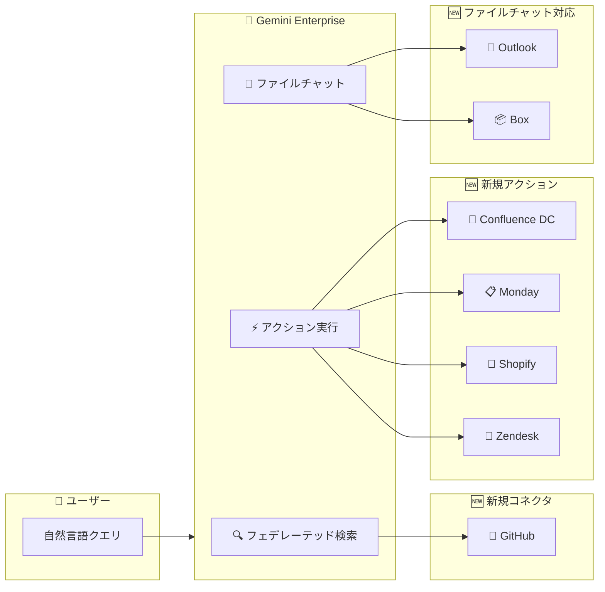

# Gemini Enterprise: 新しいデータコネクタ、アクション、ファイルチャット機能

**リリース日**: 2026-03-04

**サービス**: Gemini Enterprise

**機能**: New Data Connectors, Actions, and File Chat

**ステータス**: Public Preview

📊 [このアップデートのインフォグラフィックを見る](https://takech9203.github.io/google-cloud-news-summary/20260304-gemini-enterprise-connectors-actions.html)

## 概要

Gemini Enterprise に 3 つの重要なアップデートが同時にリリースされた。まず、GitHub データコネクタが Public Preview として追加され、GitHub リポジトリのデータを Gemini Enterprise に接続して検索・活用できるようになった。次に、Confluence Data Center、Monday、Shopify、Zendesk の 4 つのコネクタに対して新しいアクション機能が Public Preview で提供開始された。さらに、Microsoft Outlook および Box コネクタにおいて、メール添付ファイルや CSV/PDF/PPTX/XLSX ファイルに対するチャット機能が追加された。

これらのアップデートにより、Gemini Enterprise のデータコネクタエコシステムが大幅に拡張され、開発者やビジネスユーザーが日常的に利用する外部サービスとの統合がさらに深まった。特に GitHub コネクタの追加は、ソフトウェア開発チームが Gemini Enterprise を通じてコードリポジトリの情報に自然言語でアクセスできるようになる点で注目される。

**アップデート前の課題**

- GitHub のリポジトリデータを Gemini Enterprise で検索・活用するには、手動でデータをエクスポートするか、カスタムコネクタを構築する必要があった
- Confluence Data Center、Monday、Shopify、Zendesk のコネクタでは検索のみが可能で、データの作成・更新などの書き込みアクションは実行できなかった
- Microsoft Outlook や Box に保存されたファイル (添付ファイル、CSV、PDF など) の内容を分析するには、ファイルをダウンロードして手動でアップロードする必要があった

**アップデート後の改善**

- GitHub データコネクタにより、リポジトリのコード、Issue、PR などの情報を Gemini Enterprise から直接検索・参照できるようになった
- Confluence Data Center ではアタッチメントのアップロード、Monday ではボードやアイテムの操作、Shopify では顧客・注文・商品データの操作、Zendesk ではチケットの作成・更新・マージなどが自然言語コマンドで実行可能になった
- Outlook のメール添付ファイルや Box に保存された CSV/PDF/PPTX/XLSX ファイルに対して、ダウンロードせずに直接チャットで分析・質問できるようになった

## アーキテクチャ図



Gemini Enterprise のコネクタエコシステムにおける今回のアップデートの全体像を示す。ユーザーは自然言語で Gemini Enterprise に指示し、新しい GitHub コネクタでの検索、4 つのコネクタでのアクション実行、Outlook/Box でのファイルチャットが可能になった。

## サービスアップデートの詳細

### 主要機能

1. **GitHub データコネクタ (Public Preview)**
   - GitHub リポジトリのデータストアを Gemini Enterprise に接続可能
   - フェデレーテッド検索により、リポジトリ内のコード、Issue、Pull Request などの情報を自然言語で検索
   - データストア作成後、アプリケーションに接続して利用開始

2. **新しいアクション機能 (Public Preview)**
   - **Confluence Data Center**: アタッチメントのアップロードなどの書き込みアクション
   - **Monday**: ボード、アイテム、ユーザーに対する操作アクション
   - **Shopify**: 顧客、注文、商品データに対する操作アクション
   - **Zendesk**: チケットの作成、更新、マージ、カテゴリ作成、投稿更新のアクション

3. **コネクタ内ファイルチャット機能**
   - **Microsoft Outlook**: メール添付ファイルの内容を直接分析・チャット可能
   - **Box**: コネクタ内の CSV、PDF、PPTX、XLSX ファイルに対して直接チャット可能
   - ファイルをダウンロード・再アップロードする手間が不要

## 技術仕様

### Zendesk アクション一覧

| アクション | 説明 |
|------|------|
| Create ticket | 新しいチケットを作成 |
| Update ticket | 既存チケットを更新 |
| Create category | 新しいカテゴリを作成 |
| Update post | 既存の投稿を更新 |
| Merge tickets | 複数のチケットをマージ |

### Box アクション一覧

| アクション | 説明 |
|------|------|
| Copy file | 指定フォルダにファイルの複製を作成 |
| Upload file | Box の指定フォルダにファイルをアップロード |
| Download file | Box からファイルをダウンロード |

### Confluence Data Center アクション一覧

| アクション | 説明 |
|------|------|
| Upload attachment | Confluence ページにアタッチメントを追加 |

### ファイルチャット対応フォーマット

| ファイル形式 | 最大サイズ |
|------|------|
| PDF | 100 MB |
| XLSX | 50 MB (解凍後) |
| CSV | 7 MB |
| PPTX | 100 MB |

### 必要な権限 (Zendesk の例)

| 接続モード | スコープ | 目的 |
|------|------|------|
| フェデレーテッド検索 | `read`, `users:read` | Zendesk データ全体の検索 |
| 検索 + アクション | `tickets:write` | チケットの作成・更新・マージ |
| 検索 + アクション | `hc:write` | カテゴリ作成と投稿更新 |

## 設定方法

### 前提条件

1. Google Cloud プロジェクトで Gemini Enterprise が有効化されていること
2. Discovery Engine Editor ロール (`roles/discoveryengine.editor`) が付与されていること
3. 各外部サービス (GitHub、Confluence DC、Monday、Shopify、Zendesk) の管理者権限

### 手順

#### ステップ 1: データストアの作成

```
Google Cloud コンソール > Gemini Enterprise > Data Stores > Create data store
```

ソース選択画面から接続したいサービス (GitHub、Monday、Shopify、Zendesk など) を選択する。

#### ステップ 2: 認証設定

各コネクタに応じた OAuth 2.0 認証情報を入力する。

- **Monday**: Client ID と Client Secret を入力
- **Shopify**: Client ID と Client Secret を入力し、必要なスコープ (`read_customers`, `read_orders`, `read_products`) を設定
- **Zendesk**: Instance URI、Client ID、Client Secret を入力後、ログインして認証

#### ステップ 3: アクションの有効化

データストア作成後、Actions ページからアクションを有効化する。

```
Gemini Enterprise > Data Stores > [データストア名] > Actions > Enable actions
```

#### ステップ 4: ファイルチャットの利用 (Outlook/Box)

チャットボックスで「Connectors」をクリックし、対象のコネクタを有効化してからファイルに関する質問を入力する。

## メリット

### ビジネス面

- **統合された情報アクセス**: GitHub、Confluence、Monday、Shopify、Zendesk など複数のビジネスツールのデータに単一のインターフェースからアクセス可能
- **業務効率化**: 自然言語でチケット作成やデータ更新が行えるため、ツール切り替えの手間を削減
- **迅速なファイル分析**: 添付ファイルや保存ファイルをダウンロードせずに直接分析でき、意思決定の速度が向上

### 技術面

- **フェデレーテッド検索**: 権限を考慮した検索により、セキュリティを維持しながら横断的なデータアクセスを実現
- **拡張性のあるコネクタエコシステム**: 標準コネクタに加えてカスタムコネクタも構築可能で、組織固有のデータソースにも対応
- **VPC Service Controls 対応**: セキュリティ要件の厳しい環境でもデータストアを再作成することで VPC Service Controls の適用が可能

## デメリット・制約事項

### 制限事項

- 全てのコネクタは Public Preview ステータスであり、SLA の保証がない (Pre-GA Offerings Terms が適用)
- データストアのロケーションは Global、US、EU のみサポート
- 1 つのアプリケーションに対して、同一コネクタタイプのデータストアを複数関連付けることは非推奨
- 既存のデータストアに VPC Service Controls を後から適用する場合は、データストアの再作成が必要

### 考慮すべき点

- GitHub コネクタの具体的な検索対象エンティティ (コード、Issue、PR など) の詳細は正式ドキュメントで確認が必要
- ファイルチャット機能使用時は、対象コネクタ以外のコネクタと Google Search をオフにすることが推奨される
- Outlook のファイルチャットでは、メール添付ファイルの分析に Download attachments アクションの有効化が必要な場合がある

## ユースケース

### ユースケース 1: ソフトウェア開発チームのナレッジ統合

**シナリオ**: 開発チームが GitHub のコードリポジトリ、Confluence のドキュメント、Monday のプロジェクト管理ボードを横断して情報を検索したい場合

**効果**: Gemini Enterprise を通じて「この機能に関連する設計ドキュメントと実装コードを見せて」といった自然言語クエリで、複数ツールのデータを一括検索できる。ツール間の切り替えが不要になり、コンテキストスイッチのコストが削減される。

### ユースケース 2: カスタマーサポートの効率化

**シナリオ**: サポートチームが Zendesk でチケット管理を行いつつ、Outlook のメール添付ファイル (レポート、ログファイル) を分析する必要がある場合

**効果**: Zendesk のチケット作成・更新を自然言語で実行し、同時に Outlook の添付ファイルの内容を直接チャットで分析できる。「添付のログファイルからエラーの原因を特定して」といった指示で迅速に対応可能。

### ユースケース 3: EC サイト運営のデータ分析

**シナリオ**: Shopify で EC サイトを運営しており、Box に保存された売上レポート (XLSX) を分析しながら在庫管理を行いたい場合

**効果**: Shopify コネクタで注文・商品データを検索しつつ、Box の XLSX ファイルに対して「先月の売上トップ 10 商品を教えて」などと直接チャットで分析できる。

## 料金

Gemini Enterprise の料金はエディションによって異なる。コネクタ機能は全てのエディションで利用可能だが、サードパーティコネクタの完全なエコシステムへのアクセスは Standard、Plus、Frontline エディションで提供される。

| エディション | 特徴 |
|--------|--------|
| Business | 1-300 ユーザー、25 GiB/ユーザー/月、セグメント関連コネクタのみ |
| Standard | 1+ ユーザー、30 GiB/ユーザー/月、全データコネクタエコシステム |
| Plus | 1+ ユーザー、75 GiB/ユーザー/月、全データコネクタエコシステム |
| Frontline | 150+ ユーザー (Standard/Plus 併用)、2 GiB/ユーザー/月 |

詳細な料金については [Gemini Enterprise ライセンスページ](https://cloud.google.com/gemini/enterprise/docs/licenses) を参照。

## 利用可能リージョン

全てのコネクタは以下のリージョンで利用可能:

- **Global**
- **US** (米国)
- **EU** (欧州連合)

## 関連サービス・機能

- **Gemini Enterprise Agent Designer**: ノーコードでカスタムエージェントを構築し、コネクタのデータを活用したエージェントを作成可能
- **Vertex AI Search (Discovery Engine API)**: Gemini Enterprise のバックエンドで使用される検索エンジン。カスタムコネクタの構築にも利用
- **VPC Service Controls**: コネクタのデータストアに対するセキュリティ境界を設定し、データの流出を防止
- **Cloud Key Management Service (CMEK)**: データストアの暗号化にカスタマー管理の暗号鍵を使用可能
- **Identity Provider (IdP)**: コネクタの権限管理とアクセス制御に使用

## 参考リンク

- 📊 [インフォグラフィック](https://takech9203.github.io/google-cloud-news-summary/20260304-gemini-enterprise-connectors-actions.html)
- [公式リリースノート](https://docs.cloud.google.com/release-notes#March_04_2026)
- [Gemini Enterprise リリースノート](https://docs.cloud.google.com/gemini/enterprise/docs/release-notes)
- [コネクタのアクション管理](https://docs.cloud.google.com/gemini/enterprise/docs/connectors/manage-actions)
- [Zendesk コネクタ](https://docs.cloud.google.com/gemini/enterprise/docs/connectors/zendesk)
- [Shopify コネクタ](https://docs.cloud.google.com/gemini/enterprise/docs/connectors/shopify)
- [Monday コネクタ](https://docs.cloud.google.com/gemini/enterprise/docs/connectors/monday)
- [Confluence Data Center コネクタ](https://docs.cloud.google.com/gemini/enterprise/docs/connectors/confluence-dc)
- [Box コネクタ](https://docs.cloud.google.com/gemini/enterprise/docs/connectors/box)
- [Microsoft Outlook コネクタ](https://docs.cloud.google.com/gemini/enterprise/docs/connectors/ms-outlook)
- [ファイルチャット機能](https://docs.cloud.google.com/gemini/enterprise/docs/assistant-chat)
- [Gemini Enterprise エディション](https://docs.cloud.google.com/gemini/enterprise/docs/editions)

## まとめ

今回の Gemini Enterprise アップデートは、GitHub データコネクタの追加、4 つのコネクタへのアクション機能の拡張、Outlook/Box でのファイルチャット対応という 3 つの柱で構成されており、エンタープライズ AI アシスタントとしての機能が大幅に強化された。特にソフトウェア開発、カスタマーサポート、EC 運営など幅広い業務シナリオで即座に活用可能なアップデートであるため、Gemini Enterprise を導入済みの組織は各コネクタの設定を検討し、Public Preview 段階から評価を開始することを推奨する。

---

**タグ**: #GeminiEnterprise #DataConnectors #GitHub #Zendesk #Shopify #Monday #ConfluenceDataCenter #Box #MicrosoftOutlook #FileChat #Actions #PublicPreview
