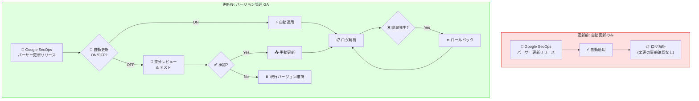

# Google SecOps: Manage Parser Versions が GA (一般提供) に昇格

**リリース日**: 2026-03-04

**サービス**: Google SecOps (Google Security Operations)

**機能**: Manage Parser Versions (パーサーバージョン管理)

**ステータス**: GA (General Availability)

📊 [このアップデートのインフォグラフィックを見る](https://takech9203.github.io/google-cloud-news-summary/20260304-google-secops-parser-versions-ga.html)

## 概要

Google SecOps の「Manage Parser Versions (パーサーバージョン管理)」機能が GA (一般提供) に昇格しました。この機能は 2025 年 10 月に Preview としてリリースされており、約 5 か月間の Preview 期間を経て本番環境での利用が正式にサポートされます。

この機能により、セキュリティ運用チームはプレビルトパーサーのバージョンを詳細に制御できるようになります。自動更新のオン/オフ、バージョン間のロジック比較、手動更新、ロールバックといった操作が可能で、パーサー更新による予期しないログ解析の変更を防止できます。

対象ユーザーは Google SecOps を利用するセキュリティアナリスト、SOC チーム、およびセキュリティ基盤の管理者です。特に大規模なログ取り込みを行っている組織や、厳格な変更管理プロセスを持つ組織にとって重要なアップデートです。

**アップデート前の課題**

- プレビルトパーサーの更新が自動的に適用されるため、更新後にログ解析結果が変わるリスクがあった
- パーサーのバージョン間でロジックの差分を確認する標準的な方法がなかった
- 更新に問題があった場合、以前のバージョンへのロールバックが容易ではなかった
- 変更管理プロセスに沿ったパーサー更新のタイミング制御ができなかった

**アップデート後の改善**

- 自動更新のオプトイン/オプトアウトにより、パーサー更新のタイミングを組織のポリシーに合わせて制御可能になった
- バージョン間のコード差分、チェンジログ、UDM 出力の比較が可能になった
- 問題発生時に直前のバージョンへワンクリックでロールバックできるようになった
- GA 昇格により、本番環境での利用が SLA 付きで正式サポートされるようになった

## アーキテクチャ図



上図は、パーサーバージョン管理の GA 昇格による変更管理フローの改善を示しています。従来の自動更新のみのフローに対し、GA 機能では自動/手動の選択、差分レビュー、ロールバックを含む包括的なライフサイクル管理が可能です。

## サービスアップデートの詳細

### 主要機能

1. **自動更新のオプトイン/オプトアウト**
   - パーサーごとに自動更新の有効/無効を切り替え可能
   - 自動更新を無効にした場合、手動で更新するか自動更新を再有効化するまで現行バージョンが維持される
   - Settings > Parsers から各パーサーのメニューで操作

2. **バージョン間の比較とレビュー**
   - 現行バージョンと新バージョンのコード差分を表示
   - Change log タブで変更内容のサマリーを確認
   - サンプルログに対する UDM 出力の比較が可能
   - サンプルログを編集して異なるログでのテストも可能

3. **手動バージョン更新**
   - 自動更新を無効にしている場合、任意のタイミングで最新バージョンに更新可能
   - 更新前に Compare parsers ページで差分を確認してから適用
   - 最新バージョンへのアップグレードのみ対応 (中間バージョンへの更新は不可)

4. **バージョンロールバック**
   - 問題発生時に直前に使用していたバージョンへロールバック可能
   - 例: v17.0 から v24.0 にアップグレード後、ロールバックすると v17.0 に戻る (v23.0 ではない)
   - 連続ロールバックは 1 回のみ可能

## 技術仕様

### パーサータイプ

| パーサータイプ | 説明 |
|------|------|
| Prebuilt | Google SecOps が作成・提供する標準パーサー。ログデータを UDM フィールドにマッピング |
| Prebuilt Extended | 顧客が追加マッピングを定義したプレビルトパーサー |
| Custom | 顧客が独自に作成したカスタムパーサー |
| Custom Extended | パーサー拡張を使用した追加マッピング付きカスタムパーサー |

### バージョン管理のタイムライン

| 操作 | 反映時間 |
|------|------|
| 自動更新 ON/OFF の切り替え | 即時 |
| 手動バージョン更新 | 約 20 分後にアクティブ化 |
| ロールバック | 約 30 分 (一時的な解析の不整合が発生する可能性あり) |

### サポートポリシー

| 条件 | サポート内容 |
|------|------|
| 最新安定バージョン使用時 | バグ修正と機能強化が提供される |
| 古いバージョン使用時 (自動更新 OFF) | パッチやアップデートは提供されない。修正は次の安定リリースに含まれるため、手動で最新版にアップグレードが必要 |

### 必要な権限

```
Administrator ロールまたは Editor ロール
```

デフォルトでは Administrator と Editor ロールのユーザーがパーサー更新を管理可能です。カスタム権限の付与により、追加のユーザーやグループにアクセスを許可できます。

## 設定方法

### 前提条件

1. Google SecOps インスタンスへの管理者権限でのアクセス
2. Administrator または Editor ロールの割り当て

### 手順

#### ステップ 1: 自動更新の無効化

Settings > Parsers にアクセスし、対象のプレビルトパーサーのメニューから「Turn off auto updates」を選択します。

#### ステップ 2: バージョンの比較と更新

新バージョンが利用可能な場合、パーサーのメニューから「Update to latest version」を選択します。Compare parsers ページでコード差分、チェンジログ、UDM 出力を確認し、問題がなければ「Update parser」をクリックします。

#### ステップ 3: ロールバック (必要な場合)

更新後に問題が発生した場合、パーサーのメニューから「Roll back to last used version」を選択します。差分を確認し、「Proceed to roll back」をクリックします。

## メリット

### ビジネス面

- **変更管理プロセスの強化**: パーサー更新を組織の変更管理ポリシーに準拠させ、コンプライアンス要件を満たすことが可能
- **運用リスクの低減**: 予期しないパーサー変更によるセキュリティ検知ルールへの影響を防止し、SOC の安定運用を維持
- **GA による SLA 保証**: Preview から GA に昇格したことで、本番環境での利用が正式にサポートされ、エンタープライズでの導入が容易に

### 技術面

- **ログ解析の一貫性**: パーサーバージョンを固定することで、検知ルール (YARA-L) や相関分析の安定性を確保
- **差分レビューによる品質管理**: UDM 出力の比較機能により、パーサー更新がログ解析に与える影響を事前評価可能
- **迅速な障害復旧**: ロールバック機能により、パーサー更新に起因する問題から約 30 分で復旧可能

## デメリット・制約事項

### 制限事項

- ロールバックは直前のバージョンにのみ可能 (連続ロールバックは 1 回まで)
- 中間バージョンへのアップグレードは不可 (最新バージョンへのアップグレードのみ)
- カスタムパーサーがアクティブな場合、プレビューツールでプレビルトパーサーのテストは不可
- パーサー更新の反映に 20 - 30 分かかり、その間に一時的な解析の不整合が発生する可能性がある

### 考慮すべき点

- 自動更新を無効にした場合、バグ修正や機能強化を受け取れないため、定期的な手動更新の運用が必要
- プレビューパーサーのオプトインには自動更新が有効かつ最新バージョンである必要がある
- 大量のプレビルトパーサーを使用している環境では、個別のバージョン管理の運用負荷が増加する可能性がある

## ユースケース

### ユースケース 1: 変更管理プロセスに沿ったパーサー更新

**シナリオ**: 金融機関の SOC チームが、厳格な変更管理プロセスのもとでパーサー更新を管理する。

**実装例**:
1. すべてのプレビルトパーサーの自動更新を無効化
2. 月次の変更管理会議でパーサー更新の差分をレビュー
3. 承認後、メンテナンスウィンドウ内で手動更新を実施
4. 更新後の検知ルールのテストを実施し、問題があればロールバック

**効果**: コンプライアンス要件を満たしつつ、パーサーの最新化を計画的に実施できる

### ユースケース 2: パーサー更新影響の事前評価

**シナリオ**: 大量のカスタム検知ルールを運用している企業が、パーサー更新による UDM フィールドの変更が既存ルールに影響しないか確認する。

**効果**: Compare parsers の UDM 出力比較により、サンプルログでの出力差分を事前に確認し、検知ルールへの影響を評価してから更新を適用できる

## 料金

Google SecOps のパーサーバージョン管理機能は、Google SecOps サブスクリプションに含まれる機能です。追加の料金は発生しません。Google SecOps の料金体系はサブスクリプションベースで、データ取り込み量に応じた課金モデルとなっています。

詳細は [Google SecOps の料金ページ](https://cloud.google.com/chronicle/pricing) を参照してください。

## 関連サービス・機能

- **Google SecOps SIEM**: パーサーはログ取り込みとデータ正規化の中核コンポーネントであり、SIEM の検知・調査機能の基盤
- **YARA-L 検知ルール**: パーサーが生成する UDM イベントに対して検知ルールが実行されるため、パーサーの安定性が検知精度に直結
- **UDM (Unified Data Model)**: パーサーが生ログを UDM 形式に変換。バージョン管理により UDM マッピングの一貫性を維持
- **Cloud Logging**: Google SecOps にログを送信するソースの一つ。パーサーの安定性がログの正規化品質に影響
- **Parser Extensions**: プレビルトパーサーに追加フィールドを抽出する拡張機能。バージョン管理と併用して柔軟なログ解析を実現

## 参考リンク

- 📊 [インフォグラフィック](https://takech9203.github.io/google-cloud-news-summary/20260304-google-secops-parser-versions-ga.html)
- [公式リリースノート](https://docs.cloud.google.com/release-notes#March_04_2026)
- [Manage prebuilt and custom parsers ドキュメント](https://docs.cloud.google.com/chronicle/docs/event-processing/manage-parser-updates)
- [Manage prebuilt parser versions セクション](https://docs.cloud.google.com/chronicle/docs/event-processing/manage-parser-updates#manage-parser-versions)
- [Overview of log parsing](https://docs.cloud.google.com/chronicle/docs/event-processing/parsing-overview)
- [料金ページ](https://cloud.google.com/chronicle/pricing)

## まとめ

Google SecOps の Manage Parser Versions 機能が GA に昇格し、プレビルトパーサーのバージョン管理が本番環境で正式にサポートされるようになりました。セキュリティ運用チームは、自動更新の制御、バージョン比較、手動更新、ロールバックを活用して、変更管理プロセスに沿った安全なパーサー運用を実現できます。特に厳格なコンプライアンス要件を持つ組織は、この機能を活用して検知基盤の安定性と最新化の両立を図ることを推奨します。

---

**タグ**: #GoogleSecOps #SIEM #パーサー管理 #GA #セキュリティ運用 #ログ解析 #UDM #変更管理
