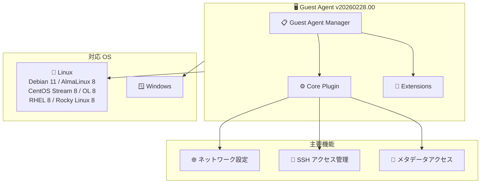

# Guest Environment: Guest Agent v20260228.00

**リリース日**: 2026-03-04

**サービス**: Compute Engine - Guest Environment

**機能**: Guest Agent v20260228.00

**ステータス**: リリース済み

📊 [このアップデートのインフォグラフィックを見る](https://takech9203.github.io/google-cloud-news-summary/20260304-guest-environment-agent-20260228.html)

## 概要

Google Compute Engine のゲストエージェント v20260228.00 がリリースされた。2026 年 3 月 3 日に Linux ディストリビューション (Debian 11、AlmaLinux 8、CentOS Stream 8、Oracle Linux 8、Red Hat Enterprise Linux 8、Rocky Linux 8) 向けに配信が開始され、3 月 4 日に Windows 向けにも配信が開始された。

ゲストエージェントは Compute Engine のゲスト環境の中核コンポーネントであり、VM インスタンス上でネットワーク設定、SSH アクセス管理、メタデータアクセス、OS Login 統合などの重要な機能を担っている。v20250901.00 以降はプラグインベースのアーキテクチャに移行しており、コアプラグインとオプションの拡張機能 (エクステンション) に分離された設計となっている。

## アーキテクチャ図

ゲストエージェントのプラグインベースアーキテクチャと対応 OS の関係を示す。Core Plugin が主要機能を提供し、Guest Agent Manager が全体のライフサイクルを管理する。

## サービスアップデートの詳細

### 主要機能

1. **マルチ OS 対応リリース**
   - Linux 向け: 2026 年 3 月 3 日にリリース (Debian 11、AlmaLinux 8、CentOS Stream 8、Oracle Linux 8、RHEL 8、Rocky Linux 8)
   - Windows 向け: 2026 年 3 月 4 日にリリース

2. **プラグインベースアーキテクチャ**
   - v20250901.00 以降、モノリシック設計からプラグインベースのアーキテクチャに移行済み
   - プラグインの分離実行により、1 つのプラグインのクラッシュが他に影響しない
   - OS レベルのリソース制限により、CPU・メモリの過剰消費を防止

## 技術仕様

### 対応プラットフォーム

| プラットフォーム | リリース日 |
|------|------|
| Debian 11 | 2026-03-03 |
| AlmaLinux 8 | 2026-03-03 |
| CentOS Stream 8 | 2026-03-03 |
| Oracle Linux 8 | 2026-03-03 |
| Red Hat Enterprise Linux 8 | 2026-03-03 |
| Rocky Linux 8 | 2026-03-03 |
| Windows | 2026-03-04 |

### エージェントバイナリの配置パス

| コンポーネント | Linux | Windows |
|------|------|------|
| Guest Agent Manager | `/usr/bin/google_guest_agent_manager` | `C:\ProgramData\Google\Compute Engine\agent\GCEWindowsAgentManager.exe` |
| Core Plugin | `/usr/lib/google/guest_agent/core_plugin` | `C:\Program Files\Google\Compute Engine\agent\CorePlugin.exe` |

## 関連サービス・機能

- **VM Extension Manager**: ゲストエージェントのエクステンション (オプションプラグイン) のライフサイクル管理を担うマネージドサービス
- **OS Config Agent**: VM Manager が OS のインベントリ、パッチ、ポリシーを管理するために使用するエージェント
- **Cloud Monitoring / Cloud Logging**: Ops Agent エクステンションを通じてメトリクスとログを収集
- **OS Login**: ゲストエージェントの Core Plugin が IAM ロールベースのインスタンスアクセス管理を提供

## 参考リンク

- 📊 [インフォグラフィック](https://takech9203.github.io/google-cloud-news-summary/20260304-guest-environment-agent-20260228.html)
- [公式リリースノート](https://docs.google.com/release-notes#March_04_2026)
- [Guest Environment ドキュメント](https://cloud.google.com/compute/docs/images/guest-environment)
- [Guest Agent アーキテクチャ](https://cloud.google.com/compute/docs/images/guest-agent)
- [Guest Agent GitHub リポジトリ](https://github.com/GoogleCloudPlatform/guest-agent)

## まとめ

ゲストエージェント v20260228.00 は、Linux 6 ディストリビューションおよび Windows を対象とした定期リリースである。Compute Engine VM を運用している場合は、自動更新が有効でない環境では手動でのアップデートを検討されたい。`google-compute-engine-auto-updater` パッケージをインストールすることで、ゲスト環境パッケージの自動更新を有効化できる。

---

**タグ**: #ComputeEngine #GuestEnvironment #GuestAgent #VM #インフラストラクチャ
