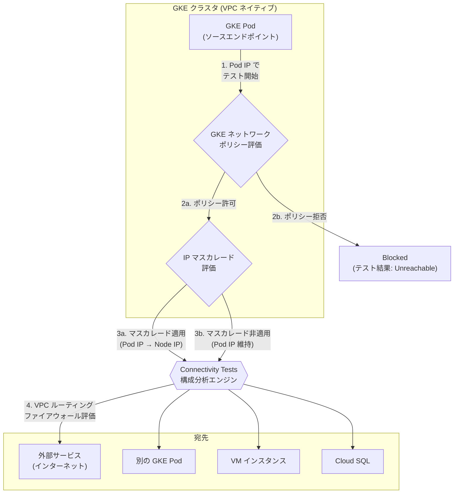

# Network Intelligence Center: Connectivity Tests - GKE Pod エンドポイント対応、IP マスカレード評価、ネットワークポリシー評価

**リリース日**: 2026-03-04

**サービス**: Network Intelligence Center

**機能**: Connectivity Tests - GKE Pod Endpoint, IP Masquerading Evaluation, Network Policy Evaluation

**ステータス**: Feature

[このアップデートのインフォグラフィックを見る](https://takech9203.github.io/google-cloud-news-summary/20260304-network-intelligence-center-connectivity-tests-gke.html)

## 概要

Google Cloud の Network Intelligence Center に含まれる Connectivity Tests に、Google Kubernetes Engine (GKE) 環境のネットワーク診断を大幅に強化する 3 つの新機能が追加された。GKE Pod をエンドポイントとして直接指定する機能、IP マスカレードの適用有無を自動評価する機能、そして GKE ネットワークポリシーを評価する機能である。

従来、Connectivity Tests で GKE 環境のネットワーク接続性を診断する場合、GKE ノードやコントロールプレーンをエンドポイントとして指定することはできたが、個々の Pod レベルでの接続テストはサポートされていなかった。また、IP マスカレードやネットワークポリシーといった GKE 固有のネットワーク機能は評価対象外であった。今回のアップデートにより、Pod レベルの精密なネットワーク診断が可能となり、GKE クラスタにおけるネットワークトラブルシューティングの精度と効率が大幅に向上した。

主な対象ユーザーはGKE クラスタのネットワーク管理者、プラットフォームエンジニア、セキュリティエンジニアであり、マイクロサービスアーキテクチャにおける Pod 間通信や外部サービスとの接続性の診断を行うチームにとって特に有用なアップデートである。

**アップデート前の課題**

- Connectivity Tests で GKE Pod を直接的なエンドポイント (ソースまたは宛先) として指定できず、Pod レベルの接続性診断が困難であった
- IP マスカレード (ip-masq-agent) の設定が Connectivity Tests の分析に反映されず、SNAT 後のアドレスを考慮したテストができなかった
- GKE ネットワークポリシーが Connectivity Tests の構成分析で評価されず、ポリシーによるトラフィック制御の影響を確認できなかった
- GKE クラスタ内のネットワーク問題を診断するには、kubectl exec でPod に接続して手動でネットワークテストを実行する必要があった

**アップデート後の改善**

- GKE Pod をソースまたは宛先エンドポイントとして直接指定して接続テストを作成可能になった
- IP マスカレードが適用されるトラフィックに対して、Connectivity Tests が自動的に SNAT 後の変換アドレスを使用してテストを実行するようになった
- FQDN ネットワークポリシーが有効でない GKE クラスタにおいて、GKE ネットワークポリシーの評価が Connectivity Tests の構成分析に含まれるようになった
- GKE 環境のネットワーク診断が Google Cloud コンソールや gcloud CLI から統合的に実行可能になった

## アーキテクチャ図

GKE Pod からの接続テストの評価フローを示す。Connectivity Tests はまず GKE ネットワークポリシーを評価し (FQDN ネットワークポリシー未有効のクラスタの場合)、次に IP マスカレードの適用有無を判定した上で、変換後のアドレスを使用して VPC レベルのルーティングおよびファイアウォール分析を実行する。

## サービスアップデートの詳細

### 主要機能

1. **GKE Pod エンドポイント (GKE Pod as an Endpoint)**
   - Connectivity Tests のソースまたは宛先として GKE Pod を直接指定可能
   - VPC ネイティブクラスタの Pod に対応
   - Pod IP アドレスに基づいた接続性の構成分析が実行される
   - Pod から外部サービス、Pod 間、Pod から VM など多様な接続パターンをテスト可能

2. **IP マスカレード評価 (IP Masquerading Evaluation)**
   - GKE Pod エンドポイントから送信されるトラフィックに対し、IP マスカレードの適用有無を自動判定
   - IP マスカレードが適用される場合、変換後のアドレス (通常はノードの IP アドレス) を使用してテストが実行される
   - ip-masq-agent の ConfigMap 設定 (nonMasqueradeCIDRs) や Autopilot クラスタの EgressNATPolicy を考慮
   - マスカレード後のアドレスでファイアウォールルールやルーティングが正しく評価される

3. **ネットワークポリシー評価 (Network Policy Evaluation)**
   - FQDN ネットワークポリシーが有効でない GKE クラスタにおいて、Kubernetes NetworkPolicy を評価
   - Ingress および Egress のネットワークポリシールールが構成分析に反映される
   - Pod セレクタやネームスペースセレクタに基づくトラフィック制御の影響をテスト結果に反映
   - FQDN ネットワークポリシーが有効なクラスタでは、この評価は適用されない

## 技術仕様

### 対応条件

| 項目 | 詳細 |
|------|------|
| クラスタタイプ | VPC ネイティブクラスタ |
| Pod エンドポイント | ソースおよび宛先の両方で指定可能 |
| IP マスカレード評価 | ip-masq-agent (Standard) / EgressNATPolicy (Autopilot) の設定を考慮 |
| ネットワークポリシー評価 | FQDN ネットワークポリシーが有効でないクラスタのみ |
| プロトコル | TCP, UDP, ICMP |

### IP マスカレードの評価ロジック

| クラスタ構成 | SNAT 動作 | Connectivity Tests での扱い |
|------|------|------|
| ip-masq-agent あり + カスタム nonMasqueradeCIDRs | nonMasqueradeCIDRs 以外の宛先で Pod IP をノード IP に変換 | 変換後のノード IP でテスト |
| ip-masq-agent あり + nonMasqueradeCIDRs 未設定 | デフォルト非マスカレード宛先以外で Pod IP をノード IP に変換 | 変換後のノード IP でテスト |
| ip-masq-agent なし + `--disable-default-snat` 未設定 | デフォルト非マスカレード宛先以外で Pod IP をノード IP に変換 | 変換後のノード IP でテスト |
| ip-masq-agent なし + `--disable-default-snat` 設定 | 全宛先で Pod IP を維持 | Pod IP のままテスト |

### ネットワークポリシー評価の条件

| 条件 | ネットワークポリシー評価 |
|------|------|
| FQDN ネットワークポリシー無効 | 評価される |
| FQDN ネットワークポリシー有効 | 評価されない |

## 設定方法

### 前提条件

1. Google Cloud プロジェクトで Network Management API が有効化されていること
2. GKE クラスタが VPC ネイティブモードで作成されていること
3. `roles/networkmanagement.admin` または `networkmanagement.connectivitytests.create` 権限を持つ IAM ロールが付与されていること
4. テスト対象の GKE クラスタおよび Pod への読み取り権限があること

### 手順

#### ステップ 1: GKE Pod をソースとした接続テストの作成

Google Cloud コンソールでの操作手順:

1. Google Cloud コンソールで Connectivity Tests ページを開く
2. 「Create Connectivity Test」を選択
3. Source endpoint で「GKE Pod」を選択
4. クラスタ、ネームスペース、Pod を指定
5. 宛先エンドポイントを指定
6. プロトコルとポートを設定
7. 「Create」をクリック

#### ステップ 2: テスト結果の確認

テスト結果には以下の情報が含まれる:

- ネットワークポリシー評価の結果 (許可/拒否)
- IP マスカレードの適用有無と変換後のアドレス
- VPC ルーティングおよびファイアウォール評価
- 全体の到達性判定 (Reachable / Unreachable / Ambiguous)

## メリット

### ビジネス面

- **GKE トラブルシューティング時間の大幅短縮**: Pod レベルの接続性を Google Cloud コンソールから直接診断でき、kubectl exec による手動テストが不要になる
- **運用の標準化**: Connectivity Tests という統一ツールで VM、GKE Pod、サーバーレスなど全レイヤーのネットワーク診断が可能になった
- **セキュリティ監査の効率化**: ネットワークポリシーの適用状況を構成分析レベルで確認でき、意図しないトラフィック許可の検出が容易になる

### 技術面

- **Pod レベルの精密診断**: IP マスカレード後の実際のソースアドレスを考慮したテストにより、ファイアウォールルールの評価精度が向上
- **GKE ネットワーク構成の可視化**: ネットワークポリシー、IP マスカレード、VPC ファイアウォールの各レイヤーがどのようにトラフィックに影響するかを一元的に確認可能
- **マイクロサービス間通信の検証**: Pod 間の通信がネットワークポリシーで正しく制御されているかを、実際にトラフィックを流すことなく構成レベルで検証可能

## デメリット・制約事項

### 制限事項

- FQDN ネットワークポリシーが有効な GKE クラスタでは、ネットワークポリシー評価が適用されない
- VPC ネイティブクラスタのみ対応しており、ルートベースクラスタの Pod はサポートされない
- 構成分析はネットワーク構成情報に基づくシミュレーションであり、データプレーンの実際の状態を保証するものではない

### 考慮すべき点

- IP マスカレードの設定が複雑な場合 (カスタム nonMasqueradeCIDRs やクラスタごとに異なる設定など)、テスト結果を正しく解釈するために ip-masq-agent の設定内容を事前に把握しておくことが推奨される
- ネットワークポリシー評価を活用するためには、FQDN ネットワークポリシーの有効/無効状態を確認する必要がある
- Windows Server ノードプール上の Pod は IP マスカレード評価の対象外である (Windows ノードの SNAT 動作はユーザー構成不可)

## ユースケース

### ユースケース 1: マイクロサービス間の通信障害の診断

**シナリオ**: フロントエンド Pod からバックエンド API Pod への通信が失敗しており、ネットワークポリシーが原因かファイアウォールが原因かを切り分けたい。

**効果**: Connectivity Tests がネットワークポリシー、IP マスカレード、VPC ファイアウォールの各レイヤーを順番に評価し、どの段階でトラフィックがブロックされているかを明確に特定できる。kubectl exec での手動テストや、各設定の個別確認が不要になる。

### ユースケース 2: Pod から外部 API への通信の検証

**シナリオ**: GKE Pod から外部 SaaS API (インターネット上のエンドポイント) への HTTPS 通信を許可しているが、IP マスカレード後のノード IP が正しくファイアウォールで許可されているか確認したい。

**効果**: Connectivity Tests が IP マスカレードの適用を自動検出し、変換後のノード IP アドレスを使用してファイアウォール評価を実行する。これにより、Pod IP とノード IP の違いによるファイアウォール設定の不整合を事前に発見できる。

### ユースケース 3: ネットワークポリシーの適用範囲の確認

**シナリオ**: 新しい Kubernetes NetworkPolicy をデプロイする前に、既存の Pod 間通信への影響を事前に評価したい。

**効果**: Connectivity Tests でポリシー適用後の到達性を構成分析レベルで確認でき、本番環境に影響を与えることなくポリシー変更の影響範囲を検証可能。

## 料金

Network Intelligence Center の Connectivity Tests は、Network Management API の一部として提供されている。料金の詳細は公式ドキュメントを参照されたい。

- [Network Intelligence Center 料金ページ](https://cloud.google.com/network-intelligence-center/pricing)

## 関連サービス・機能

- **Network Analyzer (GKE IP マスカレード構成インサイト)**: ip-masq-agent の設定と Pod CIDR 範囲の整合性を自動検出し、誤設定を警告する。Connectivity Tests のIP マスカレード評価と補完的に活用可能
- **GKE Dataplane V2**: GKE ネットワークポリシーや FQDN ネットワークポリシーの基盤。Connectivity Tests のネットワークポリシー評価対象に影響
- **Network Topology (GKE Enterprise ビュー)**: GKE クラスタ、ネームスペース、ワークロード、Pod のインフラストラクチャトポロジを可視化。Connectivity Tests と組み合わせてネットワーク構成の全体像を把握
- **Firewall Insights**: ファイアウォールルールの使用状況を分析。IP マスカレード後のノード IP に対するファイアウォール評価と合わせて活用
- **ip-masq-agent / EgressNATPolicy**: GKE クラスタの IP マスカレード設定を管理するコンポーネント。Connectivity Tests はこれらの設定を自動的に読み取って評価に反映

## 参考リンク

- [インフォグラフィック](https://takech9203.github.io/google-cloud-news-summary/20260304-network-intelligence-center-connectivity-tests-gke.html)
- [公式リリースノート](https://cloud.google.com/release-notes#March_04_2026)
- [Connectivity Tests 概要ドキュメント](https://cloud.google.com/network-intelligence-center/docs/connectivity-tests/concepts/overview)
- [Connectivity Tests の作成と実行](https://cloud.google.com/network-intelligence-center/docs/connectivity-tests/how-to/running-connectivity-tests)
- [GKE IP マスカレードエージェント](https://cloud.google.com/kubernetes-engine/docs/concepts/ip-masquerade-agent)
- [GKE ネットワークポリシー](https://cloud.google.com/kubernetes-engine/docs/how-to/network-policy)
- [FQDN ネットワークポリシー](https://cloud.google.com/kubernetes-engine/docs/how-to/fqdn-network-policies)
- [Network Intelligence Center 概要](https://cloud.google.com/network-intelligence-center/docs/overview)

## まとめ

今回のアップデートにより、Connectivity Tests で GKE Pod をエンドポイントとして直接指定できるようになり、IP マスカレードと GKE ネットワークポリシーの自動評価も加わった。これにより、GKE クラスタ内の Pod レベルのネットワーク診断が、kubectl による手動テストに頼ることなく Google Cloud コンソールや gcloud CLI から統合的に実行可能となった。GKE を利用するチームは、Pod 間通信の障害診断やネットワークポリシーの事前検証に本機能を活用し、マイクロサービス環境のネットワーク運用効率を向上させることを推奨する。

---

**タグ**: #NetworkIntelligenceCenter #ConnectivityTests #GKE #Pod #IPMasquerade #NetworkPolicy #Kubernetes #GoogleCloud
