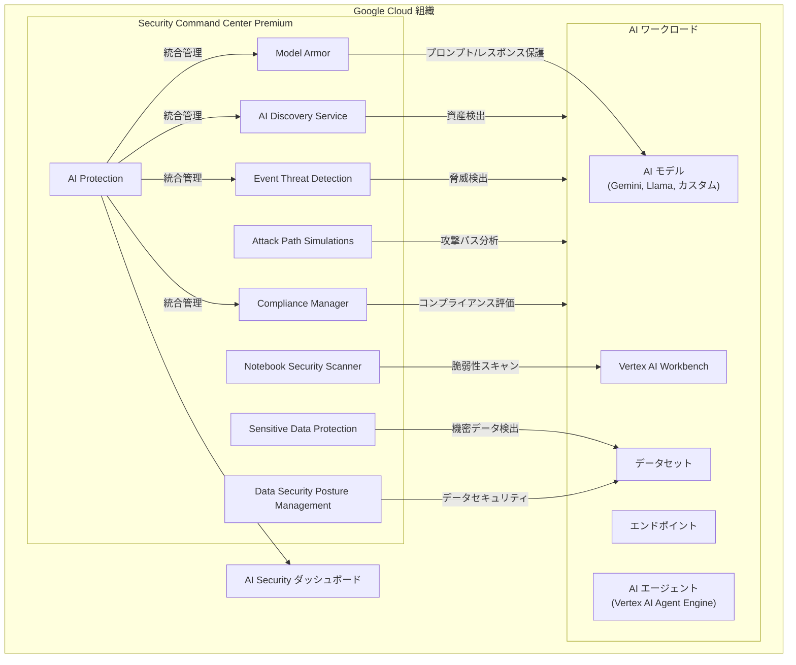

# Security Command Center: AI Protection が一般提供 (GA) に

**リリース日**: 2026-03-04

**サービス**: Security Command Center

**機能**: AI Protection の一般提供 (GA)

**ステータス**: GA (一般提供)

[このアップデートのインフォグラフィックを見る](https://takech9203.github.io/google-cloud-news-summary/20260304-security-command-center-ai-protection-ga.html)

## 概要

Security Command Center の Premium ティアにおいて、AI Protection が一般提供 (GA) となりました。これにより、組織レベルで AI ワークロードのセキュリティポスチャを包括的に管理できるようになります。AI Protection は、AI モデル、データセット、エンドポイントなどの AI 資産に対する脅威の検出とリスクの軽減を支援する機能です。

AI Protection は、これまで Preview として提供されていた機能であり、今回の GA リリースにより、本番環境での利用が正式にサポートされます。金融、医療、製造業など、AI を活用するあらゆる業界の組織が、AI システムに対するセキュリティリスクを一元的に管理できるようになります。

Enterprise ティアでは既に AI Protection が利用可能でしたが、今回のアップデートにより Premium ティアでも組織レベルで GA として利用できるようになったことで、より多くの組織が AI セキュリティの恩恵を受けられるようになります。

**アップデート前の課題**

- AI ワークロードのセキュリティ監視が個別のツールやサービスに分散しており、統合的な可視性が欠如していた
- AI モデルやデータセットに対する脅威の検出が手動プロセスに依存しがちで、リアルタイムの対応が困難だった
- AI 関連のコンプライアンス要件 (PCI DSS、GDPR、HIPAA など) への準拠状況を一元的に確認する手段が限られていた
- Premium ティアのユーザーは AI Protection を Preview としてのみ利用可能で、本番環境での SLA が保証されていなかった

**アップデート後の改善**

- AI 資産 (モデル、データセット、エンドポイント) のインベントリ評価と一元管理が GA として正式にサポートされる
- Event Threat Detection による Vertex AI 資産への脅威検出ルールが本番環境で安定的に利用可能になった
- AI Security ダッシュボードでリスク、脅威、コンプライアンス状況を統合的に可視化できるようになった
- AI Protection フレームワークによるクラウドコントロールの自動適用が GA としてサポートされる

## アーキテクチャ図



AI Protection は Security Command Center Premium 内の統合レイヤーとして機能し、AI Discovery Service、Event Threat Detection、Model Armor、Compliance Manager などの複数のサービスを連携させて AI ワークロード全体のセキュリティを管理します。

## サービスアップデートの詳細

### 主要機能

1. **AI 資産インベントリの評価**
   - AI システムおよび AI 資産 (モデル、データセット、エンドポイント) を自動検出し、可視化する
   - AI エージェント (Vertex AI Agent Engine にデプロイされたものを含む) の概要を提供する
   - 宣言的 AI 資産、推論された AI 資産、Model-as-a-Service の 3 種類の資産を管理する

2. **脅威の検出と管理**
   - Event Threat Detection による Vertex AI 資産への専用検出ルール (新しい AI API メソッドの検出、異常な地理的アクセス、サービスアカウントの異常な権限昇格など)
   - Agent Engine Threat Detection による AI エージェントへのランタイム攻撃検出
   - AI Security ダッシュボードで上位 5 件の最新脅威を表示

3. **リスクとコンプライアンスの管理**
   - AI Protection フレームワークによるクラウドコントロールの自動適用 (検出モード)
   - デフォルトフレームワークに 24 種類のクラウドコントロールが含まれる (VPC ネットワーク制限、CMEK 要件、セキュアブートなど)
   - カスタムフレームワークの作成と、組織・フォルダ・プロジェクト単位での適用が可能

4. **AI Security ダッシュボード**
   - リスク管理、脅威検出、AI インベントリの可視化、フレームワーク検出結果、Model Armor の統計を一元表示
   - Vertex AI データセット内の機密データの検出結果を表示
   - Model Armor によるプロンプトインジェクション、ジェイルブレイク検出、機密データ検出の統計を表示

## 技術仕様

### Event Threat Detection ルール (Vertex AI 資産向け)

| ルールカテゴリ | ルール名 | 説明 |
|------|------|------|
| Persistence | New AI API Method | 新しい AI API メソッドの使用を検出 |
| Persistence | New Geography for AI Service | AI サービスへの新しい地理的ロケーションからのアクセスを検出 |
| Privilege Escalation | Anomalous Impersonation of Service Account for AI Admin Activity | AI 管理アクティビティにおけるサービスアカウントの異常な偽装を検出 |
| Privilege Escalation | Anomalous Service Account Impersonator for AI Data Access | AI データアクセスにおけるサービスアカウント偽装者の異常を検出 |
| Privilege Escalation | Anomalous Multistep Service Account Delegation for AI Admin/Data Access | 多段階サービスアカウント委任の異常を検出 |
| Initial Access | Dormant Service Account Activity in AI Service | AI サービスにおける休眠サービスアカウントのアクティビティを検出 |

### 必要な IAM ロール

| アクセスレベル | ロール |
|------|------|
| 管理者アクセス (簡易) | Security Center Admin (`roles/securitycenter.admin`) |
| 閲覧専用アクセス (簡易) | Security Center Admin Viewer (`roles/securitycenter.adminViewer`) |
| 管理者アクセス (カスタム) | AIP Essentials (カスタム) + DSPM Admin + Model Armor Admin + その他 |
| 閲覧専用アクセス (カスタム) | AIP Viewer (カスタム) |

## 設定方法

### 前提条件

1. Google Cloud 組織 ID を取得済みであること
2. IAM Role Administrator (`roles/iam.roleAdmin`) および Organization Administrator (`roles/resourcemanager.organizationAdmin`) のロールを持っていること
3. Security Command Center Premium ティアが組織レベルで有効化されていること

### 手順

#### ステップ 1: Security Command Center Premium の有効化

組織で Security Command Center をまだ有効化していない場合、まず Premium ティアを有効化します。

```bash
# 組織レベルでの有効化は Google Cloud コンソールから実施
# https://console.cloud.google.com/security/command-center
```

Google Cloud コンソールから Security Command Center を開き、Premium ティアを選択して有効化します。

#### ステップ 2: AI Protection の設定

```bash
# Google Cloud コンソールで以下に移動:
# Settings > Manage Settings > AI Protection カード
# https://console.cloud.google.com/projectselector2/security/command-center/config/services/ai-protection?supportedpurview=organizationId
```

Premium ティアの有効化後、Settings から AI Protection カードの Manage Settings を選択して設定を開始します。

#### ステップ 3: リソースディスカバリの有効化

AI Protection で保護したいリソースのディスカバリを有効化します。Sensitive Data Protection によるデータスキャンも併せて設定します。

#### ステップ 4: AI Security ダッシュボードの確認

```bash
# Google Cloud コンソールで以下に移動:
# Risk Overview > AI Security
```

すべてのサービスが有効化・設定された後、AI Security ダッシュボードにデータが反映されるまで時間がかかる場合があります。

## メリット

### ビジネス面

- **コンプライアンス対応の効率化**: PCI DSS、GDPR、HIPAA などの規制要件に対する AI ワークロードの準拠状況を統合ダッシュボードで管理でき、監査対応コストを削減できる
- **リスクの早期発見と軽減**: AI システムに対するセキュリティ侵害や規制違反に伴う財務的、評判的、法的リスクを事前に検出し軽減できる
- **運用コストの最適化**: 複数のセキュリティツールを統合することで、AI セキュリティ管理の運用負荷を削減できる

### 技術面

- **統合的な脅威検出**: Event Threat Detection の AI 専用ルールにより、サービスアカウントの異常な権限昇格や新しい地理的ロケーションからのアクセスなど、AI 固有の脅威を自動検出できる
- **自動化されたセキュリティコントロール**: AI Protection フレームワークにより、CMEK 要件、セキュアブート、VPC 制限などの 24 種類のクラウドコントロールが自動的に検出モードで適用される
- **Model Armor との統合**: プロンプトインジェクション、ジェイルブレイク、機密データ漏洩などの AI 固有のリスクを Model Armor と連携して検出・防御できる

## デメリット・制約事項

### 制限事項

- 組織レベルでの有効化が必須であり、プロジェクトレベル単独では利用できない
- データレジデンシーが有効化された環境では、AI Protection の手動有効化が必要であり、AI Security ダッシュボードおよび AI Assets ページにアクセスできない
- AI Protection フレームワークはアプリケーションに割り当てることができない (組織、フォルダ、プロジェクト単位のみ)

### 考慮すべき点

- AI Protection の全機能を利用するには、Model Armor、Sensitive Data Protection、Notebook Security Scanner など複数の依存サービスの設定が必要
- すべてのサービスが有効化・設定された後、AI Security ダッシュボードにデータが反映されるまで時間がかかる場合がある
- リージョンによって利用可能な機能が異なる (Model Armor や Notebook Security Scanner の対応状況がリージョンごとに異なる)

## ユースケース

### ユースケース 1: 金融機関における顧客データ保護

**シナリオ**: 大規模な金融機関が、機密性の高い金融データを処理する AI モデルを運用している。データ漏洩、トレーニング・推論時のデータ流出、AI インフラの脆弱性などのリスクに対処する必要がある。

**効果**: AI Protection が AI ワークフローを継続的に監視し、不正なデータアクセスや異常なモデル動作を検出する。機密データの分類を実行し、PCI DSS や GDPR などの規制への準拠を支援する。

### ユースケース 2: 医療機関における患者プライバシーの保護

**シナリオ**: 医療機関が電子カルテを管理し、診断・治療計画に AI を活用している。保護対象医療情報 (PHI) は HIPAA などの厳格な規制の対象となる。

**効果**: AI Protection が HIPAA 違反の可能性を特定して警告し、モデルやユーザーによる不正な PHI アクセスを検出する。脆弱な AI サービスや設定ミスをフラグ付けし、データ漏洩を監視する。

### ユースケース 3: 製造業における知的財産の保護

**シナリオ**: ロボティクス・オートメーション企業が、生産ラインの最適化とロボット制御に AI を活用しており、AI アルゴリズムや製造データに重要な知的財産が含まれている。

**効果**: AI Protection が AI モデルやコードリポジトリへの不正アクセスを監視し、訓練済みモデルの流出試行や異常なデータアクセスパターンを検出する。AI 開発環境の脆弱性をフラグ付けし、知的財産の窃盗を防止する。

## 料金

AI Protection は Security Command Center Premium ティアに含まれる機能です。Premium ティアには以下の 2 つの課金モデルがあります。

| 課金モデル | 説明 |
|--------|--------|
| 従量課金 (Pay-as-you-go) | 柔軟性を求めるユーザー向け。リソース消費に基づく課金 |
| サブスクリプション | 予測可能なニーズを持つユーザー向け。固定料金 |

詳細な料金については [Security Command Center pricing](https://cloud.google.com/security-command-center/pricing) を参照してください。

## 利用可能リージョン

AI Protection の全機能を活用するには、AI ワークロードが以下のリージョンに配置されている必要があります。

| リージョン | ロケーション |
|------|------|
| europe-west4 | オランダ |
| us-central1 | アイオワ |
| us-east4 | 北バージニア |
| us-west1 | オレゴン |

マルチリージョンエンドポイントは以下で利用可能です。

| マルチリージョン | 対象 |
|------|------|
| eu | 欧州連合 |
| us | 米国 |

リージョンによって利用可能な機能が異なります。

| リージョン | Notebook Security Scanner | Model Armor |
|------|------|------|
| us-central1, us-east4, us-west1 | 対応 | 対応 |
| europe-west1, europe-west2, asia-southeast1 | 非対応 | 対応 |
| その他のリージョン | 非対応 | 非対応 |

## 関連サービス・機能

- **[Model Armor](https://cloud.google.com/model-armor/overview)**: AI モデルへのプロンプトインジェクション、ジェイルブレイク、機密データ漏洩などのリスクを検出・防御するサービス。AI Protection と統合して動作する
- **[Sensitive Data Protection](https://cloud.google.com/sensitive-data-protection/docs)**: AI データセット内の機密データを検出・分類するサービス。AI Protection ダッシュボードに検出結果が表示される
- **[Agent Engine Threat Detection](https://cloud.google.com/security-command-center/docs/agent-engine-threat-detection-overview)**: Vertex AI Agent Engine にデプロイされた AI エージェントへのランタイム攻撃を検出するサービス (Preview)
- **[Compliance Manager](https://cloud.google.com/security-command-center/docs/compliance-manager-overview)**: AI Protection フレームワークのクラウドコントロールを管理・適用するサービス
- **[Data Security Posture Management (DSPM)](https://cloud.google.com/security-command-center/docs/dspm-data-security)**: データアクセスガバナンス、データフローガバナンス、CMEK によるデータ保護などの高度なクラウドコントロールを提供する

## 参考リンク

- [インフォグラフィック](https://takech9203.github.io/google-cloud-news-summary/20260304-security-command-center-ai-protection-ga.html)
- [公式リリースノート](https://cloud.google.com/release-notes#March_04_2026)
- [AI Protection 概要ドキュメント](https://cloud.google.com/security-command-center/docs/ai-protection-overview)
- [AI Protection 設定ガイド](https://cloud.google.com/security-command-center/docs/configure-ai-protection)
- [Security Command Center サービスティア](https://cloud.google.com/security-command-center/docs/service-tiers)
- [AI Protection リージョン情報](https://cloud.google.com/security-command-center/docs/regional-endpoints)
- [料金ページ](https://cloud.google.com/security-command-center/pricing)

## まとめ

Security Command Center Premium ティアにおける AI Protection の GA リリースは、AI ワークロードを本番環境で運用する組織にとって重要なマイルストーンです。AI 資産の可視化、脅威検出、コンプライアンス管理を統合的に提供することで、AI セキュリティの運用負荷を大幅に削減します。AI を活用している組織は、早期に AI Protection を有効化し、AI Security ダッシュボードによるリスクの可視化と、AI Protection フレームワークによるセキュリティコントロールの適用を開始することを推奨します。

---

**タグ**: #SecurityCommandCenter #AIProtection #GA #Premium #AIセキュリティ #ThreatDetection #ModelArmor #Compliance #VertexAI
