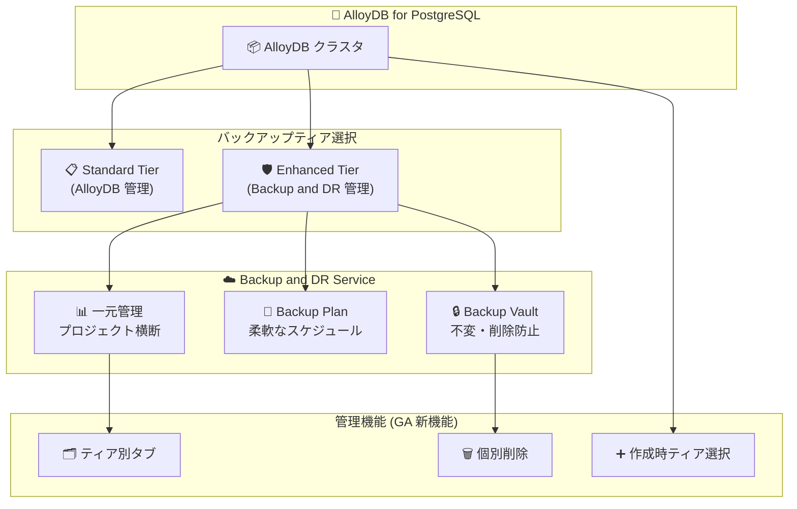

# AlloyDB for PostgreSQL: Enhanced Backups が一般提供 (GA) に昇格

**リリース日**: 2026-03-05

**サービス**: AlloyDB for PostgreSQL

**機能**: Enhanced Backups (拡張バックアップ)

**ステータス**: GA (一般提供)

📊 [このアップデートのインフォグラフィックを見る](https://takech9203.github.io/google-cloud-news-summary/20260305-alloydb-enhanced-backups-ga.html)

## 概要

AlloyDB for PostgreSQL の Enhanced Backups (拡張バックアップ) が一般提供 (GA) になりました。2025 年 10 月にパブリックプレビューとして発表されたこの機能が、本番環境で利用可能なステータスに昇格しました。Enhanced Backups は Backup and DR Service と統合し、エンタープライズグレードのバックアップ保護を AlloyDB クラスタに提供します。

GA リリースにより、クラスタ作成時に Enhanced tier (拡張ティア) を選択できるようになりました。また、プロジェクトレベルのバックアップをティア別タブで管理する機能や、拡張バックアップの個別削除機能が追加されています。これらにより、規制の厳しいワークロードやミッションクリティカルなアプリケーションにおけるデータ保護が大幅に強化されます。

**アップデート前の課題**

- Enhanced Backups はプレビュー段階であり、本番環境での使用が推奨されていなかった
- クラスタ作成後に Enhanced tier への切り替えが必要で、初期設定が煩雑だった
- プロジェクト内のバックアップが Standard と Enhanced で混在し、一覧性が低かった
- 拡張バックアップの個別削除ができず、バックアップ管理の柔軟性に制限があった

**アップデート後の改善**

- GA として本番環境で完全にサポートされるステータスになった
- クラスタ作成時に直接 Enhanced tier を選択可能になり、初期セットアップが簡素化された
- ティア別タブによるバックアップの分類表示で管理が容易になった
- 拡張バックアップの個別削除が可能になり、ストレージコストの最適化が柔軟に行えるようになった

## アーキテクチャ図



AlloyDB クラスタはバックアップティアとして Standard または Enhanced を選択できます。Enhanced Tier は Backup and DR Service と統合され、Backup Vault による不変ストレージ、柔軟なバックアッププラン、プロジェクト横断の一元管理を提供します。

## サービスアップデートの詳細

### 主要機能

1. **クラスタ作成時の Enhanced Tier 選択**
   - 新規クラスタ作成のワークフローで Enhanced tier を直接選択可能
   - 後から切り替える手間が不要になり、初期段階から高度なバックアップ保護を適用できる

2. **ティア別タブによるバックアップ管理**
   - プロジェクトレベルのバックアップ一覧が Standard と Enhanced のタブで分類表示される
   - バックアップの種類ごとに整理されたビューで管理効率が向上

3. **拡張バックアップの個別削除**
   - Enhanced Backup を個別に削除できるようになった
   - 不要になったバックアップを適時削除し、ストレージコストを最適化可能
   - ただし、Backup Vault の enforced retention 期間中は削除不可

## 技術仕様

### Standard Tier と Enhanced Tier の比較

| 機能 | Standard Tier (AlloyDB 管理) | Enhanced Tier (Backup and DR 管理) |
|------|------|------|
| 不正削除・変更からの保護 | Backup Vault による不変バックアップ | Backup Vault による不変・削除不可バックアップ |
| 自動バックアップ頻度 | 日次 (継続) / 時間・日・週次 (自動) | 時間・日・週・月・年次 |
| ソースプロジェクト削除後の保護 | -- | 対応 |
| 一元管理 | -- | 対応 |
| ソースクラスタ削除後の保護 | 対応 | 対応 |
| ポイントインタイムリカバリ (PITR) | 対応 | 対応 |
| クロスリージョンリストア | 対応 | -- |
| オンデマンドバックアップ保持期間 | 最大 1 年 | 最大 1 年 (保持期間後に手動削除または自動期限切れ) |

### 必要な権限

Enhanced Backups の管理には `alloydb.backupDrAdmin` ロール、または以下の個別権限が必要です。

| 権限 | 用途 |
|------|------|
| `backupdr.backupPlans.list` | バックアッププラン一覧の取得 |
| `backupdr.backupPlanAssociations.createForAlloydbCluster` | バックアッププランの関連付け作成 |
| `backupdr.backupPlanAssociations.deleteForAlloydbCluster` | バックアッププランの関連付け削除 |
| `backupdr.backupPlanAssociations.triggerBackupForAlloydbCluster` | オンデマンドバックアップの実行 |
| `backupdr.bvdataSources.get` / `list` | データソース情報の取得 |

## 設定方法

### 前提条件

1. AlloyDB クラスタとインスタンスが存在すること
2. Backup and DR API が有効であること
3. `alloydb.backupDrAdmin` ロールまたは必要な個別権限が付与されていること
4. Backup Vault が別プロジェクトにある場合は、Vault サービスエージェントに `backupdr.alloydbOperator` ロールを付与すること

### 手順

#### ステップ 1: Backup and DR API の有効化

Google Cloud コンソールで Backup and DR API を有効化します。

```
https://console.cloud.google.com/backupdr
```

#### ステップ 2: 新規クラスタ作成時に Enhanced Tier を選択

Google Cloud コンソールの AlloyDB クラスタ作成画面で、バックアップティアとして「Enhanced backup tier (managed by Backup and DR)」を選択します。

#### ステップ 3: 既存クラスタの Enhanced Tier への切り替え

既存クラスタを Enhanced Tier に切り替える場合は、以下の手順を実行します。

1. Google Cloud コンソールで AlloyDB の Clusters ページを開く
2. 対象クラスタを選択し、**Data Protection** をクリック
3. **Settings** の **Edit** をクリック
4. **Enhanced backup tier (managed by Backup and DR)** を選択
5. バックアッププランを設定して **Save** をクリック

## メリット

### ビジネス面

- **コンプライアンス対応の強化**: enforced retention によりランサムウェアや内部不正からのバックアップ保護が実現し、規制要件への適合が容易になる
- **運用コストの削減**: 一元管理により複数プロジェクトのバックアップ運用を統合し、管理工数を削減できる

### 技術面

- **柔軟なスケジューリング**: 時間単位から年単位まできめ細かいバックアップスケジュールを設定可能
- **ソースプロジェクト削除後の保護**: 誤ってプロジェクトを削除しても、Backup Vault 内のバックアップは保持される
- **統合バックアップ管理**: Cloud SQL、Compute Engine など他の Google Cloud ワークロードと同じ Backup and DR Service で一元管理が可能

## デメリット・制約事項

### 制限事項

- Enhanced Tier ではクロスリージョンリストアが非対応 (Standard Tier では対応)
- Standard と Enhanced の同時利用はできない (どちらか一方を選択)
- Backup Vault の enforced retention 期間中はバックアップを削除できない

### 考慮すべき点

- Enhanced Tier に切り替える場合、Backup and DR Service の理解と設定が追加で必要となる
- Backup Vault が別プロジェクトにある場合、サービスエージェントへの追加のロール付与が必要
- クロスリージョンリストアが必要なユースケースでは Standard Tier の継続利用を検討すること

## ユースケース

### ユースケース 1: 金融・医療などの規制対応ワークロード

**シナリオ**: 金融機関が AlloyDB 上で顧客データベースを運用しており、バックアップの改ざん防止と長期保持が規制で求められている。

**効果**: Enhanced Backups の Backup Vault による不変・削除不可バックアップと enforced retention により、規制要件に準拠したデータ保護を実現できる。

### ユースケース 2: マルチプロジェクト環境でのバックアップ一元管理

**シナリオ**: 大規模組織で複数のプロジェクトにまたがって AlloyDB クラスタを運用しており、バックアップポリシーの統一管理が課題となっている。

**効果**: Backup and DR Service の一元管理機能により、プロジェクト横断でバックアップの監視・レポーティングを統合し、運用効率を向上できる。

## 料金

Enhanced Backups は Backup and DR Service の料金体系に基づきます。詳細な料金は [Backup and DR Service 料金ページ](https://cloud.google.com/backup-disaster-recovery/pricing) を参照してください。

Backup and DR Service では 30 日間の無料トライアルが提供されており、バックアップ管理費用と Backup Vault のストレージ費用が無料で試用できます。

## 利用可能リージョン

AlloyDB for PostgreSQL が利用可能なすべてのリージョンで Enhanced Backups を使用できます。Backup Vault のリージョンについては [AlloyDB ドキュメント](https://cloud.google.com/alloydb/docs/overview) を参照してください。

## 関連サービス・機能

- **Backup and DR Service**: Enhanced Backups の基盤となるエンタープライズバックアップサービス。Backup Vault、バックアッププラン、一元管理を提供
- **Cloud SQL Enhanced Backups**: Cloud SQL でも同様の Enhanced Backups が 2025 年 12 月に GA。同じ Backup and DR Service 基盤で統合管理が可能
- **AlloyDB Standard Backups**: AlloyDB のデフォルトバックアップ機能。継続バックアップとリカバリ、オンデマンド・自動バックアップを提供
- **Cloud Monitoring**: Backup and DR Service のメトリクスを監視可能 (追加料金なし)

## 参考リンク

- 📊 [インフォグラフィック](https://takech9203.github.io/google-cloud-news-summary/20260305-alloydb-enhanced-backups-ga.html)
- [公式リリースノート](https://docs.google.com/release-notes#March_05_2026)
- [Enhanced Backups 管理ドキュメント](https://cloud.google.com/alloydb/docs/backup/manage-enhanced-backups)
- [データバックアップとリカバリの概要](https://cloud.google.com/alloydb/docs/backup/overview)
- [Backup and DR Service 概要](https://cloud.google.com/backup-disaster-recovery/docs/concepts/backup-dr)
- [Backup and DR Service 料金](https://cloud.google.com/backup-disaster-recovery/pricing)

## まとめ

AlloyDB Enhanced Backups の GA により、AlloyDB for PostgreSQL ユーザーは Backup and DR Service と統合されたエンタープライズグレードのバックアップ保護を本番環境で利用できるようになりました。特に規制対応が求められるワークロードや、マルチプロジェクト環境でのバックアップ一元管理が必要なケースで大きな価値を発揮します。既存の AlloyDB ユーザーは、クロスリージョンリストアの要否を考慮した上で Enhanced Tier への移行を検討することを推奨します。

---

**タグ**: #AlloyDB #PostgreSQL #Backup #DR #BackupAndDR #EnhancedBackups #GA #データ保護 #エンタープライズ
