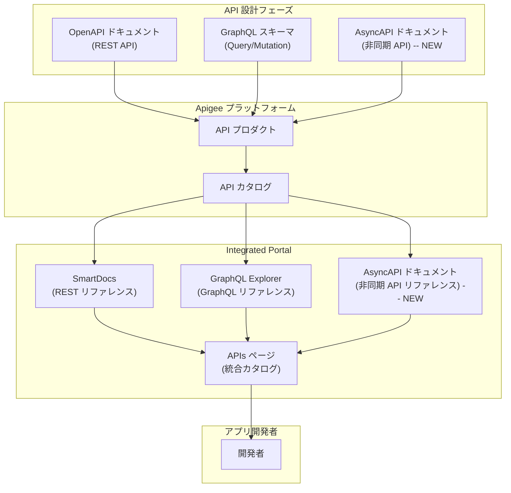

# Apigee Integrated Portal: AsyncAPI ドキュメントによる非同期 API の公開サポート

**リリース日**: 2026-03-05

**サービス**: Apigee Integrated Portal

**機能**: AsyncAPI ドキュメントを使用した非同期 API ドキュメントの公開

**ステータス**: FEATURE / ANNOUNCEMENT

[このアップデートのインフォグラフィックを見る](https://takech9203.github.io/google-cloud-news-summary/20260305-apigee-integrated-portal-asyncapi.html)

## 概要

2026 年 3 月 5 日、Apigee Integrated Portal の新バージョンがリリースされ、AsyncAPI ドキュメントを使用した非同期 API のドキュメント公開が可能になりました。これにより、ポータル上で非同期 API のリファレンスドキュメントをレンダリングし、開発者に提供できるようになります。

Apigee Integrated Portal はこれまで、REST API 向けの OpenAPI ドキュメントと GraphQL スキーマによる API ドキュメント公開をサポートしていました。今回の AsyncAPI サポートの追加により、イベント駆動型アーキテクチャやメッセージングベースの API を活用する開発者に対しても、統一されたポータル体験を提供できるようになりました。AsyncAPI は、Kafka、WebSocket、MQTT、AMQP などの非同期通信プロトコルを使用する API を記述するための業界標準仕様です。

このアップデートは、イベント駆動型アーキテクチャを採用している組織や、同期・非同期の両方の API を単一のデベロッパーポータルで管理したいと考える API プラットフォームチームにとって重要な機能強化です。

**アップデート前の課題**

- Apigee Integrated Portal で公開可能な API ドキュメント形式は OpenAPI (REST) と GraphQL スキーマの 2 種類に限定されていた
- 非同期 API (WebSocket、Kafka、MQTT など) のドキュメントをポータル上で自動レンダリングする手段がなかった
- イベント駆動型 API を提供する場合、別途手動でドキュメントページを作成するか、外部ツールを使用する必要があった

**アップデート後の改善**

- AsyncAPI ドキュメントを使用して非同期 API のリファレンスドキュメントをポータル上に公開可能になった
- OpenAPI、GraphQL、AsyncAPI の 3 つの仕様形式を統一されたポータルで管理できるようになった
- 非同期 API の チャネル、メッセージスキーマ、プロトコルバインディングなどの情報が自動的にレンダリングされるようになった

## アーキテクチャ図

API 設計者は OpenAPI、GraphQL、AsyncAPI の各仕様形式でドキュメントを作成し、API プロダクトに関連付けます。Apigee Integrated Portal は各形式に応じたリファレンスドキュメントを自動レンダリングし、統合された APIs ページを通じてアプリ開発者に提供します。

## サービスアップデートの詳細

### 主要機能

1. **AsyncAPI ドキュメントによる API 公開**
   - AsyncAPI 仕様に基づくドキュメントをポータルの API カタログに追加可能
   - 非同期 API のチャネル、メッセージ、スキーマ、サーバー情報が自動的にレンダリングされる
   - 既存の OpenAPI や GraphQL と同様の公開ワークフローで利用可能

2. **非同期プロトコルのドキュメント対応**
   - WebSocket、Kafka、MQTT、AMQP などの非同期通信プロトコルに関する API 仕様を記述・表示可能
   - プロトコルバインディング情報を含む詳細なリファレンスドキュメントの生成

3. **統合された API カタログ体験**
   - REST (OpenAPI)、GraphQL、非同期 API (AsyncAPI) の全てを単一のポータルで管理
   - API カテゴリやタグ付けによる横断的な API 検索・発見が可能
   - 開発者はプロトコルの種類に関わらず、一貫した UI でドキュメントを閲覧

## 技術仕様

### サポートされる API ドキュメント形式

| ドキュメント形式 | 対象 API タイプ | レンダリング方式 | サポート状況 |
|---|---|---|---|
| OpenAPI 3.0 / 2.0 | REST API | SmartDocs | GA (既存) |
| GraphQL スキーマ | GraphQL API | GraphQL Explorer | GA (既存) |
| AsyncAPI | 非同期 API (WebSocket, Kafka, MQTT 等) | AsyncAPI ドキュメントビューア | 新規追加 |

### AsyncAPI 仕様の主要要素

| 要素 | 説明 |
|---|---|
| Servers | メッセージブローカーやプロトコルサーバーの接続情報 |
| Channels | メッセージの送受信先 (トピック、キュー等) |
| Messages | チャネルで送受信されるメッセージの構造 |
| Schemas | メッセージペイロードのデータスキーマ定義 |
| Protocol Bindings | プロトコル固有の設定情報 (Kafka, MQTT 等) |

## 設定方法

### 前提条件

1. Apigee 組織と Integrated Portal が構成済みであること
2. 非同期 API を記述した AsyncAPI ドキュメント (YAML または JSON 形式) が準備されていること
3. 対象の API プロダクトが Apigee に登録されていること

### 手順

#### ステップ 1: API カタログに API を追加

Apigee コンソールから **Publish > Portals** を選択し、対象のポータルを開きます。**API catalog** をクリックし、**+ Add** ボタンから新しい API を追加します。API プロダクトを選択し、タイトルと説明を入力します。

#### ステップ 2: AsyncAPI ドキュメントの関連付け

追加した API の編集画面で、ドキュメントソースとして AsyncAPI ドキュメントを選択します。YAML または JSON 形式の AsyncAPI ファイルをアップロードするか、インラインで入力します。

#### ステップ 3: API の公開

**Published (listed in the catalog)** チェックボックスを有効にして保存します。ポータルの APIs ページに非同期 API のドキュメントが表示されます。

## メリット

### ビジネス面

- **デベロッパーエクスペリエンスの統一**: REST、GraphQL、非同期 API の全てを単一のポータルで提供することで、開発者の利便性が向上し、API の採用率向上につながる
- **イベント駆動型アーキテクチャの普及促進**: 非同期 API のドキュメントが整備されることで、組織内外での EDA (Event-Driven Architecture) の導入が加速する

### 技術面

- **API ドキュメントの標準化**: AsyncAPI という業界標準仕様を採用することで、ベンダーロックインを回避しつつ高品質なドキュメントを維持できる
- **運用負荷の軽減**: 非同期 API 用の別途ドキュメントサイトを構築・維持する必要がなくなり、ポータル管理の一元化が実現する

## デメリット・制約事項

### 制限事項

- Apigee Integrated Portal は Apigee (旧 Apigee X) のユーザーが対象であり、Apigee Edge for Private Cloud では利用不可 (Drupal ポータルを使用)
- AsyncAPI ドキュメントのサポート範囲 (対応バージョンや機能の詳細) については公式ドキュメントの「Publishing your APIs」ページを参照

### 考慮すべき点

- 既存の OpenAPI ベースの API カタログと AsyncAPI を混在させる場合、カテゴリやタグ付けの設計を事前に検討することを推奨
- 非同期 API のドキュメントは閲覧が中心であり、OpenAPI の SmartDocs における「Try this API」のようなインタラクティブ機能の対応範囲は公式ドキュメントで確認が必要

## ユースケース

### ユースケース 1: IoT プラットフォームの API ポータル

**シナリオ**: IoT プラットフォームを提供する企業が、デバイス管理用の REST API と、デバイスからのテレメトリデータストリーム用の MQTT ベース非同期 API の両方を開発者に公開したい場合。

**効果**: OpenAPI ドキュメント (REST) と AsyncAPI ドキュメント (MQTT) を同一のポータル上で公開することで、開発者は単一のポータルから全ての API 情報にアクセスでき、オンボーディング時間が短縮される。

### ユースケース 2: 金融サービスのイベント駆動型 API

**シナリオ**: 金融機関がリアルタイムの取引通知や価格更新を WebSocket や Kafka を通じて提供しており、パートナー開発者にこれらの非同期 API を公開する必要がある場合。

**効果**: AsyncAPI ドキュメントによりチャネル構造、メッセージスキーマ、認証方式が明確に文書化され、パートナーとの統合開発がスムーズになる。

## 関連サービス・機能

- **Apigee API Management**: API プロキシの作成・管理・セキュリティ制御を提供する基盤サービス
- **Apigee API Hub**: 組織内の全 API を発見・管理するための中央カタログ
- **Pub/Sub**: Google Cloud のメッセージングサービスで、非同期 API のバックエンドとして利用可能
- **Eventarc**: Google Cloud のイベントルーティングサービスで、イベント駆動型アーキテクチャの構築に利用

## 参考リンク

- [インフォグラフィック](https://takech9203.github.io/google-cloud-news-summary/20260305-apigee-integrated-portal-asyncapi.html)
- [公式リリースノート](https://cloud.google.com/release-notes#March_05_2026)
- [Publishing your APIs (Apigee ドキュメント)](https://cloud.google.com/apigee/docs/api-platform/publish/portal/publish-apis)
- [Apigee Integrated Portal 概要](https://cloud.google.com/apigee/docs/api-platform/publish/portal/build-integrated-portal)
- [API 設計概要 (OpenAPI / GraphQL)](https://cloud.google.com/apigee/docs/api-platform/publish/api-design-overview)
- [AsyncAPI 公式サイト](https://www.asyncapi.com/)

## まとめ

今回のアップデートにより、Apigee Integrated Portal は OpenAPI、GraphQL に加えて AsyncAPI ドキュメントをサポートし、非同期 API のドキュメント公開が可能になりました。イベント駆動型アーキテクチャを採用している組織や、同期・非同期の API を統合的に管理したい API プラットフォームチームは、既存のポータルで AsyncAPI ドキュメントの公開を検討することを推奨します。詳細な設定方法や対応範囲については、公式ドキュメント「Publishing your APIs」を参照してください。

---

**タグ**: #Apigee #IntegratedPortal #AsyncAPI #API管理 #非同期API #イベント駆動 #デベロッパーポータル #APIドキュメント
