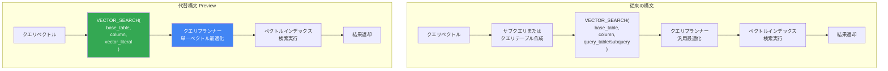

# BigQuery: VECTOR_SEARCH 関数の代替構文による単一ベクトル検索のパフォーマンス向上

**リリース日**: 2026-03-05

**サービス**: BigQuery

**機能**: VECTOR_SEARCH 関数の代替構文 (単一ベクトル検索向け)

**ステータス**: Preview

[このアップデートのインフォグラフィックを見る](https://takech9203.github.io/google-cloud-news-summary/20260305-bigquery-vector-search-alternate-syntax.html)

## 概要

BigQuery の `VECTOR_SEARCH` 関数に、単一ベクトル検索時のパフォーマンスを向上させる代替構文が Preview として導入されました。従来の構文ではクエリベクトルをテーブルまたはサブクエリとして渡す必要がありましたが、新しい代替構文では単一のベクトルリテラルを直接引数として渡すことが可能になります。

この機能は、RAG (Retrieval-Augmented Generation) パイプラインやリアルタイム推薦システムなど、単一のクエリベクトルに対して類似検索を実行するユースケースで特に有効です。クエリテーブルの作成やサブクエリの記述が不要になるため、クエリの記述が簡素化されるだけでなく、クエリエンジンの最適化も可能になりパフォーマンスが向上します。

対象ユーザーは、BigQuery でベクトル検索を利用しているデータエンジニア、ML エンジニア、データサイエンティストです。

**アップデート前の課題**

従来の `VECTOR_SEARCH` 関数では、単一のベクトルで検索する場合でも以下の課題がありました。

- 単一ベクトルの検索であっても、クエリテーブルを事前に作成するか、サブクエリ (`SELECT ... AS embedding`) として記述する必要があった
- サブクエリによるクエリテーブルの構築は、BigQuery のクエリプランナーにとって最適化しにくく、不要なオーバーヘッドが発生していた
- 単純な類似検索のためのクエリが冗長になり、開発者体験が低下していた

**アップデート後の改善**

今回のアップデートにより、以下の改善が実現しました。

- 単一ベクトルをリテラルとして直接 `VECTOR_SEARCH` 関数に渡せるようになり、クエリテーブルやサブクエリが不要になった
- BigQuery のクエリエンジンが単一ベクトル検索を認識し、内部的に最適化されたコードパスを使用できるようになった
- クエリ構文が簡潔になり、RAG パイプラインなどからの呼び出しが容易になった

## アーキテクチャ図



従来の構文ではクエリテーブルまたはサブクエリの構築ステップが必要でしたが、代替構文ではベクトルリテラルを直接渡すことでこのステップが省略され、クエリプランナーが単一ベクトル検索に特化した最適化を適用できます。

## サービスアップデートの詳細

### 主要機能

1. **単一ベクトルリテラルの直接渡し**
   - `ARRAY<FLOAT64>` 型のベクトルリテラルを `VECTOR_SEARCH` 関数の第 3 引数に直接指定可能
   - クエリテーブルの事前作成やサブクエリの記述が不要

2. **クエリパフォーマンスの向上**
   - 単一ベクトル検索に特化したクエリ実行パスにより、クエリのオーバーヘッドが削減
   - ベクトルインデックスとの組み合わせで、ANN (Approximate Nearest Neighbor) 検索の効率が向上

3. **既存機能との互換性**
   - `top_k`、`distance_type`、`options` などの既存パラメータはそのまま利用可能
   - ベクトルインデックス (IVF、TreeAH) との組み合わせも引き続きサポート

## 技術仕様

### VECTOR_SEARCH 構文の比較

| 項目 | 従来の構文 | 代替構文 (Preview) |
|------|-----------|-------------------|
| クエリデータの渡し方 | `TABLE query_table` またはサブクエリ | ベクトルリテラル直接指定 |
| 対応するクエリ数 | 複数ベクトル一括検索 | 単一ベクトル検索に最適化 |
| クエリテーブル作成 | 必要 (テーブルまたはサブクエリ) | 不要 |
| ベクトルインデックス対応 | 対応 | 対応 |
| 距離タイプ | EUCLIDEAN, COSINE, DOT_PRODUCT | EUCLIDEAN, COSINE, DOT_PRODUCT |
| ステータス | GA | Preview |

### 従来の構文

```sql
-- 従来の構文: サブクエリでクエリベクトルを渡す
SELECT base.id, base.my_embedding, distance
FROM VECTOR_SEARCH(
  TABLE mydataset.base_table,
  'my_embedding',
  (SELECT [1.0, 2.0, 3.0] AS embedding),
  'embedding',
  top_k => 5,
  distance_type => 'COSINE'
);
```

### 代替構文 (Preview)

```sql
-- 代替構文: ベクトルリテラルを直接渡す
SELECT base.id, base.my_embedding, distance
FROM VECTOR_SEARCH(
  TABLE mydataset.base_table,
  'my_embedding',
  [1.0, 2.0, 3.0],
  top_k => 5,
  distance_type => 'COSINE'
);
```

## 設定方法

### 前提条件

1. BigQuery API が有効化された Google Cloud プロジェクト
2. `bigquery.jobs.create` 権限を持つ IAM ロール (例: BigQuery User ロール)
3. 検索対象テーブルに `ARRAY<FLOAT64>` 型のエンベディング列が存在すること

### 手順

#### ステップ 1: ベースとなるテーブルとベクトルインデックスの準備

```sql
-- エンベディングを含むテーブルの作成
CREATE OR REPLACE TABLE mydataset.products (
  id STRING,
  name STRING,
  embedding ARRAY<FLOAT64>
);

-- データの挿入
INSERT mydataset.products (id, name, embedding)
VALUES
  ('p1', 'ノートパソコン', [0.1, 0.5, 0.3, 0.8]),
  ('p2', 'タブレット', [0.2, 0.4, 0.6, 0.7]),
  ('p3', 'スマートフォン', [0.3, 0.6, 0.2, 0.9]);

-- ベクトルインデックスの作成 (大規模データの場合に推奨)
CREATE VECTOR INDEX product_index
ON mydataset.products(embedding)
OPTIONS(distance_type = 'COSINE', index_type = 'IVF');
```

#### ステップ 2: 代替構文を使用したベクトル検索の実行

```sql
-- 単一ベクトルで類似商品を検索
SELECT
  base.id,
  base.name,
  distance
FROM VECTOR_SEARCH(
  TABLE mydataset.products,
  'embedding',
  [0.15, 0.45, 0.4, 0.75],
  top_k => 3,
  distance_type => 'COSINE'
);
```

クエリテーブルやサブクエリを使用せず、ベクトルリテラル `[0.15, 0.45, 0.4, 0.75]` を直接渡して検索を実行しています。

## メリット

### ビジネス面

- **開発速度の向上**: クエリの記述が簡素化されることで、ベクトル検索を利用した機能開発の速度が向上する
- **コスト効率の改善**: クエリ最適化によるパフォーマンス向上で、BigQuery のコンピュートコスト (オンデマンドのバイトスキャン量またはスロット使用量) の削減が期待できる

### 技術面

- **クエリ最適化**: 単一ベクトル検索に特化した実行パスにより、クエリテーブルの構築やジョインのオーバーヘッドが排除される
- **コードの簡潔さ**: アプリケーションコードから動的にクエリを生成する際に、サブクエリやテーブル作成の記述が不要になり、保守性が向上する
- **RAG パイプラインとの親和性**: LLM からのエンベディング出力をそのままベクトル検索に渡すワークフローが簡潔になる

## デメリット・制約事項

### 制限事項

- 本機能は Preview であり、本番環境での使用は SLA の対象外
- 単一ベクトル検索に最適化されているため、複数ベクトルの一括検索には従来の構文が引き続き必要
- Preview 期間中は仕様が変更される可能性がある

### 考慮すべき点

- 大量のベクトルを一括検索する場合は、従来のクエリテーブル/サブクエリ構文の方が適している
- ベクトルインデックスを使用する場合、Standard エディションではインデックスの利用がサポートされていないため注意が必要

## ユースケース

### ユースケース 1: RAG (Retrieval-Augmented Generation) パイプライン

**シナリオ**: LLM アプリケーションで、ユーザーの質問に対して関連ドキュメントを検索し、コンテキストとして LLM に渡す RAG パイプラインを構築する場合。

**実装例**:
```sql
-- ユーザーの質問から生成されたエンベディングで関連ドキュメントを検索
SELECT
  base.document_id,
  base.content,
  distance
FROM VECTOR_SEARCH(
  TABLE mydataset.document_embeddings,
  'embedding',
  [0.12, -0.34, 0.56, ...],  -- ML モデルが生成したクエリエンベディング
  top_k => 5,
  distance_type => 'COSINE'
);
```

**効果**: サブクエリの記述が不要になることで、アプリケーションからの呼び出しがシンプルになり、レイテンシーの削減も期待できる。

### ユースケース 2: リアルタイム商品推薦

**シナリオ**: EC サイトで、ユーザーが閲覧中の商品に類似した商品をリアルタイムに推薦する場合。閲覧中の商品のエンベディングを使って類似商品を検索する。

**効果**: 単一の商品エンベディングからの類似検索が高速化されることで、リアルタイムの推薦レスポンスが改善される。

## 料金

`VECTOR_SEARCH` 関数は BigQuery のコンピュートリソースを使用するため、既存の BigQuery 分析料金が適用されます。

| 料金モデル | 課金対象 |
|-----------|---------|
| オンデマンド | ベーステーブル、インデックス、検索クエリでスキャンされたバイト数 |
| エディション | ジョブ完了に必要なスロット数 (リザベーション内) |

代替構文自体による追加料金はありません。パフォーマンス向上によりスキャン量やスロット使用量が削減される場合、コスト削減につながる可能性があります。なお、ベクトルインデックスのストレージには別途アクティブストレージ料金が適用されます。

## 関連サービス・機能

- **[ベクトルインデックス](https://cloud.google.com/bigquery/docs/vector-index)**: `VECTOR_SEARCH` と組み合わせて ANN 検索を実現し、大規模データセットでのパフォーマンスを向上させる
- **[AI.SEARCH 関数](https://cloud.google.com/bigquery/docs/reference/standard-sql/bigqueryml-syntax-ai-search)**: 自律的エンベディング生成が有効なテーブルで、文字列から直接類似検索を行うための関数 (Preview)
- **[AI.SIMILARITY 関数](https://cloud.google.com/bigquery/docs/reference/standard-sql/bigqueryml-syntax-ai-similarity)**: 2 つの入力間のコサイン類似度を計算する関数。少数の比較に適している (Preview)
- **[自律的エンベディング生成](https://cloud.google.com/bigquery/docs/autonomous-embedding-generation)**: テーブルの STRING 列に対して自動的にエンベディングを生成・管理する機能

## 参考リンク

- [インフォグラフィック](https://takech9203.github.io/google-cloud-news-summary/20260305-bigquery-vector-search-alternate-syntax.html)
- [公式リリースノート](https://cloud.google.com/release-notes#March_05_2026)
- [VECTOR_SEARCH 関数リファレンス](https://cloud.google.com/bigquery/docs/reference/standard-sql/search_functions#vector_search)
- [ベクトル検索チュートリアル](https://cloud.google.com/bigquery/docs/vector-search)
- [ベクトル検索の概要](https://cloud.google.com/bigquery/docs/vector-search-intro)
- [BigQuery 料金ページ](https://cloud.google.com/bigquery/pricing)

## まとめ

BigQuery の `VECTOR_SEARCH` 関数に単一ベクトル検索向けの代替構文が Preview として追加され、クエリテーブルやサブクエリを使用せずにベクトルリテラルを直接渡せるようになりました。RAG パイプラインや推薦システムなど単一ベクトルでの類似検索を頻繁に実行するワークロードにおいて、クエリの簡素化とパフォーマンスの向上が期待できます。Preview 段階のため GA 化を注視しつつ、開発・検証環境で新しい構文を試してみることを推奨します。

---

**タグ**: #BigQuery #VectorSearch #VECTOR_SEARCH #エンベディング #ベクトル検索 #ANN #RAG #Preview #パフォーマンス最適化
