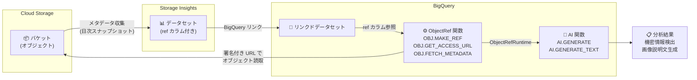

# Cloud Storage: Storage Insights ObjectRef Functions for BigQuery

**リリース日**: 2026-03-05

**サービス**: Cloud Storage

**機能**: Storage Insights ObjectRef Functions for BigQuery

**ステータス**: Available

📊 [このアップデートのインフォグラフィックを見る](https://takech9203.github.io/google-cloud-news-summary/20260305-cloud-storage-objectref-bigquery.html)

## 概要

Cloud Storage の Storage Insights データセットに BigQuery ObjectRef 関数のサポートが追加されました。Storage Insights データセット内の `ref` カラムには Cloud Storage オブジェクトへの参照が含まれており、この ObjectRef 関数を使用することでオブジェクトのデータやメタデータを直接 BigQuery から分析できるようになります。

この機能により、BigQuery SQL クエリを使ってドキュメント内の機密情報の検出や画像の説明文生成などの高度な分析が可能になります。従来はオブジェクトメタデータの分析に限定されていた Storage Insights データセットの活用範囲が、オブジェクトのコンテンツ分析にまで拡張されたことで、大規模なデータガバナンスやコンテンツ管理のユースケースに対応できるようになりました。

対象ユーザーは、Storage Intelligence を利用している組織で大規模なオブジェクト管理やデータガバナンスを行うデータエンジニア、セキュリティ担当者、データアナリストです。

**アップデート前の課題**

- Storage Insights データセットではオブジェクトのメタデータ (サイズ、ストレージクラス、更新日時など) の分析のみが可能で、オブジェクトのコンテンツ自体を分析するには別途データパイプラインの構築が必要だった
- ドキュメント内の機密情報を検出するには、Cloud Storage からオブジェクトをダウンロードして DLP API や独自のスクリプトで処理する必要があった
- 画像の説明文生成やコンテンツ分類など、非構造化データの分析には複数のサービスを組み合わせた複雑なワークフローが必要だった

**アップデート後の改善**

- Storage Insights データセットの `ref` カラムを ObjectRef 関数と組み合わせて使用することで、BigQuery から直接オブジェクトコンテンツの分析が可能になった
- `OBJ.GET_ACCESS_URL` で署名付き URL を取得し、AI 関数 (`AI.GENERATE` など) と組み合わせることで、SQL クエリだけで機密情報検出や画像説明文生成が実現できるようになった
- データパイプラインの構築が不要になり、BigQuery の SQL インターフェースから統一的にメタデータとコンテンツの両方を分析できるようになった

## アーキテクチャ図



Storage Insights データセットが Cloud Storage オブジェクトのメタデータを収集し、BigQuery リンクドデータセットとして公開します。ObjectRef 関数により BigQuery から Cloud Storage オブジェクトのコンテンツに直接アクセスし、AI 関数と組み合わせた高度な分析が可能になります。

## サービスアップデートの詳細

### 主要機能

1. **Storage Insights データセットの ref カラム**
   - Storage Insights データセットのオブジェクトメタデータテーブルに `ref` カラムが含まれており、各行が Cloud Storage オブジェクトへの ObjectRef 参照を保持する
   - この参照を使用して、メタデータだけでなくオブジェクトコンテンツにもアクセス可能

2. **ObjectRef 関数によるオブジェクトアクセス**
   - `OBJ.MAKE_REF`: Cloud Storage オブジェクトの URI と接続情報から ObjectRef 値を作成
   - `OBJ.FETCH_METADATA`: ObjectRef 値から Cloud Storage メタデータ (content_type、md5_hash、size、updated) を取得
   - `OBJ.GET_ACCESS_URL`: ObjectRef から署名付きの読み取り/書き込み URL を生成 (有効期限は最大 6 時間)

3. **AI 関数との統合によるコンテンツ分析**
   - `AI.GENERATE`、`AI.GENERATE_TEXT` などの生成 AI 関数に ObjectRefRuntime 値を入力として渡すことで、Gemini モデルを使用したコンテンツ分析が可能
   - 画像説明文の生成、ドキュメントの要約、機密情報の検出などを SQL クエリで実行可能

## 技術仕様

### ObjectRef 値の構造

| 項目 | 詳細 |
|------|------|
| `uri` | Cloud Storage オブジェクト URI (例: `gs://mybucket/path/to/file.jpg`) |
| `version` | Cloud Storage オブジェクトバージョン |
| `authorizer` | BigQuery がオブジェクトにアクセスする際に使用する Cloud リソース接続 |
| `details` | Cloud Storage が管理するオブジェクトメタデータ (JSON) |

### ObjectRefRuntime 値

| 項目 | 詳細 |
|------|------|
| `obj_ref` | 元の ObjectRef 値 (uri, version, authorizer, details) |
| `access_urls.read_url` | 読み取り専用の署名付き URL |
| `access_urls.write_url` | 書き込み可能な署名付き URL |
| `access_urls.expiry_time` | URL の有効期限 (`YYYY-MM-DD'T'HH:MM:SS'Z'` 形式) |

### 制約事項

| 項目 | 詳細 |
|------|------|
| 接続数制限 | クエリ実行プロジェクトで ObjectRef/ObjectRefRuntime を参照する接続は最大 20 個 |
| URL 有効期限 | ObjectRefRuntime のアクセス URL は最大 6 時間で失効 |
| ステータス | ObjectRef 関数は現在 Preview |

### 必要な IAM ロール

```
# ObjectRef の読み取りに必要
roles/bigquery.objectRefReader
  - bigquery.objectRefs.read

# ObjectRef の管理に必要
roles/bigquery.objectRefAdmin

# Storage Insights データセットのクエリに必要
roles/storageinsights.viewer
roles/bigquery.jobUser
roles/bigquery.dataViewer
```

## 設定方法

### 前提条件

1. Storage Intelligence が有効化されていること
2. Storage Insights データセットが作成・設定済みであること
3. データセットが BigQuery にリンクされていること
4. Cloud リソース接続が作成されていること

### 手順

#### ステップ 1: Storage Insights データセットのリンク確認

```bash
# データセット設定の確認
gcloud storage insights dataset-configs list --location=us-central1

# BigQuery へのリンク作成 (未リンクの場合)
gcloud storage insights dataset-configs create-link my_config --location=us-central1
```

Storage Insights データセットが BigQuery にリンクされていることを確認します。

#### ステップ 2: ref カラムを使用したオブジェクトコンテンツの分析

```sql
-- Storage Insights データセットの ref カラムから ObjectRefRuntime を生成し、
-- AI 関数で画像説明文を生成する例
SELECT
  obj_metadata.name,
  AI.GENERATE_TEXT(
    'gemini-2.0-flash',
    'Describe this image in detail',
    OBJ.GET_ACCESS_URL(obj_metadata.ref, 'r', INTERVAL 1 HOUR)
  ) AS image_description
FROM
  `project.dataset.objects_metadata` AS obj_metadata
WHERE
  obj_metadata.content_type LIKE 'image/%';
```

この例では、Storage Insights データセットのオブジェクトメタデータテーブルから画像オブジェクトを抽出し、ObjectRef 関数でアクセス URL を生成後、AI.GENERATE_TEXT で画像の説明文を生成しています。

#### ステップ 3: 機密情報の検出

```sql
-- ドキュメント内の機密情報を検出するクエリ例
SELECT
  obj_metadata.name,
  obj_metadata.bucket,
  AI.GENERATE(
    'gemini-2.0-flash',
    CONCAT(
      'Analyze this document for sensitive information such as ',
      'PII, credit card numbers, or API keys. ',
      'Return a JSON with fields: has_sensitive_data (boolean), ',
      'types (array of strings), confidence (float).'
    ),
    OBJ.GET_ACCESS_URL(obj_metadata.ref, 'r', INTERVAL 1 HOUR)
  ) AS sensitivity_analysis
FROM
  `project.dataset.objects_metadata` AS obj_metadata
WHERE
  obj_metadata.content_type IN ('application/pdf', 'text/plain', 'text/csv');
```

ドキュメント形式のオブジェクトに対して Gemini モデルで機密情報の検出を行う例です。

## メリット

### ビジネス面

- **データガバナンスの強化**: 組織全体の Cloud Storage オブジェクトに対して、SQL クエリだけで機密情報の一括検出が可能になり、コンプライアンス対応が効率化される
- **運用コストの削減**: オブジェクトコンテンツ分析のための専用データパイプラインの構築・運用が不要になり、インフラストラクチャコストと開発工数を削減できる

### 技術面

- **統一的なインターフェース**: BigQuery SQL からメタデータとコンテンツの両方を分析でき、ツールの切り替えやデータ移動が不要
- **スケーラブルな分析**: BigQuery のサーバーレスアーキテクチャにより、大量のオブジェクトに対しても並列的にコンテンツ分析を実行可能
- **AI 関数との直接統合**: Gemini モデルを活用した高度なコンテンツ分析 (画像認識、テキスト分類、要約) を追加のインフラなしで利用可能

## デメリット・制約事項

### 制限事項

- ObjectRef 関数は現在 Preview ステータスであり、本番環境での SLA が限定的である可能性がある
- 1 プロジェクトあたり ObjectRef/ObjectRefRuntime を参照する接続は最大 20 個に制限されている
- ObjectRefRuntime のアクセス URL は最大 6 時間で失効するため、長時間実行されるワークフローでは再生成が必要

### 考慮すべき点

- Storage Intelligence サブスクリプションが前提条件であり、追加のコストが発生する
- AI 関数の呼び出しには BigQuery の処理コストに加えて、Gemini モデルの推論コストが発生する
- 大量のオブジェクトに対してコンテンツ分析を実行する場合、署名付き URL の生成と AI 推論のコストが累積的に増加する可能性がある

## ユースケース

### ユースケース 1: 組織全体のドキュメント機密情報スキャン

**シナリオ**: 金融機関が複数のプロジェクトにまたがる Cloud Storage バケットに保存されたドキュメント (PDF、テキストファイル) に対して、PII (個人識別情報) や機密データが含まれていないかを定期的にスキャンしたい。

**実装例**:
```sql
SELECT
  obj.name,
  obj.bucket,
  obj.project,
  AI.GENERATE(
    'gemini-2.0-flash',
    'Detect any PII such as names, addresses, SSNs, or credit card numbers. Return JSON with detected_pii array.',
    OBJ.GET_ACCESS_URL(obj.ref, 'r', INTERVAL 1 HOUR)
  ) AS pii_scan_result
FROM
  `project.insights_dataset.objects_metadata` AS obj
WHERE
  obj.content_type IN ('application/pdf', 'text/plain')
  AND obj.size < 10485760  -- 10MB 以下のファイルに限定
```

**効果**: DLP API と連携した専用パイプラインを構築することなく、BigQuery SQL のみで組織全体の機密情報スキャンを定期的に実行でき、コンプライアンス監査の工数を大幅に削減できる。

### ユースケース 2: 商品画像の自動説明文生成

**シナリオ**: EC サイトを運営する企業が Cloud Storage に保存された商品画像に対して、アクセシビリティ対応やSEO 最適化のために画像の説明文 (alt テキスト) を自動生成したい。

**効果**: 画像処理パイプラインを別途構築することなく、BigQuery のスケジューリング機能と組み合わせて定期的に新規画像の説明文を自動生成し、結果をテーブルに保存して下流のアプリケーションから参照できる。

## 料金

Storage Insights ObjectRef 関数の利用には以下のコストが関連します。

- **Storage Intelligence サブスクリプション**: Storage Insights データセットは Storage Intelligence の機能として提供されるため、サブスクリプション料金が発生 (30 日間の無料トライアルあり)
- **BigQuery クエリ処理**: ObjectRef 関数を含むクエリの実行に対する標準的な BigQuery の処理コスト
- **AI 関数の推論コスト**: `AI.GENERATE` などの AI 関数を使用する場合、Gemini モデルの推論コストが追加で発生

詳細な料金については公式料金ページを参照してください。

## 利用可能リージョン

Storage Insights データセットおよび ObjectRef 関数は BigQuery がサポートするリージョンで利用可能です。データセット設定時にロケーションを指定します。詳細はドキュメントを参照してください。

## 関連サービス・機能

- **BigQuery ObjectRef 関数**: `OBJ.MAKE_REF`、`OBJ.FETCH_METADATA`、`OBJ.GET_ACCESS_URL` により Cloud Storage オブジェクトを BigQuery から直接参照するための基盤機能
- **BigQuery AI 関数**: `AI.GENERATE`、`AI.GENERATE_TEXT`、`AI.GENERATE_TABLE` など、Gemini モデルを活用したコンテンツ分析関数群
- **Storage Intelligence**: Storage Insights データセットの前提となるサブスクリプションサービス。データ探索、コスト最適化、セキュリティ対応、ガバナンス機能を提供
- **Cloud Resource Connection**: BigQuery が Cloud Storage オブジェクトにアクセスする際に使用する接続リソース

## 参考リンク

- 📊 [インフォグラフィック](https://takech9203.github.io/google-cloud-news-summary/20260305-cloud-storage-objectref-bigquery.html)
- [公式リリースノート](https://docs.cloud.google.com/release-notes#March_05_2026)
- [Storage Insights データセット ドキュメント](https://cloud.google.com/storage/docs/insights/datasets)
- [BigQuery ObjectRef 関数リファレンス](https://cloud.google.com/bigquery/docs/reference/standard-sql/objectref_functions)
- [BigQuery マルチモーダルデータ分析](https://cloud.google.com/bigquery/docs/analyze-multimodal-data)
- [ObjectRef カラムの指定](https://cloud.google.com/bigquery/docs/objectref-columns)
- [Storage Intelligence 概要](https://cloud.google.com/storage/docs/storage-intelligence/overview)
- [Storage Intelligence 料金](https://cloud.google.com/storage/pricing#storage-intelligence)

## まとめ

今回のアップデートにより、Storage Insights データセットの `ref` カラムを BigQuery ObjectRef 関数と組み合わせて使用することで、Cloud Storage オブジェクトのコンテンツを BigQuery から直接分析できるようになりました。特に AI 関数との統合により、機密情報検出や画像説明文生成といった高度なコンテンツ分析を SQL クエリだけで実現できる点が大きな進歩です。Storage Intelligence を既に利用している組織は、この機能を活用してデータガバナンスやコンテンツ管理ワークフローの効率化を検討することを推奨します。

---

**タグ**: #CloudStorage #StorageInsights #BigQuery #ObjectRef #StorageIntelligence #AI #マルチモーダルデータ #データガバナンス
