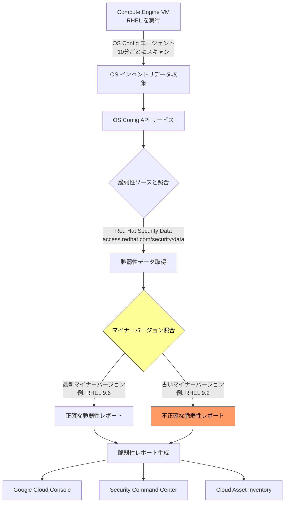

# Compute Engine: VM Manager の RHEL 脆弱性スキャンに関する既知の問題

**リリース日**: 2026-03-05

**サービス**: Compute Engine (VM Manager)

**カテゴリ**: 既知の問題 (Known Issue)

**ステータス**: 公開済み

📊 [このアップデートのインフォグラフィックを見る](https://takech9203.github.io/google-cloud-news-summary/20260305-compute-engine-vm-manager-rhel-scanning-issue.html)

## 概要

VM Manager の脆弱性レポート機能において、Red Hat Enterprise Linux (RHEL) の脆弱性スキャン結果に不正確な情報が含まれる可能性がある既知の問題が公式に文書化されました。

VM Manager は、RHEL の脆弱性スキャン結果を各メジャーバージョンの**最新マイナーバージョン**に基づいて提供しています。そのため、RHEL の古いマイナーバージョンを実行している VM では、脆弱性レポートに不正確な結果が表示される可能性があります。例えば、RHEL 9.2 を実行している VM に対して、RHEL 9 系の最新マイナーバージョン (例: RHEL 9.6) の脆弱性データに基づいたレポートが生成されるため、実際には該当しない脆弱性が報告されたり、逆に該当する脆弱性が見逃されたりする可能性があります。

この問題は、RHEL 8、RHEL 9、RHEL 10 の各メジャーバージョンにおいて、最新のマイナーバージョン以外を使用しているすべての VM に影響します。なお、RHEL for SAP および RHEL EUS バージョンでは、脆弱性レポート機能自体がサポートされていません。

## 問題の詳細

**影響を受ける条件**

- RHEL の最新マイナーバージョン以外を実行している Compute Engine VM
- VM Manager の脆弱性レポート機能を使用している環境
- OS Config エージェントがインストール済みで、OS インベントリ管理が有効化されている VM

**発生する問題**

- 脆弱性レポートに偽陽性 (実際には該当しない脆弱性) が含まれる可能性
- 脆弱性レポートに偽陰性 (実際に該当する脆弱性が欠落) が含まれる可能性
- Security Command Center や Cloud Asset Inventory に連携される脆弱性データにも同様の影響

## アーキテクチャ図



この図は VM Manager の脆弱性スキャンフローを示しています。Red Hat Security Data から取得される脆弱性データが各メジャーバージョンの最新マイナーバージョンに基づいているため、古いマイナーバージョンを実行している VM では不正確なレポートが生成される箇所を強調しています。

## 影響範囲

### 影響を受ける RHEL バージョン

| メジャーバージョン | 脆弱性レポート対応 | 既知の問題の影響 |
|---|---|---|
| RHEL 10 | 対応 (※) | 最新マイナーバージョン以外で不正確な結果の可能性 |
| RHEL 9 | 対応 (※) | 最新マイナーバージョン以外で不正確な結果の可能性 |
| RHEL 8 | 対応 (※) | 最新マイナーバージョン以外で不正確な結果の可能性 |
| RHEL 7 | 対応 (※) | 最新マイナーバージョン以外で不正確な結果の可能性 |
| RHEL for SAP | 非対応 | 影響なし (脆弱性レポート非対応) |
| RHEL EUS | 非対応 | 影響なし (脆弱性レポート非対応) |

(※) 最新マイナーバージョンに基づくスキャン結果

### 影響を受けるサービス・機能

- **VM Manager 脆弱性レポート**: 直接影響を受ける主要機能
- **Security Command Center**: VM Manager から連携される CVE データに影響
- **Cloud Asset Inventory**: VM Manager から転送される脆弱性レポートデータに影響
- **パッチコンプライアンスダッシュボード**: パッチ適用状況の評価にも同様のデータソースを使用

## 根本原因

VM Manager は RHEL の脆弱性スキャンにおいて、Red Hat Security Data (https://access.redhat.com/security/data) を脆弱性ソースとして使用しています。この脆弱性データは各メジャーバージョンの最新マイナーバージョンに対して最適化されているため、古いマイナーバージョンで実行されているパッケージのバージョンとの不一致が発生します。

## 回避策・対応方法

### 推奨される対応

1. **RHEL を最新マイナーバージョンにアップデートする**
   - 最も確実な対応策です
   - 各メジャーバージョンの最新マイナーバージョンにアップデートすることで、正確な脆弱性レポートを取得できます

   ```bash
   # RHEL のマイナーバージョンを確認
   gcloud compute ssh INSTANCE_NAME --zone=ZONE --command="cat /etc/redhat-release"

   # VM 上でアップデートを実行
   sudo yum update -y
   ```

2. **脆弱性レポートの結果を補完的に検証する**
   - 古いマイナーバージョンを使用せざるを得ない場合、Red Hat の公式セキュリティアドバイザリと照合して結果を検証してください

3. **脆弱性レポートの閲覧方法**

   ```bash
   # 特定ゾーンの VM の脆弱性レポートを一覧表示
   gcloud compute os-config vulnerability-reports list \
     --location=ZONE

   # 特定 VM の脆弱性レポートを表示
   gcloud compute os-config vulnerability-reports describe VM_NAME \
     --location=ZONE
   ```

## 注意事項

- この問題は VM Manager の設計上の制限であり、バグではありません
- RHEL 以外の OS (Debian、Ubuntu、SLES、Rocky Linux、Windows) にはこの制限は適用されません
- RHEL for SAP および RHEL EUS バージョンでは脆弱性レポート機能自体がサポートされていないため、この問題の影響を受けません
- パッチコンプライアンスにおいても、RHEL の脆弱性スキャン結果は最新マイナーバージョンに基づいているため、同様の不正確さが発生する可能性があります

## 関連サービス・機能

- **VM Manager (OS Config)**: 脆弱性レポートおよびパッチ管理の基盤サービス
- **Security Command Center**: 脆弱性データの集中管理と可視化
- **Cloud Asset Inventory**: 脆弱性レポートデータの保存・転送
- **OS インベントリ管理**: VM の OS 情報・パッケージ情報の収集基盤

## 参考リンク

- 📊 [インフォグラフィック](https://takech9203.github.io/google-cloud-news-summary/20260305-compute-engine-vm-manager-rhel-scanning-issue.html)
- [公式リリースノート](https://cloud.google.com/release-notes#March_05_2026)
- [VM Manager 脆弱性レポート ドキュメント](https://cloud.google.com/compute/vm-manager/docs/os-inventory/vulnerability-reports)
- [OS インベントリ管理 ドキュメント](https://cloud.google.com/compute/vm-manager/docs/os-inventory/os-inventory-management)
- [サポートされる OS の詳細](https://cloud.google.com/compute/docs/images/os-details#vm-manager)
- [VM Manager のセットアップ](https://cloud.google.com/compute/docs/manage-os)

## まとめ

VM Manager の RHEL 脆弱性スキャンは、各メジャーバージョンの最新マイナーバージョンに基づいて結果を提供するため、古いマイナーバージョンを実行している VM では不正確なレポートが生成される可能性があります。RHEL を使用している環境では、可能な限り最新マイナーバージョンへのアップデートを推奨します。アップデートが困難な場合は、脆弱性レポートの結果を Red Hat の公式セキュリティアドバイザリと照合して補完的に検証することが重要です。

---

**タグ**: #ComputeEngine #VMManager #RHEL #VulnerabilityScanning #KnownIssue #Security #OSConfig
