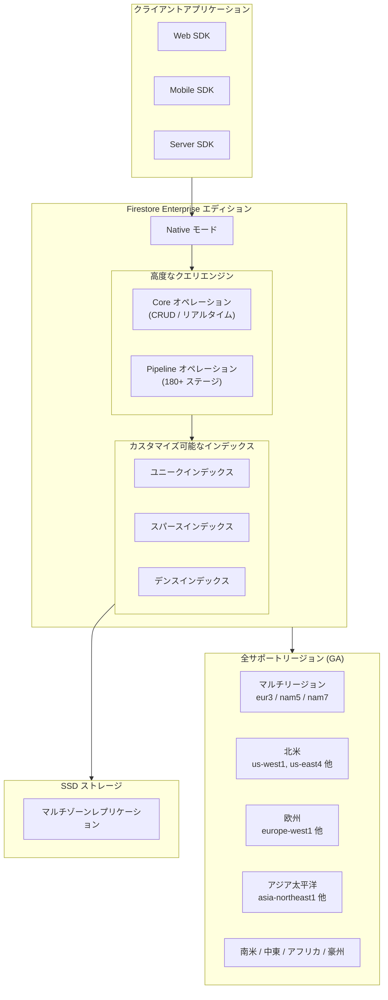

# Firestore: Enterprise エディション Native モードが全サポートリージョンで利用可能に

**リリース日**: 2026-03-05

**サービス**: Firestore

**機能**: Enterprise エディション Native モードの全リージョン展開

**ステータス**: GA (一般提供)

[このアップデートのインフォグラフィックを見る](https://takech9203.github.io/google-cloud-news-summary/20260305-firestore-enterprise-native-mode-all-regions.html)

## 概要

Firestore Enterprise エディションの Native モードが、全サポートリージョンで利用可能になりました。これまで Enterprise エディションの Native モードはプレビュー期間中の限定リージョン (マルチリージョン: nam5、リージョナル: us-east4、southamerica-east1、europe-west4、asia-south1、asia-east1) のみで提供されていましたが、今回のアップデートにより Standard エディションと同等の全リージョンで利用できるようになります。

Enterprise エディションは、180 以上のクエリステージとオペレーターを備えた高度なクエリエンジン、カスタマイズ可能なインデックス、最大 5 倍のパフォーマンス向上を特長としています。Native モードでは、リアルタイム同期やオフラインキャッシュなどの Firebase SDK の機能をフル活用できます。今回の全リージョン展開により、世界中のユーザーが低レイテンシで Enterprise エディションの先進的な機能を利用可能になりました。

**アップデート前の課題**

- Enterprise エディション Native モードはプレビュー段階で、マルチリージョンは nam5 (米国中部) のみに限定されていた
- リージョナルロケーションも us-east4、southamerica-east1、europe-west4、asia-south1、asia-east1 の 5 リージョンのみだった
- アジア太平洋地域 (東京、大阪、シドニーなど) や欧州の多くのリージョンで Enterprise エディション Native モードを利用できなかった
- データレジデンシー要件のある企業は、Enterprise エディションの高度な機能を活用できない場合があった

**アップデート後の改善**

- Enterprise エディション Native モードが全サポートリージョンで利用可能になり、地理的制約が解消された
- 東京 (asia-northeast1)、大阪 (asia-northeast2) を含むアジア太平洋リージョンで Enterprise エディションが利用可能に
- 各国のデータレジデンシー要件を満たしながら Enterprise エディションの高度なクエリエンジンを活用可能に
- Standard エディションと同じリージョン選択の柔軟性を Enterprise エディションでも実現

## アーキテクチャ図



Firestore Enterprise エディション Native モードのアーキテクチャを示しています。クライアント SDK からのリクエストは高度なクエリエンジンで処理され、カスタマイズ可能なインデックスと SSD ストレージにより高速なデータアクセスを実現します。今回のアップデートにより、全サポートリージョンでこのアーキテクチャが利用可能になりました。

## サービスアップデートの詳細

### 主要機能

1. **全リージョン展開**
   - Enterprise エディション Native モードが Standard エディションと同等の全リージョンで利用可能に
   - マルチリージョン (eur3、nam5、nam7) およびすべてのリージョナルロケーションをサポート
   - データの保存場所を自由に選択でき、コンプライアンス要件への対応が容易に

2. **高度なクエリエンジン**
   - 180 以上のステージとオペレーターを搭載
   - 集計、算術演算、配列操作、セット演算、型変換、データ結合をサポート
   - インデックスなしでもクエリ実行が可能 (インデックスはオプション)

3. **Core オペレーションと Pipeline オペレーション**
   - Core オペレーション: 標準的な CRUD 操作、リアルタイムリスナー、オフライン永続化
   - Pipeline オペレーション: 柔軟なクエリ構文による高度なデータ取得
   - Firebase SDK を通じたリアルタイム同期とオフラインサポート

4. **パフォーマンスの優位性**
   - Standard エディション比で最大 5 倍のパフォーマンス向上
   - SSD ベースのストレージによる高速なデータアクセス
   - バーストトラフィックの処理能力が Standard エディションの最大 8 倍

## 技術仕様

### エディション比較

| 項目 | Enterprise エディション | Standard エディション |
|------|------------------------|----------------------|
| クエリエンジン | 高度 (180+ ステージ) | 標準 |
| インデックス | カスタマイズ可能 (任意) | 自動 (必須) |
| ドキュメントサイズ上限 | 1 MiB (Native モード) | 1 MiB |
| ストレージ | SSD | ハイブリッド (SSD & HDD) |
| パフォーマンス | 最大 5 倍高速 | 標準 |
| MongoDB 互換 | 対応 | 非対応 |
| リアルタイム/オフライン | Core オペレーションで対応 | 対応 |

### 料金モデル (us-central1 基準)

| 項目 | Enterprise エディション | Standard エディション |
|------|------------------------|----------------------|
| 読み取り | $0.05 / 100 万 Read Unit (4 KiB 単位) | $0.30 / 100 万ドキュメント |
| 書き込み | $0.26 / 100 万 Write Unit (1 KiB 単位) | $0.90 / 100 万ドキュメント |
| リアルタイム更新 | $0.30 / 100 万 Read Unit (別 SKU) | 読み取りに含まれる |
| ストレージ | $0.00032 / GiB 時間 | $0.00020 / GiB 時間 |

### データベース作成例

```bash
# Enterprise エディション Native モードのデータベースを東京リージョンで作成
gcloud firestore databases create \
  --database=my-enterprise-db \
  --location=asia-northeast1 \
  --type=firestore-native \
  --edition=enterprise
```

## 設定方法

### 前提条件

1. Google Cloud プロジェクトが作成済みであること
2. Firestore API が有効化されていること
3. 適切な IAM 権限 (roles/datastore.owner または roles/firebase.admin) を持っていること

### 手順

#### ステップ 1: Firestore API の有効化

```bash
gcloud services enable firestore.googleapis.com
```

#### ステップ 2: Enterprise エディションデータベースの作成

```bash
# 任意のサポートリージョンを指定してデータベースを作成
gcloud firestore databases create \
  --database=my-database \
  --location=asia-northeast1 \
  --type=firestore-native \
  --edition=enterprise
```

#### ステップ 3: データベースの確認

```bash
gcloud firestore databases list
```

Google Cloud コンソールのデータベース一覧画面からも、各データベースのロケーションとエディションを確認できます。

## メリット

### ビジネス面

- **グローバル展開の加速**: 世界中のリージョンで Enterprise エディションが利用可能になり、グローバルアプリケーションの展開が容易に
- **コンプライアンス対応**: 各国のデータレジデンシー要件を満たしながら、高度なデータベース機能を活用可能
- **コスト最適化**: Enterprise エディションのバイト単位課金モデルにより、小さなドキュメントを大量に扱うワークロードでコスト削減の可能性

### 技術面

- **高度なクエリ機能**: 180 以上のクエリステージにより、従来はアプリケーション側で行っていた複雑なデータ処理をデータベース側で実行可能
- **柔軟なインデックス管理**: 自動インデックスではなく必要なインデックスのみを作成することで、書き込みコストとストレージを最適化
- **低レイテンシ**: SSD ストレージと最寄りリージョンの選択により、エンドユーザーへの応答時間を短縮

## デメリット・制約事項

### 制限事項

- データベース作成後のロケーション変更は不可。慎重なリージョン選択が必要
- データベース作成後のエディション変更は不可。Standard から Enterprise への切り替えにはデータの移行 (エクスポート/インポート) が必要
- Enterprise エディションのインデックスは手動管理が必要。インデックスなしのクエリはデータ量の増加に伴いパフォーマンスとコストが悪化する可能性がある

### 考慮すべき点

- Enterprise エディションのストレージ単価 ($0.00032/GiB 時間) は Standard エディション ($0.00020/GiB 時間) より高い
- リアルタイム更新が別 SKU となるため、リアルタイムリスナーを多用するアプリケーションではコスト構造が変わる
- インデックス設計を適切に行わないと、コレクションスキャンによるコスト増大のリスクがある
- Query Explain と Query Insights を活用した継続的なパフォーマンスモニタリングが推奨される

## ユースケース

### ユースケース 1: グローバル EC プラットフォーム

**シナリオ**: 日本、東南アジア、欧州に展開する EC プラットフォームが、各リージョンのデータレジデンシー要件を満たしつつ高度な商品検索・集計機能を必要としている。

**実装例**:
```bash
# 各リージョンに Enterprise エディションデータベースを作成
gcloud firestore databases create --database=db-tokyo --location=asia-northeast1 --type=firestore-native --edition=enterprise
gcloud firestore databases create --database=db-singapore --location=asia-southeast1 --type=firestore-native --edition=enterprise
gcloud firestore databases create --database=db-frankfurt --location=europe-west3 --type=firestore-native --edition=enterprise
```

**効果**: Pipeline オペレーションを活用した高度な商品検索と集計をデータベース側で実行でき、アプリケーションの複雑性を低減しながら低レイテンシを実現。

### ユースケース 2: リアルタイムコラボレーションアプリ

**シナリオ**: 複数拠点のチームが同時にドキュメントを編集するコラボレーションツールで、リアルタイム同期と高速なクエリ処理が求められている。

**効果**: Enterprise エディションの Core オペレーションによるリアルタイムリスナーと、SSD ストレージによる高速な読み書きにより、ユーザー体験を向上。最寄りリージョンの選択により、各拠点での操作レイテンシを最小化。

## 料金

Enterprise エディションは、ドキュメント単位ではなくバイトトランシェ単位の課金モデルを採用しています。Read Unit (4 KiB 単位) と Write Unit (1 KiB 単位) で計測され、小さなドキュメントを大量に扱うワークロードでは Standard エディションよりコスト効率が良くなる可能性があります。

### 無料枠 (日次)

| 項目 | Enterprise エディション | Standard エディション |
|------|------------------------|----------------------|
| 読み取り | 50,000 | 50,000 |
| 書き込み | 40,000 | 20,000 |
| リアルタイム更新 | 50,000 | 読み取りに含まれる |
| ストレージ | 1 GB | 1 GB |

### 確約利用割引

| 期間 | 割引率 |
|------|--------|
| 1 年 | 20% |
| 3 年 | 40% |

## 利用可能リージョン

今回のアップデートにより、Enterprise エディション Native モードは以下を含む全サポートリージョンで利用可能になりました。

### マルチリージョン

| マルチリージョン名 | 説明 | Read-Write リージョン | Witness リージョン |
|-------------------|------|----------------------|-------------------|
| eur3 | 欧州 | europe-west1 (ベルギー), europe-west4 (オランダ) | europe-north1 (フィンランド) |
| nam5 | 米国中部 | us-central1 (アイオワ), us-central2 (オクラホマ) | us-east1 (サウスカロライナ) |
| nam7 | 米国中部・東部 | us-central1 (アイオワ), us-east4 (バージニア北部) | us-central2 (オクラホマ) |

### リージョナル (主要リージョン抜粋)

| 地域 | リージョン | 説明 |
|------|-----------|------|
| 北米 | us-west1, us-east4, us-central1 他 | オレゴン、バージニア北部、アイオワ 他 |
| 南米 | southamerica-east1, southamerica-west1 | サンパウロ、サンティアゴ |
| 欧州 | europe-west1, europe-west3, europe-west4 他 | ベルギー、フランクフルト、オランダ 他 |
| アジア | asia-northeast1, asia-northeast2, asia-south1 他 | 東京、大阪、ムンバイ 他 |
| 豪州 | australia-southeast1, australia-southeast2 | シドニー、メルボルン |
| 中東 | me-central1, me-central2, me-west1 | ドーハ、ダンマーム、テルアビブ |
| アフリカ | africa-south1 | ヨハネスブルグ |

サポートリージョンの完全な一覧は [Firestore Locations](https://cloud.google.com/firestore/native/docs/locations) を参照してください。

## 関連サービス・機能

- **Firestore with MongoDB compatibility**: Enterprise エディションで利用可能な MongoDB 互換 API。既存の MongoDB アプリケーションコードやドライバーを再利用可能
- **Firebase SDK**: Native モードで利用可能なリアルタイム同期とオフラインキャッシュ機能を提供
- **Cloud Functions / Eventarc**: Firestore トリガーによるイベント駆動アーキテクチャの構築
- **Query Explain / Query Insights**: Enterprise エディションのクエリパフォーマンス分析とインデックス最適化ツール

## 参考リンク

- [インフォグラフィック](https://takech9203.github.io/google-cloud-news-summary/20260305-firestore-enterprise-native-mode-all-regions.html)
- [公式リリースノート](https://cloud.google.com/release-notes#March_05_2026)
- [Firestore Editions 概要](https://cloud.google.com/firestore/native/docs/editions-overview)
- [Firestore Locations](https://cloud.google.com/firestore/native/docs/locations)
- [Enterprise エディション料金](https://cloud.google.com/firestore/enterprise/pricing)
- [Enterprise エディション Native モード概要](https://firebase.google.com/docs/firestore/enterprise/overview-enterprise-edition-modes)

## まとめ

Firestore Enterprise エディション Native モードの全リージョン展開は、グローバルにアプリケーションを展開する開発者にとって重要なマイルストーンです。これまでプレビュー期間中は限定リージョンのみでしたが、今回のアップデートにより東京・大阪を含む全サポートリージョンで高度なクエリエンジン、柔軟なインデックス管理、最大 5 倍のパフォーマンス向上を活用できるようになりました。既存の Firestore ユーザーは、データのエクスポート/インポート機能を使って Enterprise エディションへの移行を検討することを推奨します。

---

**タグ**: #Firestore #Enterprise #NativeMode #リージョン拡張 #NoSQL #データベース #GoogleCloud
