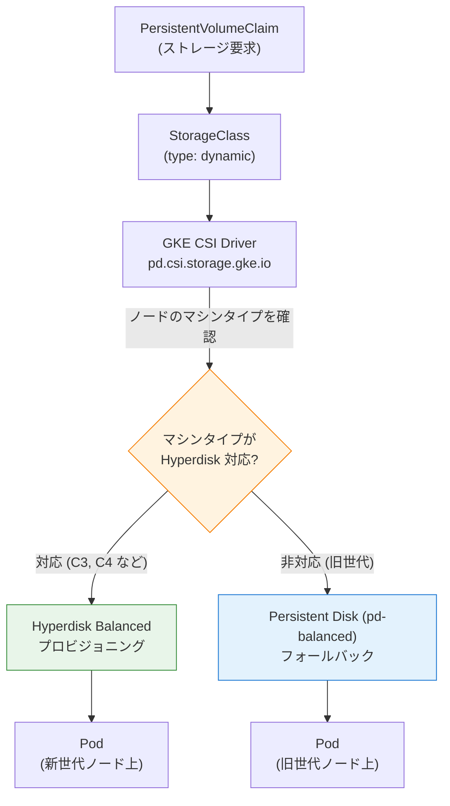

# Google Kubernetes Engine: Hyperdisk ボリュームの自動ディスクタイプ選択

**リリース日**: 2026-03-05

**サービス**: Google Kubernetes Engine (GKE)

**機能**: Hyperdisk ボリュームの自動ディスクタイプ選択 (Automated Disk Type Selection)

**ステータス**: Feature

[このアップデートのインフォグラフィックを見る](https://takech9203.github.io/google-cloud-news-summary/20260305-gke-automated-hyperdisk-type-selection.html)

## 概要

Google Kubernetes Engine (GKE) において、Hyperdisk ボリュームの自動ディスクタイプ選択機能が利用可能になりました。この機能により、GKE はワークロードがスケジュールされるノードのマシンタイプに基づいて、最適なディスクタイプを自動的に選択します。単一の StorageClass で、異なる VM 世代が混在するクラスタをサポートできるようになります。

具体的には、C3 や C4 などの Hyperdisk 対応インスタンスでは Hyperdisk が自動的にプロビジョニングされ、それ以外の旧世代インスタンスでは Persistent Disk に自動的にフォールバックします。この機能を利用するには、クラスタバージョンが 1.35.0-gke.2232000 以降であり、StorageClass の `type` パラメータを `dynamic` に設定する必要があります。

この機能は、複数世代の VM を使用するクラスタを運用するプラットフォームエンジニアや、新しいコンピュート技術への段階的な移行を計画しているインフラストラクチャチームにとって特に有用です。

**アップデート前の課題**

- Hyperdisk と Persistent Disk を混在させるには、それぞれ別の StorageClass を作成し、ワークロードごとに適切な StorageClass を手動で指定する必要があった
- クラスタ内に異なる VM 世代のノードプールが存在する場合、Hyperdisk 非対応ノードにスケジュールされたワークロードでストレージプロビジョニングが失敗する可能性があった
- 旧世代 VM から新世代 VM への段階的な移行時に、StorageClass の管理が複雑になっていた

**アップデート後の改善**

- 単一の StorageClass で Hyperdisk と Persistent Disk の両方をサポートでき、GKE がノードのマシンタイプに応じて最適なディスクタイプを自動選択する
- `use-allowed-disk-topology` パラメータにより、Pod が選択されたディスクタイプをサポートするノードにのみスケジュールされることを保証できる
- VM 世代の移行時にストレージ設定の変更が不要になり、運用負荷が大幅に削減される

## アーキテクチャ図



GKE の CSI ドライバがノードのマシンタイプを評価し、Hyperdisk 対応インスタンスでは Hyperdisk を、非対応インスタンスでは Persistent Disk を自動的にプロビジョニングするフローを示しています。

## サービスアップデートの詳細

### 主要機能

1. **動的ディスクタイプ選択 (type: dynamic)**
   - StorageClass の `type` パラメータに `dynamic` を指定することで、自動ディスクタイプ選択を有効化
   - ノードのマシンタイプに基づき、GKE が Hyperdisk または Persistent Disk を自動的に選択
   - 既存のブロックストレージパラメータとの併用が可能で、GKE は選択されたディスクタイプに関連する設定のみを適用

2. **フォールバック機構**
   - `hyperdisk-type` パラメータで Hyperdisk 対応ノードに使用するディスクタイプを指定 (デフォルト: `hyperdisk-balanced`)
   - `pd-type` パラメータで非対応ノードへのフォールバック用ディスクタイプを指定 (デフォルト: `pd-balanced`)
   - `disk-type-preference` パラメータで、両方をサポートするノードでの優先順位を制御可能

3. **トポロジー制約によるスケジューリング最適化**
   - `use-allowed-disk-topology: "true"` を設定することで、Pod が選択されたディスクタイプをサポートするノードにのみスケジュールされることを保証
   - Hyperdisk 対応ノードとの親和性を確保し、意図しないフォールバックを防止

## 技術仕様

### StorageClass パラメータ

| パラメータ | 説明 | デフォルト値 |
|------|------|------|
| `type` | `dynamic` に設定して自動ディスク選択を有効化 (必須) | N/A |
| `use-allowed-disk-topology` | `true` にすると、Pod は選択されたディスクタイプをサポートするノードにのみスケジュールされる (推奨) | `false` |
| `hyperdisk-type` | Hyperdisk 対応ノードで使用するディスクタイプ | `hyperdisk-balanced` |
| `pd-type` | フォールバック時に使用する Persistent Disk タイプ | `pd-balanced` |
| `disk-type-preference` | 両方のディスクタイプをサポートするノードでの優先ディスクタイプ | `hyperdisk-type` |

### 前提条件

| 項目 | 要件 |
|------|------|
| GKE クラスタバージョン | 1.35.0-gke.2232000 以降 |
| CSI ドライバ | Compute Engine Persistent Disk CSI Driver (pd.csi.storage.gke.io) |
| volumeBindingMode | `WaitForFirstConsumer` (推奨) |

## 設定方法

### 前提条件

1. GKE クラスタバージョンが 1.35.0-gke.2232000 以降であること
2. Compute Engine Persistent Disk CSI ドライバが有効であること

### 手順

#### ステップ 1: 動的ディスク選択を有効にした StorageClass を作成

```yaml
apiVersion: storage.k8s.io/v1
kind: StorageClass
metadata:
  name: dynamic-volume
provisioner: pd.csi.storage.gke.io
volumeBindingMode: WaitForFirstConsumer
allowVolumeExpansion: true
parameters:
  type: dynamic
  pd-type: pd-balanced
  hyperdisk-type: hyperdisk-balanced
  use-allowed-disk-topology: "true"
  # 以下のパラメータは hyperdisk-type が選択された場合のみ適用され、
  # pd-type が選択された場合は無視される
  provisioned-throughput-on-create: "250Mi"
  provisioned-iops-on-create: "3000"
```

上記のマニフェストを `dynamic-storageclass.yaml` として保存し、適用します。

```bash
kubectl apply -f dynamic-storageclass.yaml
```

#### ステップ 2: PersistentVolumeClaim を作成

```yaml
apiVersion: v1
kind: PersistentVolumeClaim
metadata:
  name: dynamic-pvc
spec:
  accessModes:
    - ReadWriteOnce
  storageClassName: dynamic-volume
  resources:
    requests:
      storage: 100Gi
```

```bash
kubectl apply -f dynamic-pvc.yaml
```

PVC が作成されると、Pod がノードにスケジュールされた時点で、GKE がノードのマシンタイプに基づき適切なディスクタイプを自動的にプロビジョニングします。

## メリット

### ビジネス面

- **運用コストの削減**: 複数の StorageClass を管理する必要がなくなり、ストレージ構成の管理工数が削減される
- **スムーズな移行**: 旧世代 VM から新世代 VM への移行時に、ストレージ設定を変更する必要がなく、段階的な移行が容易になる

### 技術面

- **統一されたストレージ抽象化**: 単一の StorageClass で異なるディスクタイプを透過的に扱えるため、Kubernetes マニフェストの簡素化が可能
- **パフォーマンスの自動最適化**: Hyperdisk 対応ノードでは自動的により高性能な Hyperdisk が使用され、ワークロードのパフォーマンスが向上
- **スケジューリングの安全性**: `use-allowed-disk-topology` により、ディスクタイプとノードの互換性が保証される

## デメリット・制約事項

### 制限事項

- GKE クラスタバージョン 1.35.0-gke.2232000 以降が必須であり、それ以前のバージョンでは利用不可
- Hyperdisk 固有のパラメータ (`provisioned-throughput-on-create`、`provisioned-iops-on-create`) は、Persistent Disk にフォールバックした場合は無視される
- Hyperdisk の利用可能なマシンタイプは Compute Engine の対応状況に依存する

### 考慮すべき点

- `use-allowed-disk-topology` を `false` にした場合、Hyperdisk 非対応ノードにスケジュールされた Pod でストレージプロビジョニングが失敗する可能性がある
- フォールバック先の Persistent Disk と Hyperdisk ではパフォーマンス特性が異なるため、ワークロードのパフォーマンス要件を十分に検討する必要がある
- Hyperdisk と Persistent Disk で料金体系が異なるため、コスト影響を事前に確認することを推奨

## ユースケース

### ユースケース 1: 段階的な VM 世代移行

**シナリオ**: 企業が N2 世代のノードプールから C3/C4 世代への段階的な移行を計画している。移行期間中は両方の世代のノードが混在するクラスタを運用する必要がある。

**実装例**:
```yaml
apiVersion: storage.k8s.io/v1
kind: StorageClass
metadata:
  name: migration-storage
provisioner: pd.csi.storage.gke.io
volumeBindingMode: WaitForFirstConsumer
allowVolumeExpansion: true
parameters:
  type: dynamic
  pd-type: pd-ssd
  hyperdisk-type: hyperdisk-balanced
  use-allowed-disk-topology: "true"
  provisioned-iops-on-create: "5000"
  provisioned-throughput-on-create: "200Mi"
```

**効果**: 移行期間中もストレージ設定の変更なしに、旧世代ノードでは pd-ssd、新世代ノードでは hyperdisk-balanced が自動的に使用される。移行完了後も同じ StorageClass を継続利用可能。

### ユースケース 2: マルチテナントクラスタでの統一ストレージポリシー

**シナリオ**: プラットフォームチームが複数のチームに GKE クラスタを提供しており、各チームが異なるマシンタイプのノードプールを使用している。ストレージポリシーを統一しつつ、各ノードプールで最適なディスクタイプを自動的に使用したい。

**効果**: プラットフォームチームは単一の StorageClass を提供するだけでよく、各テナントのワークロードはノードのマシンタイプに応じて自動的に最適なストレージが割り当てられる。

## 料金

Hyperdisk と Persistent Disk では料金体系が異なります。自動ディスクタイプ選択機能自体には追加料金はかかりませんが、プロビジョニングされるディスクタイプに応じた料金が適用されます。

- **Hyperdisk Balanced**: プロビジョニング容量 (GiB/月) に加え、ベースライン (3,000 IOPS / 140 MiB/s) を超える IOPS およびスループットに対して課金
- **Persistent Disk (pd-balanced)**: プロビジョニング容量 (GiB/月) に基づく課金

詳細な料金については [Compute Engine ディスク料金](https://cloud.google.com/compute/disks-image-pricing#disk) を参照してください。

## 関連サービス・機能

- **Compute Engine Hyperdisk**: GKE の Hyperdisk ボリュームの基盤となるブロックストレージサービス。マシンタイプごとの対応状況は Compute Engine のドキュメントを参照
- **GKE Persistent Disk CSI Driver**: Hyperdisk および Persistent Disk のプロビジョニングを行う CSI ドライバ (pd.csi.storage.gke.io)
- **GKE Autopilot Compute Classes**: Autopilot クラスタで Hyperdisk を使用する場合、Performance Compute Class との組み合わせが可能

## 参考リンク

- [インフォグラフィック](https://takech9203.github.io/google-cloud-news-summary/20260305-gke-automated-hyperdisk-type-selection.html)
- [公式リリースノート](https://cloud.google.com/release-notes#March_05_2026)
- [GKE での Hyperdisk の使用 - ドキュメント](https://cloud.google.com/kubernetes-engine/docs/concepts/hyperdisk)
- [Hyperdisk ボリュームの作成方法](https://cloud.google.com/kubernetes-engine/docs/how-to/persistent-volumes/hyperdisk)
- [Compute Engine ディスク料金](https://cloud.google.com/compute/disks-image-pricing#disk)

## まとめ

GKE の Hyperdisk 自動ディスクタイプ選択は、異なる VM 世代が混在するクラスタにおけるストレージ管理を大幅に簡素化する機能です。StorageClass の `type` パラメータを `dynamic` に設定するだけで、GKE がノードのマシンタイプに応じて Hyperdisk と Persistent Disk を自動的に使い分けます。特に、旧世代から新世代 VM への段階的な移行を計画している組織は、この機能を活用することで移行に伴うストレージ構成の変更を最小限に抑えることができます。

---

**タグ**: #GoogleKubernetesEngine #GKE #Hyperdisk #PersistentDisk #StorageClass #ストレージ #自動ディスク選択 #CSI
