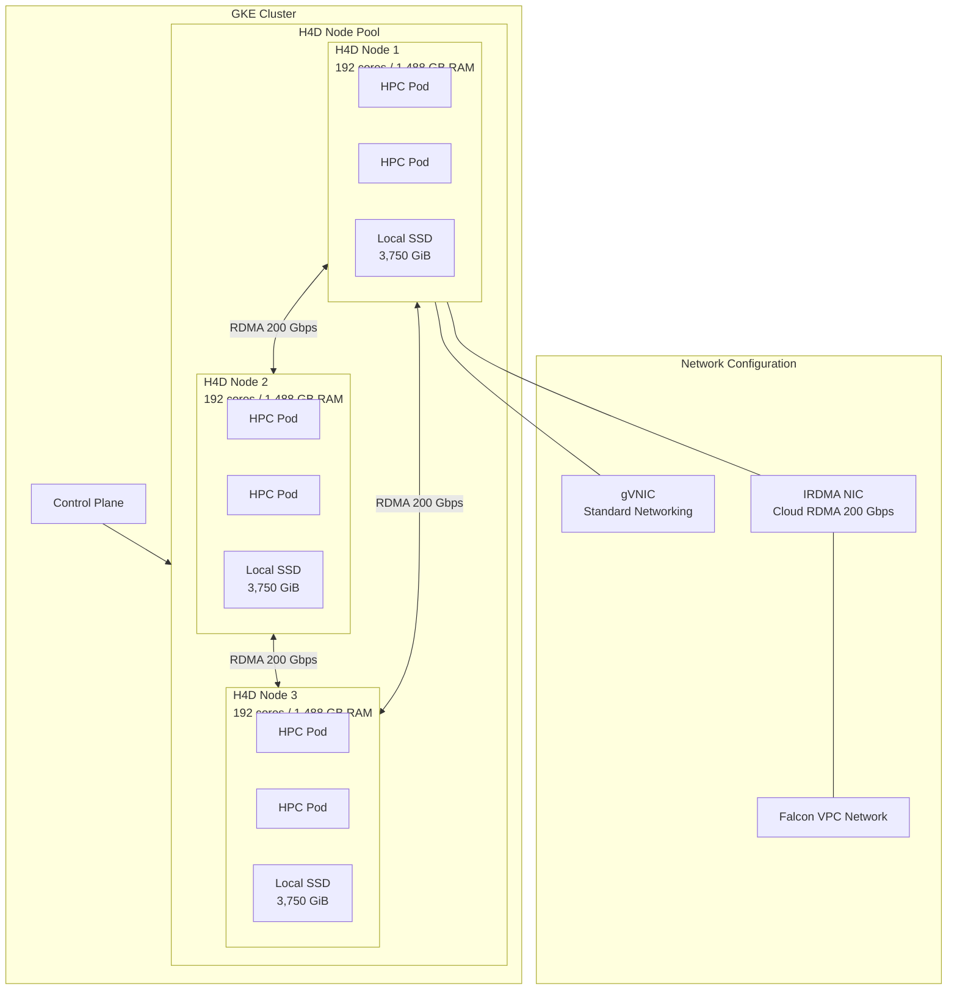

# Google Kubernetes Engine: H4D マシンシリーズが一般提供開始

**リリース日**: 2026-03-05

**サービス**: Google Kubernetes Engine (GKE)

**機能**: H4D マシンシリーズによる HPC ワークロードの実行

**ステータス**: GA (一般提供)

[このアップデートのインフォグラフィックを見る](https://takech9203.github.io/google-cloud-news-summary/20260305-gke-h4d-machine-series-ga.html)

## 概要

Google Kubernetes Engine (GKE) において、高性能コンピューティング (HPC) ワークロード向けに設計された H4D マシンシリーズが一般提供 (GA) となりました。H4D は Compute Engine のコンピューティング最適化マシンファミリーに属し、第 5 世代 AMD EPYC Turin プロセッサと Google Titanium オフロードプロセッサを搭載しています。

H4D は、複数ノードにまたがる密結合アプリケーション向けに最適化されており、RDMA (Remote Direct Memory Access) 対応の 200 Gbps ネットワーキングを提供します。192 コア (SMT 無効)、最大 1,488 GB のメモリ、3,750 GiB の Local SSD を搭載し、製造業、気象予測、電子設計自動化 (EDA)、ヘルスケア、科学技術計算などの HPC ワークロードに最適です。

GKE Standard モードおよび Autopilot の Performance コンピュートクラスで H4D を利用でき、Kubernetes のオーケストレーション機能と HPC レベルの計算性能を組み合わせることが可能になりました。

**アップデート前の課題**

- GKE で HPC ワークロードを実行する場合、H3 マシンシリーズ (88 vCPU、352 GB メモリ) が最大の選択肢であり、コア数やメモリ容量に制限があった
- Cloud RDMA を活用した低レイテンシ・高帯域幅のノード間通信を GKE 上で実現する手段が限定的だった
- 密結合 HPC アプリケーションをクラウド上で実行する際、オンプレミスと同等の性能を達成するのが困難だった

**アップデート後の改善**

- GKE 上で 192 コア、最大 1,488 GB メモリの大規模ノードを利用でき、HPC ワークロードの処理能力が大幅に向上した
- RDMA 対応 200 Gbps ネットワーキングにより、ノード間通信のレイテンシが大幅に低減し、密結合アプリケーションのスケーラビリティが改善された
- GKE Standard と Autopilot の両方で利用可能となり、マネージドな Kubernetes 環境で HPC ワークロードを柔軟に実行できるようになった

## アーキテクチャ図



H4D ノードは gVNIC (通常のネットワーク通信用) と IRDMA NIC (Cloud RDMA 通信用) の 2 つのネットワークインターフェースを構成します。RDMA により、ノード間で 200 Gbps の高帯域幅・低レイテンシ通信が実現されます。

## サービスアップデートの詳細

### 主要機能

1. **第 5 世代 AMD EPYC Turin プロセッサ**
   - ベース周波数 2.7 GHz、最大周波数 4.1 GHz
   - 192 コア (SMT 無効) でホストサーバー全体を専有
   - オーバーコミットなしで一貫したパフォーマンスを提供

2. **Cloud RDMA 200 Gbps ネットワーキング**
   - RDMA over Falcon トランスポートプロトコルを使用
   - ノード間で最大 200 Gbps の帯域幅を提供
   - 密結合アプリケーションのスケーラビリティを大幅に向上
   - Falcon VPC ネットワークプロファイルによる専用ネットワーク構成

3. **大容量メモリと Local SSD**
   - 標準構成で 720 GB、ハイメモリ構成で最大 1,488 GB の DDR5 メモリ
   - Titanium SSD による 3,750 GiB の Local SSD ストレージ (h4d-highmem-192-lssd)
   - Hyperdisk Balanced ストレージもサポート

4. **GKE Standard および Autopilot 対応**
   - GKE Standard モードで H4D ノードプールを作成可能
   - Autopilot の Performance コンピュートクラスで利用可能
   - Cluster Toolkit による迅速なクラスタ構築をサポート

## 技術仕様

### H4D マシンタイプ

| マシンタイプ | vCPU | メモリ (GB) | Titanium SSD | ネットワーク帯域幅 |
|------|------|------|------|------|
| h4d-standard-192 | 192 | 720 | なし | 最大 200 Gbps |
| h4d-highmem-192 | 192 | 1,488 | なし | 最大 200 Gbps |
| h4d-highmem-192-lssd | 192 | 1,488 | 3,750 GiB (10 x 375 GiB) | 最大 200 Gbps |

### GKE バージョン要件

| 用途 | 必要な GKE バージョン |
|------|------|
| Standard モードでの予約済み H4D VM | 1.32.6-gke.1060000 以降 |
| Flex-start での H4D ノード | 1.33.2-gke.4731000 以降 |
| Autopilot での H4D ノード | 1.33.2-gke.4731000 以降 |
| Standard でのクラスタオートスケーリング | 1.33.2-gke.4731000 以降 |
| Standard でのノード自動プロビジョニング | 1.33.2-gke.4731000 以降 |

### ネットワーク構成

H4D インスタンスで Cloud RDMA を使用する場合、2 つのネットワークインターフェース (vNIC) の構成が必要です。

| インターフェース | ドライバ | 用途 | インターネット接続 |
|------|------|------|------|
| gVNIC | gVNIC ドライバ | 通常のネットワーク通信 | 可 (最大 1 Gbps) |
| IRDMA | Intel iDPF/iRDMA ドライバ | Cloud RDMA 通信 | 不可 |

## 設定方法

### 前提条件

1. Google Kubernetes Engine API が有効化されていること
2. H4D VM のキャパシティを取得済みであること (Dense リソース割り当て推奨)
3. Container-Optimized OS ノードイメージを使用すること
4. H4D マシンタイプが利用可能なリージョン/ゾーンであること

### 手順

#### ステップ 1: RDMA 用 VPC ネットワークの作成

```bash
# Falcon VPC ネットワークの作成
gcloud compute --project=PROJECT_ID \
  networks create RDMA_NETWORK_PREFIX-net \
  --network-profile=COMPUTE_ZONE-vpc-falcon \
  --subnet-mode=custom

# サブネットの作成
gcloud compute --project=PROJECT_ID \
  networks subnets create RDMA_NETWORK_PREFIX-sub-0 \
  --network=RDMA_NETWORK_PREFIX-net \
  --region=CONTROL_PLANE_LOCATION \
  --range=RDMA_SUBNET_CIDR
```

Falcon VPC ネットワークプロファイルを使用して、RDMA 専用のネットワークを作成します。

#### ステップ 2: マルチネットワーク対応の GKE クラスタ作成

```bash
gcloud container clusters create CLUSTER_NAME \
  --project PROJECT_ID \
  --enable-dataplane-v2 \
  --enable-ip-alias \
  --location=CONTROL_PLANE_LOCATION \
  --enable-multi-networking
```

マルチネットワーキングを有効にした GKE クラスタを作成します。

#### ステップ 3: GKE ネットワークオブジェクトの設定

```yaml
apiVersion: networking.gke.io/v1
kind: GKENetworkParamSet
metadata:
  name: rdma-0
spec:
  vpc: RDMA_NETWORK_PREFIX-net
  vpcSubnet: RDMA_NETWORK_PREFIX-sub-0
  deviceMode: RDMA
---
apiVersion: networking.gke.io/v1
kind: Network
metadata:
  name: rdma-0
spec:
  type: "Device"
  parametersRef:
    group: networking.gke.io
    kind: GKENetworkParamSet
    name: rdma-0
```

GKENetworkParamSet と Network オブジェクトを適用して、RDMA ネットワークを構成します。

#### 代替方法: Cluster Toolkit による構築

```bash
# Cluster Toolkit を使用した H4D GKE クラスタのデプロイ
./gcluster deploy \
  -d examples/gke-h4d/gke-h4d-deployment.yaml \
  examples/gke-h4d/gke-h4d.yaml
```

Cluster Toolkit の GKE H4D Blueprint を使用すると、本番環境対応のクラスタを迅速にデプロイできます。

## メリット

### ビジネス面

- **HPC ワークロードのクラウド移行**: オンプレミスの HPC クラスタと同等の性能を GKE 上で実現でき、インフラ管理コストを削減
- **柔軟なキャパシティ管理**: オンデマンド、Flex-start、1 年 /3 年の確約利用割引 (CUD) など、ワークロードに応じた消費モデルを選択可能
- **Dynamic Workload Scheduler 対応**: HPC のバースト的なワークロード需要に対して、スケジュールまたは即座のクラスタデプロイメントが可能

### 技術面

- **RDMA 200 Gbps ネットワーキング**: 従来の TCP/IP ベースの通信と比較して、大幅に低いレイテンシと高い帯域幅を実現
- **192 コアの専有ホスト**: SMT 無効、オーバーコミットなしにより、一貫したパフォーマンスを保証
- **Kubernetes エコシステムとの統合**: GKE のオートスケーリング、ノード自動プロビジョニングなどの機能を HPC ワークロードで活用可能

## デメリット・制約事項

### 制限事項

- カスタムマシンタイプは利用不可 (定義済みマシンタイプのみ)
- GPU との併用は不可
- インターネットへのアウトバウンドデータ転送は 1 Gbps に制限
- ライブマイグレーションは非対応 (メンテナンス時はインスタンスが終了)
- マシンイメージの作成は不可
- Hyperdisk Balanced のパフォーマンスは 15,000 IOPS / 240 MBps が上限
- インスタンス間でのディスク共有は不可 (マルチライターモード、読み取り専用モードともに)

### 考慮すべき点

- H4D マシンタイプが利用可能なリージョン/ゾーンが限定されている
- Container-Optimized OS ノードイメージのみサポート
- Cloud RDMA を使用する場合、Falcon VPC ネットワークの追加構成が必要
- ホストメンテナンス時にはインスタンスが終了するため、ワークロードの中断に対する設計が必要 (最低 30 日間隔、7 日前の事前通知あり)

## ユースケース

### ユースケース 1: 気象予報シミュレーション

**シナリオ**: 気象研究機関が大規模な気象モデルシミュレーションを実行する際、数百ノードにまたがる密結合計算が必要。H4D の 192 コアと RDMA 200 Gbps ネットワーキングにより、ノード間のデータ交換を高速化し、シミュレーション時間を短縮。

**効果**: RDMA による低レイテンシ通信と大容量メモリにより、メッシュ分割されたシミュレーション領域のデータ交換が高速化され、従来の TCP/IP ベースの通信と比較してシミュレーション完了時間を大幅に短縮可能。

### ユースケース 2: 電子設計自動化 (EDA)

**シナリオ**: 半導体設計企業が大規模な回路シミュレーションやタイミング解析を実行。H4D の高いコア数とメモリ容量を活用し、複雑な回路設計の検証時間を短縮。

**効果**: 192 コアの専有ホストにより、大規模な並列シミュレーションを単一ノードで実行可能。さらに RDMA ネットワーキングにより、複数ノードにまたがるジョブの実行効率が向上。

### ユースケース 3: ライフサイエンス・ゲノム解析

**シナリオ**: 製薬企業が大規模な分子動力学シミュレーションやゲノムシーケンシングのデータ処理を GKE 上で実行。Kubernetes のジョブ管理機能と H4D の HPC 性能を組み合わせて、研究パイプラインを自動化。

**効果**: GKE のオーケストレーション機能により、HPC ジョブの投入・管理が容易になり、研究者はインフラ管理ではなく研究に集中できる。

## 料金

H4D インスタンスはオンデマンド、1 年間の確約利用割引 (CUD)、3 年間の確約利用割引 (CUD) で利用可能です。確約利用割引のコミットメントタイプは `compute-optimized-h4d` を指定します。

具体的な料金については、[Compute Engine の料金ページ](https://cloud.google.com/compute/vm-instance-pricing)を参照してください。

## 利用可能リージョン

H4D マシンタイプは限定されたリージョン/ゾーンで利用可能です。利用可能なリージョン/ゾーンの最新情報は、[Available regions and zones](https://cloud.google.com/compute/docs/regions-zones#available) で H4D をフィルタリングして確認してください。

## 関連サービス・機能

- **Compute Engine H4D マシンシリーズ**: GKE の H4D サポートの基盤となる Compute Engine のマシンタイプ
- **Cloud RDMA**: ノード間の低レイテンシ・高帯域幅通信を実現するネットワーキングインフラストラクチャ
- **Cluster Toolkit**: H4D GKE クラスタのデプロイを簡素化するオープンソースツール
- **Dynamic Workload Scheduler**: HPC バーストワークロード向けのスケジューリング機能
- **Falcon VPC ネットワークプロファイル**: RDMA 通信用の専用 VPC ネットワーク構成
- **GKE Autopilot Performance コンピュートクラス**: Autopilot モードでの H4D 利用をサポート

## 参考リンク

- [インフォグラフィック](https://takech9203.github.io/google-cloud-news-summary/20260305-gke-h4d-machine-series-ga.html)
- [公式リリースノート](https://cloud.google.com/release-notes#March_05_2026)
- [Run high performance computing (HPC) workloads with H4D](https://cloud.google.com/kubernetes-engine/docs/how-to/run-hpc-workloads)
- [H4D machine series ドキュメント](https://cloud.google.com/compute/docs/compute-optimized-machines#h4d_series)
- [Cloud RDMA ネットワークプロファイル](https://cloud.google.com/vpc/docs/rdma-network-profiles)
- [HPC クラスタの概要](https://cloud.google.com/compute/docs/hpc/overview-hpc-clusters)
- [料金ページ](https://cloud.google.com/compute/vm-instance-pricing)

## まとめ

H4D マシンシリーズの GKE 一般提供により、Google Cloud 上で本格的な HPC ワークロードを Kubernetes のマネージド環境で実行することが可能になりました。192 コア、最大 1,488 GB メモリ、RDMA 200 Gbps ネットワーキングという強力なスペックにより、気象予測、EDA、ライフサイエンスなどの密結合 HPC アプリケーションをクラウドネイティブに展開できます。HPC ワークロードをクラウドに移行検討中の組織は、H4D の利用可能リージョンとキャパシティ取得方法を確認し、Cluster Toolkit を活用した検証環境の構築から始めることを推奨します。

---

**タグ**: #GoogleKubernetesEngine #GKE #H4D #HPC #HighPerformanceComputing #RDMA #CloudRDMA #AMDEPYCTurin #ComputeOptimized #GA
