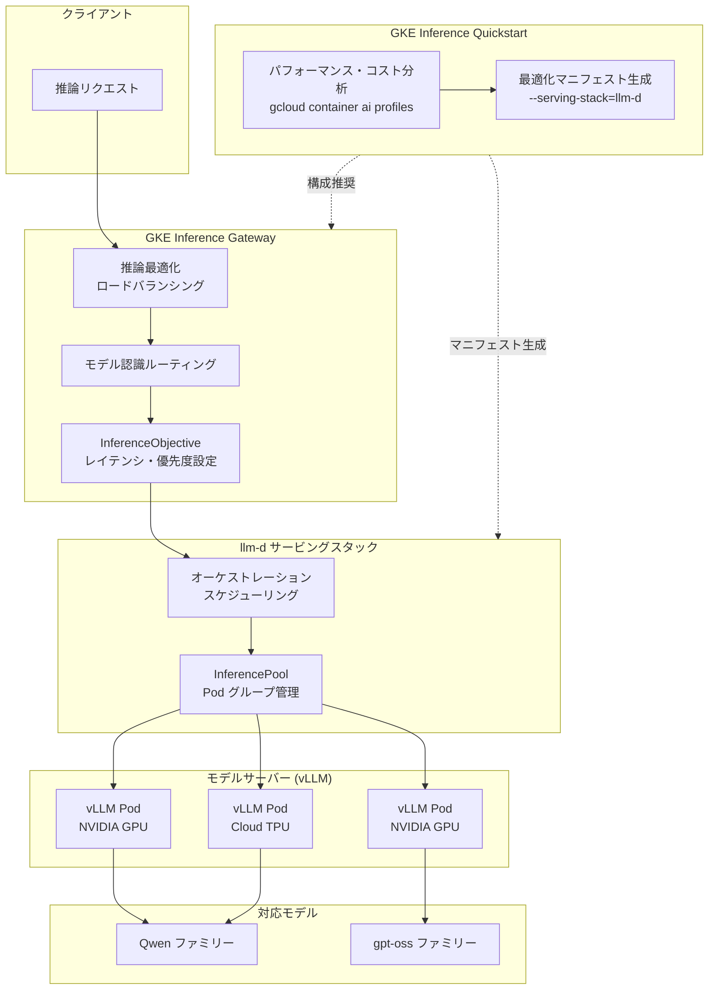

# Google Kubernetes Engine: GKE Inference Quickstart が分散 AI 推論のレコメンデーションを提供開始

**リリース日**: 2026-03-05

**サービス**: Google Kubernetes Engine (GKE)

**機能**: GKE Inference Quickstart (GIQ) による分散 AI 推論レコメンデーション

**ステータス**: Feature

📊 [このアップデートのインフォグラフィックを見る](https://takech9203.github.io/google-cloud-news-summary/20260305-gke-inference-quickstart-distributed-inference.html)

## 概要

GKE Inference Quickstart (GIQ) が分散 AI 推論のレコメンデーション機能を新たに提供開始しました。これにより、Qwen や gpt-oss などの大規模モデルファミリーに対して、NVIDIA GPU および Cloud TPU 上で最適化されたフルコンフィギュレーションをデプロイできるようになります。

本リリースの中核となるのは、llm-d 推論スケジューリングを統合した GKE Inference Gateway の導入です。llm-d は Kubernetes ネイティブの分散推論サービングスタックであり、vLLM をベースのモデルサーバーとして使用しつつ、その上にオーケストレーションとルーティングのレイヤーを追加します。ユーザーはワークロードに最適化された構成を選択し、アプリケーション固有のレイテンシおよびスループット要件に合わせてインフラストラクチャをチューニングできます。

対象ユーザーは、GKE 上で大規模言語モデル (LLM) の推論ワークロードを運用する ML エンジニア、プラットフォーム管理者、データおよび AI スペシャリストです。

**アップデート前の課題**

- 大規模モデル (Qwen、gpt-oss など) の分散推論を構成する際、アクセラレータ、モデルサーバー、スケーリング設定を手動で調整・テストする必要があり、時間がかかっていた
- 推論ゲートウェイのルーティングとロードバランシングが LLM ワークロードに最適化されておらず、レイテンシやスループットの要件を満たすための設定が複雑だった
- llm-d サービングスタック用の最適化済みマニフェストが Inference Quickstart から直接生成できなかった

**アップデート後の改善**

- Inference Quickstart が分散推論向けのレコメンデーションを提供し、Qwen や gpt-oss などの大規模モデルに対する最適化済み構成をワンコマンドで生成可能になった
- GKE Inference Gateway と llm-d の統合により、推論に最適化されたロードバランシング、モデル認識ルーティング、LoRA アダプターのマルチワークロードサービングが実現した
- レイテンシとスループットの要件を指定するだけで、Google のベンチマークに基づいた最適なインフラ構成が自動的に推奨されるようになった

## アーキテクチャ図



GKE Inference Quickstart がパフォーマンス分析に基づいて最適化マニフェストを生成し、GKE Inference Gateway が llm-d サービングスタックを通じて推論リクエストを適切なモデルサーバー Pod にルーティングする全体アーキテクチャを示しています。

## サービスアップデートの詳細

### 主要機能

1. **分散 AI 推論向けレコメンデーション**
   - Inference Quickstart が大規模モデル向けの分散推論構成をレコメンデーションとして提供
   - Qwen ファミリーや gpt-oss ファミリーなどの大規模モデルに対する最適化済みコンフィギュレーションを生成
   - NVIDIA GPU (H100 など) および Cloud TPU の両方に対応

2. **GKE Inference Gateway と llm-d の統合**
   - llm-d は Kubernetes ネイティブの分散推論サービングスタックで、vLLM をベースモデルサーバーとして使用
   - 推論に最適化されたロードバランシング (負荷メトリクスベース) を提供
   - LoRA アダプターのデンスマルチワークロードサービングをサポート
   - モデル認識ルーティングにより運用を簡素化

3. **ワークロード最適化構成の選択**
   - `gcloud container ai profiles` コマンドでパフォーマンスとコストの分析が可能
   - レイテンシ (NTPOT、TTFT) とスループット (出力トークン/秒) の要件を指定して最適構成を取得
   - Google の内部ベンチマークに基づいた、レイテンシ vs スループットの最適動作点を自動設定

## 技術仕様

### llm-d サービングスタック構成要素

| コンポーネント | 役割 |
|------|------|
| vLLM | ベースモデルサーバー (PagedAttention、連続バッチ処理、テンソル並列) |
| llm-d オーケストレーション | vLLM 上にルーティングとオーケストレーションを追加 |
| InferencePool (CRD) | モデルサーバー Pod のグループを定義 |
| InferenceObjective (CRD) | モデルのサービングパラメータと優先度を定義 |
| GKE Inference Gateway | 推論最適化ロードバランシングとルーティング |

### パフォーマンスメトリクス

| メトリクス | 説明 |
|------|------|
| NTPOT (Normalized Time per Output Token) | 出力トークンあたりの正規化処理時間 (ms) |
| TTFT (Time to First Token) | 最初のトークン生成までの時間 (ms) |
| Output Tokens/s | 1 秒あたりの出力トークン数 |
| Cost/M Input Tokens | 100 万入力トークンあたりのコスト (USD) |
| Cost/M Output Tokens | 100 万出力トークンあたりのコスト (USD) |

## 設定方法

### 前提条件

1. GKE Autopilot または Standard クラスタ (バージョン 1.32.3 以降)
2. `gkerecommender.googleapis.com` API が有効であること
3. gcloud CLI バージョン 536.0.1 以降
4. 使用するアクセラレータ (GPU/TPU) の十分なクォータ

### 手順

#### ステップ 1: パフォーマンスプロファイルの確認

```bash
# 利用可能なモデルの一覧
gcloud container ai profiles models list

# 特定モデルのプロファイル一覧 (レイテンシ要件指定)
gcloud container ai profiles list \
  --model=openai/gpt-oss-20b \
  --pricing-model=on-demand \
  --target-ttft-milliseconds=300
```

レイテンシとコストの要件に基づいて最適なアクセラレータとモデルサーバーの組み合わせを確認します。

#### ステップ 2: llm-d サービングスタック用マニフェストの生成

```bash
gcloud container ai profiles manifests create \
  --accelerator-type=nvidia-h100-80gb \
  --model=openai/gpt-oss-120b \
  --model-server=vllm \
  --serving-stack=llm-d \
  --use-case 'Multi Agent Large Document Summarization'
```

`--serving-stack=llm-d` フラグを指定することで、llm-d サービングスタック用の最適化済みマニフェストが生成されます。

#### ステップ 3: マニフェストのデプロイ

```bash
kubectl apply -f ./manifests.yaml
```

生成されたマニフェストの出力コメントに記載されるクラスタ作成手順や依存関係のインストール手順も確認してください。

## メリット

### ビジネス面

- **インフラ構成の最適化によるコスト削減**: Google のベンチマークに基づいた最適な動作点の設定により、過剰プロビジョニングを防ぎコストを最小化できる
- **デプロイまでの時間短縮**: 手動での構成調整やテストが不要になり、大規模モデルの本番デプロイを迅速化できる
- **大規模モデルへの対応**: Qwen や gpt-oss などの大規模モデルファミリーを分散推論で効率的に運用できる

### 技術面

- **llm-d による高度なスケジューリング**: Kubernetes ネイティブのオーケストレーションにより、推論リクエストの効率的な分散処理を実現
- **Inference Gateway の推論最適化ルーティング**: 負荷メトリクスベースのロードバランシングとモデル認識ルーティングにより、レイテンシとスループットを最適化
- **GPU/TPU 両対応**: NVIDIA GPU と Cloud TPU の両方で最適化済み構成が提供され、ワークロードに応じたアクセラレータ選択が可能

## デメリット・制約事項

### 制限事項

- Inference Quickstart のベンチマークデータは特定の入出力トークン分布に基づいており、実際のワークロードとは異なるパフォーマンスとなる可能性がある
- 生成されたマニフェストはバージョニングされておらず、時間経過で変更される可能性があるため、安定したマニフェストが必要な場合は別途保存が必要

### 考慮すべき点

- llm-d サービングスタックの導入には、InferencePool や InferenceObjective などの Kubernetes CRD の理解が必要
- プレフィルやデコード負荷の偏ったワークロードでは、inference-perf ツールを使用した追加のベンチマークテストが推奨される
- 使用するアクセラレータのクォータが十分であることを事前に確認する必要がある

## ユースケース

### ユースケース 1: 大規模モデルによるマルチエージェント文書要約

**シナリオ**: 企業が gpt-oss-120b モデルを使用して、大量の文書を自動要約するマルチエージェントシステムを運用したい。低レイテンシかつ高スループットが求められる。

**実装例**:
```bash
gcloud container ai profiles manifests create \
  --accelerator-type=nvidia-h100-80gb \
  --model=openai/gpt-oss-120b \
  --model-server=vllm \
  --serving-stack=llm-d \
  --use-case 'Multi Agent Large Document Summarization'
```

**効果**: llm-d の分散推論スケジューリングにより、大規模モデルの推論を複数の GPU にわたって効率的に分散させ、レイテンシ要件を満たしつつスループットを最大化できる。

### ユースケース 2: Qwen モデルによる多言語チャットサービス

**シナリオ**: 多言語対応のチャットサービスで Qwen モデルファミリーを使用し、複数の LoRA アダプター (言語別にファインチューニング) を同時にサービングしたい。

**効果**: GKE Inference Gateway のモデル認識ルーティングと LoRA アダプターのマルチワークロードサービングにより、単一の InferencePool で複数の言語特化モデルを効率的にサービングし、インフラコストを最適化できる。

## 料金

GKE Inference Quickstart 自体は追加料金なしで使用できます。実際の料金は、選択するアクセラレータ (GPU/TPU)、ノードタイプ、使用量に基づく GKE 標準料金が適用されます。詳細は [GKE 料金ページ](https://cloud.google.com/kubernetes-engine/pricing) を参照してください。

Inference Quickstart の `gcloud container ai profiles list` コマンドで、構成ごとの 100 万トークンあたりの推定コストを事前に確認できます。

## 関連サービス・機能

- **GKE Inference Gateway**: 推論ワークロード向けに最適化されたロードバランシングとルーティングを提供する GKE Gateway の拡張機能
- **llm-d**: Kubernetes ネイティブの分散推論サービングスタック。vLLM 上にオーケストレーションとルーティングレイヤーを追加
- **vLLM**: PagedAttention や連続バッチ処理を搭載した高性能 LLM サービングフレームワーク
- **Cloud TPU**: Google が設計した AI/ML アクセラレータ。大規模モデルの推論とトレーニングに使用
- **Horizontal Pod Autoscaler (HPA)**: Inference Quickstart が生成するスケーリング設定で使用される Kubernetes のオートスケーリング機能

## 参考リンク

- 📊 [インフォグラフィック](https://takech9203.github.io/google-cloud-news-summary/20260305-gke-inference-quickstart-distributed-inference.html)
- [公式リリースノート](https://cloud.google.com/release-notes#March_05_2026)
- [Inference Quickstart ドキュメント](https://cloud.google.com/kubernetes-engine/docs/how-to/machine-learning/inference/inference-quickstart)
- [GKE Inference Gateway について](https://cloud.google.com/kubernetes-engine/docs/concepts/about-gke-inference-gateway)
- [GKE Inference Gateway チュートリアル](https://cloud.google.com/kubernetes-engine/docs/tutorials/serve-with-gke-inference-gateway)
- [llm-d ドキュメント](https://llm-d.ai/docs/architecture)
- [GKE 料金](https://cloud.google.com/kubernetes-engine/pricing)

## まとめ

GKE Inference Quickstart の分散 AI 推論レコメンデーション機能と GKE Inference Gateway による llm-d 統合は、大規模言語モデルの本番推論デプロイを大幅に簡素化します。Qwen や gpt-oss などの大規模モデルを NVIDIA GPU や Cloud TPU 上で運用する組織は、この機能を活用することでインフラ構成の最適化とデプロイまでの時間短縮を実現できます。まずは `gcloud container ai profiles list` コマンドで利用可能なプロファイルを確認し、ワークロード要件に合った構成を検討することを推奨します。

---

**タグ**: #GKE #InferenceQuickstart #llm-d #InferenceGateway #分散推論 #vLLM #GPU #TPU #Qwen #gpt-oss #AI推論 #Kubernetes
