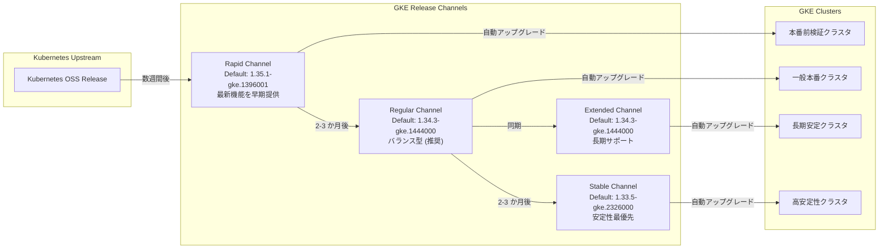

# Google Kubernetes Engine: 2026-R9 リリースチャネル バージョンアップデート

**リリース日**: 2026-03-05
**サービス**: Google Kubernetes Engine
**機能**: 2026-R9 Version Updates across All Release Channels
**ステータス**: GA (Generally Available)

[このアップデートのインフォグラフィックを見る](https://takech9203.github.io/google-cloud-news-summary/20260305-gke-version-updates-2026-r9.html)

## 概要

Google Kubernetes Engine (GKE) の全リリースチャネル (Rapid、Regular、Extended、Stable) において、2026-R9 バージョンアップデートが実施された。各チャネルのデフォルトバージョンが更新され、複数のマイナーバージョンおよびパッチバージョンが新たに利用可能になった。

今回のアップデートでは、Rapid チャネルで Kubernetes 1.35.1 がデフォルトとなり、Regular および Extended チャネルでは 1.34.3 がデフォルトに設定された。Stable チャネルでは 1.33.5 がデフォルトバージョンとして提供される。また、すべてのチャネルで自動アップグレードターゲットが更新され、クラスタのマイナーバージョンおよびパッチバージョンのアップグレードが順次適用される。

このバージョンアップデートにより、最新のセキュリティパッチ、パフォーマンス改善、および Kubernetes の新機能がチャネルごとの安定性基準に基づいて提供される。GKE ユーザーは、利用しているリリースチャネルに応じて自動的にアップグレードが適用されるため、クラスタの安全性と最新性が維持される。

**アップデート前の課題**

- 以前のデフォルトバージョンでは、最新のセキュリティ修正やバグフィックスが含まれていなかった
- 一部のマイナーバージョンにおいてパッチレベルが古く、既知の脆弱性や不具合が残存していた
- 自動アップグレードターゲットが旧バージョンを指していたため、クラスタが最新のパッチを自動的に受け取れなかった

**アップデート後の改善**

- 各チャネルのデフォルトバージョンが最新のパッチレベルに更新され、新規クラスタ作成時に最新バージョンが適用される
- 自動アップグレードターゲットが更新され、既存クラスタも順次最新パッチバージョンにアップグレードされる
- Rapid チャネルで Kubernetes 1.35.1 が利用可能になり、最新の Kubernetes 機能をいち早く検証できるようになった

## アーキテクチャ図



この図は、Kubernetes のアップストリームリリースから GKE の各リリースチャネルへのバージョン伝搬フローと、各チャネルからクラスタへの自動アップグレードの関係を示している。バージョンは Rapid から Regular、Stable へと段階的に昇格し、各段階で安定性の検証が行われる。

## サービスアップデートの詳細

### 主要機能

1. **Rapid チャネルのバージョン更新**
   - デフォルトバージョンが 1.35.1-gke.1396001 に更新
   - 新規利用可能バージョン: 1.32.12-gke.1127000、1.33.8-gke.1169000、1.34.4-gke.1193000、1.35.1-gke.1396001、1.35.1-gke.1616000
   - Kubernetes 1.35 系の最新パッチが含まれ、最新機能の早期検証が可能

2. **Regular チャネルのバージョン更新**
   - デフォルトバージョンが 1.34.3-gke.1444000 に更新
   - 新規利用可能バージョン: 1.32.12-gke.1127000、1.33.8-gke.1169000、1.34.4-gke.1193000、1.35.0-gke.2745005、1.35.0-gke.3047002、1.35.1-gke.1396001、1.35.1-gke.1616000
   - Kubernetes 1.35 系が Regular チャネルでも利用可能になり、手動アップグレードによる早期採用が可能

3. **Extended チャネルのバージョン更新**
   - デフォルトバージョンが 1.34.3-gke.1444000 に更新
   - 1.30.14-gke.2071000 から 1.35.0-gke.3047002 までの幅広いバージョンが利用可能
   - 長期サポートが必要な環境向けに、旧マイナーバージョン (1.30 系) も継続提供

4. **Stable チャネルのバージョン更新**
   - デフォルトバージョンが 1.33.5-gke.2326000 に更新
   - 新規利用可能バージョン: 1.32.11-gke.1211000、1.33.5-gke.2392000、1.34.3-gke.1318000
   - Rapid および Regular チャネルで十分に検証されたバージョンのみが提供される

5. **自動アップグレードターゲットの更新**
   - すべてのチャネルで自動アップグレードターゲットが更新
   - マイナーバージョンおよびパッチバージョンの自動アップグレードが順次展開

## 技術仕様

### チャネル別デフォルトバージョン一覧

| チャネル | デフォルトバージョン | 最新利用可能バージョン | 推奨用途 |
|---------|---------------------|---------------------|---------|
| Rapid | 1.35.1-gke.1396001 | 1.35.1-gke.1616000 | 本番前検証、新機能の早期評価 |
| Regular | 1.34.3-gke.1444000 | 1.35.1-gke.1616000 | 一般的な本番ワークロード (推奨) |
| Extended | 1.34.3-gke.1444000 | 1.35.0-gke.3047002 | 長期サポートが必要な環境 |
| Stable | 1.33.5-gke.2326000 | 1.34.3-gke.1318000 | 高安定性が求められる本番環境 |

### チャネル別新規利用可能バージョン詳細

| バージョン | Rapid | Regular | Extended | Stable |
|-----------|:-----:|:-------:|:--------:|:------:|
| 1.30.14-gke.2071000 | - | - | 利用可能 | - |
| 1.32.11-gke.1211000 | - | - | - | 利用可能 |
| 1.32.12-gke.1127000 | 利用可能 | 利用可能 | 利用可能 | - |
| 1.33.5-gke.2392000 | - | - | - | 利用可能 |
| 1.33.8-gke.1169000 | 利用可能 | 利用可能 | 利用可能 | - |
| 1.34.3-gke.1318000 | - | - | - | 利用可能 |
| 1.34.4-gke.1193000 | 利用可能 | 利用可能 | 利用可能 | - |
| 1.35.0-gke.2745005 | - | 利用可能 | 利用可能 | - |
| 1.35.0-gke.3047002 | - | 利用可能 | 利用可能 | - |
| 1.35.1-gke.1396001 | 利用可能 | 利用可能 | - | - |
| 1.35.1-gke.1616000 | 利用可能 | 利用可能 | - | - |

### リリースチャネルの特性比較

| 特性 | Rapid | Regular | Extended | Stable |
|------|-------|---------|----------|--------|
| 新バージョン提供速度 | 最速 (数週間) | 中程度 (2-3 か月) | Regular と同期 | 最遅 (4-6 か月) |
| GKE SLA 対象 | 対象外 | 対象 | 対象 | 対象 |
| 推奨環境 | 開発/検証 | 本番 (推奨) | 長期安定本番 | 高安定性本番 |
| マイナーバージョン保持期間 | 標準 | 標準 | 最長 (24 か月) | 標準 |

## 設定方法

### 前提条件

1. Google Cloud プロジェクトで GKE API が有効化されていること
2. gcloud CLI がインストールされ、認証が完了していること
3. Kubernetes Engine Cluster Admin 以上の IAM 権限を持つこと

### 手順

#### ステップ 1: 現在のクラスタバージョンとチャネルを確認

```bash
gcloud container clusters list \
    --project PROJECT_ID \
    --format="table(name,location,currentMasterVersion,releaseChannel.channel)"
```

現在のクラスタが使用しているバージョンとリリースチャネルを確認する。

#### ステップ 2: 利用可能なバージョンを確認

```bash
# 特定チャネルの利用可能バージョンを確認
gcloud container get-server-config \
    --location LOCATION \
    --format="yaml(channels)"
```

リリースチャネルごとのデフォルトバージョンと利用可能バージョンの一覧を表示する。

#### ステップ 3: クラスタのリリースチャネルを変更する場合

```bash
gcloud container clusters update CLUSTER_NAME \
    --location LOCATION \
    --release-channel CHANNEL
```

CHANNEL には `rapid`、`regular`、`extended`、`stable` のいずれかを指定する。チャネル変更時は、現在のバージョンが新チャネルで利用可能であることを確認すること。

#### ステップ 4: 手動でバージョンをアップグレードする場合

```bash
# コントロールプレーンのアップグレード
gcloud container clusters upgrade CLUSTER_NAME \
    --location LOCATION \
    --master \
    --cluster-version VERSION

# ノードプールのアップグレード
gcloud container clusters upgrade CLUSTER_NAME \
    --location LOCATION \
    --node-pool NODE_POOL_NAME \
    --cluster-version VERSION
```

手動アップグレードを行う場合は、コントロールプレーンを先にアップグレードし、その後ノードプールをアップグレードする。

## メリット

### ビジネス面

- **運用負荷の軽減**: リリースチャネルに登録されたクラスタは自動的にアップグレードされるため、手動でのバージョン管理作業が不要になり、運用チームの負担が軽減される
- **セキュリティリスクの低減**: 最新のセキュリティパッチが自動的に適用されるため、既知の脆弱性に対するリスクが迅速に低減される
- **段階的なバージョン採用**: チャネルごとの段階的なバージョン提供により、新バージョンを検証環境で先行評価し、本番環境への影響を最小化できる

### 技術面

- **最新 Kubernetes 機能へのアクセス**: Rapid チャネルで Kubernetes 1.35.1 が利用可能になり、最新の Kubernetes API や機能をいち早く検証できる
- **幅広いバージョン選択肢**: Extended チャネルでは 1.30 系から 1.35 系まで幅広いバージョンが利用可能で、ワークロードの互換性要件に応じた柔軟な選択が可能
- **パッチバージョンの早期利用**: 新しいパッチバージョンはデフォルトバージョンやアップグレードターゲットになる前に利用可能になるため、手動アップグレードで先行適用が可能

## デメリット・制約事項

### 制限事項

- Rapid チャネルのバージョンは GKE SLA の対象外であり、本番環境での使用は推奨されない
- 自動アップグレードはメンテナンスウィンドウの設定に従うため、ウィンドウが設定されていない場合は任意のタイミングでアップグレードが実行される可能性がある
- マイナーバージョンのアップグレードでは Kubernetes API の非推奨化や削除が含まれる場合があり、ワークロードの互換性確認が必要

### 考慮すべき点

- 自動アップグレードの適用前に、ステージング環境でワークロードの互換性テストを実施することを推奨する
- メンテナンスウィンドウとメンテナンス除外を適切に設定し、ビジネスクリティカルな時間帯での自動アップグレードを回避すること
- Extended チャネルを使用してマイナーバージョンの保持期間を延長する場合でも、サポート終了日までにアップグレード計画を策定すること
- 複数のマイナーバージョンをスキップする手動アップグレードは段階的に実施する必要がある

## ユースケース

### ユースケース 1: 段階的なバージョン検証パイプライン

**シナリオ**: 開発チームが Kubernetes 1.35 の新機能を検証したい場合、Rapid チャネルの開発クラスタで先行検証し、問題がなければ Regular チャネルの本番クラスタに順次展開する。

**実装例**:
```bash
# 検証クラスタ (Rapid チャネル) を 1.35.1 にアップグレード
gcloud container clusters upgrade dev-cluster \
    --location us-central1 \
    --master \
    --cluster-version 1.35.1-gke.1616000

# 検証完了後、本番クラスタ (Regular チャネル) を手動アップグレード
gcloud container clusters upgrade prod-cluster \
    --location us-central1 \
    --master \
    --cluster-version 1.35.1-gke.1396001
```

**効果**: 新バージョンの機能やパフォーマンスを検証環境で事前に評価でき、本番環境への影響を最小化しながら最新バージョンを採用できる。

### ユースケース 2: Extended チャネルによる長期バージョン保持

**シナリオ**: 金融機関の規制要件により、Kubernetes マイナーバージョンのアップグレードには社内監査プロセスが必要で、頻繁なバージョン変更が困難な場合。Extended チャネルを利用して 1.34 系を長期間維持しつつ、パッチアップデートは自動的に適用する。

**効果**: Extended チャネルのマイナーバージョン長期サポート (最大 24 か月) を活用することで、監査プロセスに十分な時間を確保しながら、セキュリティパッチは自動的に適用され、クラスタの安全性が維持される。

## 料金

GKE のリリースチャネルおよびバージョンアップデートに関する追加料金は発生しない。バージョンアップデートは GKE サービスの標準機能として提供される。

### GKE クラスタ管理費用

| モード | クラスタ管理料金 |
|--------|-----------------|
| GKE Standard | $0.10/クラスタ/時間 |
| GKE Autopilot | クラスタ管理料金なし (Pod リソースに対して課金) |
| GKE Enterprise | $0.00 (Enterprise ライセンス料金に含まれる) |

バージョンアップグレード時のダウンタイムに関するコスト影響は、メンテナンスウィンドウの設定とワークロードの冗長構成に依存する。

## 利用可能リージョン

GKE のリリースチャネルバージョンアップデートは、GKE が利用可能なすべてのリージョンおよびゾーンに適用される。特定のリージョン制限はなく、グローバルに展開される。

## 関連サービス・機能

- **GKE リリースチャネル**: クラスタのバージョン管理ポリシーを定義する機能。Rapid、Regular、Extended、Stable の 4 つのチャネルから選択可能
- **GKE メンテナンスウィンドウ**: 自動アップグレードの実行時間帯を制御する機能。ビジネスクリティカルな時間帯を避けてアップグレードをスケジュール可能
- **GKE クラスタ通知**: バージョンの更新やアップグレードイベントに関する通知を受け取る機能。Pub/Sub を通じてアップグレードの事前通知を受信可能
- **GKE Surge Upgrade**: ノードプールのアップグレード時に一時的に追加ノードを作成し、ワークロードの可用性を維持しながらローリングアップグレードを実行する機能

## 参考リンク

- [インフォグラフィック](https://takech9203.github.io/google-cloud-news-summary/20260305-gke-version-updates-2026-r9.html)
- [公式リリースノート](https://cloud.google.com/release-notes#March_05_2026)
- [GKE リリースチャネルの概要](https://cloud.google.com/kubernetes-engine/docs/concepts/release-channels)
- [GKE リリーススケジュール](https://cloud.google.com/kubernetes-engine/docs/release-schedule)
- [リリースチャネルのデフォルトバージョンと利用可能バージョンの確認](https://cloud.google.com/kubernetes-engine/docs/how-to/release-channels#viewing_the_default_and_available_versions_for_release_channels)
- [GKE クラスタのアップグレード](https://cloud.google.com/kubernetes-engine/docs/how-to/upgrading-a-cluster)
- [メンテナンスウィンドウと除外の設定](https://cloud.google.com/kubernetes-engine/docs/concepts/maintenance-windows-and-exclusions)
- [GKE 料金ページ](https://cloud.google.com/kubernetes-engine/pricing)

## まとめ

2026-R9 バージョンアップデートにより、GKE の全リリースチャネルでデフォルトバージョンと利用可能バージョンが更新された。Rapid チャネルでは Kubernetes 1.35.1 がデフォルトとなり、最新機能の早期検証が可能になった一方、Stable チャネルでは十分に検証された 1.33.5 が提供され、安定性重視の運用に対応している。自動アップグレードターゲットも更新されているため、メンテナンスウィンドウの設定を確認し、ワークロードの互換性テストを事前に実施することを推奨する。

---

**タグ**: #GoogleKubernetesEngine #GKE #ReleaseChannels #VersionUpdate #Kubernetes #AutoUpgrade #Rapid #Regular #Extended #Stable #ClusterManagement
