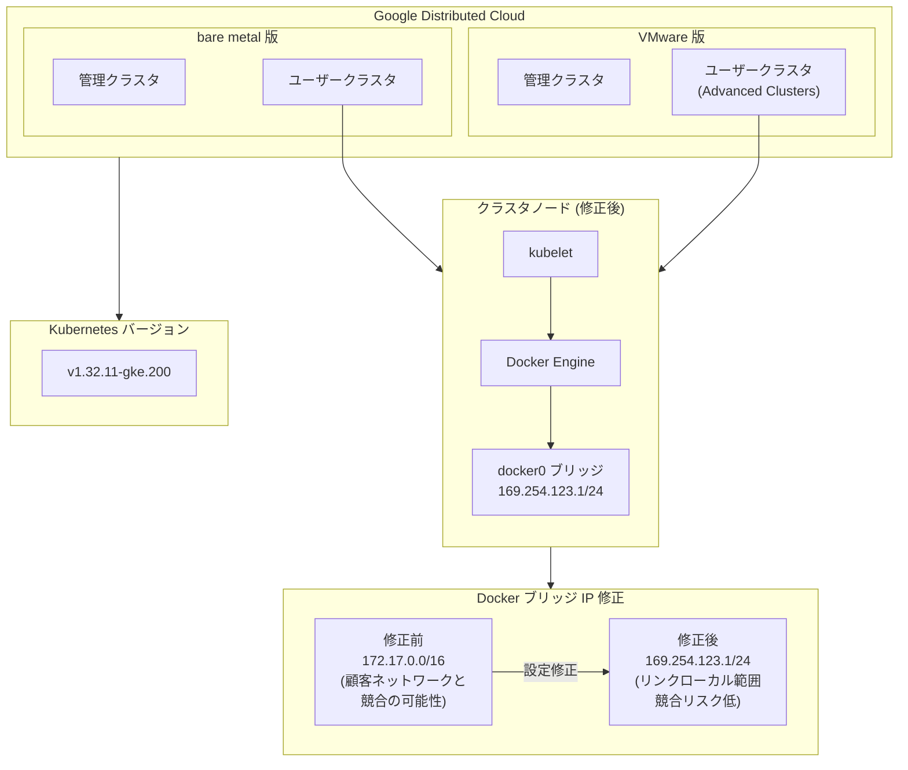

# Google Distributed Cloud: v1.32.900-gke.60 リリースと Docker ブリッジ IP 修正

**リリース日**: 2026-03-05

**サービス**: Google Distributed Cloud (software only) for VMware / bare metal

**機能**: v1.32.900-gke.60 パッチリリースおよび Docker デフォルトブリッジ IP 範囲の修正

**ステータス**: 利用可能

[このアップデートのインフォグラフィックを見る](https://takech9203.github.io/google-cloud-news-summary/20260305-google-distributed-cloud-v1-32-900.html)

## 概要

Google Distributed Cloud (software only) for VMware および bare metal の v1.32.900-gke.60 がリリースされました。本バージョンは Kubernetes v1.32.11-gke.200 上で動作します。VMware 版と bare metal 版の両方で同一バージョン番号が提供されており、統一的なアップグレードパスが確保されています。

また、VMware V2 (Advanced Clusters) のバージョン 1.31 以前に存在していた Docker デフォルトブリッジ IP 範囲の問題が修正されました。この問題では、ノード起動スクリプトに Docker デフォルトブリッジ IP 範囲を定義する設定ステップが欠落しており、Docker がデフォルトの 172.17.0.0/16 アドレス範囲を使用していました。顧客のネットワークインフラストラクチャとこの範囲が重複する場合、クラスタ作成時や運用中に接続障害が発生する可能性がありました。

本リリースは、オンプレミスまたはハイブリッドクラウド環境で Google Distributed Cloud を運用しているエンタープライズユーザー、特に VMware vSphere やベアメタルサーバー上で Kubernetes クラスタを管理しているインフラストラクチャチームを対象としています。

**アップデート前の課題**

- VMware V2 (Advanced Clusters) バージョン 1.31 以前では、ノード起動スクリプトに Docker デフォルトブリッジ IP 範囲の設定が欠落していた
- Docker がデフォルトの 172.17.0.0/16 (場合によっては 172.16.0.0/16) アドレス範囲を使用し、顧客ネットワークとの IP アドレス競合が発生する可能性があった
- IP 競合が発生した場合、クラスタ作成や運用中に接続障害が発生していた
- 以前のバージョン (1.28.0-1.28.500、1.29.0) では COS OS イメージのリグレッションにより Docker サービスが再起動されず、手動でのワークアラウンドが必要だった

**アップデート後の改善**

- Docker デフォルトブリッジ IP がクラスタノードで明示的に 169.254.123.1/24 に設定されるようになった
- 169.254.0.0/16 はリンクローカルアドレス範囲であり、顧客のネットワークインフラストラクチャと競合するリスクが極めて低い
- Advanced Clusters のノード起動スクリプトが修正され、手動ワークアラウンドが不要になった
- VMware 版・bare metal 版の両方で v1.32.900-gke.60 が利用可能になり、Kubernetes v1.32.11-gke.200 の最新パッチが適用された

## アーキテクチャ図



Google Distributed Cloud の VMware 版と bare metal 版の両方で v1.32.900-gke.60 がリリースされ、Docker ブリッジ IP がリンクローカルアドレス範囲に修正されたことを示しています。

## サービスアップデートの詳細

### 主要機能

1. **Docker デフォルトブリッジ IP 範囲の修正 (VMware Advanced Clusters)**
   - VMware V2 (Advanced Clusters) バージョン 1.31 以前で、ノード起動スクリプトに Docker デフォルトブリッジ IP 範囲の設定ステップが欠落していた問題を修正
   - Docker のデフォルト 172.17.0.0/16 から、明示的に 169.254.123.1/24 (リンクローカルアドレス) に変更
   - 172.17.0.0/16 や 172.16.0.0/16 を社内ネットワークで使用している場合に発生していた接続障害が解消

2. **Google Distributed Cloud for VMware 1.32.900-gke.60**
   - Kubernetes v1.32.11-gke.200 上で動作
   - リリース後、GKE On-Prem API クライアント (Google Cloud コンソール、gcloud CLI、Terraform) で利用可能になるまで約 7-14 日かかる
   - サードパーティストレージベンダーを使用している場合、ストレージパートナーの認定確認が必要

3. **Google Distributed Cloud for bare metal 1.32.900-gke.60**
   - Kubernetes v1.32.11-gke.200 上で動作
   - リリース後、GKE On-Prem API クライアントで利用可能になるまで約 7-14 日かかる
   - サードパーティストレージベンダーを使用している場合、ストレージパートナーの認定確認が必要

## 技術仕様

### バージョン情報

| 項目 | 詳細 |
|------|------|
| GDC for VMware バージョン | 1.32.900-gke.60 |
| GDC for bare metal バージョン | 1.32.900-gke.60 |
| Kubernetes バージョン | v1.32.11-gke.200 |
| 修正対象 (Docker ブリッジ IP) | VMware V2 Advanced Clusters v1.31 以前 |
| 修正前の Docker ブリッジ IP | 172.17.0.0/16 (デフォルト) |
| 修正後の Docker ブリッジ IP | 169.254.123.1/24 (リンクローカル) |

### Docker ブリッジ IP 設定

Docker デーモン設定で `--bip` パラメータが明示的に指定されるようになりました。

```json
{
  "bip": "169.254.123.1/24"
}
```

この設定により、Docker の `docker0` ブリッジインターフェースに割り当てられる IP アドレス範囲が、顧客ネットワークと競合しないリンクローカルアドレス範囲に固定されます。

## 設定方法

### 前提条件

1. 既存の Google Distributed Cloud クラスタが稼働していること
2. 管理ワークステーションから `gkectl` コマンドまたは GKE On-Prem API クライアントにアクセスできること

### 手順

#### ステップ 1: アップグレードドキュメントの確認

VMware 版の場合:

```bash
# 現在のクラスタバージョンを確認
gkectl version --kubeconfig ADMIN_CLUSTER_KUBECONFIG
```

bare metal 版の場合:

```bash
# 現在のクラスタバージョンを確認
bmctl version --kubeconfig ADMIN_CLUSTER_KUBECONFIG
```

#### ステップ 2: クラスタのアップグレード

VMware 版のアップグレード手順は [Upgrade clusters](https://cloud.google.com/kubernetes-engine/distributed-cloud/vmware/docs/how-to/upgrading) を、bare metal 版は [Upgrade clusters](https://cloud.google.com/kubernetes-engine/distributed-cloud/bare-metal/docs/how-to/upgrade) を参照してください。

#### ステップ 3: Docker ブリッジ IP の確認 (VMware Advanced Clusters)

アップグレード後、ノード上で Docker ブリッジ IP が正しく設定されていることを確認します。

```bash
# ノードにアクセスして確認
ip a | grep docker0
```

期待される出力に `169.254.123.1/24` が含まれていることを確認してください。

## メリット

### ビジネス面

- **ネットワーク信頼性の向上**: Docker ブリッジ IP の競合による予期しないダウンタイムのリスクが排除され、クラスタの安定運用が可能に
- **運用コストの削減**: 手動ワークアラウンド (Docker サービスの再起動) が不要になり、VM 再作成時の追加作業が解消

### 技術面

- **IP アドレス競合の解消**: リンクローカルアドレス範囲 (169.254.x.x) の使用により、エンタープライズネットワークで一般的に使用される 172.16.0.0/12 プライベートアドレス範囲との競合を回避
- **Kubernetes v1.32.11 の最新パッチ適用**: セキュリティ修正とバグフィックスが含まれた最新の Kubernetes パッチバージョンが利用可能

## デメリット・制約事項

### 制限事項

- リリース後、GKE On-Prem API クライアント (Google Cloud コンソール、gcloud CLI、Terraform) で利用可能になるまで約 7-14 日かかる
- サードパーティストレージベンダーを使用している場合、ベンダーがこのリリースの認定を通過していることを確認する必要がある

### 考慮すべき点

- VMware 版で 1.32 から 1.33 にアップグレードする際は、クラスタが自動的に Advanced Clusters に変換される点に注意が必要
- Advanced Clusters への変換時に cert-manager が自動的にオーバーライドされるため、既存の cert-manager カスタム設定がある場合は事前確認が必要
- クラスタバージョンスキュールールに準拠したアップグレードパスを計画すること

## ユースケース

### ユースケース 1: 172.17.0.0/16 を社内ネットワークで使用している環境

**シナリオ**: 企業の社内ネットワークが 172.17.0.0/16 アドレス範囲を使用しており、Google Distributed Cloud の VMware Advanced Clusters でクラスタを作成すると Docker ブリッジ IP との競合により接続障害が発生していた。

**効果**: Docker ブリッジ IP が 169.254.123.1/24 に変更されたことで、社内ネットワークとの IP 競合が解消され、クラスタの作成と運用が安定して行えるようになる。

### ユースケース 2: マルチクラスタ環境での統一アップグレード

**シナリオ**: VMware 上と bare metal 上の両方で Google Distributed Cloud クラスタを運用しており、統一されたバージョンで管理したいインフラストラクチャチーム。

**効果**: 両プラットフォームで同一バージョン (1.32.900-gke.60) が提供されるため、バージョン管理が簡素化され、Kubernetes v1.32.11-gke.200 の最新パッチを統一的に適用できる。

## 関連サービス・機能

- **GKE Enterprise**: Google Distributed Cloud は GKE Enterprise の一部として提供される、オンプレミス/ハイブリッド環境向けの Kubernetes プラットフォーム
- **Advanced Clusters (VMware V2)**: 拡張性と柔軟性を向上させた新しいアーキテクチャ。1.32 ではデフォルトで新規クラスタが Advanced Clusters として作成される
- **GKE Identity Service**: 認証・OIDC 設定のトラブルシューティングを容易にする診断ユーティリティが v1.32 で追加

## 参考リンク

- [インフォグラフィック](https://takech9203.github.io/google-cloud-news-summary/20260305-google-distributed-cloud-v1-32-900.html)
- [公式リリースノート](https://cloud.google.com/release-notes#March_05_2026)
- [GDC for VMware リリースノート](https://cloud.google.com/kubernetes-engine/distributed-cloud/vmware/docs/release-notes)
- [GDC for bare metal リリースノート](https://cloud.google.com/kubernetes-engine/distributed-cloud/bare-metal/docs/release-notes)
- [VMware アップグレードガイド](https://cloud.google.com/kubernetes-engine/distributed-cloud/vmware/docs/how-to/upgrading)
- [bare metal アップグレードガイド](https://cloud.google.com/kubernetes-engine/distributed-cloud/bare-metal/docs/how-to/upgrade)
- [Advanced Clusters の概要](https://cloud.google.com/kubernetes-engine/distributed-cloud/vmware/docs/concepts/advanced-clusters)
- [既知の問題 (VMware)](https://cloud.google.com/kubernetes-engine/distributed-cloud/vmware/docs/troubleshooting/known-issues)

## まとめ

Google Distributed Cloud v1.32.900-gke.60 は、VMware 版と bare metal 版の両方で利用可能な重要なパッチリリースです。特に VMware V2 (Advanced Clusters) における Docker デフォルトブリッジ IP 範囲の修正は、172.17.0.0/16 を社内ネットワークで使用している環境での接続障害を根本的に解消するものです。該当バージョンを使用しているクラスタ管理者は、アップグレード計画を立てて本パッチの適用を推奨します。

---

**タグ**: #GoogleDistributedCloud #GDC #VMware #BareMetal #Kubernetes #DockerBridgeIP #AdvancedClusters #GKEEnterprise #オンプレミス #ハイブリッドクラウド #セキュリティパッチ
