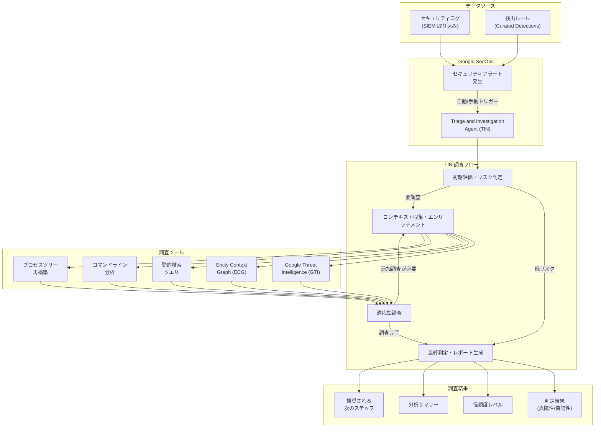

# Google SecOps: Agentic SOC 無料トライアルの提供開始

**リリース日**: 2026-03-05

**サービス**: Google SecOps (Google Security Operations)

**機能**: Triage and Investigation Agent (TIN) - Agentic SOC Trial

**ステータス**: アナウンス (トライアル期間: 2026年4月1日 - 2026年6月30日)

📊 [このアップデートのインフォグラフィックを見る](https://takech9203.github.io/google-cloud-news-summary/20260305-google-secops-agentic-soc-trial.html)

## 概要

Google は、Google SecOps の Triage and Investigation Agent (TIN) を無料で試用できる「Google Agentic SOC Trial」を発表しました。トライアル期間は 2026年4月1日から2026年6月30日までの3か月間で、対象のサブスクリプションを持つ顧客が追加費用なしで TIN を利用できます。

TIN は、Google SecOps に組み込まれた AI ベースのエージェント型調査アシスタントです。Mandiant の原則と業界のベストプラクティスに基づき、セキュリティアラートが真陽性か偽陽性かを自動的に判定し、その判定根拠を構造化された分析レポートとして提供します。これにより、SOC (Security Operations Center) アナリストのアラートトリアージ作業を大幅に効率化し、脅威への初動対応時間の短縮を実現します。

対象となるのは、Google SecOps の Enterprise、Enterprise Plus、または Google Unified Security (GUS) サブスクリプションを持つ顧客です。トライアル期間中は、ティアに応じた時間あたりの実行回数制限が適用されます。

**アップデート前の課題**

- SOC アナリストが大量のセキュリティアラートを手動でトリアージする必要があり、調査に多大な時間と労力を要していた
- アラートの真偽判定に一貫性がなく、アナリストのスキルや経験に依存していた
- 脅威インテリジェンスやエンティティコンテキストの収集・統合を手動で行う必要があり、調査の初動が遅れがちだった
- TIN の導入には追加コストが発生するため、効果を事前に検証する機会が限られていた

**アップデート後の改善**

- 3か月間の無料トライアルにより、TIN の効果を本番環境で検証してから導入判断が可能になった
- AI エージェントによるアラートの自動トリアージで、SOC アナリストの調査工数を大幅に削減できる
- Mandiant の知見に基づく一貫した脅威分析により、アラート判定の品質と再現性が向上する
- Google Threat Intelligence (GTI) との自動連携により、脅威情報の収集・照合が即座に行われる

## アーキテクチャ図

TIN はセキュリティアラートを受け取ると、初期評価、コンテキスト収集、適応型調査の多段階プロセスを経て、最終的な判定結果と分析サマリーを生成します。各調査ステップでは GTI やエンティティコンテキストグラフなど複数の調査ツールを並列に活用します。

## サービスアップデートの詳細

### 主要機能

1. **自動アラートトリアージ**
   - アラート発生時に TIN が自動的にトリガーされ、調査を開始する
   - Mandiant の原則と業界ベストプラクティスに基づいた分析を実行
   - 真陽性・偽陽性の判定と信頼度レベルを提供

2. **多段階調査プロセス**
   - 初期評価とリスク優先順位付けで低リスクアラートを即座に分類
   - Google Threat Intelligence (GTI) によるファイルハッシュ、IP アドレス、ドメインの脅威インテリジェンス照合
   - Entity Context Graph (ECG) によるエンティティ間の関係分析と環境コンテキストの付加
   - 動的検索クエリによるネットワークコンテキストの収集
   - プロセスツリーの再構築によるシステムアクティビティの可視化

3. **適応型ディープダイブ調査**
   - 初回の調査結果に基づき、追加の調査が必要かを動的に判断
   - 新たな調査計画を自動生成し、専門ツールを使った深掘り調査を反復実行
   - コマンドラインの自然言語解析で不審な操作を説明

4. **構造化された調査レポート**
   - 調査サマリー、判定結果、信頼度、タイムラインを統合した詳細レポートを生成
   - Gemini による推奨次ステップの提案
   - フィードバック機能 (サムアップ/サムダウン) で判定精度の継続的な改善が可能

## 技術仕様

### トライアル利用制限

| 項目 | Enterprise | Enterprise Plus / GUS |
|------|------|------|
| 時間あたり合計実行回数 | 10 回 | 20 回 |
| 自動実行の上限 | 5 回/時 | 10 回/時 |
| 手動実行の上限 | 5 回/時 | 10 回/時 |
| 制限リセット | 1 時間ごと | 1 時間ごと |

### 調査パフォーマンス

| 項目 | 詳細 |
|------|------|
| 平均調査完了時間 | 約 60 秒 |
| 最大調査実行時間 | 20 分 |
| 対応データソース | Google SecOps SIEM で取り込まれたデータのみ (SOAR コネクタ経由のアラートは非対応) |
| テナント構成 | シングルテナントのみ対応 (マルチテナント非対応) |

### トライアル対象サブスクリプション

| パッケージ | トライアル対象 | トライアル終了後 |
|------|------|------|
| Enterprise | 対象 | TIN へのアクセス終了。履歴データは保持。継続利用には Security Tokens SKU の購入が必要 |
| Enterprise Plus | 対象 | サブスクリプション付属の無料 Security Token 枠に自動移行。追加容量は Security Tokens SKU の購入が必要 |
| Google Unified Security (GUS) | 対象 | Enterprise Plus と同様の移行 |

### 必要な IAM 権限

TIN の利用には、Triage and Investigation Agent に関連する IAM 権限が必要です。詳細は [Feature RBAC permissions and roles](https://cloud.google.com/chronicle/docs/reference/feature-rbac-permissions-roles#triageInvestigationAgent) を参照してください。

## メリット

### ビジネス面

- **導入リスクの低減**: 3か月間の無料トライアルにより、コスト負担なく TIN の効果を本番環境で検証し、ROI を評価した上で導入判断ができる
- **SOC 運用コストの削減**: アラートトリアージの自動化により、アナリストの手動調査時間を大幅に短縮し、より高度な脅威ハンティングにリソースを集中できる
- **インシデント対応時間の短縮**: 平均 60 秒での調査完了により、脅威の初動対応が飛躍的に向上する

### 技術面

- **一貫した脅威分析品質**: Mandiant の知見と Gemini AI による分析で、アナリストの経験に依存しない一定品質のトリアージを実現
- **Google Threat Intelligence との統合**: GTI、VirusTotal、Safe Browsing など Google の広範な脅威インテリジェンスを自動的に活用
- **適応型調査**: 固定的なルールベースではなく、調査過程の発見に基づいて動的に調査計画を調整する柔軟な分析が可能

## デメリット・制約事項

### 制限事項

- シングルテナント構成のみ対応。マルチテナント (親テナント + 子サブテナント) 構成では利用不可
- Google SecOps SIEM で取り込まれたデータのみが調査対象。SOAR コネクタ経由のアラートは TIN で処理されない
- 時間あたりの実行回数に制限があり、制限到達時は1時間待つ必要がある
- 調査キューは存在しないため、制限を超えたアラートは自動分析されない
- 規制やコンプライアンスの制約により、一部の顧客ではトライアルが利用できない場合がある

### 考慮すべき点

- トライアル終了後、Enterprise 顧客は TIN へのアクセスが停止されるため、継続利用には Security Tokens SKU の購入計画が必要
- トライアル期間中に TIN の効果測定と社内評価を完了できるよう、事前の計画策定が重要
- トークンはサブスクリプション単位で付与され、異なるサブスクリプション間でのプール・譲渡は不可

## ユースケース

### ユースケース 1: 大量アラートのトリアージ自動化

**シナリオ**: 大規模企業の SOC チームが1日あたり数千件のセキュリティアラートを受信しており、アナリストが手動トリアージに追われて高度な脅威調査に時間を割けない状況にある。

**効果**: TIN による自動トリアージで偽陽性アラートを迅速に分類し、真陽性アラートに対しては構造化された分析レポートを即座に提供。アナリストは TIN の調査結果を起点として、より深い脅威ハンティングに集中できる。

### ユースケース 2: トライアルを活用した AI セキュリティ投資の評価

**シナリオ**: セキュリティチームが AI を活用した SOC 自動化への投資を検討しているが、効果が不明確なため経営層への説明が困難な状況にある。

**効果**: 3か月間の無料トライアルで TIN の検出精度、調査時間の短縮効果、偽陽性削減率を定量的に計測し、データに基づいた投資判断が可能になる。トライアル中の履歴データは終了後も保持されるため、効果分析に活用できる。

### ユースケース 3: 夜間・休日のセキュリティ監視強化

**シナリオ**: SOC チームの人員が限られており、夜間や休日のアラート対応が遅延しがちな中小規模の Enterprise 顧客。

**効果**: TIN の自動トリガー機能により、アナリスト不在時もアラートの初期トリアージが自動的に実行される。緊急度の高い真陽性アラートを即座に特定し、オンコール対応の効率を向上させる。

## 料金

トライアル期間 (2026年4月1日 - 6月30日) 中は無料で TIN を利用できます。

トライアル終了後の継続利用には Google SecOps Security Tokens SKU の購入が必要です。Enterprise Plus および GUS 顧客は、サブスクリプションに付属する無料の Security Token 枠が利用可能で、追加容量が必要な場合に Security Tokens SKU を購入する形となります。

## 関連サービス・機能

- **Google SecOps (Google Security Operations)**: TIN が統合されるセキュリティ運用プラットフォーム。SIEM、SOAR、脅威インテリジェンスを統合
- **Google Threat Intelligence (GTI)**: TIN が調査時に活用する脅威インテリジェンスサービス。VirusTotal データを含む
- **Mandiant**: TIN の調査ロジックの基盤となるサイバーセキュリティ専門知識を提供
- **Google Unified Security (GUS)**: Security Command Center と Google SecOps を統合したセキュリティプラットフォーム
- **Gemini**: TIN の AI 基盤として、分析サマリー生成や次ステップの推奨に使用

## 参考リンク

- 📊 [インフォグラフィック](https://takech9203.github.io/google-cloud-news-summary/20260305-google-secops-agentic-soc-trial.html)
- [公式リリースノート](https://cloud.google.com/release-notes#March_05_2026)
- [Google Agentic SOC Trial 詳細](https://cloud.google.com/chronicle/docs/agentic-soc/trial)
- [Triage and Investigation Agent (TIN) ドキュメント](https://cloud.google.com/chronicle/docs/secops/triage-investigation-agent)
- [Google SecOps 概要](https://cloud.google.com/chronicle/docs/secops/secops-overview)

## まとめ

Google Agentic SOC Trial は、AI エージェントによるセキュリティアラート自動調査の効果を無料で検証できる貴重な機会です。Enterprise、Enterprise Plus、GUS の顧客は、2026年4月1日から3か月間 TIN を試用できるため、トライアル開始前に IAM 権限の設定とデータ取り込みの確認を済ませておくことを推奨します。特に、SOC チームの調査効率向上と脅威対応時間の短縮を目指す組織にとって、この無料トライアルは AI セキュリティ投資の判断材料として活用すべきアップデートです。

---

**タグ**: #GoogleSecOps #AgenticSOC #TIN #TriageAndInvestigationAgent #セキュリティ #AI #Gemini #SOC #脅威検出 #無料トライアル #Mandiant #GoogleThreatIntelligence
