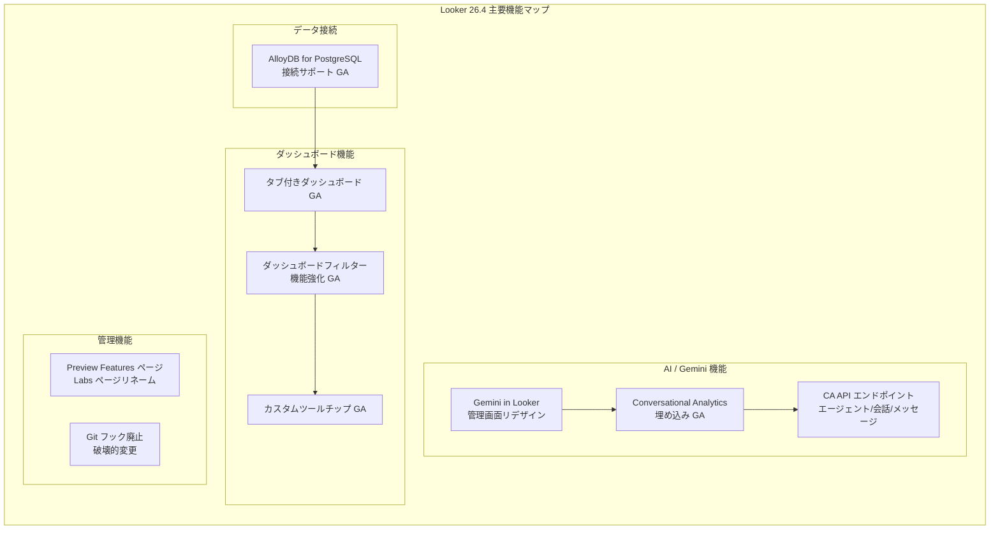

# Looker: Looker 26.4 リリース - Conversational Analytics 埋め込み、タブ付きダッシュボード、カスタムツールチップなど多数の GA 機能

**リリース日**: 2026-03-05

**サービス**: Looker (Google Cloud core) / Looker (original)

**機能**: Looker 26.4 リリース (複数の新機能、改善、バグ修正)

**ステータス**: GA (一般提供) / Preview

📊 [このアップデートのインフォグラフィックを見る](https://takech9203.github.io/google-cloud-news-summary/20260305-looker-26-4-features.html)

## 概要

Looker 26.4 は、BI プラットフォームとしての Looker の機能を大幅に強化するメジャーリリースです。Conversational Analytics の埋め込みサポート GA、カスタムツールチップ GA、タブ付きダッシュボード GA、AlloyDB for PostgreSQL 接続サポート GA など、多数の機能が一般提供に移行しました。

本リリースでは、ダッシュボードのユーザー体験を向上させるフィルター機能の強化や、Gemini in Looker の管理画面リデザインなど、管理者向けの改善も含まれています。また、Conversational Analytics API の新しいエンドポイントが追加され、エージェント、会話、メッセージの作成と管理がプログラマティックに可能になりました。

セキュリティ面では、プロジェクトレベルのローカル Git フックのサポートが廃止される破壊的変更が含まれており、既存のワークフローへの影響を確認する必要があります。

**アップデート前の課題**

- Conversational Analytics を外部アプリケーションに埋め込む際、Looker (Google Cloud core) ではサポートされておらず、Embed SDK も利用できなかった
- ダッシュボードのコンテンツが増加すると、単一ページに全てのビジュアライゼーションが配置され、見通しが悪くパフォーマンスにも影響していた
- ツールチップのカスタマイズには LookML の html パラメータを使用する必要があり、開発者以外には困難だった
- AlloyDB for PostgreSQL に接続する場合、PostgreSQL 9.5+ のダイアレクトを代用する必要があった
- ダッシュボードフィルターでの複数選択や一括操作が煩雑だった

**アップデート後の改善**

- Conversational Analytics が Looker (Google Cloud core) での埋め込みをサポートし、Embed SDK 経由での利用も可能に
- タブ付きダッシュボードにより、関連するビジュアライゼーションをタブごとに整理でき、アクティブなタブのみ読み込むことでパフォーマンスも向上
- UI ベースのカスタムツールチップエディタにより、HTML と Liquid テンプレートを使ったツールチップ設定が容易に
- AlloyDB for PostgreSQL 専用のダイアレクトが選択可能になり、最適化された接続が実現
- フィルターのドロップダウン常時表示、全選択/全解除、条件制御などダッシュボード操作性が大幅に改善

## アーキテクチャ図



Looker 26.4 の主要機能は、AI/Gemini 機能群、ダッシュボード機能群、データ接続、管理機能の 4 つの領域に分類されます。Conversational Analytics の埋め込みと API は連携して動作し、ダッシュボード関連の GA 機能はユーザー体験を統合的に向上させます。

## サービスアップデートの詳細

### 主要機能

1. **Embed Conversational Analytics (GA)**
   - Looker (Google Cloud core) で Conversational Analytics の埋め込みがサポートされるようになった
   - Looker Embed SDK が埋め込み Conversational Analytics をサポート
   - 埋め込みテーマが部分的にサポート
   - 埋め込み URL は `/embed/conversations` または `/embed/agents` の形式で構成
   - プライベート埋め込みと署名付き埋め込みの両方に対応
   - 利用には `chat_with_explore` などの適切な権限が必要

2. **カスタムツールチップ (GA)**
   - Explore のビジュアライゼーションエディタ内でツールチップを UI 設定と HTML エディタで構成可能
   - Liquid テンプレートによる動的なデータ表示をサポート
   - フォントサイズ、フォントファミリー、背景色、フォント色、角丸、影、テキスト配置のカスタマイズが可能
   - テーブルチャート、単一値チャート、デカルトチャートでサポート
   - 円グラフ、ボックスプロット、ウォーターフォールチャートは未対応

3. **タブ付きダッシュボード (GA)**
   - ダッシュボードエディタがタブを使用してコンテンツを整理可能
   - アクティブなタブのタイルのみを読み込むことでパフォーマンスが向上
   - デフォルトの最大タブ数は 5 (管理者がカスタマイズ可能)
   - PDF ダウンロード時は全タブが 1 つの PDF に統合される
   - タブごとのクイックレイアウト (XS/S/M/L/XL) を適用可能
   - タブごとのアクセス制御は不可

4. **AlloyDB for PostgreSQL 接続サポート (GA)**
   - 接続作成時に「Google Cloud AlloyDB for PostgreSQL」をダイアレクトメニューから直接選択可能
   - 対称集計、派生テーブル、永続 SQL 派生テーブル、タイムゾーンなど幅広い機能をサポート
   - Looker (Google Cloud core) と Looker (original) の両方で利用可能
   - 既存の PostgreSQL 9.5+ オプションで作成された AlloyDB 接続には影響なし

5. **ダッシュボードフィルター機能強化 (GA)**
   - フィルター候補のドロップダウンが常時表示され、複数選択が容易に
   - タグリストおよび高度なフィルタータイプで全選択/全解除が可能
   - 高度なフィルターの条件オプションを制限する機能を追加
   - ボードのカスタムフィルター値のデフォルト有効化オプションを追加

6. **Preview Features ページ**
   - 従来の Labs ページが「Preview Features」にリネーム
   - 機能が「Preview features」と「Labs features」のカテゴリに整理

7. **Gemini in Looker 管理画面リデザイン**
   - Admin パネルの Gemini in Looker ページが再設計
   - Gemini 機能を個別に有効化/無効化できるように変更

8. **Looker API Conversational Analytics エンドポイント**
   - エージェントの作成・管理用 API エンドポイントを追加
   - 会話の作成・取得・一覧・削除用 API エンドポイントを追加
   - メッセージの送信・一覧用 API エンドポイントを追加
   - ステートレスチャットメッセージの送信をサポート

9. **破壊的変更: プロジェクトレベルの Git フック廃止**
   - セキュリティ上の理由により、プロジェクトレベルのローカル Git フックがサポートされなくなった
   - 既存のローカル Git フックに依存するワークフローの見直しが必要

10. **バグ修正**
    - フィルターでの日本語入力に関する問題を修正
    - 条件付き書式の問題を修正
    - ピボットカラムのソートに関する問題を修正
    - PDF ダウンロードに関する問題を修正

## 技術仕様

### Conversational Analytics 埋め込み

| 項目 | 詳細 |
|------|------|
| 対応プラットフォーム | Looker (Google Cloud core)、Looker (original) |
| 埋め込み方式 | プライベート埋め込み、署名付き埋め込み |
| Embed SDK | サポート対象 |
| 埋め込みテーマ | 部分的にサポート |
| 必要な権限 | `chat_with_explore`、`chat_with_agent` など |
| 最低バージョン | Looker 26.2 以降 |

### AlloyDB for PostgreSQL サポート機能

| 項目 | サポート状況 |
|------|------|
| Looker (Google Cloud core) | 対応 |
| 対称集計 | 対応 |
| 派生テーブル | 対応 |
| 永続 SQL 派生テーブル | 対応 |
| タイムゾーン | 対応 |
| SSL | 対応 |
| 接続プーリング | 対応 |
| 集約認識 | 対応 |
| インクリメンタル PDT | 対応 |
| マテリアライズドビュー | 対応 |

### Conversational Analytics API エンドポイント

```
# エージェント管理
POST   /v1beta/projects/*/locations/*/dataAgents           # エージェント作成
GET    /v1beta/projects/*/locations/*/dataAgents/*          # エージェント取得
GET    /v1beta/projects/*/locations/*/dataAgents            # エージェント一覧

# 会話管理
POST   /v1beta/projects/*/locations/*/conversations         # 会話作成
GET    /v1beta/projects/*/locations/*/conversations/*        # 会話取得
GET    /v1beta/projects/*/locations/*/conversations          # 会話一覧
DELETE /v1beta/projects/*/locations/*/conversations/*        # 会話削除

# メッセージ管理
POST   /v1beta/projects/*/locations/*/conversations/*/messages  # メッセージ送信
GET    /v1beta/projects/*/locations/*/conversations/*/messages  # メッセージ一覧
```

## デプロイスケジュール

| プラットフォーム | デプロイ開始日 |
|------|------|
| Looker (original) | 2026年3月8日 (日曜日) |
| Looker (Google Cloud core) | 2026年3月16日 (月曜日) |

## メリット

### ビジネス面

- **データ民主化の加速**: Conversational Analytics の埋め込みにより、自社アプリケーション内で自然言語によるデータ分析が可能になり、BI の専門知識がないユーザーもデータにアクセスできる
- **ダッシュボードの整理と効率化**: タブ付きダッシュボードにより、関連する分析を 1 つのダッシュボードに統合でき、コンテンツの発見性と管理効率が向上
- **情報提示の高度化**: カスタムツールチップにより、ビジュアライゼーション上で文脈に応じた追加情報を表示でき、データストーリーテリングが強化される
- **Google Cloud エコシステムとの統合**: AlloyDB for PostgreSQL のネイティブサポートにより、Google Cloud のデータベースサービスとの接続がシームレスに

### 技術面

- **パフォーマンス改善**: タブ付きダッシュボードのタブ単位の遅延読み込みにより、初期表示速度が向上
- **API ファーストの Conversational Analytics**: 新しい API エンドポイントにより、カスタムアプリケーションからの Conversational Analytics 統合が容易に
- **Gemini 機能の細粒度制御**: 管理者が Gemini 機能を個別に制御可能になり、段階的な導入が可能に
- **セキュリティ強化**: ローカル Git フックの廃止により、潜在的なセキュリティリスクを排除

## デメリット・制約事項

### 制限事項

- カスタムツールチップは円グラフ、ボックスプロット、ウォーターフォールチャートでは利用不可
- タブ付きダッシュボードではタブごとのアクセス制御ができない
- タブ付きダッシュボードのデフォルト最大タブ数は 5 (パフォーマンス考慮で 10 以下を推奨)
- Conversational Analytics の埋め込みテーマは部分的なサポートのみ

### 考慮すべき点

- **破壊的変更への対応**: プロジェクトレベルのローカル Git フックを使用している場合、代替ワークフローへの移行が必要
- **デプロイタイミングの差異**: Looker (original) と Looker (Google Cloud core) でデプロイ開始日が約 1 週間異なるため、マルチ環境での機能利用開始タイミングに注意
- **Conversational Analytics は Gemini 依存**: AI 生成の回答は事実と異なる場合があるため、出力の検証が推奨される

## ユースケース

### ユースケース 1: 顧客向け SaaS アプリケーションへの AI データ分析埋め込み

**シナリオ**: SaaS プロバイダーが自社の顧客ポータルに Conversational Analytics を埋め込み、顧客が自然言語でデータを分析できるようにする。

**実装例**:
```html
<!-- Looker Embed SDK を使用した Conversational Analytics の埋め込み -->
<iframe
  src="https://my_instance.looker.com/embed/conversations"
  width="100%"
  height="800"
  frameborder="0">
</iframe>
```

**効果**: 顧客がダッシュボードの操作方法を学ぶ必要がなくなり、自然言語で直感的にデータを分析可能に。サポート問い合わせの削減とユーザー満足度の向上が期待できる。

### ユースケース 2: 経営ダッシュボードのタブ化による情報整理

**シナリオ**: 経営層向けのダッシュボードを「売上概要」「部門別分析」「KPI トレンド」「アラート」の 4 タブに整理し、各タブに関連するビジュアライゼーションをグルーピングする。

**効果**: 複数のダッシュボードを行き来する必要がなくなり、1 つのダッシュボード内で体系的にデータを閲覧可能。アクティブタブのみの読み込みによりパフォーマンスも改善。

### ユースケース 3: AlloyDB を活用した高性能 BI 基盤

**シナリオ**: オンライントランザクションと分析ワークロードを AlloyDB for PostgreSQL で統合し、Looker から専用ダイアレクトで接続することで、リアルタイムに近い分析環境を構築する。

**効果**: PostgreSQL 互換の AlloyDB を活用しつつ、Looker のネイティブサポートにより対称集計や永続派生テーブルなどの高度な BI 機能をフル活用可能。

## 関連サービス・機能

- **Gemini for Google Cloud**: Conversational Analytics の基盤となる AI 機能を提供
- **AlloyDB for PostgreSQL**: Looker のデータソースとして新たにネイティブサポートされた Google Cloud データベースサービス
- **Looker Embed SDK**: Conversational Analytics を含む Looker コンテンツの埋め込みを支援する開発キット
- **Conversational Analytics API**: エージェントと会話を管理するための REST API (v1beta)

## 参考リンク

- 📊 [インフォグラフィック](https://takech9203.github.io/google-cloud-news-summary/20260305-looker-26-4-features.html)
- [公式リリースノート](https://cloud.google.com/release-notes#March_05_2026)
- [Looker リリースノート](https://cloud.google.com/looker/docs/release-notes)
- [Conversational Analytics 概要](https://cloud.google.com/looker/docs/conversational-analytics-overview)
- [Conversational Analytics 埋め込み](https://cloud.google.com/looker/docs/conversational-analytics-looker-embedding)
- [カスタムツールチップ](https://cloud.google.com/looker/docs/custom-tooltips)
- [タブ付きダッシュボード](https://cloud.google.com/looker/docs/tabbed-dashboards)
- [AlloyDB for PostgreSQL 接続設定](https://cloud.google.com/looker/docs/db-config-alloydb)
- [Conversational Analytics API](https://cloud.google.com/gemini/docs/conversational-analytics-api/overview)

## まとめ

Looker 26.4 は、Conversational Analytics の埋め込み GA やタブ付きダッシュボード GA など、エンドユーザー体験とプラットフォーム統合を大幅に強化するリリースです。特に Conversational Analytics の Looker (Google Cloud core) 対応と Embed SDK サポートにより、自社アプリケーションへの AI データ分析機能の組み込みが実用段階に入りました。プロジェクトレベルの Git フック廃止という破壊的変更があるため、既存のワークフローを確認し、デプロイスケジュールに合わせて必要な対応を計画することを推奨します。

---

**タグ**: #Looker #ConversationalAnalytics #Gemini #AlloyDB #Dashboard #BI #GoogleCloud #Looker264
