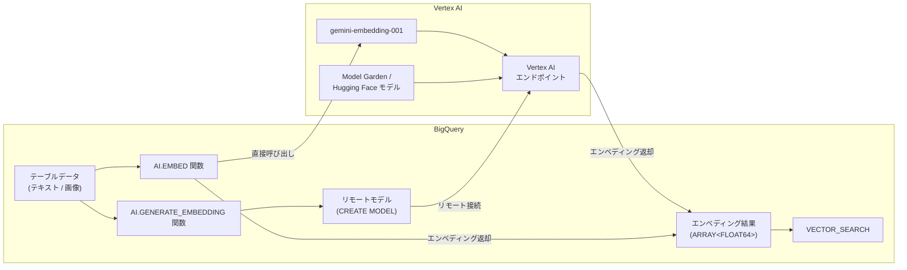

# BigQuery: エンベディング生成 AI 関数が GA (一般提供) に

**リリース日**: 2026-03-06

**サービス**: BigQuery

**機能**: AI.GENERATE_EMBEDDING / AI.EMBED 関数によるエンベディング生成

**ステータス**: GA (Generally Available)

:bar_chart: [このアップデートのインフォグラフィックを見る](https://takech9203.github.io/google-cloud-news-summary/20260306-bigquery-embedding-ai-functions-ga.html)

## 概要

Google Cloud は、BigQuery におけるエンベディング生成機能を一般提供 (GA) としてリリースしました。これにより、Vertex AI の gemini-embedding-001 モデルに基づくリモートモデルの作成、Vertex Model Garden や Hugging Face のオープンエンベディングモデルを Vertex AI にデプロイしたリモートモデルの作成、そしてこれらのモデルを使用した `AI.GENERATE_EMBEDDING` 関数によるエンベディング生成が本番環境で利用可能になりました。

さらに、`AI.EMBED` 関数を使用して gemini-embedding-001 モデルエンドポイントに直接アクセスし、リモートモデルを事前に作成することなくエンベディングを生成することも可能です。これらの機能が GA となったことで、SLA に基づくサポートが提供され、エンタープライズワークロードでの利用に適した信頼性が保証されます。

この機能は、セマンティック検索、レコメンデーション、テキスト分類、クラスタリングなどの機械学習タスクを BigQuery の SQL インターフェースから直接実行したいデータアナリスト、データエンジニア、ML エンジニアを対象としています。

**アップデート前の課題**

BigQuery でエンベディングを活用するには、これまで以下のような課題がありました。

- エンベディング生成のために BigQuery の外部で別途 ML パイプラインを構築し、データを移動させる必要があった
- オープンモデルを使用したエンベディング生成はプレビュー段階であり、本番ワークロードでの利用に SLA が保証されていなかった
- gemini-embedding-001 のような最新の高性能エンベディングモデルを BigQuery から簡単に利用する手段が限定的だった

**アップデート後の改善**

今回のアップデートにより以下が可能になりました。

- SQL クエリだけで Vertex AI のエンベディングモデルを呼び出し、データを移動させることなくエンベディングを生成できるようになった
- GA リリースにより SLA が保証され、本番ワークロードでの安心した利用が可能になった
- `AI.EMBED` 関数でリモートモデルの事前作成なしに直接 gemini-embedding-001 を利用でき、セットアップが大幅に簡素化された

## アーキテクチャ図



BigQuery 内の SQL クエリから Vertex AI のエンベディングモデルを呼び出す 2 つのパスを示しています。`AI.EMBED` は直接モデルエンドポイントを指定し、`AI.GENERATE_EMBEDDING` はリモートモデル経由で Vertex AI に接続します。生成されたエンベディングは `VECTOR_SEARCH` と組み合わせてセマンティック検索に利用できます。

## サービスアップデートの詳細

### 主要機能

1. **AI.GENERATE_EMBEDDING 関数 (テーブル値関数)**
   - リモートモデルを参照してエンベディングを生成するテーブル値関数
   - Vertex AI の gemini-embedding-001、text-embedding-005、multimodalembedding@001 などの Google モデルに対応
   - Vertex Model Garden や Hugging Face からデプロイしたオープンモデルにも対応
   - `task_type` や `output_dimensionality` パラメータによる柔軟な制御が可能

2. **AI.EMBED 関数 (スカラー関数)**
   - リモートモデルの事前作成不要でエンベディングを生成するスカラー関数
   - `endpoint` パラメータで直接モデルを指定 (例: `gemini-embedding-001`)
   - テキストデータおよび画像データ (ObjectRefRuntime 経由) のエンベディングに対応
   - `STRUCT` 型 (`result`, `status`) でエンベディング結果を返却

3. **gemini-embedding-001 モデルのサポート**
   - 最大 3072 次元の出力に対応する最新のエンベディングモデル
   - 英語、多言語、コードタスクで最先端のパフォーマンスを実現
   - text-embedding-005 や text-multilingual-embedding-002 を統合し、各ドメインでより高い性能を達成
   - 最大 2048 トークンの入力シーケンスに対応

## 技術仕様

### 対応モデル

| モデル名 | 説明 | 出力次元数 | 最大シーケンス長 |
|----------|------|-----------|----------------|
| gemini-embedding-001 | 英語・多言語・コードタスクに対応する統合モデル | 最大 3072 | 2048 トークン |
| text-embedding-005 | 英語・コードタスクに特化 | 最大 768 | 2048 トークン |
| text-multilingual-embedding-002 | 多言語タスクに特化 | 最大 768 | 2048 トークン |
| multimodalembedding@001 | テキスト・画像・動画のマルチモーダル対応 | 128, 256, 512, 1408 | - |
| オープンモデル (Hugging Face 等) | Model Garden 経由でデプロイ | モデル依存 | モデル依存 |

### サポートされるタスクタイプ (AI.EMBED)

| タスクタイプ | 用途 |
|-------------|------|
| `RETRIEVAL_QUERY` | 検索クエリ用エンベディング |
| `RETRIEVAL_DOCUMENT` | ドキュメント用エンベディング |
| `SEMANTIC_SIMILARITY` | テキスト意味的類似度 |
| `CLASSIFICATION` | 分類タスク |
| `CLUSTERING` | クラスタリング |
| `QUESTION_ANSWERING` | 質問応答 |
| `FACT_VERIFICATION` | ファクトチェック |
| `CODE_RETRIEVAL_QUERY` | コード検索 |

### IAM 権限

```text
必要なロール:
- BigQuery Admin (roles/bigquery.admin): データセット、接続、モデルの作成・使用
- Project IAM Admin (roles/resourcemanager.projectIamAdmin): 接続サービスアカウントへの権限付与
- Vertex AI User (roles/aiplatform.user): 接続のサービスアカウントに付与 (Vertex AI モデルへのアクセス)
- Vertex AI Administrator (roles/aiplatform.admin): オープンモデルのデプロイ・アンデプロイ (必要な場合)
```

## 設定方法

### 前提条件

1. BigQuery API、BigQuery Connection API、Vertex AI API が有効であること
2. 課金が有効な Google Cloud プロジェクトが存在すること
3. BigQuery 接続 (Cloud リソース接続) が作成済みであること

### 手順

#### ステップ 1: リモートモデルの作成 (AI.GENERATE_EMBEDDING の場合)

```sql
-- gemini-embedding-001 を使用するリモートモデルの作成
CREATE OR REPLACE MODEL `mydataset.embedding_model`
  REMOTE WITH CONNECTION `us.my_connection`
  OPTIONS (ENDPOINT = 'gemini-embedding-001');
```

接続のサービスアカウントに Vertex AI User ロールを付与する必要があります。

#### ステップ 2: AI.GENERATE_EMBEDDING によるエンベディング生成

```sql
-- テーブルのテキストデータからエンベディングを生成
SELECT *
FROM AI.GENERATE_EMBEDDING(
  MODEL `mydataset.embedding_model`,
  (SELECT 'エンベディングしたいテキスト' AS content),
  STRUCT('RETRIEVAL_DOCUMENT' AS task_type, 256 AS output_dimensionality)
);
```

#### ステップ 3: AI.EMBED による直接エンベディング生成

```sql
-- リモートモデル不要で直接エンベディングを生成
SELECT
  AI.EMBED(
    'エンベディングしたいテキスト',
    endpoint => 'gemini-embedding-001',
    task_type => 'RETRIEVAL_DOCUMENT',
    model_params => JSON '{"outputDimensionality": 256}'
  ) AS embedding;
```

#### ステップ 4: VECTOR_SEARCH との組み合わせ

```sql
-- エンベディングをテーブルに保存
CREATE OR REPLACE TABLE mydataset.text_embeddings AS
SELECT
  title, body,
  AI.EMBED(body, endpoint => 'gemini-embedding-001').result AS embedding
FROM `mydataset.articles`;

-- セマンティック検索の実行
SELECT base.title, base.body
FROM VECTOR_SEARCH(
  TABLE mydataset.text_embeddings,
  'embedding',
  (SELECT AI.EMBED('検索クエリ', endpoint => 'gemini-embedding-001').result),
  top_k => 5
);
```

## メリット

### ビジネス面

- **データ移動の削減**: BigQuery 内で直接エンベディングを生成できるため、外部 ML パイプラインの構築・運用コストが不要
- **迅速なプロトタイピング**: SQL だけでセマンティック検索やレコメンデーション機能のプロトタイプを構築可能
- **本番対応の信頼性**: GA リリースにより SLA が保証され、ミッションクリティカルなワークロードにも対応

### 技術面

- **柔軟なモデル選択**: Google の最新モデル (gemini-embedding-001) からオープンソースモデルまで幅広い選択肢
- **簡素化されたアーキテクチャ**: `AI.EMBED` 関数によりリモートモデルの事前作成なしにエンベディング生成が可能
- **ベクトル検索との統合**: `VECTOR_SEARCH` 関数とのシームレスな連携により、BigQuery をベクトルデータベースとして活用可能

## デメリット・制約事項

### 制限事項

- モデルと入力テーブルは同一リージョンに存在する必要がある
- `AI.EMBED` の `title` パラメータは `task_type` が `RETRIEVAL_DOCUMENT` の場合のみ使用可能
- オープンモデルを使用する場合、Vertex AI へのモデルデプロイが別途必要であり、デプロイ中はマシン時間単位の課金が発生する

### 考慮すべき点

- Vertex AI のエンベディングモデル呼び出しごとに Vertex AI 側の課金が発生するため、大量データのエンベディング生成時はコストに注意が必要
- `AI.EMBED` を使用する場合、クエリジョブが 48 時間以上実行される見込みの場合は `connection_id` パラメータによるサービスアカウント認証が推奨される
- Vertex AI のクォータ制限が適用されるため、大規模バッチ処理の場合はクォータの事前確認が必要

## ユースケース

### ユースケース 1: エンタープライズセマンティック検索

**シナリオ**: 社内ナレッジベースの大量のドキュメントを BigQuery に格納し、自然言語での類似検索を実現したい。

**実装例**:
```sql
-- ドキュメントのエンベディングを生成して保存
CREATE OR REPLACE TABLE knowledge_base.doc_embeddings AS
SELECT
  doc_id, title, content,
  AI.EMBED(content, endpoint => 'gemini-embedding-001',
           task_type => 'RETRIEVAL_DOCUMENT').result AS embedding
FROM `knowledge_base.documents`;

-- ユーザーの質問に関連するドキュメントを検索
SELECT base.title, base.content, distance
FROM VECTOR_SEARCH(
  TABLE knowledge_base.doc_embeddings, 'embedding',
  (SELECT AI.EMBED('BigQuery でコスト最適化するには?',
                    endpoint => 'gemini-embedding-001',
                    task_type => 'RETRIEVAL_QUERY').result),
  top_k => 10
);
```

**効果**: 外部のベクトルデータベースを導入することなく、BigQuery 内でエンドツーエンドのセマンティック検索パイプラインを構築可能。

### ユースケース 2: RAG (Retrieval-Augmented Generation) パイプライン

**シナリオ**: Gemini モデルによるテキスト生成の精度を向上させるため、関連するコンテキストをエンベディングベースで検索し、プロンプトに含めたい。

**効果**: BigQuery のデータウェアハウスに蓄積された構造化・非構造化データを活用し、AI.EMBED + VECTOR_SEARCH + AI.GENERATE を組み合わせた SQL ベースの RAG パイプラインを構築できる。

## 料金

エンベディング生成に関する料金は、BigQuery ML と Vertex AI の両方で発生します。

- **BigQuery ML**: クエリで処理されるデータ量に基づく課金 (オンデマンドの場合 TB あたりの料金が適用)
- **Vertex AI**: リモートモデルが参照する Vertex AI モデルへの呼び出しに対する課金
- **オープンモデル**: Vertex AI にデプロイしたモデルはマシン時間単位での課金 (デプロイ中は継続的に課金)

### 料金例

| コンポーネント | 課金基準 | 参考 |
|--------------|---------|------|
| BigQuery (オンデマンド) | 処理データ量あたり | [BigQuery 料金](https://cloud.google.com/bigquery/pricing) |
| Vertex AI エンベディング (gemini-embedding-001) | API 呼び出しあたり | [Vertex AI 料金](https://cloud.google.com/vertex-ai/pricing#generative_ai_models) |
| オープンモデルデプロイ | マシン時間あたり | [Vertex AI 予測料金](https://cloud.google.com/vertex-ai/pricing#prediction-prices) |

## 利用可能リージョン

`AI.EMBED` 関数は Vertex AI のエンベディングモデルをサポートする全てのリージョンに加え、`US` および `EU` のマルチリージョンで利用可能です。`AI.GENERATE_EMBEDDING` はリモートモデルとテーブルが同一リージョンにある必要があります。

## 関連サービス・機能

- **Vertex AI Embeddings API**: BigQuery のリモートモデルが接続する Vertex AI のエンベディングモデルサービス
- **BigQuery VECTOR_SEARCH**: エンベディングを使用したベクトル類似検索を実行する関数
- **BigQuery ML リモートモデル**: Vertex AI モデルを BigQuery から利用するための接続機能
- **Vertex Model Garden**: オープンソースモデルを発見・デプロイするためのプラットフォーム

## 参考リンク

- :bar_chart: [インフォグラフィック](https://takech9203.github.io/google-cloud-news-summary/20260306-bigquery-embedding-ai-functions-ga.html)
- [公式リリースノート](https://cloud.google.com/release-notes#March_06_2026)
- [AI.GENERATE_EMBEDDING ドキュメント](https://cloud.google.com/bigquery/docs/reference/standard-sql/bigqueryml-syntax-ai-generate-embedding)
- [AI.EMBED ドキュメント](https://cloud.google.com/bigquery/docs/reference/standard-sql/bigqueryml-syntax-ai-embed)
- [テキストエンベディング生成ガイド](https://cloud.google.com/bigquery/docs/generate-text-embedding)
- [Vertex AI テキストエンベディング API リファレンス](https://cloud.google.com/vertex-ai/generative-ai/docs/model-reference/text-embeddings-api)
- [BigQuery 料金ページ](https://cloud.google.com/bigquery/pricing)

## まとめ

BigQuery のエンベディング生成 AI 関数が GA となったことで、SQL だけで高品質なエンベディングを生成し、セマンティック検索や RAG パイプラインを構築できる環境が本番対応として整いました。特に `AI.EMBED` 関数によるリモートモデル不要の直接呼び出しは、開発者の生産性を大幅に向上させます。BigQuery をベクトルデータベースとしても活用したいユーザーは、まず gemini-embedding-001 モデルと VECTOR_SEARCH の組み合わせから試すことを推奨します。

---

**タグ**: #BigQuery #VertexAI #Embeddings #AI #MachineLearning #VectorSearch #GA #gemini-embedding-001
