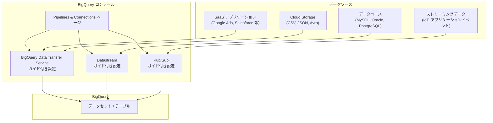

# BigQuery: Pipelines & Connections ページによるデータ統合の効率化

**リリース日**: 2026-03-06

**サービス**: BigQuery

**機能**: Pipelines & Connections ページ

**ステータス**: Preview

[このアップデートのインフォグラフィックを見る](https://takech9203.github.io/google-cloud-news-summary/20260306-bigquery-pipelines-connections-preview.html)

## 概要

Google Cloud は BigQuery に新しい「Pipelines & Connections」ページを導入しました。この機能により、BigQuery Data Transfer Service、Datastream、Pub/Sub といったデータ統合サービスの設定を、BigQuery コンソール内のガイド付きワークフローを通じて一元的に管理できるようになります。

従来、これらのデータ統合サービスはそれぞれ個別のコンソールページや設定画面で管理する必要がありましたが、Pipelines & Connections ページではBigQuery に特化した構成ワークフローを提供し、データ統合タスクの設定と管理を大幅に簡素化します。データエンジニアやアナリストは、BigQuery を中心としたデータパイプラインの構築を、より直感的かつ効率的に行えるようになります。

本機能は現在 Preview 段階であり、BigQuery コンソールから利用可能です。データウェアハウスの構築や運用に携わるすべてのユーザーにとって、日常的なデータ統合作業の効率化に貢献する機能です。

**アップデート前の課題**

- BigQuery Data Transfer Service、Datastream、Pub/Sub の設定がそれぞれ別のコンソールページに分散しており、統一的な管理が困難だった
- 各サービスの設定には、それぞれのサービス固有の知識や手順の理解が必要で、学習コストが高かった
- BigQuery へのデータ取り込みパイプラインの全体像を一箇所で把握することが難しく、運用管理に手間がかかっていた

**アップデート後の改善**

- BigQuery コンソール内の Pipelines & Connections ページから、複数のデータ統合サービスを一元的に設定・管理できるようになった
- BigQuery に特化したガイド付きワークフローにより、各サービスの設定手順が簡素化され、迷うことなく構成を完了できるようになった
- データ統合パイプラインの全体像を BigQuery コンソール内で把握でき、運用効率が向上した

## アーキテクチャ図



Pipelines & Connections ページは BigQuery コンソール内の統合エントリーポイントとして機能し、各データソースに応じた適切なサービス (Data Transfer Service、Datastream、Pub/Sub) へのガイド付き設定ワークフローを提供します。

## サービスアップデートの詳細

### 主要機能

1. **統合データ統合ダッシュボード**
   - BigQuery コンソール内に Pipelines & Connections ページが新設され、すべてのデータ統合タスクを一箇所から管理可能
   - 既存の転送設定やストリーミング接続の状態を一覧で確認可能

2. **BigQuery Data Transfer Service のガイド付き設定**
   - SaaS アプリケーション (Google Ads、Salesforce、Facebook Ads 等) やクラウドストレージからのバッチデータ転送を、ステップバイステップのウィザードで設定
   - スケジュール設定、宛先データセットの選択、認証設定などを直感的に構成
   - 40 以上のデータソースに対応し、コードを書かずにデータ転送パイプラインを構築可能

3. **Datastream のガイド付き設定**
   - MySQL、Oracle、PostgreSQL、SQL Server などのデータベースからのリアルタイム CDC (Change Data Capture) レプリケーションを簡易設定
   - 接続プロファイルの作成、ストリームの設定、宛先 BigQuery データセットの指定をガイド付きで実行
   - スキーマ変更の自動検出と BigQuery テーブルの自動更新をサポート

4. **Pub/Sub のガイド付き設定**
   - ストリーミングデータの BigQuery への取り込みを、Pub/Sub サブスクリプションの設定から BigQuery テーブルへの書き込みまで一貫して構成
   - Pub/Sub BigQuery サブスクリプションや Dataflow テンプレートを活用したパイプラインの構築をサポート

## 技術仕様

### 対応サービスと主なユースケース

| サービス | データ取り込み方式 | 主な用途 | 対応ソース例 |
|---------|------------------|---------|-------------|
| BigQuery Data Transfer Service | スケジュールベースのバッチ転送 | SaaS データ、定期的なファイル取り込み | Google Ads, Salesforce, Cloud Storage, Amazon S3 |
| Datastream | リアルタイム CDC レプリケーション | データベースの変更データキャプチャ | MySQL, Oracle, PostgreSQL, SQL Server |
| Pub/Sub | ストリーミング取り込み | イベント駆動型データ取り込み | IoT デバイス、アプリケーションイベント |

### 必要な IAM 権限

```json
{
  "BigQuery Data Transfer Service": [
    "bigquery.transfers.update",
    "bigquery.transfers.get",
    "bigquery.datasets.get"
  ],
  "Datastream": [
    "datastream.streams.create",
    "datastream.connectionProfiles.create",
    "bigquery.datasets.get"
  ],
  "Pub/Sub": [
    "pubsub.subscriptions.create",
    "pubsub.topics.get",
    "bigquery.tables.updateData"
  ]
}
```

## 設定方法

### 前提条件

1. Google Cloud プロジェクトで BigQuery API が有効化されていること
2. 使用するデータ統合サービス (Data Transfer Service、Datastream、Pub/Sub) の API がそれぞれ有効化されていること
3. 適切な IAM 権限が付与されていること

### 手順

#### ステップ 1: Pipelines & Connections ページへのアクセス

Google Cloud コンソールで BigQuery を開き、左側のナビゲーションメニューから「Pipelines & Connections」を選択します。

```
Google Cloud コンソール > BigQuery > Pipelines & Connections
```

#### ステップ 2: データ統合サービスの選択

Pipelines & Connections ページで、使用したいデータ統合サービスを選択します。各サービスのカードには概要説明と「設定を開始」ボタンが表示されます。

- **Data Transfer Service**: バッチデータ転送を設定する場合
- **Datastream**: リアルタイムデータレプリケーションを設定する場合
- **Pub/Sub**: ストリーミングデータ取り込みを設定する場合

#### ステップ 3: ガイド付きワークフローの実行

選択したサービスに応じたガイド付きワークフローが開始されます。画面の指示に従い、データソースの接続情報、宛先データセット、スケジュール設定などを順番に入力していきます。

## メリット

### ビジネス面

- **運用効率の向上**: 複数のデータ統合サービスを一箇所で管理できるため、データエンジニアリングチームの生産性が向上する
- **導入コストの削減**: ガイド付きワークフローにより、各サービスの専門知識がなくてもデータパイプラインを構築でき、トレーニングコストを削減できる
- **データ活用の加速**: データソースから BigQuery への取り込みパイプラインを迅速に構築できるため、ビジネスインサイトの取得までの時間が短縮される

### 技術面

- **統一的な管理インターフェース**: BigQuery コンソール内で Data Transfer Service、Datastream、Pub/Sub の設定を統一的に管理でき、コンテキストスイッチのコストが削減される
- **BigQuery 最適化された設定フロー**: 各サービスの設定が BigQuery のデータセットやテーブル構造を考慮した形で最適化されており、設定ミスのリスクが低減される
- **パイプライン可視化**: データ取り込みパイプラインの全体像を把握しやすくなり、トラブルシューティングや最適化が容易になる

## デメリット・制約事項

### 制限事項

- 本機能は Preview 段階であり、GA (一般提供) 前に仕様が変更される可能性がある
- Preview 段階のため、SLA の対象外であり、本番環境での使用には注意が必要
- すべてのデータ統合サービスの全機能が Pipelines & Connections ページから設定できるわけではなく、詳細な設定には各サービスの個別コンソールページを使用する必要がある場合がある

### 考慮すべき点

- 既存の転送設定や接続設定は、Pipelines & Connections ページからも表示・管理可能だが、移行作業は不要
- Terraform や gcloud CLI で管理している既存のインフラストラクチャ・アズ・コードのワークフローには影響しない (コンソール UI の変更のみ)

## ユースケース

### ユースケース 1: マーケティングデータの統合分析基盤構築

**シナリオ**: マーケティングチームが Google Ads、Facebook Ads、Salesforce のデータを BigQuery に統合し、クロスチャネルのマーケティング効果分析を行いたい場合。

**実装例**:
```
Pipelines & Connections ページ
  -> Data Transfer Service を選択
  -> Google Ads 転送を設定 (日次スケジュール)
  -> Facebook Ads 転送を設定 (日次スケジュール)
  -> Salesforce 転送を設定 (日次スケジュール)
  -> すべての転送先を同一データセットに集約
```

**効果**: 3つのデータソースからの転送設定を一箇所で完了でき、設定作業が従来の個別設定と比較して大幅に簡素化される。

### ユースケース 2: リアルタイムデータベースレプリケーションとストリーミング分析

**シナリオ**: 本番 MySQL データベースの変更をリアルタイムで BigQuery にレプリケーションしながら、IoT デバイスからのストリーミングデータも同時に取り込み、統合分析を行いたい場合。

**効果**: Datastream と Pub/Sub の設定を Pipelines & Connections ページから統一的に管理でき、データベースのCDC レプリケーションとストリーミングデータ取り込みの両方を一元的に監視・運用可能。

## 料金

Pipelines & Connections ページ自体の利用に追加料金は発生しません。料金は使用する各データ統合サービスの標準料金に従います。

### 料金例

| サービス | 料金体系 |
|---------|---------|
| BigQuery Data Transfer Service | データソースにより異なる (多くの Google ソースは無料、サードパーティソースは転送量に基づく) |
| Datastream | 処理されたデータ量に基づく従量課金 |
| Pub/Sub | メッセージの公開・配信量に基づく従量課金 |
| BigQuery ストレージ・クエリ | 標準の BigQuery 料金が適用 |

## 利用可能リージョン

Pipelines & Connections ページは BigQuery が利用可能なすべてのリージョンで使用できます。ただし、各データ統合サービスの利用可能リージョンはサービスごとに異なります。BigQuery Data Transfer Service はマルチリージョンリソースとして動作し、Datastream および Pub/Sub もそれぞれのサポートリージョンで利用可能です。

## 関連サービス・機能

- **BigQuery Data Transfer Service**: SaaS アプリケーションやクラウドストレージからのスケジュールベースのバッチデータ転送を自動化するサービス。40以上のデータソースに対応
- **Datastream**: データベースからのリアルタイム CDC レプリケーションを提供するサーバーレスサービス。MySQL、Oracle、PostgreSQL、SQL Server 等に対応
- **Pub/Sub**: 大規模なイベント駆動型メッセージングサービス。ストリーミングデータの取り込みや配信に使用
- **Dataflow**: Apache Beam ベースのデータ処理サービス。Pub/Sub から BigQuery へのストリーミングパイプラインテンプレートを提供
- **Cloud Data Fusion**: GUI ベースのデータ統合サービス。より複雑な ETL パイプラインの構築に適している

## 参考リンク

- [インフォグラフィック](https://takech9203.github.io/google-cloud-news-summary/20260306-bigquery-pipelines-connections-preview.html)
- [公式リリースノート](https://cloud.google.com/release-notes#March_06_2026)
- [BigQuery Data Transfer Service ドキュメント](https://cloud.google.com/bigquery/docs/dts-introduction)
- [Datastream ドキュメント](https://cloud.google.com/datastream/docs/overview)
- [Pub/Sub ドキュメント](https://cloud.google.com/pubsub/docs)
- [BigQuery 料金ページ](https://cloud.google.com/bigquery/pricing)

## まとめ

BigQuery の Pipelines & Connections ページは、データ統合タスクの設定と管理を BigQuery コンソール内に統合し、ガイド付きワークフローによって設定作業を大幅に簡素化する機能です。Data Transfer Service、Datastream、Pub/Sub を一元管理できるため、データウェアハウスの構築と運用に携わるチームの生産性向上が期待できます。現在 Preview 段階のため、本番環境への導入を検討する場合は GA リリースの動向を注視しつつ、開発・検証環境での評価を推奨します。

---

**タグ**: #BigQuery #DataIntegration #PipelinesAndConnections #DataTransferService #Datastream #PubSub #Preview #DataWarehouse
