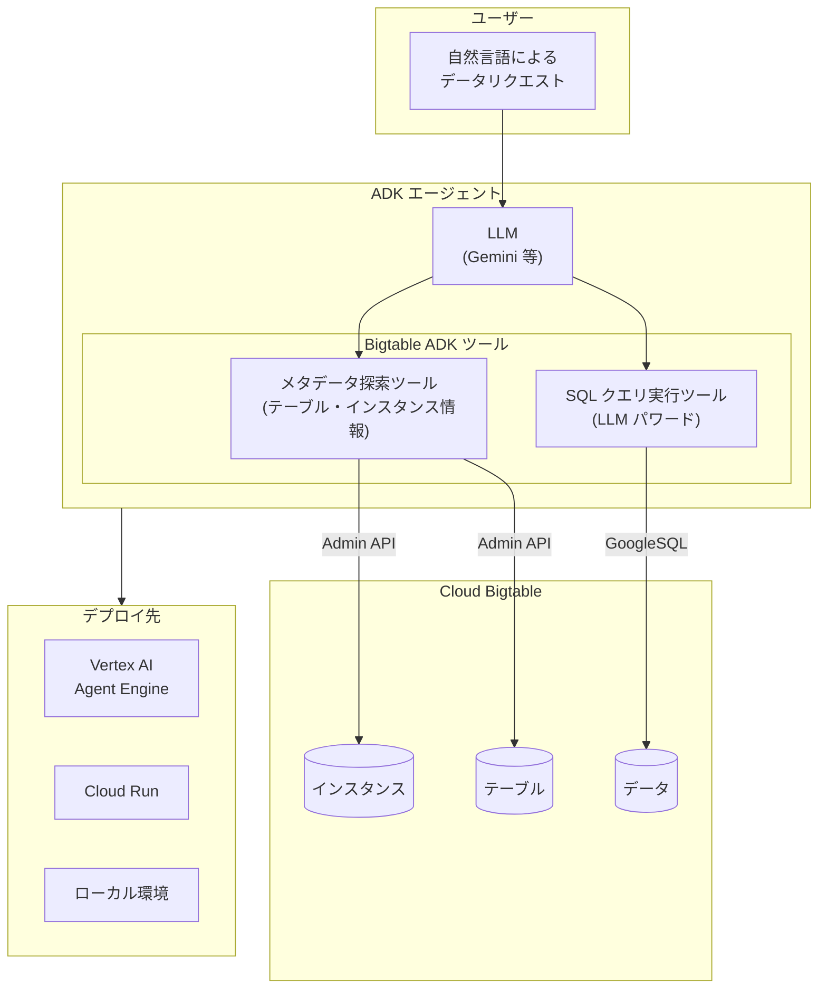

# Bigtable: Agent Development Kit (ADK) ツールが GA

**リリース日**: 2026-03-06

**サービス**: Bigtable

**機能**: Agent Development Kit (ADK) ツール

**ステータス**: GA (Generally Available)

[このアップデートのインフォグラフィックを見る](https://takech9203.github.io/google-cloud-news-summary/20260306-bigtable-adk-tools-ga.html)

## 概要

Google Cloud は 2026 年 3 月 6 日に、Bigtable 向けの Agent Development Kit (ADK) ツールを GA (一般提供) としてリリースした。ADK は Google が提供するオープンソースの AI エージェント開発フレームワークであり、今回の GA リリースにより、AI エージェントが ADK のビルトインツールとして Bigtable のデータおよびメタデータと対話できるようになった。

この ADK ツールを使用することで、開発者は Bigtable のテーブルやインスタンスに関するメタデータの探索と、LLM を活用した SQL クエリの実行が可能な AI エージェントを構築できる。Bigtable は GoogleSQL をサポートしており、ADK ツールはこの SQL インターフェースを活用してエージェントが自然言語で Bigtable データにアクセスする橋渡しを行う。なお、2025 年 8 月に Preview として公開されていたこの機能が、今回正式に GA となった。

対象となるのは、AI エージェントを活用したデータアクセスパターンの構築を検討しているアプリケーション開発者、Bigtable を利用した大規模データ分析基盤を運用しているデータエンジニア、および ADK フレームワークを用いたエージェントシステムの開発者である。

**アップデート前の課題**

このアップデート以前に存在していた課題を以下に示す。

- AI エージェントから Bigtable のデータにアクセスするには、Bigtable クライアントライブラリを使用したカスタムツールの開発が必要であり、ADK のビルトインツールとしての統合は提供されていなかった
- Bigtable のテーブルスキーマやインスタンス構成などのメタデータを AI エージェントが探索するには、Admin API を直接呼び出すカスタムコードの実装が必要だった
- LLM が生成した SQL クエリを Bigtable に対して実行するための標準化されたツールチェーンが存在せず、エージェントによる自然言語でのデータアクセスの実現に高い開発コストがかかっていた

**アップデート後の改善**

今回のアップデートにより可能になったことを以下に示す。

- ADK のビルトインツールとして Bigtable ツールが GA で提供され、AI エージェントが Bigtable のメタデータ探索と SQL クエリ実行を標準的な方法で行えるようになった
- 開発者はカスタムツールの実装なしに、ADK エージェントに Bigtable ツールを組み込むだけで、自然言語による Bigtable データへのアクセスを実現できるようになった
- GA リリースにより本番環境での利用が正式にサポートされ、SLA の対象となるため、エンタープライズレベルのアプリケーションに安心して組み込める

## アーキテクチャ図



ユーザーの自然言語リクエストを ADK エージェント内の LLM が解釈し、Bigtable ADK ツールを選択的に呼び出す。メタデータ探索ツールは Admin API を通じてインスタンスやテーブルの情報を取得し、SQL クエリ実行ツールは LLM が生成した GoogleSQL クエリを Bigtable のデータに対して実行する。構築したエージェントは Vertex AI Agent Engine、Cloud Run、またはローカル環境にデプロイ可能である。

## サービスアップデートの詳細

### 主要機能

1. **Bigtable メタデータ探索**
   - AI エージェントが Bigtable のテーブルやインスタンスに関するメタデータを自動的に取得・参照できる
   - テーブルのスキーマ情報 (カラムファミリー、カラム修飾子)、インスタンス構成 (クラスタ、ノード数、ストレージタイプ) などの構造情報をエージェントが把握可能
   - メタデータの理解に基づいて、エージェントが適切な SQL クエリを生成するためのコンテキストを構築できる

2. **LLM パワード SQL クエリ実行**
   - LLM が自然言語のリクエストを解釈し、GoogleSQL for Bigtable に準拠した SQL クエリを自動生成・実行する
   - Bigtable 固有の MAP データ型やカラムファミリー構造を考慮した適切なクエリを生成可能
   - `_key` カラムによるロウキーの指定、カラムファミリーからの値抽出、時系列フィルタ (`with_history`) などの Bigtable 固有の SQL パターンに対応

3. **ADK フレームワークとのネイティブ統合**
   - ADK のビルトインツールとして提供されるため、BigQuery ツールなど他の ADK ビルトインツールと同様のインターフェースで利用可能
   - マルチエージェントシステムにおいて、Bigtable ツールを装備したエージェントを専門エージェントとして他のエージェントから呼び出すことが可能
   - Vertex AI Agent Engine Runtime へのデプロイに最適化されており、フルマネージドな本番環境での運用がサポートされる

## 技術仕様

### Bigtable ADK ツールの機能

| 機能 | 詳細 |
|------|------|
| メタデータ探索 | テーブル一覧、テーブルスキーマ、インスタンス情報、クラスタ情報の取得 |
| SQL クエリ実行 | GoogleSQL for Bigtable に準拠した SELECT クエリの生成・実行 |
| 対応する SQL 構文 | SELECT、WHERE、カラムファミリーアクセス、MAP 型操作、時系列フィルタ |
| SQL の制限事項 | DML (INSERT/UPDATE/DELETE)、DDL (CREATE/ALTER/DROP)、サブクエリ、JOIN、UNION は非対応 |
| ステータス | GA (Generally Available) |
| ADK フレームワーク | Python、Java、Go 対応 |

### GoogleSQL for Bigtable の主要特性

| 項目 | 詳細 |
|------|------|
| データアクセス | `_key` カラムでロウキーにアクセス。各カラムファミリーは MAP 型カラムとして表現 |
| MAP データ型 | `MAP<key, value>` でカラムファミリーのデータを表現。キーはカラム修飾子、値は最新の値 |
| 時系列データ | `with_history => TRUE` フィルタで全セルの履歴を取得可能 |
| 実行環境 | クラスタノードで直接処理されるため、NoSQL リクエストと同様のパフォーマンス特性を持つ |

### エージェント構成例

```python
from google import adk

# Bigtable ツールを装備した ADK エージェントの構成例
agent = adk.Agent(
    model="gemini-2.5-flash",
    name="bigtable_data_agent",
    instruction="""あなたは Bigtable データアクセスエージェントです。
    ユーザーのリクエストに基づいて:
    1. Bigtable のテーブルやインスタンスのメタデータを探索する
    2. 適切な SQL クエリを生成してデータを取得する
    3. 結果をわかりやすく要約して返す""",
    tools=[
        # Bigtable ADK ビルトインツール
        # メタデータ探索ツールと SQL クエリ実行ツールを含む
    ],
)
```

## 設定方法

### 前提条件

1. Google Cloud プロジェクトが作成済みであること
2. Bigtable API (`bigtable.googleapis.com`) が有効化されていること
3. ADK (Agent Development Kit) がインストール済みであること (`pip install google-adk`)
4. 適切な IAM ロール (`roles/bigtable.reader` 以上) が付与されていること

### 手順

#### ステップ 1: ADK のインストール

```bash
# ADK をインストール
pip install google-adk
```

ADK はオープンソースフレームワークとして提供されており、pip で簡単にインストールできる。

#### ステップ 2: Bigtable ツールを使用するエージェントの作成

```bash
# ADK プロジェクトの初期化
adk init bigtable-agent
```

プロジェクトディレクトリ内に Bigtable ツールを使用するエージェントの定義ファイルを作成する。

#### ステップ 3: ローカルでのテストと実行

```bash
# ADK の開発 UI でエージェントをテスト
adk web
```

ブラウザベースの開発 UI からエージェントの動作をインタラクティブにテストできる。

#### ステップ 4: Vertex AI Agent Engine へのデプロイ

```bash
# Vertex AI Agent Engine Runtime にデプロイ
# Python SDK を使用してプログラムからデプロイ
```

本番環境での運用には、Vertex AI Agent Engine Runtime へのデプロイを推奨する。フルマネージドなスケーリングとモニタリングが提供される。

## メリット

### ビジネス面

- **データアクセスの民主化**: SQL や Bigtable の専門知識がなくても、自然言語で Bigtable のデータを照会できるため、ビジネスユーザーがリアルタイムデータに直接アクセスできる範囲が拡大する
- **エージェントアプリケーションの迅速な構築**: カスタムのデータアクセスツールを開発する必要がなくなり、ADK のビルトインツールを組み込むだけでデータ駆動型エージェントを短期間で構築できる
- **本番環境での信頼性**: GA リリースにより SLA の対象となり、エンタープライズアプリケーションへの組み込みに必要な信頼性と安定性が保証される

### 技術面

- **統合されたツールチェーン**: ADK のビルトインツールとして提供されるため、BigQuery ツールやその他の ADK ツールと統一されたインターフェースで利用でき、マルチデータソースのエージェント構築が容易になる
- **GoogleSQL によるクエリ生成**: BigQuery や Spanner と共通の SQL 方言 (GoogleSQL) を使用するため、LLM が生成する SQL の品質と一貫性が向上する
- **低レイテンシのデータアクセス**: Bigtable のクラスタノードで直接 SQL クエリが処理されるため、NoSQL データリクエストと同等の低レイテンシパフォーマンスが期待できる

## デメリット・制約事項

### 制限事項

- GoogleSQL for Bigtable は SELECT クエリのみをサポートし、INSERT、UPDATE、DELETE などの DML 操作やテーブル作成・変更の DDL 操作はサポートしていない
- サブクエリ、JOIN、UNION、CTE (Common Table Expression) などの高度な SQL 構文は現在サポートされていない
- Data Boost は GoogleSQL for Bigtable では利用できない

### 考慮すべき点

- Bigtable の SQL クエリはクラスタノードで処理されるため、フルテーブルスキャンや複雑なフィルタを含むクエリはノードのパフォーマンスに影響を与える可能性がある。NoSQL データリクエストと同様のベストプラクティスを適用すべきである
- LLM が生成する SQL クエリの精度は、テーブルスキーマの複雑さやリクエストの曖昧さに依存する。重要なデータアクセスにおいては、生成されたクエリの検証プロセスを組み込むことが推奨される
- ADK ツールはデータの読み取り (データプレーン) に焦点を当てており、インスタンスやテーブルの管理操作 (コントロールプレーン) には、別途 Bigtable Admin API MCP サーバーなどの利用を検討する必要がある

## ユースケース

### ユースケース 1: IoT データの自然言語クエリエージェント

**シナリオ**: 大規模な IoT センサーデータを Bigtable に格納している製造業企業で、現場のエンジニアが「過去 1 時間の工場 A のセンサー温度データを見せて」といった自然言語で即座にデータを取得したい。

**実装例**:
```
ユーザー: "工場 A の温度センサーの過去 1 時間のデータを表示して"

AI エージェント:
  1. メタデータツールでテーブルスキーマを確認
  2. 以下の SQL を生成・実行:
     SELECT _key, sensor_data['temperature']
     FROM iot_readings
     WHERE _key LIKE 'factory-a/temp%'
     AND _timestamp > TIMESTAMP_SUB(CURRENT_TIMESTAMP(), INTERVAL 1 HOUR)
  3. 結果を要約して返答
```

**効果**: Bigtable の NoSQL データモデルや SQL 構文を知らないエンジニアでも、自然言語でリアルタイムのセンサーデータにアクセスでき、迅速な意思決定が可能になる。

### ユースケース 2: マルチデータソースのデータ分析エージェント

**シナリオ**: Bigtable に格納されたリアルタイムユーザー行動データと BigQuery に格納された過去の分析データを横断的に照会し、統合的なインサイトを提供するマルチエージェントシステムを構築する。

**効果**: ADK のマルチエージェント機能を活用し、Bigtable ツールを装備したエージェントと BigQuery ツールを装備したエージェントを協調させることで、リアルタイムデータと履歴データの両方に基づく包括的なデータ分析が可能になる。

## 料金

Bigtable ADK ツール自体の追加料金は発生しない。ADK はオープンソースフレームワークとして無料で利用できる。ただし、基盤となる Bigtable の利用料金と、LLM の推論コスト (Gemini API 利用料) が別途発生する。

### Bigtable の主な料金

| 項目 | 料金 (概算) |
|------|-------------|
| ノード (SSD、オンデマンド) | $0.65/ノード/時間 (us-central1) |
| SSD ストレージ | $0.17/GB/月 |
| HDD ストレージ | $0.026/GB/月 |
| 1 年 CUD 割引 | ノード料金 20% 割引 |
| 3 年 CUD 割引 | ノード料金 40% 割引 |

### Vertex AI Agent Engine (デプロイ先) の料金

Vertex AI Agent Engine Runtime へデプロイする場合は、Agent Engine の利用料金が別途発生する。詳細は [Vertex AI の料金ページ](https://cloud.google.com/vertex-ai/pricing) を参照。

## 利用可能リージョン

Bigtable ADK ツールは Bigtable が利用可能な全リージョンで使用できる。ADK はクライアントサイドのフレームワークであるため、リージョンの制約は Bigtable インスタンスの配置に依存する。Bigtable は 40 以上のリージョンで利用可能であり、主要なリージョンとして us-central1、us-east1、europe-west1、asia-east1 などがサポートされている。

## 関連サービス・機能

- **Agent Development Kit (ADK)**: Google が提供するオープンソースの AI エージェント開発フレームワーク。Bigtable ツールは ADK のビルトインツールの一つとして提供される
- **GoogleSQL for Bigtable**: Bigtable データに対して SQL クエリを実行するための機能。ADK ツールはこの SQL インターフェースを活用してデータアクセスを行う
- **Vertex AI Agent Engine**: AI エージェントをデプロイ・管理するためのフルマネージドサービス。ADK で構築した Bigtable エージェントの推奨デプロイ先
- **Bigtable Admin API MCP サーバー**: Bigtable のインスタンス・テーブル管理操作を MCP プロトコルで提供するサーバー (Preview)。ADK ツールのデータプレーン操作と補完的に使用できる
- **BigQuery ADK ビルトインツール**: ADK が提供する BigQuery 向けビルトインツール。Bigtable ツールと組み合わせたマルチデータソースエージェントの構築が可能

## 参考リンク

- [このアップデートのインフォグラフィック](https://takech9203.github.io/google-cloud-news-summary/20260306-bigtable-adk-tools-ga.html)
- [公式リリースノート](https://cloud.google.com/release-notes#March_06_2026)
- [Agent Development Kit (ADK) ドキュメント](https://google.github.io/adk-docs/)
- [ADK ビルトインツール](https://google.github.io/adk-docs/tools/built-in-tools/)
- [GoogleSQL for Bigtable 概要](https://cloud.google.com/bigtable/docs/googlesql-overview)
- [GoogleSQL for Bigtable リファレンス](https://cloud.google.com/bigtable/docs/reference/sql/googlesql-reference-overview)
- [Vertex AI Agent Engine 概要](https://cloud.google.com/agent-builder/agent-engine/overview)
- [Bigtable 料金ページ](https://cloud.google.com/bigtable/pricing)

## まとめ

Bigtable ADK ツールの GA リリースは、AI エージェントが大規模 NoSQL データベースである Bigtable とネイティブに統合できるようになる重要なアップデートである。ADK のビルトインツールとして提供されることで、開発者はカスタムツールの実装なしに、自然言語による Bigtable データへのアクセスを実現する AI エージェントを迅速に構築できる。まずは ADK の開発 UI を使って Bigtable ツールの動作を検証し、IoT データの照会やリアルタイムデータ分析など、自社のユースケースに適合するか評価することを推奨する。

---

**タグ**: #Bigtable #ADK #AgentDevelopmentKit #AIAgent #GoogleSQL #GA #GoogleCloud #NoSQL #VertexAI #AgentEngine
