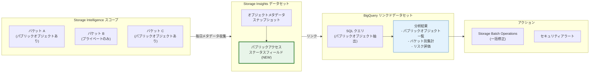

# Cloud Storage: Storage Insights データセットによるパブリックアクセスオブジェクトの識別機能

**リリース日**: 2026-03-06

**サービス**: Cloud Storage

**機能**: Storage Insights データセットを使用したパブリックアクセス可能オブジェクトの識別

**ステータス**: Preview

📊 [このアップデートのインフォグラフィックを見る](https://takech9203.github.io/google-cloud-news-summary/20260306-cloud-storage-public-access-insights.html)

## 概要

Cloud Storage の Storage Insights データセットに、オブジェクトのパブリックアクセスステータスを示すメタデータフィールドが新たに追加されました (プレビュー)。この機能により、組織内の Cloud Storage バケットに保存されているオブジェクトのうち、パブリックにアクセス可能なものを大規模に把握、整理、管理できるようになります。

Storage Insights データセットは、Storage Intelligence サブスクリプションの一部として提供される機能で、Cloud Storage のバケットおよびオブジェクトのメタデータとアクティビティデータのクエリ可能なインデックスを作成します。今回のアップデートでは、オブジェクトメタデータスキーマにパブリックアクセスステータスに関するフィールドが追加され、BigQuery 経由で SQL クエリを使用してパブリックアクセス可能なオブジェクトを特定できるようになりました。

**アップデート前の課題**

- パブリックアクセス可能なオブジェクトを組織全体で網羅的に把握するには、各バケットの ACL や IAM ポリシーを個別に確認する必要があった
- 大量のオブジェクト (数十億規模) に対してパブリックアクセスの状態を一括で確認する標準的な方法がなかった
- セキュリティ監査やコンプライアンスチェックにおいて、パブリックアクセスの状況を組織横断で可視化するにはカスタムスクリプトの開発が必要だった

**アップデート後の改善**

- Storage Insights データセットのオブジェクトメタデータにパブリックアクセスステータスフィールドが追加され、BigQuery クエリでパブリックオブジェクトを一括特定可能になった
- 組織、フォルダ、プロジェクト単位でスコープを設定し、大規模な環境でもパブリックアクセスの状況を効率的に把握できるようになった
- Gemini Cloud Assist と組み合わせて自然言語でパブリックアクセスに関する質問を行うことも可能になった

## アーキテクチャ図



この図は、Storage Insights データセットがバケット内のオブジェクトからパブリックアクセスステータスを含むメタデータを収集し、BigQuery を通じて分析・可視化する流れを示しています。分析結果に基づいて Storage Batch Operations による一括修正やセキュリティアラートの発行といったアクションにつなげることができます。

## サービスアップデートの詳細

### 主要機能

1. **パブリックアクセスステータスフィールドの追加**
   - オブジェクトメタデータスキーマに、各オブジェクトのパブリックアクセス状態を示すフィールドが新規追加
   - `object_attributes_view` および `object_attributes_latest_snapshot_view` テーブルで利用可能
   - パブリック / プライベートの状態をオブジェクトレベルで識別可能

2. **BigQuery による大規模クエリ対応**
   - BigQuery リンクドデータセットとして公開されるため、標準 SQL でパブリックオブジェクトの抽出・集計が可能
   - 組織、フォルダ、プロジェクト単位でスコープを設定し、大規模環境でも効率的に分析可能
   - 既存のオブジェクトメタデータ (サイズ、ストレージクラス、作成日時など) と組み合わせた高度な分析が可能

3. **セキュリティガバナンスの強化**
   - パブリックアクセスの状況を定期的にモニタリングすることで、意図しない公開設定を早期に検出可能
   - Storage Batch Operations と組み合わせて、特定条件のパブリックオブジェクトに対する一括アクションを実行可能
   - Gemini Cloud Assist を活用した自然言語による問い合わせにも対応

## 技術仕様

### データセットスキーマ (パブリックアクセス関連)

| 項目 | 詳細 |
|------|------|
| 対象テーブル | `object_attributes_view`, `object_attributes_latest_snapshot_view` |
| データ更新頻度 | メタデータスナップショット: 24 時間ごと |
| スコープ | 組織、フォルダ、プロジェクト、特定バケット |
| クエリエンジン | BigQuery (標準 SQL) |
| 初回データロード | 24 - 48 時間 |

### バケットメタデータとの関連

| フィールド | 説明 |
|-----------|------|
| `iamConfiguration` | バケットレベルの IAM 設定 (Uniform bucket-level access、パブリックアクセス防止の設定を含む) |
| オブジェクトレベルのパブリックアクセスフィールド (NEW) | 各オブジェクトが実際にパブリックアクセス可能かどうかを示すステータス |

### クエリ例

```sql
-- パブリックアクセス可能なオブジェクトを検索
SELECT
  bucket,
  name,
  size,
  storageClass,
  timeCreated
FROM
  `project_id.dataset_id.object_attributes_latest_snapshot_view`
WHERE
  publicAccessStatus = 'PUBLIC'
ORDER BY
  size DESC
LIMIT 100;
```

## 設定方法

### 前提条件

1. Storage Intelligence サブスクリプション (STANDARD ティア) が有効であること (30 日間の無料トライアルも利用可能)
2. Storage Insights データセットが構成済みであること
3. BigQuery へのリンクが設定されていること
4. 必要な IAM 権限: `storage.intelligenceConfigs.update`, `storageinsights.datasetConfigs.create`

### 手順

#### ステップ 1: Storage Intelligence を有効化

```bash
# Storage Intelligence の設定 (プロジェクトレベル)
gcloud storage intelligence-configs update \
  --project=PROJECT_ID \
  --edition-config=STANDARD
```

組織またはフォルダレベルで有効化する場合は `--organization` または `--folder` フラグを使用します。トライアルの場合は `--edition-config=TRIAL` を指定します。

#### ステップ 2: Storage Insights データセットを構成

```bash
# データセット構成を作成
gcloud storage insights dataset-configs create \
  --project=PROJECT_ID \
  --location=LOCATION \
  --source-projects=SOURCE_PROJECT_ID \
  --retention-period-days=RETENTION_DAYS
```

データセット構成後、サービスエージェントに必要な権限を付与してください。

#### ステップ 3: BigQuery でパブリックオブジェクトをクエリ

データセットが BigQuery にリンクされた後、パブリックアクセスステータスフィールドを使用してクエリを実行します。初回データロードには 24 - 48 時間かかる場合があります。

## メリット

### ビジネス面

- **コンプライアンス強化**: パブリックアクセスの状況を組織全体で可視化し、データ保護規制 (GDPR、PCI DSS 等) への準拠を支援
- **セキュリティリスクの低減**: 意図しないパブリック公開を迅速に検出し、データ漏洩リスクを最小化
- **運用コストの削減**: カスタムスクリプトによる監査作業が不要になり、セキュリティチームの運用負荷を軽減

### 技術面

- **スケーラブルな分析**: BigQuery の処理能力を活用し、数十億オブジェクト規模の環境でもパブリックアクセスの状態を効率的に分析
- **自動化の促進**: Storage Batch Operations と連携して、パブリックオブジェクトの検出から修正までのワークフローを自動化可能
- **統合的な可視化**: Looker Studio ダッシュボードテンプレートを活用して、パブリックアクセスの状況をリアルタイムに可視化

## デメリット・制約事項

### 制限事項

- 本機能は現在プレビュー段階であり、SLA が適用されない可能性がある
- Storage Insights データセットは Storage Intelligence サブスクリプション (有料) が必要
- メタデータスナップショットの更新は 24 時間ごとのため、リアルタイムでの検出には対応していない
- データセットがサポートされる BigQuery ロケーションは限定されている (EU、US、asia-south1、asia-south2、asia-southeast1、europe-west1、us-central1、us-east1、us-east4)

### 考慮すべき点

- BigQuery でのクエリ実行にはクエリ処理料金が発生する
- 大規模なデータセットの可視化には相応の BigQuery コンピュートリソースを消費するため、初期評価時は小規模なデータセットでの検証を推奨
- CMEK (顧客管理暗号化キー) で暗号化されたオブジェクトの場合、CRC32C チェックサムおよび MD5 ハッシュはメタデータテーブルに含まれない

## ユースケース

### ユースケース 1: 組織全体のセキュリティ監査

**シナリオ**: 大規模な組織で、数千のバケットに数十億のオブジェクトが保存されている環境において、セキュリティチームが定期的にパブリックアクセスの状況を監査する必要がある。

**実装例**:
```sql
-- バケットごとのパブリックオブジェクト数を集計
SELECT
  bucket,
  COUNT(*) as public_object_count,
  SUM(size) as total_public_size_bytes
FROM
  `project_id.dataset_id.object_attributes_latest_snapshot_view`
WHERE
  publicAccessStatus = 'PUBLIC'
GROUP BY
  bucket
ORDER BY
  public_object_count DESC;
```

**効果**: カスタムスクリプトを開発・維持することなく、BigQuery の SQL クエリのみで組織全体のパブリックアクセス状況を把握。問題のあるバケットを特定し、Storage Batch Operations で一括修正が可能。

### ユースケース 2: コンテンツ配信のための意図的なパブリック公開の管理

**シナリオ**: Web サイトの静的コンテンツを Cloud Storage から配信しているが、意図したオブジェクトのみがパブリックに公開されていることを確認したい。

**効果**: パブリックアクセスステータスフィールドを使って、公開対象として意図したオブジェクト (画像、CSS、JavaScript 等) のみがパブリックであることを確認し、誤って公開された機密ファイルを迅速に特定できる。

## 料金

Storage Insights データセットのパブリックアクセス識別機能は、Storage Intelligence サブスクリプションの一部として提供されます。追加の機能固有の料金は発生しませんが、以下の料金が適用されます。

### 料金構成

| 項目 | 料金 |
|------|------|
| Storage Intelligence サブスクリプション (STANDARD) | オブジェクト管理料金が適用 (詳細は料金ページを参照) |
| BigQuery クエリ処理 | オンデマンド: $6.25 / TB (処理データ量) |
| BigQuery ストレージ | 標準料金が適用 |
| 30 日間無料トライアル | オブジェクト管理料金は無料 (ストレージ・クエリ料金は別途発生) |

詳細な料金については [Storage Intelligence の料金ページ](https://cloud.google.com/storage/pricing#storage-intelligence) を参照してください。

## 利用可能リージョン

Storage Insights データセットは、以下の BigQuery ロケーションでサポートされています:

- **マルチリージョン**: EU、US
- **リージョン**: asia-south1、asia-south2、asia-southeast1、europe-west1、us-central1、us-east1、us-east4

## 関連サービス・機能

- **Storage Intelligence**: Storage Insights データセットの親機能。データ管理、分析、最適化のための統合プラットフォーム
- **BigQuery**: Storage Insights データセットのクエリエンジンとして使用。標準 SQL によるパブリックオブジェクトの分析が可能
- **Gemini Cloud Assist**: 自然言語によるストレージデータの分析支援。パブリックアクセスに関する質問にも対応
- **Storage Batch Operations**: パブリックオブジェクトの検出後、メタデータ更新やオブジェクト削除などの一括アクションを実行可能
- **Inventory Reports**: 個別バケットレベルのインベントリレポート。データセットほどの組織横断的なスケーラビリティはないが、特定バケットの詳細な分析に有用

## 参考リンク

- 📊 [インフォグラフィック](https://takech9203.github.io/google-cloud-news-summary/20260306-cloud-storage-public-access-insights.html)
- [公式リリースノート](https://cloud.google.com/release-notes#March_06_2026)
- [Storage Insights データセット ドキュメント](https://cloud.google.com/storage/docs/insights/datasets)
- [データセットスキーマ](https://cloud.google.com/storage/docs/insights/dataset-tables-and-schemas)
- [Storage Intelligence 概要](https://cloud.google.com/storage/docs/storage-intelligence/overview)
- [料金ページ](https://cloud.google.com/storage/pricing#storage-intelligence)

## まとめ

Storage Insights データセットへのパブリックアクセスステータスフィールドの追加は、Cloud Storage のセキュリティガバナンスを大幅に強化するアップデートです。組織全体で数十億規模のオブジェクトに対して、パブリックアクセスの状況を BigQuery クエリで効率的に把握できるようになります。セキュリティ監査やコンプライアンス対応を行っている組織は、Storage Intelligence の 30 日間無料トライアルを活用してこの機能を評価することを推奨します。

---

**タグ**: #CloudStorage #StorageInsights #StorageIntelligence #PublicAccess #Security #BigQuery #DataGovernance #Preview
