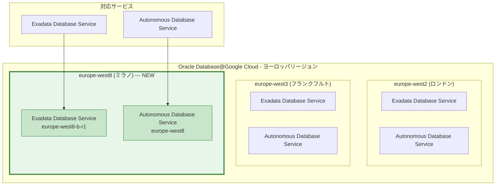

# Oracle Database@Google Cloud: europe-west8 (ミラノ、イタリア) リージョンのサポート開始

**リリース日**: 2026-03-06

**サービス**: Oracle Database@Google Cloud

**機能**: Exadata Database Service および Autonomous Database Service 向け europe-west8-b-r1 (ミラノ、イタリア) リージョンのサポート

**ステータス**: Feature

📊 [このアップデートのインフォグラフィックを見る](https://takech9203.github.io/google-cloud-news-summary/20260306-oracle-database-google-cloud-milan-region.html)

## 概要

Oracle Database@Google Cloud が、Exadata Database Service および Autonomous Database Service において、新たに europe-west8-b-r1 (ミラノ、イタリア) リージョンをサポートしました。これにより、イタリアを拠点とする企業やヨーロッパ南部のユーザーが、より低レイテンシで Oracle データベースワークロードを実行できるようになります。

Oracle Database@Google Cloud は、Google Cloud のデータセンター内で OCI Exadata ハードウェア上に Oracle データベースサービスをデプロイできるサービスです。今回のリージョン拡張により、ヨーロッパにおけるカバレッジが拡大し、既存の europe-west2 (ロンドン)、europe-west3 (フランクフルト) に加えて、イタリアのミラノが新たな選択肢として加わりました。

**アップデート前の課題**

- ヨーロッパの Oracle Database@Google Cloud リージョンはロンドン (europe-west2) とフランクフルト (europe-west3) の 2 拠点のみで、南ヨーロッパからのアクセスにはレイテンシが発生していた
- イタリアのデータレジデンシー要件を持つ企業が Oracle Database@Google Cloud を利用する際、国外のリージョンを選択する必要があった
- 南ヨーロッパ地域での災害復旧 (DR) 構成の選択肢が限られていた

**アップデート後の改善**

- ミラノリージョンの追加により、イタリアおよび南ヨーロッパのユーザーが低レイテンシで Oracle データベースにアクセス可能になった
- イタリア国内のデータレジデンシー要件に対応できるようになった
- ヨーロッパ内での DR 構成の選択肢が増え、地理的に分散した高可用性アーキテクチャが構築しやすくなった

## アーキテクチャ図

この図は Oracle Database@Google Cloud のヨーロッパリージョン構成を示しています。今回新たに追加されたミラノリージョン (緑色) により、ヨーロッパ内で 3 つのリージョンが利用可能になりました。

## サービスアップデートの詳細

### 主要機能

1. **Exadata Database Service のミラノリージョン対応**
   - ゾーン europe-west8-b-r1 で Exadata Infrastructure インスタンスおよび Exadata VM Cluster の作成が可能
   - OCI Exadata ハードウェア上で高性能な Oracle データベースを運用可能

2. **Autonomous Database Service のミラノリージョン対応**
   - europe-west8 リージョンで Autonomous AI Database リソースの作成・管理が可能
   - サーバーレスでフルマネージドな Oracle データベースをイタリアで利用可能

3. **既存機能との統合**
   - Google Cloud IAM によるアクセス管理
   - ODB Network を使用した VPC ネットワーク接続
   - CMEK (顧客管理暗号化キー) による Cloud KMS 統合
   - Autonomous Data Guard によるクロスリージョン災害復旧

## 技術仕様

### 対応サービスとゾーン

| サービス | リージョン | ゾーン | リソースタイプ |
|---------|-----------|--------|-------------|
| Exadata Database Service | europe-west8 | europe-west8-b-r1 | ゾーンリソース (Exadata Infrastructure、VM Cluster、ODB Network) |
| Autonomous Database Service | europe-west8 | - | リージョンリソース (Autonomous AI Database) |

### ヨーロッパリージョン一覧

| リージョン | ロケーション | Exadata DB | Autonomous DB |
|-----------|------------|-----------|--------------|
| europe-west2 | ロンドン、イギリス | 対応 | 対応 |
| europe-west3 | フランクフルト、ドイツ | 対応 | 対応 |
| europe-west8 | ミラノ、イタリア | 対応 (NEW) | 対応 (NEW) |

## メリット

### ビジネス面

- **データレジデンシーの遵守**: イタリア国内にデータを保持する必要がある規制要件 (GDPR のデータローカライゼーション等) に対応可能
- **南ヨーロッパ市場へのリーチ拡大**: イタリア、スペイン、ギリシャなど南ヨーロッパの顧客に対して、より近い拠点からサービスを提供可能
- **DR/BCP 戦略の強化**: ヨーロッパ内で 3 リージョンを活用した災害復旧・事業継続計画が策定可能

### 技術面

- **低レイテンシ**: 南ヨーロッパのエンドユーザーに対するデータベースアクセスのレイテンシが改善
- **地理的分散**: ロンドン、フランクフルト、ミラノの 3 拠点によるマルチリージョン構成が可能
- **Google Cloud サービスとの統合**: europe-west8 リージョンの既存 Google Cloud サービス (Compute Engine、Cloud Storage 等) との低レイテンシ接続

## デメリット・制約事項

### 制限事項

- Exadata Database Service on Exascale Infrastructure および Base Database Service は、今回のアップデートでは europe-west8 リージョンの対応が記載されていない
- Exadata Database Service はゾーンリソースであるため、europe-west8-b-r1 ゾーンのみが利用可能

### 考慮すべき点

- ODB Network やその他のゾーンリソースは同一リージョン・ゾーンに作成する必要がある
- 新リージョンのため、初期段階ではキャパシティが限定される可能性がある

## ユースケース

### ユースケース 1: イタリア企業のオンプレミス Oracle DB 移行

**シナリオ**: イタリアの金融機関が、オンプレミスの Oracle データベースをクラウドに移行したいが、イタリア国内のデータレジデンシー要件を遵守する必要がある。

**効果**: europe-west8 (ミラノ) リージョンを使用することで、データをイタリア国内に保持しながら、Google Cloud の管理性とスケーラビリティを活用できる。Exadata Database Service によりオンプレミスと同等の高性能を維持。

### ユースケース 2: ヨーロッパ全域のマルチリージョン DR 構成

**シナリオ**: ヨーロッパ全域で事業を展開する企業が、Autonomous Data Guard を活用してクロスリージョンの災害復旧構成を構築する。

**効果**: ミラノをプライマリ、フランクフルトまたはロンドンをスタンバイとする DR 構成により、南ヨーロッパのユーザーに低レイテンシを提供しつつ、高可用性を確保。

## 利用可能リージョン

Oracle Database@Google Cloud は現在、以下の地域でサービスを提供しています (Exadata Database Service 基準):

- **アジア太平洋**: 東京、大阪、シドニー、メルボルン、ムンバイ、デリー
- **北米**: モントリオール、トロント、アイオワ、北バージニア、ソルトレイクシティ
- **南米**: サンパウロ
- **ヨーロッパ**: ロンドン、フランクフルト、ミラノ (NEW)

全リージョンの詳細は [Supported regions and zones](https://cloud.google.com/oracle/database/docs/regions-and-zones) を参照してください。

## 関連サービス・機能

- **Autonomous Data Guard**: クロスリージョン災害復旧のためのデータレプリケーション機能
- **Cloud KMS (CMEK)**: 顧客管理暗号化キーによるデータベースの暗号化
- **ODB Network**: Oracle Database@Google Cloud リソースと Google Cloud VPC の接続
- **Exadata Database Service on Exascale Infrastructure**: Exascale インフラ上でのデータベースサービス (ミラノリージョンは未対応)

## 参考リンク

- 📊 [インフォグラフィック](https://takech9203.github.io/google-cloud-news-summary/20260306-oracle-database-google-cloud-milan-region.html)
- [公式リリースノート](https://cloud.google.com/release-notes#March_06_2026)
- [Oracle Database@Google Cloud ドキュメント](https://cloud.google.com/oracle/database/docs/overview)
- [サポートされるリージョンとゾーン](https://cloud.google.com/oracle/database/docs/regions-and-zones)

## まとめ

Oracle Database@Google Cloud の europe-west8 (ミラノ、イタリア) リージョン対応は、ヨーロッパ、特に南ヨーロッパにおけるサービスカバレッジを大幅に拡大する重要なアップデートです。イタリアのデータレジデンシー要件を持つ企業や、南ヨーロッパのエンドユーザーに低レイテンシを提供したい組織は、このリージョンの活用を検討してください。既存のヨーロッパリージョンと組み合わせたマルチリージョン DR 構成も推奨されます。

---

**タグ**: #OracleDatabase #GoogleCloud #europe-west8 #Milan #Exadata #AutonomousDatabase #RegionExpansion #DataResidency #Europe
