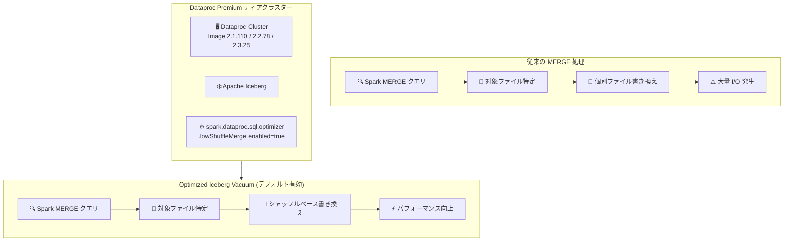

# Dataproc: Iceberg Vacuum 最適化デフォルト有効化、新サブマイナーイメージバージョン、CVE 修正

**リリース日**: 2026-03-08

**サービス**: Dataproc on Compute Engine

**機能**: Optimized Iceberg Vacuum / サブマイナーイメージバージョン更新 / セキュリティ修正

**ステータス**: Feature / Announcement / Fixed

📊 [このアップデートのインフォグラフィックを見る](https://takech9203.github.io/google-cloud-news-summary/20260308-dataproc-iceberg-vacuum-image-updates.html)

## 概要

Dataproc on Compute Engine において、3 つの重要なアップデートが同時にリリースされた。最も注目すべきは、Premium ティアクラスターで Optimized Iceberg Vacuum がデフォルトで有効化されたことである。これにより、Spark の MERGE クエリで大量のファイルを変更する際に、シャッフルベースのアプローチでデータファイルの書き換えが行われ、パフォーマンスの向上が期待できる。

また、イメージバージョン 2.1、2.2、2.3 の各系統で新しいサブマイナーイメージバージョンがリリースされた。加えて、hms-proxy の v0.0.78 へのアップグレードにより複数の CVE が修正され、セキュリティが強化されている。

このアップデートは、Apache Iceberg を活用したデータレイクハウスワークロードを Dataproc 上で実行しているユーザー、および定期的にイメージバージョンを更新してセキュリティを維持しているクラスター管理者にとって重要である。

**アップデート前の課題**

- Iceberg テーブルの MERGE クエリで大量のファイルを変更する際、データファイルの書き換え処理が非効率で、パフォーマンスが低下する場合があった
- Iceberg Vacuum の最適化を利用するには、明示的にプロパティを設定する必要があった
- hms-proxy に複数のセキュリティ脆弱性 (CVE) が存在していた

**アップデート後の改善**

- Premium ティアクラスターで Optimized Iceberg Vacuum がデフォルト有効となり、シャッフルベースのデータファイル書き換えによって MERGE クエリのパフォーマンスが自動的に改善される
- 追加設定不要で最適化の恩恵を受けられるようになった (無効化したい場合は `spark.dataproc.sql.optimizer.lowShuffleMerge.enabled=false` を設定)
- CVE-2025-58057、CVE-2025-53864、CVE-2025-68161、CVE-2025-48924 (部分)、CVE-2025-33042 が修正された

## アーキテクチャ図



Optimized Iceberg Vacuum により、MERGE クエリ実行時のデータファイル書き換えがシャッフルベースのアプローチに変更され、大量ファイル変更時のパフォーマンスが改善される。Premium ティアクラスターではデフォルトで有効化されている。

## サービスアップデートの詳細

### 主要機能

1. **Optimized Iceberg Vacuum のデフォルト有効化**
   - Premium ティアクラスターの Spark で Optimized Iceberg Vacuum がデフォルト有効に
   - シャッフルベースのアプローチでデータファイルを書き換え
   - MERGE クエリで大量のファイルを変更する場合にパフォーマンスが向上
   - 無効化するには `spark.dataproc.sql.optimizer.lowShuffleMerge.enabled` を `false` に設定

2. **新サブマイナーイメージバージョン**
   - **2.1 系**: 2.1.110-debian11, 2.1.110-rocky8, 2.1.110-ubuntu20, 2.1.110-ubuntu20-arm
   - **2.2 系**: 2.2.78-debian12, 2.2.78-rocky9, 2.2.78-ubuntu22, 2.2.78-ubuntu22-arm
   - **2.3 系**: 2.3.25-debian12, 2.3.25-ml-ubuntu22, 2.3.25-rocky9, 2.3.25-ubuntu22, 2.3.25-ubuntu22-arm

3. **セキュリティ修正 (CVE)**
   - hms-proxy を v0.0.78 にアップグレード
   - 修正された CVE: CVE-2025-58057、CVE-2025-53864、CVE-2025-68161、CVE-2025-48924 (部分修正)、CVE-2025-33042

## 技術仕様

### Optimized Iceberg Vacuum 設定

| 項目 | 詳細 |
|------|------|
| プロパティ名 | `spark.dataproc.sql.optimizer.lowShuffleMerge.enabled` |
| デフォルト値 (Premium ティア) | `true` |
| 対象操作 | Iceberg テーブルの MERGE クエリ |
| 最適化手法 | シャッフルベースのデータファイル書き換え |
| 効果 | 大量ファイル変更時の MERGE クエリパフォーマンス向上 |

### 新サブマイナーイメージバージョン一覧

| イメージ系統 | バージョン | 対応 OS |
|-------------|-----------|---------|
| 2.1 | 2.1.110 | Debian 11, Rocky 8, Ubuntu 20.04, Ubuntu 20.04 ARM |
| 2.2 | 2.2.78 | Debian 12, Rocky 9, Ubuntu 22.04, Ubuntu 22.04 ARM |
| 2.3 | 2.3.25 | Debian 12, Rocky 9, Ubuntu 22.04, Ubuntu 22.04 ARM, ML Ubuntu 22.04 |

### 無効化設定

```bash
# クラスター作成時に Optimized Iceberg Vacuum を無効化
gcloud dataproc clusters create CLUSTER_NAME \
    --region=REGION \
    --properties=spark:spark.dataproc.sql.optimizer.lowShuffleMerge.enabled=false
```

## 設定方法

### 前提条件

1. Dataproc on Compute Engine クラスターが Premium ティアで構成されていること
2. Apache Iceberg コンポーネントがクラスターにインストールされていること (イメージバージョン 2.2.47 以降で利用可能)

### 手順

#### ステップ 1: 最新イメージバージョンでクラスターを作成

```bash
# Iceberg コンポーネント付きで最新イメージのクラスターを作成
gcloud dataproc clusters create my-cluster \
    --region=us-central1 \
    --image-version=2.3.25-ubuntu22 \
    --optional-components=ICEBERG
```

Premium ティアクラスターでは Optimized Iceberg Vacuum がデフォルトで有効化される。

#### ステップ 2: (任意) 無効化する場合

```bash
# Optimized Iceberg Vacuum を無効化してクラスターを作成
gcloud dataproc clusters create my-cluster \
    --region=us-central1 \
    --image-version=2.3.25-ubuntu22 \
    --optional-components=ICEBERG \
    --properties=spark:spark.dataproc.sql.optimizer.lowShuffleMerge.enabled=false
```

ジョブ単位で無効化することも可能である。

#### ステップ 3: (任意) ジョブ単位での制御

```bash
# 特定のジョブで無効化
gcloud dataproc jobs submit spark-sql \
    --cluster=my-cluster \
    --region=us-central1 \
    --properties=spark.dataproc.sql.optimizer.lowShuffleMerge.enabled=false \
    -e "MERGE INTO catalog.db.target USING catalog.db.source ON ..."
```

## メリット

### ビジネス面

- **運用負荷の軽減**: Premium ティアクラスターでは追加設定なしで Iceberg の MERGE パフォーマンスが改善されるため、チューニング工数が削減される
- **処理時間の短縮**: 大量ファイル変更を伴う MERGE クエリの高速化により、データパイプラインの処理時間が短縮される

### 技術面

- **シャッフルベースの最適化**: データファイルの書き換えにシャッフルベースのアプローチを採用することで、I/O 効率が向上する
- **セキュリティ強化**: hms-proxy の CVE 修正により、Hive Metastore プロキシ経由のアクセスの安全性が向上する
- **幅広い OS サポート**: 2.3 系で ML Ubuntu 22.04 を含む 5 つの OS バリアントが提供されている

## デメリット・制約事項

### 制限事項

- Optimized Iceberg Vacuum のデフォルト有効化は Premium ティアクラスターのみが対象であり、Standard ティアでは明示的に設定が必要な場合がある
- CVE-2025-48924 は部分修正 (partial fix) であり、完全な修正は今後のリリースで提供される可能性がある

### 考慮すべき点

- 既存のクラスターには自動適用されないため、新しいイメージバージョンでクラスターを再作成する必要がある
- シャッフルベースのアプローチは、変更対象ファイルが少ない場合にはオーバーヘッドとなる可能性がある。パフォーマンスが低下する場合は `lowShuffleMerge.enabled=false` で無効化を検討する
- イメージバージョンの更新前に、既存ワークロードとの互換性を十分にテストすることを推奨する

## ユースケース

### ユースケース 1: データレイクハウスでの大規模 MERGE 処理

**シナリオ**: 毎日数百万件のレコードが到着するデータレイクハウスで、Iceberg テーブルに対して MERGE (UPSERT) 処理を実行している。MERGE の対象ファイル数が数千に及び、処理時間が長くなっていた。

**実装例**:
```sql
-- Premium ティアクラスターでは自動的に最適化が適用される
MERGE INTO catalog.db.customer_master AS target
USING catalog.db.daily_updates AS source
ON target.customer_id = source.customer_id
WHEN MATCHED THEN UPDATE SET *
WHEN NOT MATCHED THEN INSERT *;
```

**効果**: シャッフルベースの書き換えにより、大量ファイル変更時の I/O が最適化され、MERGE 処理時間が短縮される。

### ユースケース 2: セキュリティコンプライアンスのためのイメージ更新

**シナリオ**: セキュリティポリシーにより、既知の CVE が修正されたイメージを速やかに適用する必要がある組織で、Dataproc クラスターを運用している。

**効果**: 新しいサブマイナーイメージバージョン (2.1.110、2.2.78、2.3.25) に更新することで、CVE-2025-58057 をはじめとする 5 つの CVE に対処でき、セキュリティコンプライアンスを維持できる。

## 料金

Dataproc on Compute Engine の料金体系は以下の通りである。Optimized Iceberg Vacuum 自体に追加料金は発生しない。

| 項目 | 料金 |
|------|------|
| Dataproc クラスター料金 | vCPU あたり $0.010/時間 |
| Compute Engine VM | マシンタイプに応じた料金 |
| Premium ティア | Standard ティアと比較して追加コストが発生 |

詳細は [Dataproc 料金ページ](https://cloud.google.com/dataproc/pricing) を参照。

## 利用可能リージョン

Dataproc on Compute Engine は全ての Google Cloud リージョンで利用可能である。詳細は [Dataproc リージョンとゾーン](https://cloud.google.com/dataproc/docs/concepts/configuring-clusters/auto-zone) を参照。

## 関連サービス・機能

- **[Apache Iceberg on Dataproc](https://cloud.google.com/dataproc/docs/concepts/components/iceberg)**: Dataproc のオプションコンポーネントとして提供される Apache Iceberg 統合。スキーマ進化、タイムトラベル、隠しパーティショニング、ACID トランザクションをサポート
- **[Dataproc Spark パフォーマンス強化](https://cloud.google.com/dataproc/docs/guides/performance-enhancements)**: Spark オプティマイザ・実行エンジンの強化機能。`spark.dataproc.enhanced.optimizer.enabled` で有効化可能
- **[Dataproc Metastore](https://cloud.google.com/dataproc-metastore/docs/apache-iceberg)**: Iceberg テーブルのメタデータ管理に利用可能な Hive メタストアサービス
- **[BigLake Metastore](https://cloud.google.com/dataproc/docs/guides/iceberg-metadata-biglake-metastore)**: BigQuery と Iceberg テーブルのメタデータを統合管理するサービス
- **[Cloud Monitoring](https://cloud.google.com/monitoring)**: Dataproc クラスターのメトリクス監視

## 参考リンク

- 📊 [インフォグラフィック](https://takech9203.github.io/google-cloud-news-summary/20260308-dataproc-iceberg-vacuum-image-updates.html)
- [公式リリースノート](https://cloud.google.com/release-notes#March_08_2026)
- [Dataproc Iceberg コンポーネント](https://cloud.google.com/dataproc/docs/concepts/components/iceberg)
- [Dataproc サポートされるイメージバージョン](https://cloud.google.com/dataproc/docs/concepts/versioning/dataproc-version-clusters#supported-dataproc-image-versions)
- [Dataproc Spark パフォーマンス強化](https://cloud.google.com/dataproc/docs/guides/performance-enhancements)
- [料金ページ](https://cloud.google.com/dataproc/pricing)

## まとめ

今回のアップデートにより、Dataproc Premium ティアクラスターでは Iceberg テーブルの MERGE クエリパフォーマンスが追加設定なしで改善される。大量のデータファイル変更を伴う MERGE ワークロードを持つユーザーは、最新のサブマイナーイメージバージョンへの更新を推奨する。また、複数の CVE が修正されているため、セキュリティの観点からもイメージバージョンの更新を検討すべきである。

---

**タグ**: #Dataproc #ApacheIceberg #Spark #MERGE #パフォーマンス最適化 #CVE修正 #イメージバージョン #データレイクハウス #PremiumTier
