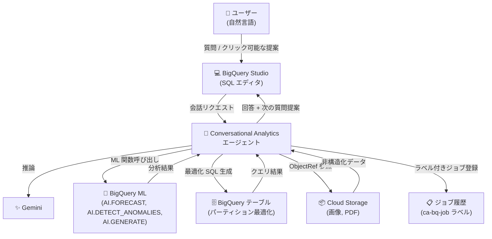

# BigQuery: Conversational Analytics 機能強化アップデート

**リリース日**: 2026-03-09

**サービス**: BigQuery

**機能**: Conversational Analytics (会話型分析) の複数機能強化

**ステータス**: Preview

:bar_chart: [このアップデートのインフォグラフィックを見る](https://takech9203.github.io/google-cloud-news-summary/20260309-bigquery-conversational-analytics-updates.html)

## 概要

BigQuery の Conversational Analytics (会話型分析) に、6 つの主要な機能強化が追加された。ObjectRef を通じた Cloud Storage 上の非構造化データとの統合、BigQuery ML 関数 (AI.FORECAST、AI.DETECT_ANOMALIES、AI.GENERATE) のサポート、SQL エディタでのクエリ結果との会話機能、パーティションテーブルの最適化サポート、エージェント生成クエリへのラベル付与、クリック可能な次の質問の提案機能が含まれる。

これらの改善により、自然言語でのデータ分析がより広範囲かつ高度になり、構造化データだけでなく画像や PDF などの非構造化データも含めた包括的な会話型分析が可能になる。データアナリスト、データサイエンティスト、ビジネスユーザーなど、SQL に精通していないユーザーでも高度な分析タスクを自然言語で実行できるようになる。

**アップデート前の課題**

- 会話型分析では BigQuery テーブル内の構造化データのみが対象で、Cloud Storage 上の画像や PDF などの非構造化データを参照・分析できなかった
- 予測、異常検知、生成 AI などの高度な分析を行うには、BigQuery ML の SQL 構文を直接記述する必要があった
- クエリ結果を得た後、その結果についてさらに深掘りする会話を SQL エディタ上で直接行うことができなかった
- パーティションテーブルに対するクエリで、エージェントがパーティション列を活用した最適化を自動で行えなかった
- エージェントが実行したジョブをジョブ履歴から識別・フィルタリングする手段がなかった
- エージェントの提案する次の質問をクリックで選択することができなかった

**アップデート後の改善**

- ObjectRef 関数を通じて Cloud Storage 上の画像や PDF を会話型分析から直接参照・分析できるようになった
- 「来月の売上を予測して」「異常値を検出して」といった自然言語プロンプトで BigQuery ML 関数が自動的に呼び出されるようになった
- BigQuery Studio の SQL エディタでクエリ結果に対して直接会話を開始し、追加の質問やフォローアップ分析ができるようになった
- パーティションテーブルに対して、エージェントが日付範囲などのパーティション列を活用した最適化 SQL を自動生成するようになり、パフォーマンスとコストが改善された
- エージェントが生成したジョブに `ca-bq-job: true` ラベルが付与され、ジョブ履歴での識別・フィルタリングが可能になった
- エージェントが提案する次の質問がクリック可能になり、素早くフォローアップ分析を実行できるようになった

## アーキテクチャ図



BigQuery Conversational Analytics の全体アーキテクチャを示す。ユーザーは BigQuery Studio から自然言語で質問し、エージェントが Gemini を活用して推論を行い、BigQuery ML 関数の呼び出し、パーティション最適化された SQL の生成、Cloud Storage 上の非構造化データの参照を自動的に行う。

## サービスアップデートの詳細

### 主要機能

1. **ObjectRef サポート (Cloud Storage 連携)**
   - BigQuery Conversational Analytics が ObjectRef 関数を通じて Cloud Storage と統合された
   - Cloud Storage バケット内の画像、PDF などの非構造化データを会話型分析から参照・操作できる
   - ObjectRef 値は `STRUCT<uri STRING, version STRING, authorizer STRING, details JSON>` 形式で Cloud Storage オブジェクトのメタデータと認可情報を保持する
   - `OBJ.MAKE_REF` や `OBJ.FETCH_METADATA` などの関数で ObjectRef 値を作成・更新できる

2. **BigQuery ML サポート**
   - 会話型分析で以下の BigQuery ML 関数がサポートされた:
     - `AI.FORECAST`: 時系列データの予測 (例: 「来月のトリップ数を予測して」)
     - `AI.DETECT_ANOMALIES`: 異常検知 (例: 「2018 年の 1 日あたりのトリップ数の外れ値を見つけて」)
     - `AI.GENERATE` (および `AI.GENERATE_BOOL`, `AI.GENERATE_INT`, `AI.GENERATE_DOUBLE`): テキスト生成 (例: 「各記事を 1-2 文で要約して」)
   - 自然言語のプロンプトから自動的に適切な BigQuery ML SQL が生成される
   - Verified Query (検証済みクエリ) 内でも BigQuery ML 関数を使用可能

3. **クエリ結果との会話 (Chat with BigQuery results)**
   - BigQuery Studio の SQL エディタでクエリ結果に対して直接会話を開始できる
   - クエリ実行後、結果に対するフォローアップの質問や追加分析を自然言語で行える
   - メニューバーの「Create conversation」ボタンから新しい会話を開始可能

4. **パーティションテーブルの最適化サポート**
   - エージェントが BigQuery テーブルのパーティション情報を認識し、SQL クエリを最適化する
   - 日付パーティションテーブルに対して日付範囲を使用したパーティションプルーニングを自動適用
   - クエリパフォーマンスの向上とスキャンデータ量の削減によるコスト最適化を実現

5. **エージェント生成クエリへのラベル付与**
   - Conversational Analytics エージェントが開始した BigQuery ジョブに自動的にラベルが付与される
   - ラベル形式: `{'ca-bq-job': 'true'}`
   - BigQuery ジョブ履歴でラベルを使用してエージェント生成ジョブの識別、フィルタリング、分析が可能

6. **クリック可能な次の質問の提案**
   - エージェントが会話中に次の質問候補を提案する
   - 提案された質問は Google Cloud コンソール上で直接クリック可能
   - ユーザーの分析フローを加速し、データ探索を効率化する

## 技術仕様

### サポートされる BigQuery ML 関数

| 関数 | 用途 | プロンプト例 |
|------|------|-------------|
| `AI.FORECAST` | 時系列データの予測 | 「来月のトリップ数を予測して」 |
| `AI.DETECT_ANOMALIES` | 異常検知 | 「2018 年の外れ値を見つけて」 |
| `AI.GENERATE` | テキスト生成 | 「各記事を 1-2 文で要約して」 |
| `AI.GENERATE_BOOL` | ブール値生成 | - |
| `AI.GENERATE_INT` | 整数値生成 | - |
| `AI.GENERATE_DOUBLE` | 浮動小数点数生成 | - |

### ObjectRef 形式

| フィールド | 型 | 説明 |
|-----------|-----|------|
| `uri` | STRING | Cloud Storage オブジェクトの URI |
| `version` | STRING | オブジェクトのバージョン識別子 |
| `authorizer` | STRING | Cloud リソース接続の識別子 |
| `details` | JSON | オブジェクトメタデータの詳細 |

### ジョブラベル

```json
{
  "ca-bq-job": "true"
}
```

エージェントが生成したジョブを識別するためにジョブ履歴に付与されるラベル。INFORMATION_SCHEMA.JOBS ビューでフィルタリングに使用できる。

## 設定方法

### 前提条件

1. Google Cloud プロジェクトで BigQuery API と Vertex AI API が有効であること
2. Conversational Analytics API の IAM ロールと権限が設定されていること
3. AI.GENERATE 関数を使用する場合は、生成 AI クエリの実行に必要な権限が付与されていること
4. ObjectRef を使用する場合は、Cloud Storage バケットと Cloud リソース接続が設定されていること

### 手順

#### ステップ 1: データエージェントの作成

Google Cloud コンソールで BigQuery の Agent Catalog タブからデータエージェントを作成する。テーブル、ビュー、UDF をナレッジソースとして追加する。

#### ステップ 2: 会話の開始

BigQuery Studio の SQL エディタから「Create conversation」ボタンをクリックし、自然言語で質問を入力する。エージェントが自動的に最適な SQL (パーティションプルーニング含む) を生成し、必要に応じて BigQuery ML 関数を使用して回答する。

#### ステップ 3: エージェント生成ジョブの確認

BigQuery ジョブ履歴で `ca-bq-job: true` ラベルを使用して、エージェントが実行したジョブをフィルタリングし、コストとパフォーマンスを監視する。

## メリット

### ビジネス面

- **データ分析の民主化**: SQL の専門知識がなくても、自然言語で予測・異常検知・テキスト生成などの高度な分析を実行でき、データドリブンな意思決定を組織全体に拡大できる
- **非構造化データの活用促進**: Cloud Storage 上の画像や PDF を会話型分析に組み込むことで、これまで分析対象外だった非構造化データからもインサイトを得られる
- **コスト管理の改善**: パーティション最適化とジョブラベリングにより、クエリコストの最適化と監視が容易になる

### 技術面

- **クエリパフォーマンスの自動最適化**: パーティションプルーニングの自動適用により、不要なデータスキャンを削減し、クエリ実行時間とコストを改善できる
- **分析ワークフローの効率化**: SQL エディタでのクエリ結果との会話により、分析の反復サイクルが短縮され、コンテキストスイッチなしでフォローアップ分析を実行できる
- **ジョブの可観測性向上**: ラベルベースのジョブ追跡により、エージェントの利用状況を INFORMATION_SCHEMA.JOBS ビューから定量的に分析できる

## デメリット・制約事項

### 制限事項

- Conversational Analytics は現在 Preview ステータスであり、限定的なサポートのみ提供される
- Conversational Analytics はグローバルに動作し、使用するリージョンを選択できない
- ObjectRef を使用するクエリは、ObjectRef 値を含むテーブルと同じプロジェクトで実行する必要がある
- ObjectRef/ObjectRefRuntime を参照するクエリを実行するプロジェクトとリージョンで、接続数が 20 を超えてはならない

### 考慮すべき点

- 大規模テーブル、データ結合、AI 関数の頻繁な呼び出しでは予期しないコストが発生する可能性がある
- Gemini による生成出力は事実と異なる可能性があるため、出力結果の検証が推奨される
- AI.GENERATE 関数の使用には Vertex AI の追加コストが発生する

## ユースケース

### ユースケース 1: 非構造化データを含むマルチモーダル分析

**シナリオ**: EC サイトの運営チームが、商品テーブル (構造化データ) と商品画像 (Cloud Storage 上の画像) を統合して分析したい。

**実装例**:
```
ユーザー: 「商品画像に基づいて、各カテゴリの商品の見た目の特徴を要約して」

エージェント: ObjectRef を通じて Cloud Storage 上の商品画像を参照し、
AI.GENERATE を使用して画像の特徴をテキストで生成。カテゴリごとに集計して回答。
```

**効果**: SQL を記述せずに構造化データと非構造化データを組み合わせたマルチモーダル分析を実行できる。

### ユースケース 2: 自然言語による予測分析と異常検知

**シナリオ**: データアナリストが、過去の売上データから来月の売上を予測し、直近のデータに異常値がないか確認したい。

**実装例**:
```
ユーザー: 「来月の売上を予測して」
→ エージェントが AI.FORECAST を使用した SQL を自動生成・実行

ユーザー: 「直近 3 ヶ月の日次売上に外れ値はある?」
→ エージェントが AI.DETECT_ANOMALIES を使用した SQL を自動生成・実行
```

**効果**: BigQuery ML の構文を覚えなくても、自然言語で高度な予測・異常検知分析を実行でき、分析サイクルが大幅に短縮される。

### ユースケース 3: コスト最適化とジョブ監視

**シナリオ**: データプラットフォームチームが、Conversational Analytics エージェントの利用状況とコストを監視したい。

**実装例**:
```sql
-- エージェント生成ジョブの一覧と消費バイト数を確認
SELECT
  job_id,
  user_email,
  total_bytes_processed,
  creation_time
FROM `region-us`.INFORMATION_SCHEMA.JOBS
WHERE JSON_VALUE(labels, '$.ca-bq-job') = 'true'
ORDER BY creation_time DESC;
```

**効果**: パーティション最適化によるスキャン量削減と、ラベルベースのジョブ追跡により、エージェント利用のコストを定量的に把握・最適化できる。

## 料金

Conversational Analytics の利用自体に追加料金は発生しない (Preview 期間中)。ただし、以下のコストが発生する:

- **BigQuery コンピュート料金**: データエージェントの作成や会話時に実行されるクエリに対して BigQuery コンピュート料金が課金される
- **Vertex AI 料金**: AI.GENERATE などの生成 AI 関数を使用する場合、Vertex AI の料金が発生する
- **Cloud Storage 料金**: ObjectRef を使用した非構造化データのアクセスに関連する Cloud Storage 料金が発生する

詳細は [BigQuery 料金ページ](https://cloud.google.com/bigquery/pricing) を参照。

## 利用可能リージョン

Conversational Analytics はグローバルに動作し、使用するリージョンを選択できない。

## 関連サービス・機能

- **[Gemini for Google Cloud](https://cloud.google.com/gemini/docs/overview)**: Conversational Analytics の推論エンジンとして使用される
- **[BigQuery ML](https://cloud.google.com/bigquery/docs/bqml-introduction)**: AI.FORECAST、AI.DETECT_ANOMALIES、AI.GENERATE などの ML 関数を提供
- **[Cloud Storage](https://cloud.google.com/storage)**: ObjectRef を通じた非構造化データの保存・参照先
- **[Conversational Analytics API](https://cloud.google.com/gemini/docs/conversational-analytics-api/overview)**: プログラマティックなアクセスを提供する API
- **[Looker Studio](https://cloud.google.com/looker/docs/studio/conversational-analytics-looker-studio)**: BigQuery で作成したデータエージェントを Looker Studio Pro からも利用可能
- **[Dataplex Universal Catalog](https://cloud.google.com/dataplex)**: ビジネス用語集のインポート元として連携

## 参考リンク

- :bar_chart: [インフォグラフィック](https://takech9203.github.io/google-cloud-news-summary/20260309-bigquery-conversational-analytics-updates.html)
- [公式リリースノート](https://cloud.google.com/release-notes#March_09_2026)
- [Conversational Analytics 概要ドキュメント](https://cloud.google.com/bigquery/docs/conversational-analytics)
- [会話でデータを分析する](https://cloud.google.com/bigquery/docs/create-conversations)
- [データエージェントの作成](https://cloud.google.com/bigquery/docs/create-data-agents)
- [マルチモーダルデータの分析](https://cloud.google.com/bigquery/docs/analyze-multimodal-data)
- [ObjectRef 列の指定](https://cloud.google.com/bigquery/docs/objectref-columns)
- [Conversational Analytics API リリースノート](https://cloud.google.com/gemini/docs/conversational-analytics-api/release-notes)
- [BigQuery 料金ページ](https://cloud.google.com/bigquery/pricing)

## まとめ

BigQuery Conversational Analytics の今回のアップデートは、自然言語によるデータ分析の範囲と深度を大幅に拡張するものである。特に ObjectRef を通じた非構造化データの統合と BigQuery ML 関数のサポートにより、SQL の専門知識がなくても予測分析やマルチモーダル分析が可能になる。パーティション最適化やジョブラベリングなどの実用的な改善も含まれており、本番環境での利用を検討する価値がある。現在は Preview ステータスのため、本番ワークロードへの適用は段階的に進め、生成結果の検証プロセスを組み込むことを推奨する。

---

**タグ**: #BigQuery #ConversationalAnalytics #BigQueryML #ObjectRef #CloudStorage #Gemini #Preview #自然言語分析 #マルチモーダル
