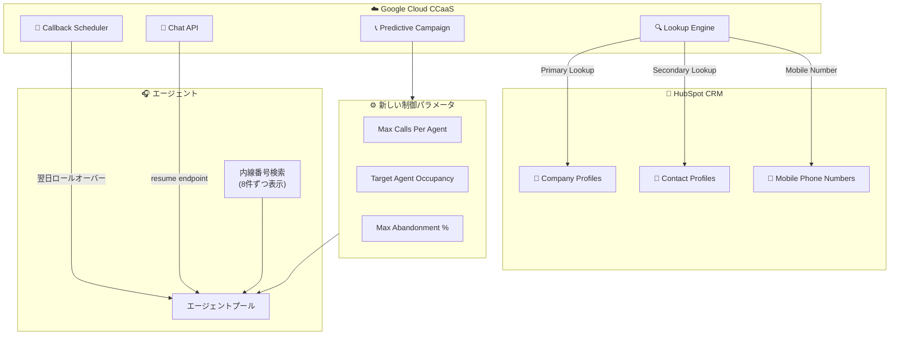

# Google Cloud CCaaS: HubSpot Company プロファイル検索と予測キャンペーン制御の強化

**リリース日**: 2026-03-09

**サービス**: Google Cloud Contact Center as a Service (CCaaS)

**機能**: HubSpot Company プロファイル検索、予測キャンペーン制御強化、チャット再開エンドポイント

**ステータス**: GA

📊 [このアップデートのインフォグラフィックを見る](https://takech9203.github.io/google-cloud-news-summary/20260309-cloud-ccaas-hubspot-predictive-campaigns.html)

## 概要

Google Cloud CCaaS (Contact Center as a Service / CCAI Platform) の最新リリースでは、HubSpot CRM 統合の大幅な拡張、予測キャンペーンの精密な制御機能、チャットセッション再開 API、コールバック履行時間の柔軟な設定など、複数の重要な機能改善が含まれている。

本アップデートは、CRM 統合を活用するコンタクトセンター運用者にとって特に影響が大きい。HubSpot を CRM として使用している組織は、Company プロファイルに対するルックアップやモバイル電話番号検索が可能となり、顧客識別の精度が向上する。また、アウトバウンドキャンペーンを実施する組織にとっては、予測キャンペーンの新しい制御パラメータにより、エージェント稼働率と放棄率のバランスをより細かく管理できるようになった。

対象ユーザーは、CCAI Platform を利用するコンタクトセンターの管理者、スーパーバイザー、および API を活用した統合開発者である。

**アップデート前の課題**

- HubSpot 統合では Contact オブジェクトに対する検索のみがサポートされており、Company プロファイルに基づく顧客識別ができなかった
- HubSpot でのモバイル電話番号による顧客検索が利用できなかった
- エージェント内線番号検索で複数一致した場合、すべての結果を一度に読み上げるため、ユーザーが選択しにくかった
- dismissed / va_dismissed ステータスのチャットセッションをプログラム的に再開する手段がなかった
- コールバック履行時間に翌日へのロールオーバーオプションがなく、営業時間をまたぐ設定が困難だった
- 予測キャンペーンでは、エージェントあたりの最大コール数やターゲットエージェント稼働率の細かい制御ができなかった

**アップデート後の改善**

- HubSpot 統合で Company プロファイルに対するルックアップが可能になり、プライマリ/セカンダリの検索オブジェクトを管理者が設定できるようになった
- モバイル電話番号によるルックアップが HubSpot 統合で有効化可能になった
- エージェント内線番号検索で複数一致した場合、8 件ずつグループで読み上げられるようになり、ユーザー体験が改善された
- 新しい chats/CHAT_ID/resume エンドポイントにより、dismissed/va_dismissed ステータスのチャットを API 経由で再開可能になった
- コールバック履行時間に翌日ロールオーバーオプションが追加された
- 予測キャンペーンに Max Calls Per Agent、Target Agent Occupancy、オプションの Max Abandonment % の新しい制御パラメータが追加された

## アーキテクチャ図

本図は、今回のアップデートで強化された CCaaS の主要コンポーネントと HubSpot CRM との連携を示している。Lookup Engine が Company プロファイルとモバイル電話番号に対応し、予測キャンペーンには新しい制御パラメータが追加された。

## サービスアップデートの詳細

### 主要機能

1. **HubSpot Company プロファイル検索**
   - HubSpot 統合において、Company プロファイルに対するルックアップが新たにサポートされた
   - 管理者はプライマリおよびセカンダリの検索オブジェクトを設定可能
   - プライマリ検索で結果が見つからない場合、セカンダリオブジェクトにフォールバックすることで、重複レコードの作成を防止
   - 設定場所: Settings > Developer Settings > CRM > HubSpot

2. **HubSpot モバイル電話番号ルックアップ**
   - 管理者が HubSpot 統合でモバイル電話番号によるルックアップを有効化可能
   - 既存の電話番号フォーマット設定 (Automatic, E.164, US Local など) と連携して動作

3. **エージェント内線番号検索の改善**
   - エンドユーザーがエージェント内線番号を入力した際、複数の一致がある場合に 8 件ずつのグループで読み上げる方式に変更
   - 大規模なコンタクトセンターでの内線番号検索体験が向上

4. **チャット再開エンドポイント (chats/CHAT_ID/resume)**
   - dismissed または va_dismissed ステータスのチャットセッションを再開するための新しい REST API エンドポイント
   - プログラム的にチャットセッションのライフサイクルを管理可能に

5. **コールバック履行時間の翌日ロールオーバー**
   - コールバック履行時間に翌日へのロールオーバーオプションを追加
   - 営業時間終了後にスケジュールされたコールバックを翌営業日に自動的に繰り越し可能

6. **予測キャンペーンの制御強化**
   - **Max Calls Per Agent**: エージェントあたりの最大コール数を設定し、エージェントの負荷を制御
   - **Target Agent Occupancy**: ターゲットとなるエージェント稼働率を設定し、適切なペーシングを実現
   - **Max Abandonment % (オプション)**: 最大放棄率の設定が任意項目として利用可能に (従来はデフォルト 3%)

## 技術仕様

### チャット再開 API

| 項目 | 詳細 |
|------|------|
| エンドポイント | `POST /chats/{CHAT_ID}/resume` |
| 対象ステータス | `dismissed`, `va_dismissed` |
| 認証 | Apps API 認証 (Basic Auth) |

### 予測キャンペーン新パラメータ

| パラメータ | 説明 | 備考 |
|-----------|------|------|
| Max Calls Per Agent | エージェントあたりの最大コール数 | キャンペーン単位で設定 |
| Target Agent Occupancy | ターゲットエージェント稼働率 | パーセンテージで指定 |
| Max Abandonment % | 最大放棄率 | オプション (米国では 30 日間で 3% 以下が推奨) |

### HubSpot 検索オブジェクト設定

| 項目 | 詳細 |
|------|------|
| Primary Lookup Object | Company プロファイルまたは Contact プロファイル |
| Secondary Lookup Object | プライマリで結果なしの場合のフォールバック先 |
| Mobile Phone Lookup | 有効/無効の切り替え可能 |

## 設定方法

### 前提条件

1. CCAI Platform ポータルへの管理者権限でのアクセス
2. HubSpot 機能を使用する場合: HubSpot アカウントと API キーの設定済み
3. 予測キャンペーン機能を使用する場合: キャンペーンマネージャーへのアクセス権限

### 手順

#### ステップ 1: HubSpot Company プロファイル検索の設定

CCAI Platform ポータルにログインし、Settings > Developer Settings > CRM > HubSpot に移動する。Account Lookup セクションで Primary Lookup Object と Secondary Lookup Object を設定する。

#### ステップ 2: モバイル電話番号ルックアップの有効化

同じ HubSpot 設定画面でモバイル電話番号ルックアップのオプションを有効化する。Phone Number Format の設定が正しく構成されていることを確認する。

#### ステップ 3: 予測キャンペーンの制御設定

Campaigns からキャンペーンを作成または編集し、新しいパラメータ (Max Calls Per Agent, Target Agent Occupancy, Max Abandonment %) を設定する。

## メリット

### ビジネス面

- **顧客識別精度の向上**: HubSpot の Company プロファイル検索とモバイル電話番号ルックアップにより、顧客の特定が迅速かつ正確になり、パーソナライズされたサービス提供が可能になる
- **アウトバウンドキャンペーンの最適化**: 予測キャンペーンの新しい制御パラメータにより、エージェントの稼働率と顧客体験のバランスを細かく調整でき、放棄率を低減しながら効率的な架電が可能になる
- **営業時間外対応の改善**: コールバック履行時間の翌日ロールオーバーにより、営業時間終了間際のコールバックリクエストも確実に対応可能になる

### 技術面

- **API の拡張**: チャット再開エンドポイントにより、チャットセッションのライフサイクルをプログラム的に管理でき、カスタムワークフローの構築が容易になる
- **CRM 統合の柔軟性向上**: プライマリ/セカンダリ検索オブジェクトの構成により、重複レコード作成のリスクが低減する
- **ユーザー体験の改善**: 内線番号検索の 8 件ずつ読み上げにより、IVR 体験が向上する

## デメリット・制約事項

### 制限事項

- HubSpot 統合はメディアファイル (Blended SMS/MMS で送信されたコンテンツ) のストレージをサポートしていない
- 予測キャンペーンの Max Abandonment % は米国では 30 日間で 3% を超えてはならない (国によって異なる)
- インスタンスへのアップデート適用タイミングは、選択したデプロイメントスケジュールに依存する

### 考慮すべき点

- HubSpot の Primary/Secondary Lookup Object の設定は、既存の CRM レコード管理プロセスへの影響を事前に評価する必要がある
- 予測キャンペーンの新パラメータ (特に Target Agent Occupancy) は、既存のキャンペーン設定との整合性を確認してから適用することを推奨

## ユースケース

### ユースケース 1: B2B コンタクトセンターでの企業プロファイル活用

**シナリオ**: B2B サービスを提供する企業が、着信時に発信者の所属企業を HubSpot の Company プロファイルから自動的に特定し、企業レベルの契約情報やサポート履歴をエージェントに表示する。

**効果**: エージェントが顧客の企業コンテキストを即座に把握でき、初回対応時間 (First Contact Resolution) の改善と顧客満足度の向上が期待できる。

### ユースケース 2: アウトバウンド販促キャンペーンの効率化

**シナリオ**: マーケティングチームが大規模なアウトバウンド販促キャンペーンを実施する際、Max Calls Per Agent と Target Agent Occupancy を設定し、エージェントの燃え尽き防止と放棄率の最小化を両立する。

**効果**: エージェントの稼働率を 85% 程度にターゲットし、Max Calls Per Agent で 1 日の上限を設定することで、品質を維持しながらキャンペーンの効率を最大化できる。

### ユースケース 3: チャットボットからのシームレスな再開

**シナリオ**: バーチャルエージェントとのチャットが一度 dismissed された後、顧客が再度問い合わせを希望した場合に、`chats/CHAT_ID/resume` エンドポイントを使用して前回のセッションコンテキストを維持したまま再開する。

**効果**: 顧客が同じ情報を繰り返し入力する必要がなくなり、カスタマーエクスペリエンスが向上する。

## 料金

CCAI Platform の料金はインスタンスサイズと課金モデル (同時エージェント数、指名エージェント数、または使用分数) に基づいて月額で請求される。テレフォニー料金は使用量に応じて別途課金される。

| インスタンスサイズ | 同時セッション数 |
|------------------|----------------|
| Small | 250 (最低 25 エージェント) |
| Medium | 1,600 |
| Large | 3,800 |
| X-Large | 14,000 |
| 2X-Large | 38,000 |
| 3X-Large | 100,000 |

非本番インスタンス (Trial, Sandbox, Dev) はテレフォニー料金を除き無料で利用可能。詳細な料金については Google Cloud アカウントチームへの問い合わせが必要。

## 利用可能リージョン

CCAI Platform の利用可能なリージョンについては、[ロケーションページ](https://cloud.google.com/contact-center/ccai-platform/docs/localities) を参照。

## 関連サービス・機能

- **Dialogflow CX**: バーチャルエージェントの構築に使用。チャット再開エンドポイントと組み合わせることで、VA セッションの柔軟な管理が可能
- **Customer Experience Insights (CCAI Insights)**: コンタクトセンターデータのパターン検出と可視化。キャンペーンの効果分析に活用可能
- **Agent Assist**: エージェントへのリアルタイム支援。セッション要約機能と組み合わせて使用
- **HubSpot CRM**: 本アップデートで Company プロファイル検索とモバイル電話番号ルックアップが追加された主要統合先
- **Gemini Enterprise for CX**: CCAI Platform を含む Google Cloud のカスタマーエクスペリエンス向け AI ソリューション群

## 参考リンク

- 📊 [インフォグラフィック](https://takech9203.github.io/google-cloud-news-summary/20260309-cloud-ccaas-hubspot-predictive-campaigns.html)
- [公式リリースノート](https://cloud.google.com/release-notes#March_09_2026)
- [CCAI Platform ドキュメント](https://cloud.google.com/contact-center/ccai-platform/docs)
- [HubSpot 統合ガイド](https://cloud.google.com/contact-center/ccai-platform/docs/hubspot)
- [予測キャンペーン](https://cloud.google.com/contact-center/ccai-platform/docs/campaign-predictive)
- [Chat Platform API エンドポイント](https://cloud.google.com/contact-center/ccai-platform/docs/chat-platform-api-endpoints)
- [営業時間設定](https://cloud.google.com/contact-center/ccai-platform/docs/hours-of-operation)

## まとめ

本アップデートは、Google Cloud CCaaS の CRM 統合能力とアウトバウンドキャンペーン管理を大幅に強化するものである。HubSpot を利用する組織は Company プロファイル検索の設定を確認し、予測キャンペーンを運用する組織は新しい制御パラメータの活用を検討することを推奨する。特に chats/CHAT_ID/resume エンドポイントは、カスタムチャットワークフローを構築している開発者にとって即座に活用可能な改善である。

---

**タグ**: #GoogleCloud #CCaaS #CCAI-Platform #HubSpot #PredictiveCampaign #ContactCenter #CRM #ChatAPI #Callback
